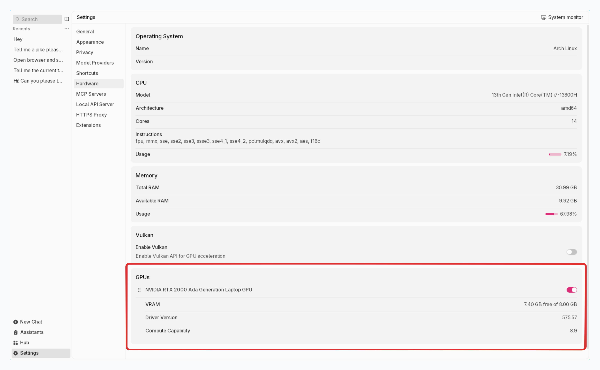

import { Tabs } from 'nextra/components'
import { Callout, Steps } from 'nextra/components'


# Troubleshooting

## How to Get Error Logs

Error logs are essential for troubleshooting issues and getting help from Jan team. To get error logs from Jan, follow the steps below:

#### Through Jan Interface

1. Open **System Monitor** in the footer
2. Choose **App Log**

<br/>

<br/>

#### Through Terminal
**Application Logs**
```bash
tail -n 50 ~/Library/Application\ Support/Jan/data/logs/app.log
```
**Server Logs**
```bash
tail -n 50 ~/Library/Application\ Support/Jan/data/logs/cortex.log
```

<Callout type="warning">
Ensure to redact any private or sensitive information when sharing logs or error details. We retain your logs for only 24 hours.
</Callout>


## Broken Build

To resolve the issue where Jan is stuck in a broken build after installation:

<Tabs items={['Mac', 'Windows', 'Linux']}>
  <Tabs.Tab>
      1. **Uninstall** Jan

      2. **Delete** Application Data, Cache, and User Data:

      ```zsh
      rm -rf ~/Library/Application\ Support/Jan
      ```

      3. If you are using a version before `0.4.2`, you need to run the following commands:

      ```zsh
      ps aux | grep nitro
      # Looks for processes like `nitro` and `nitro_arm_64`, and kill them one by one by process ID
      kill -9 <PID>
      ```

      4. **Download** the [latest version of Jan](/download)
  </Tabs.Tab>

  <Tabs.Tab>
      1. **Uninstall** Jan, using the [Windows Control Panel](https://support.microsoft.com/en-us/windows/uninstall-or-remove-apps-and-programs-in-windows-4b55f974-2cc6-2d2b-d092-5905080eaf98)

      2. **Delete** Application Data, Cache, and User Data:

      ```cmd
      cd C:\Users\%USERNAME%\AppData\Roaming
      rmdir /S Jan
      ```

      3. If you are using a version before `0.4.2`, you need to run the following commands:

      ```bash
      # Find the process ID (PID) of the nitro process by filtering the list by process name
      tasklist | findstr "nitro"
      # Once you have the PID of the process you want to terminate, run the `taskkill`
      taskkill /F /PID <PID>
      ```

      4. **Download** the [latest version of Jan](/download)
  </Tabs.Tab>

  <Tabs.Tab>
      1. **Uninstall** Jan

      Choose the appropriate method based on how you installed Jan:

      **For Debian/Ubuntu:**
      ```
      sudo apt-get remove Jan
      ```
      **For Others:** Delete the Jan `.AppImage` file from your system

      2. Delete Application Data, Cache, and User Data:

      ```bash
      # Default dir
      ~/.config/Jan
      # Custom installation directory
      $XDG_CONFIG_HOME = /home/username/custom_config/Jan
      ```

      3. If you are using a version before `0.4.2`, you need to run the following commands:

      ```zsh
      ps aux | grep nitro
      # Looks for processes like `nitro` and `nitro_arm_64`, and kill them one by one by process ID
      kill -9 <PID>
      ```

      4. **Download** the [latest version of Jan](/download)
  </Tabs.Tab>

</Tabs>

Following these steps, you can cleanly uninstall and reinstall Jan, ensuring a smooth and error-free experience with the latest version.

<Callout type="info">
  Before reinstalling Jan, ensure it's completely removed from all shared spaces if installed on multiple user accounts on your device.
</Callout>

## Troubleshooting NVIDIA GPU
To resolve issues when Jan does not utilize the NVIDIA GPU on Windows and Linux systems.

<Steps>

### Step 1: Verify Hardware and System Requirements

#### 1.1. Check GPU Detection
First, verify that your system recognizes the NVIDIA GPU:
**Windows:**
- Right-click desktop → NVIDIA Control Panel
- Or check Device Manager → Display Adapters
**Linux:**
```
lspci | grep -i nvidia
```
#### 1.2. Install Required components
**NVIDIA Driver:**
1. Install [NVIDIA Driver](https://www.nvidia.com/en-us/drivers/) for your GPU (NVIDIA driver **470.63.01 or higher**).
2. Verify installation:

```
nvidia-smi
```
Expected output should show your GPU model and driver version.

**CUDA Toolkit:**
1. Download and install [CUDA toolkit](https://developer.nvidia.com/cuda-downloads) (**CUDA 11.7 or higher**)
2. Verify installation:

```
nvcc --version
```
**Linux Additional Requirements:**
1. Required packages are installed:
```
sudo apt update
sudo apt install gcc-11 g++-11 cpp-11
```
See [detailed instructions](https://gcc.gnu.org/projects/cxx-status.html#cxx17).

2. Set up CUDA environment:
```
export LD_LIBRARY_PATH=$LD_LIBRARY_PATH:/usr/local/cuda/lib64
```
See [detailed instructions](https://docs.nvidia.com/cuda/cuda-installation-guide-linux/index.html#post-installation-actions).

<Callout type="info">
Ensure your (V)RAM is accessible; some users with virtual RAM may require additional configuration.
</Callout>

### Step 2: Turn on GPU acceleration

Jan manages GPU usage automatically:
- Switches to GPU mode when supported
- Automatically selects GPU with highest VRAM

To verify GPU acceleration is turned on:
1. Open **Settings** > **Hardware**
2. Verify that **GPU Acceleration** is turned on
3. Verify your selected GPU(s) are visible in **System Monitor** from Jan's footer

<br/>

<br/>


### Step 3: GPU Settings Check

1. Go to **Settings** > **General** > **Data Folder**
2. Click on **Open Containing Folder**
3. Open `settings.json` file

Example `settings.json`:

```
{
  "notify": true,
  "run_mode": "gpu",
  "nvidia_driver": {
    "exist": true,
    "version": "531.18"
  },
  "cuda": {
    "exist": true,
    "version": "12"
  },
  "gpus": [
    {
      "id": "0",
      "vram": "12282"
    },
    {
      "id": "1",
      "vram": "6144"
    },
    {
      "id": "2",
      "vram": "6144"
    }
  ],
  "gpu_highest_vram": "0"
}
```
**Key Configuration Values:**
- `run_mode`: Should be "gpu" for GPU acceleration
- `nvidia_driver`: Shows driver status and version
- `cuda`: Shows CUDA toolkit status and version
- `gpus`: Lists available GPUs and their VRAM (in MB)
- `gpu_highest_vram`: ID of GPU with most VRAM


### Step 4: Restart Jan

Restart Jan to make sure it works.

</Steps>

### Tested Configurations
These configurations have been verified to work with Jan's GPU acceleration. You can use them as reference points for your setup.

**Bare Metal Installations**

Windows 11 Pro (64-bit)
| Component | Version/Model |
|-----------|--------------|
| GPU | NVIDIA GeForce RTX 4070Ti |
| CUDA | 12.2 |
| NVIDIA Driver | 531.18 |
| OS | Windows 11 Pro 64-bit |
| RAM | 32GB |

Ubuntu 22.04 LTS
| Component | Version/Model |
|-----------|--------------|
| GPU | NVIDIA GeForce RTX 4070Ti |
| CUDA | 12.2 |
| NVIDIA Driver | 545 |
| OS | Ubuntu 22.04 LTS |

**Virtual Machine Setups**

Ubuntu on Proxmox VM
| Component | Version/Model |
|-----------|--------------|
| GPU | NVIDIA GeForce GTX 1660Ti |
| CUDA | 12.1 |
| NVIDIA Driver | 535 |
| OS | Ubuntu 20.04/18.04 LTS |
| VM Type | Proxmox |

**Performance Notes**
- Bare metal installations provide better performance
- VM setups require proper GPU passthrough configuration
- Some laptop GPUs may have reduced performance
- Hybrid graphics (Optimus) may need additional configuration

## Permission Denied

When running Jan, you might encounter the following error message:

```
Uncaught (in promise) Error: Error invoking layout-480796bff433a3a3.js:538 remote method 'installExtension':
Error Package /Applications/Jan.app/Contents/Resources/app.asar.unpacked/pre-install/janhq-assistant-extension-1.0.0.tgz does not contain a valid manifest:
Error EACCES: permission denied, mkdtemp '/Users/username/.npm/_cacache/tmp/ueCMn4'
```

Permission problems mainly cause this error during installation. To resolve this issue, follow these steps:

1. Open your **Terminal**

2. Execute the following command to change ownership of the `~/.npm` directory to the current user:

```bash
sudo chown -R $(whoami) ~/.npm
```

This command ensures that the necessary permissions are granted for Jan's installation.


## "Failed to fetch" or "Something's Amiss" errors

When you start a chat with a model and encounter a **Failed to Fetch** or **Something's Amiss** error, here are some possible solutions to resolve it:

**1. Check System & Hardware Requirements**
- Hardware dependencies: Ensure your device meets all [hardware requirements](troubleshooting)
- OS: Ensure your operating system meets the minimum requirements ([Mac](https://www.jan.ai/docs/desktop/install/mac#minimum-requirements), [Windows](/windows#compatibility), [Linux](https://www.jan.ai/docs/desktop/install/linux#compatibility)
- RAM: Choose models that use less than 80% of your available RAM
  - For 8GB systems: Use models under 6GB
  - For 16GB systems: Use models under 13GB

**2. Check Model Parameters**
- In **Engine Settings** in right sidebar, check your `ngl` ([number of GPU layers](/docs/desktop/model-parameters)) setting to see if it's too high
- Start with a lower NGL value and increase gradually based on your GPU memory

**3. Port Conflicts**

If you check your [app logs](/docs/desktop/troubleshooting#how-to-get-error-logs) & see "Bind address failed at 127.0.0.1:39291", check port availability:
```
# Mac
netstat -an | grep 39291

# Windows
netstat -ano | find "39291"
tasklist /fi "PID eq 39291"

# Linux
netstat -anpe | grep "39291"
```
<Callout type="info">
  `Netstat` displays the contents of various network-related data structures for active connections.
</Callout>

Default Jan ports:
- Jan and Cortex API Server: `1337`
- Jan Documentation: `3001`

**4. Factory Reset**

A factory reset can resolve persistent issues by returning Jan to its original state. This will remove all custom settings, downloaded models, and chat history.
1. Go to **Settings** > **Advanced Settings**
2. At **Reset To Factory Settings**, click **Reset**

<Callout type="warning">
This will delete all chat history, models, and settings.
</Callout>

**5. Try a clean installation**
- Uninstall Jan & clean Jan data folders ([Mac](/docs/desktop/install/mac#uninstall-jan), [Windows](/docs/desktop/install/windows#uninstall-jan), [Linux](/docs/desktop/install/linux#uninstall-jan))
- Install the latest [stable release](/download)

<Callout type="warning">
This will delete all your Jan data.
</Callout>

## OpenAI Unexpected Token Issue
The "Unexpected token" error usually relates to OpenAI API authentication or regional restrictions.

**Step 1: API Key Sepup**
1. Get a valid API key from [OpenAI's developer platform](https://platform.openai.com/)
2. Ensure the key has sufficient credits & appropriate permissions

**Step 2: Regional Access**
1. If you're in a region with restricted access, use a VPN service from a supported region
2. Verify your network can reach OpenAI's API endpoints


## Need Further Support?
If you can't find what you need in our troubleshooting guide, feel free reach out to us for extra help:
- **Copy** your [app logs](/docs/desktop/troubleshooting#how-to-get-error-logs)
- Go to our [Discord](https://discord.com/invite/FTk2MvZwJH) & send it to **#🆘|jan-help** channel for further support.


<Callout type="info">
Check the logs to ensure the information is what you intend to send. We retain your logs for only **24 hours**, so report any issues promptly.
</Callout>
