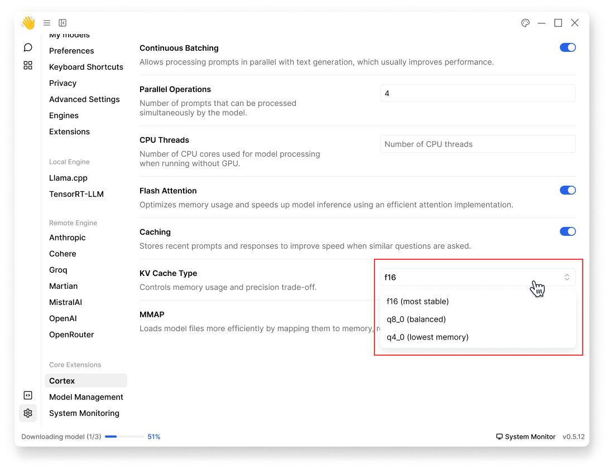

import { Callout } from 'nextra/components'
import { Settings } from 'lucide-react'

# Cortex 

Configure how [Cortex.cpp](/docs/extensions#cortexcpp) runs AI models. Access these settings through **Settings** (<Settings width={16} height={16} style={{display:"inline"}}/>) > **Core Extensions** > **Cortex**:

## Performance Settings

### Continuous Batching
- Enables processing multiple requests simultaneously
- Improves throughput for concurrent operations, which usually improves performance

**Continuous Batching** is turned on by default:
 

 

### Parallel Operations
- Number of prompts to run in parallel
- Affects model inference speed

By default, **Parallel Operations** is 4:
 

 

### CPU Threads
- Number of CPU cores to use when running without GPU
- Adjust based on your system's capabilities

<Callout type="info">
Higher thread counts may improve performance but increase CPU usage.
</Callout>

Leave blank at **CPU Threads** to use system defaults:
 

 

## Memory Settings

### Flash Attention
- Optimizes attention computation
- Reduces memory usage
- Recommended for most cases

**Flash Attention** is turned on by default:
 

 

### Caching
- Enable to store recent prompts and responses
- Improves response time for repeated prompts

**Caching** is turned on by default:
 

 

### KV Cache Type
- KV cache implementation type; controls memory usage and precision trade-off.
- Options:
  - f16 (most stable) 
  - q8_0 (balanced)
  - q4_0 (lowest memory)

<Callout type="warning">
Changing KV cache type from default (f16) may affect model stability.
</Callout>

By default, **KV Cache Type** is f16:
 

 

### MMAP
- Enables memory-mapped model loading
- Reduces memory usage
- Recommended for large models

**MMAP** is turned on by default:
 

 

> **Best Practices:**
> - Start with default settings
> - Adjust based on your hardware capabilities
> - Monitor system performance
> - Test changes with your specific use case

<Callout type="info">
Performance impact varies by hardware, model size, and usage patterns.
</Callout>

