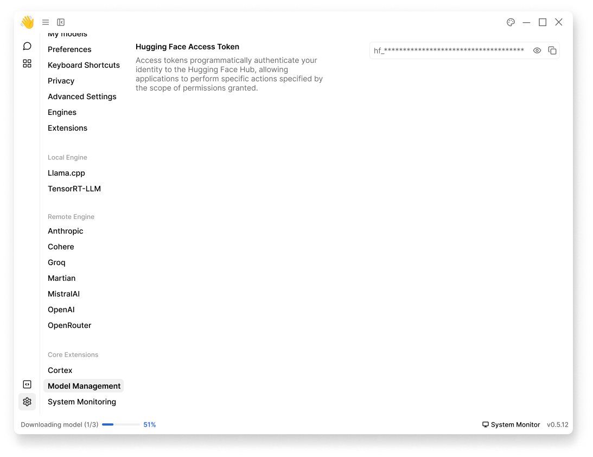

import { Callout } from 'nextra/components'
import { Settings, EllipsisVertical, Plus, FolderOpen, Pencil } from 'lucide-react'

# Model Management 

This extension configures how Jan handles model downloads and management:
- Model discovery and browsing
- Version control & configuration handling
- Download management

## Hugging Face Access Token

Access tokens authenticate your identity to Hugging Face Hub for model downloads. 
1. Get your token from [Hugging Face Tokens](https://huggingface.co/docs/hub/en/security-tokens)
2. Navigate to **Settings** (<Settings width={16} height={16} style={{display:"inline"}}/>) > **Core Extensions** > **Model Management**
2. Enter your token in Jan: `hf_************************`

<Callout type="warning">
Keep your access tokens secure and never share them. 
</Callout>

 

 