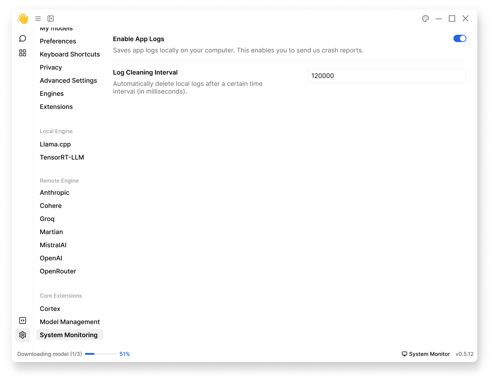

import { Callout } from 'nextra/components'
import { Settings, EllipsisVertical } from 'lucide-react'

# System Monitoring
Provides system health and OS level data:
- Hardware utilization tracking
- Performance monitoring
- Error logging

You can configure your logs in Jan in **Settings** (<Settings width={16} height={16} style={{display:"inline"}}/>) > **Core Extensions** > **System Monitoring**:

## Enable App Logs
Jan can save logs locally on your computer for:
- Debugging model issues
- Crash reports
- Download troubleshooting

To enable, toggle on **Enable App Logs**:

 

 

## Log Cleaning Interval
Set automatic log deletion interval in milliseconds:
- Default: 120000 (2 minutes); however, there's no minimum or maximum intervals 
- Controls disk space usage
- Prevents log accumulation

<Callout type='info'>
You can clear Jan logs manually with [Clear logs](/docs/settings#log-management) in **Privacy**.
</Callout>

