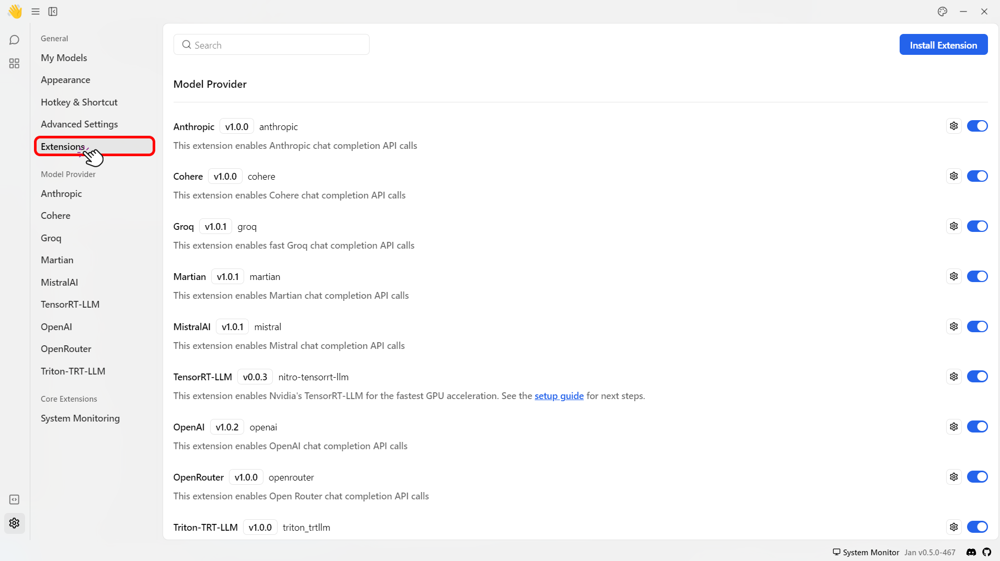
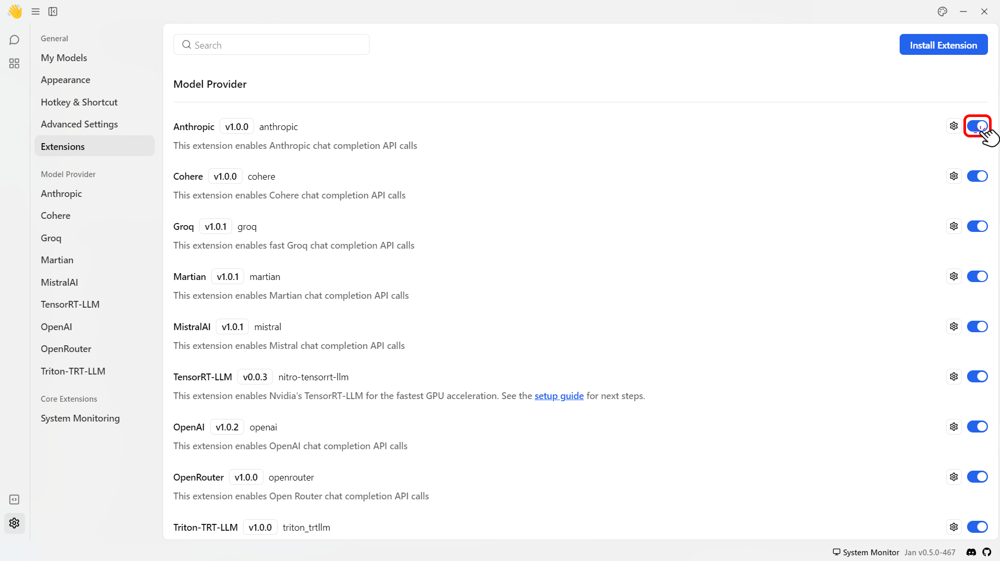
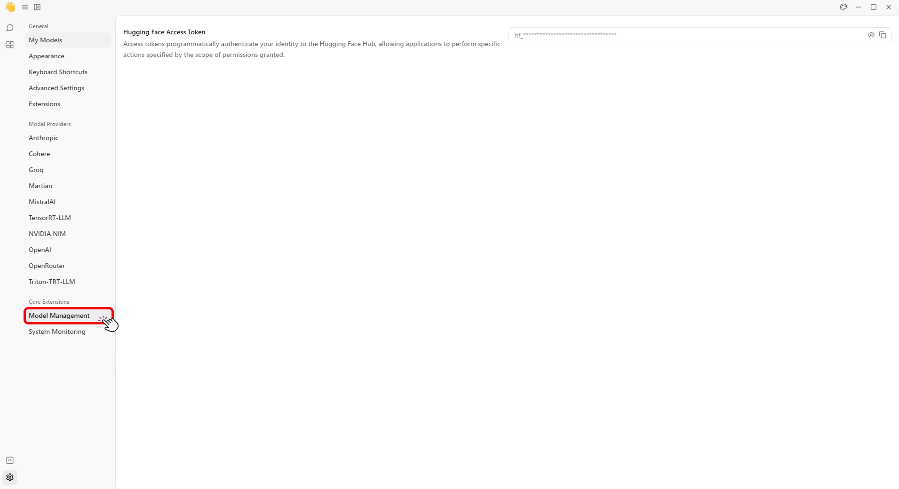
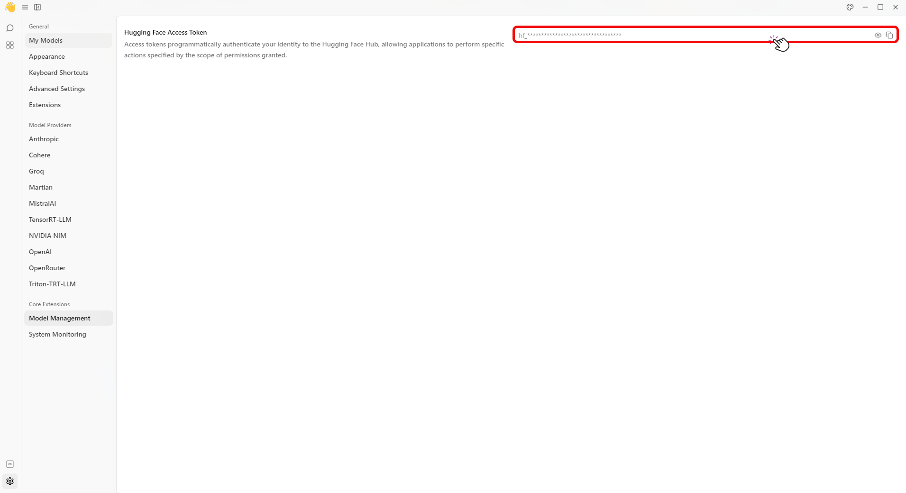
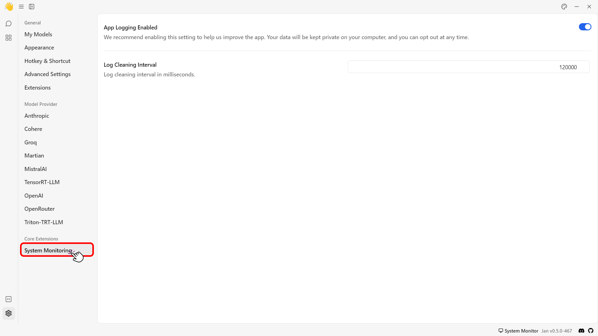
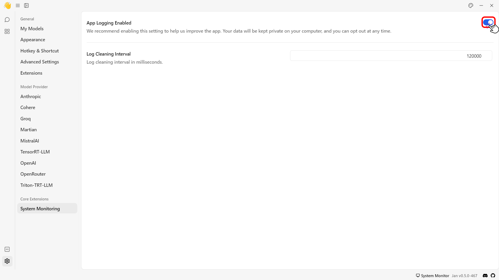
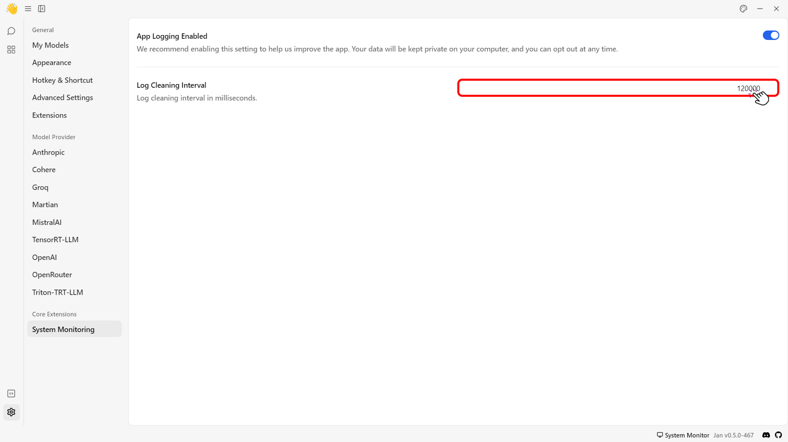

import { Callout } from 'nextra/components'


# Extensions Overview

The current Jan Desktop Client has some default extensions built on this framework to enhance the user experience. There are two types of extensions:
- Model Providers: These are extensions that enable Jan to support cloud-based models and provide the engine to support additional local models.
- Core Extensions: These are built-in tools for managing and monitoring the Jan's system.

## List of Model Provider Extensions
| Extension Name | Version | Description |
|----------------|---------|-------------|
| Anthropic      | v1.0.2  | This extension enables Anthropic chat completion API calls |
| Cohere         | v1.0.0  | This extension enables Cohere chat completion API calls |
| Groq           | v1.0.1  | This extension enables fast Groq chat completion API calls |
| Martian        | v1.0.1  | This extension enables Martian chat completion API calls |
| MistralAI      | v1.0.1  | This extension enables Mistral chat completion API calls |
| TensorRT-LLM   | v0.0.3  | This extension enables Nvidia's TensorRT-LLM for the fastest GPU acceleration. See the setup guide for next steps |
| NVIDIA NIM     | v1.0.1  | This extension enables NVIDIA chat completion API calls |
| OpenAI         | v1.0.2  | This extension enables OpenAI chat completion API calls |
| OpenRouter     | v1.0.0  | This extension enables Open Router chat completion API calls |
| Triton-TRT-LLM | v1.0.0  | This extension enables Nvidia's Triton-TRT-LLM as an inference engine option |

## List of Core Extensions
| Extension Name      | Version  | Description                                                                 |
|---------------------|----------|-----------------------------------------------------------------------------|
| Jan Assistant       | v1.0.1   | This extension enables assistants, including Jan, a default assistant that can call all downloaded models |
| Conversational      | v1.0.0   | This extension enables conversations and state persistence via your filesystem |
| Model Management    | v1.0.33  | Model Management Extension provides model exploration and seamless downloads |
| System Monitoring   | v1.0.10  | This extension provides system health and OS level data                     |


## Configure an Extension Settings

To configure an extension settings:

1. Navigate to the `~/jan/data/extensions`.
2. Open the `extensions.json` file
3. Edit the file with options including:

| Option           | Description                         |
| ---------------- | ----------------------------------- |
| `_active`        | Enable/disable the extension.       |
| `listeners`      | Default listener setting.           |
| `origin`         | Extension file path.                |
| `installOptions` | Version and metadata configuration. |
| `name`           | Extension name.                     |
| `productName`    | Extension display name.                     |
| `version`        | Extension version.                  |
| `main`           | Main file path.                     |
| `description`    | Extension description.              |
| `url`            | Extension URL.                      |

```json title="~/jan/data/extensions/extensions.json"
{
    "@janhq/conversational-extension": {
        "_active": true,
        "listeners": {},
        "origin": "C:\\Users\\ACER\\AppData\\Local\\Programs\\jan\\resources\\app.asar.unpacked\\pre-install\\janhq-conversational-extension-1.0.0.tgz",
        "installOptions": {
            "version": false,
            "fullMetadata": true
        },
        "name": "@janhq/conversational-extension",
        "productName": "Conversational",
        "version": "1.0.0",
        "main": "dist/index.js",
        "description": "This extension enables conversations and state persistence via your filesystem",
        "url": "extension://@janhq/conversational-extension/dist/index.js"
    },
    "@janhq/inference-anthropic-extension": {
        "_active": true,
        "listeners": {},
        "origin": "C:\\Users\\ACER\\AppData\\Local\\Programs\\jan\\resources\\app.asar.unpacked\\pre-install\\janhq-inference-anthropic-extension-1.0.2.tgz",
        "installOptions": {
            "version": false,
            "fullMetadata": true
        },
        "name": "@janhq/inference-anthropic-extension",
        "productName": "Anthropic Inference Engine",
        "version": "1.0.2",
        "main": "dist/index.js",
        "description": "This extension enables Anthropic chat completion API calls",
        "url": "extension://@janhq/inference-anthropic-extension/dist/index.js"
    },
    "@janhq/inference-triton-trt-llm-extension": {
        "_active": true,
        "listeners": {},
        "origin": "C:\\Users\\ACER\\AppData\\Local\\Programs\\jan\\resources\\app.asar.unpacked\\pre-install\\janhq-inference-triton-trt-llm-extension-1.0.0.tgz",
        "installOptions": {
            "version": false,
            "fullMetadata": true
        },
        "name": "@janhq/inference-triton-trt-llm-extension",
        "productName": "Triton-TRT-LLM Inference Engine",
        "version": "1.0.0",
        "main": "dist/index.js",
        "description": "This extension enables Nvidia's TensorRT-LLM as an inference engine option",
        "url": "extension://@janhq/inference-triton-trt-llm-extension/dist/index.js"
    },
    "@janhq/inference-mistral-extension": {
        "_active": true,
        "listeners": {},
        "origin": "C:\\Users\\ACER\\AppData\\Local\\Programs\\jan\\resources\\app.asar.unpacked\\pre-install\\janhq-inference-mistral-extension-1.0.1.tgz",
        "installOptions": {
            "version": false,
            "fullMetadata": true
        },
        "name": "@janhq/inference-mistral-extension",
        "productName": "MistralAI Inference Engine",
        "version": "1.0.1",
        "main": "dist/index.js",
        "description": "This extension enables Mistral chat completion API calls",
        "url": "extension://@janhq/inference-mistral-extension/dist/index.js"
    },
    "@janhq/inference-martian-extension": {
        "_active": true,
        "listeners": {},
        "origin": "C:\\Users\\ACER\\AppData\\Local\\Programs\\jan\\resources\\app.asar.unpacked\\pre-install\\janhq-inference-martian-extension-1.0.1.tgz",
        "installOptions": {
            "version": false,
            "fullMetadata": true
        },
        "name": "@janhq/inference-martian-extension",
        "productName": "Martian Inference Engine",
        "version": "1.0.1",
        "main": "dist/index.js",
        "description": "This extension enables Martian chat completion API calls",
        "url": "extension://@janhq/inference-martian-extension/dist/index.js"
    },
    "@janhq/inference-openrouter-extension": {
        "_active": true,
        "listeners": {},
        "origin": "C:\\Users\\ACER\\AppData\\Local\\Programs\\jan\\resources\\app.asar.unpacked\\pre-install\\janhq-inference-openrouter-extension-1.0.0.tgz",
        "installOptions": {
            "version": false,
            "fullMetadata": true
        },
        "name": "@janhq/inference-openrouter-extension",
        "productName": "OpenRouter Inference Engine",
        "version": "1.0.0",
        "main": "dist/index.js",
        "description": "This extension enables Open Router chat completion API calls",
        "url": "extension://@janhq/inference-openrouter-extension/dist/index.js"
    },
    "@janhq/inference-nvidia-extension": {
        "_active": true,
        "listeners": {},
        "origin": "C:\\Users\\ACER\\AppData\\Local\\Programs\\jan\\resources\\app.asar.unpacked\\pre-install\\janhq-inference-nvidia-extension-1.0.1.tgz",
        "installOptions": {
            "version": false,
            "fullMetadata": true
        },
        "name": "@janhq/inference-nvidia-extension",
        "productName": "NVIDIA NIM Inference Engine",
        "version": "1.0.1",
        "main": "dist/index.js",
        "description": "This extension enables NVIDIA chat completion API calls",
        "url": "extension://@janhq/inference-nvidia-extension/dist/index.js"
    },
    "@janhq/inference-groq-extension": {
        "_active": true,
        "listeners": {},
        "origin": "C:\\Users\\ACER\\AppData\\Local\\Programs\\jan\\resources\\app.asar.unpacked\\pre-install\\janhq-inference-groq-extension-1.0.1.tgz",
        "installOptions": {
            "version": false,
            "fullMetadata": true
        },
        "name": "@janhq/inference-groq-extension",
        "productName": "Groq Inference Engine",
        "version": "1.0.1",
        "main": "dist/index.js",
        "description": "This extension enables fast Groq chat completion API calls",
        "url": "extension://@janhq/inference-groq-extension/dist/index.js"
    },
    "@janhq/inference-openai-extension": {
        "_active": true,
        "listeners": {},
        "origin": "C:\\Users\\ACER\\AppData\\Local\\Programs\\jan\\resources\\app.asar.unpacked\\pre-install\\janhq-inference-openai-extension-1.0.2.tgz",
        "installOptions": {
            "version": false,
            "fullMetadata": true
        },
        "name": "@janhq/inference-openai-extension",
        "productName": "OpenAI Inference Engine",
        "version": "1.0.2",
        "main": "dist/index.js",
        "description": "This extension enables OpenAI chat completion API calls",
        "url": "extension://@janhq/inference-openai-extension/dist/index.js"
    },
    "@janhq/inference-cohere-extension": {
        "_active": true,
        "listeners": {},
        "origin": "C:\\Users\\ACER\\AppData\\Local\\Programs\\jan\\resources\\app.asar.unpacked\\pre-install\\janhq-inference-cohere-extension-1.0.0.tgz",
        "installOptions": {
            "version": false,
            "fullMetadata": true
        },
        "name": "@janhq/inference-cohere-extension",
        "productName": "Cohere Inference Engine",
        "version": "1.0.0",
        "main": "dist/index.js",
        "description": "This extension enables Cohere chat completion API calls",
        "url": "extension://@janhq/inference-cohere-extension/dist/index.js"
    },
    "@janhq/model-extension": {
        "_active": true,
        "listeners": {},
        "origin": "C:\\Users\\ACER\\AppData\\Local\\Programs\\jan\\resources\\app.asar.unpacked\\pre-install\\janhq-model-extension-1.0.33.tgz",
        "installOptions": {
            "version": false,
            "fullMetadata": true
        },
        "name": "@janhq/model-extension",
        "productName": "Model Management",
        "version": "1.0.33",
        "main": "dist/index.js",
        "description": "Model Management Extension provides model exploration and seamless downloads",
        "url": "extension://@janhq/model-extension/dist/index.js"
    },
    "@janhq/monitoring-extension": {
        "_active": true,
        "listeners": {},
        "origin": "C:\\Users\\ACER\\AppData\\Local\\Programs\\jan\\resources\\app.asar.unpacked\\pre-install\\janhq-monitoring-extension-1.0.10.tgz",
        "installOptions": {
            "version": false,
            "fullMetadata": true
        },
        "name": "@janhq/monitoring-extension",
        "productName": "System Monitoring",
        "version": "1.0.10",
        "main": "dist/index.js",
        "description": "This extension provides system health and OS level data",
        "url": "extension://@janhq/monitoring-extension/dist/index.js"
    },
    "@janhq/assistant-extension": {
        "_active": true,
        "listeners": {},
        "origin": "C:\\Users\\ACER\\AppData\\Local\\Programs\\jan\\resources\\app.asar.unpacked\\pre-install\\janhq-assistant-extension-1.0.1.tgz",
        "installOptions": {
            "version": false,
            "fullMetadata": true
        },
        "name": "@janhq/assistant-extension",
        "productName": "Jan Assistant",
        "version": "1.0.1",
        "main": "dist/index.js",
        "description": "This extension enables assistants, including Jan, a default assistant that can call all downloaded models",
        "url": "extension://@janhq/assistant-extension/dist/index.js"
    },
    "@janhq/tensorrt-llm-extension": {
        "_active": true,
        "listeners": {},
        "origin": "C:\\Users\\ACER\\AppData\\Local\\Programs\\jan\\resources\\app.asar.unpacked\\pre-install\\janhq-tensorrt-llm-extension-0.0.3.tgz",
        "installOptions": {
            "version": false,
            "fullMetadata": true
        },
        "name": "@janhq/tensorrt-llm-extension",
        "productName": "TensorRT-LLM Inference Engine",
        "version": "0.0.3",
        "main": "dist/index.js",
        "description": "This extension enables Nvidia's TensorRT-LLM for the fastest GPU acceleration. See the [setup guide](https://jan.ai/guides/providers/tensorrt-llm/) for next steps.",
        "url": "extension://@janhq/tensorrt-llm-extension/dist/index.js"
    },
    "@janhq/inference-cortex-extension": {
        "_active": true,
        "listeners": {},
        "origin": "C:\\Users\\ACER\\AppData\\Local\\Programs\\jan\\resources\\app.asar.unpacked\\pre-install\\janhq-inference-cortex-extension-1.0.15.tgz",
        "installOptions": {
            "version": false,
            "fullMetadata": true
        },
        "name": "@janhq/inference-cortex-extension",
        "productName": "Cortex Inference Engine",
        "version": "1.0.15",
        "main": "dist/index.js",
        "description": "This extension embeds cortex.cpp, a lightweight inference engine written in C++. See https://nitro.jan.ai.\nAdditional dependencies could be installed to run without Cuda Toolkit installation.",
        "url": "extension://@janhq/inference-cortex-extension/dist/index.js"
    }
}
```

## Specific Extension Settings
Jan offers an Extensions settings menu for configuring extensions that have registered their settings within the application. Here, you can directly integrate Remote Inference Engines with Jan without inserting the URL and API Key directly in the `JSON` file. Additionally, you can turn the Logging extensions available on or off in Jan. To access the Extension settings, follow the steps below:
1. Navigate to the main dashboard.
2. Click the **gear icon (⚙️)** on the bottom left of your screen.
<br/>

<br/>
3. Click **Extensions**.
<br/>


## Turn Off an Extension

To turn off the extension, follow the steps below:

1. Click the **Gear Icon (⚙️)** on the bottom left of your screen.
<br/>

<br/>
2. Click the **Extensions** button.
<br/>

<br/>
3. Click the slider button to turn off the extension.
<br/>

<br/>
4. Restart the app to see that the extension has been disabled.

## Model Management
The Model Management extension allows Jan's app to download specific models from Hugging Face repositories, which require an access token for access.
1. Navigate to the main dashboard.
2. Click the **Gear Icon (⚙️)** on the bottom left of your screen.
<br/>

<br/>
3. Under the **Core Extensions** section, select the **Model Management** extension.
<br/>

<br/>
4. Enter the HuggingFace access token.
<br/>

<br/>

## System Monitor
The System Monitor extension now offers enhanced customization for app logging. Users can toggle the application logging feature on or off and set a custom interval for clearing the app logs. To configure the app log feature, follow these steps:
1. Navigate to the main dashboard.
2. Click the **Gear Icon (⚙️)** on the bottom left of your screen.
<br/>

<br/>
3. Under the **Core Extensions** section, select the **System Monitoring** extension.
<br/>

<br/>
4. Use the **slider** to turn the app logging feature on or off.
<br/>

<br/>
5. Specify the log cleaning interval in milliseconds.
<br/>

<br/>
<Callout type='info'>
  - You can clear the app logs manually by clicking the **Clear logs** button in the advanced settings.
  - There are no minimum or maximum intervals for setting the time. However, invalid inputs will default to `120000ms (2 minutes)`.
</Callout>