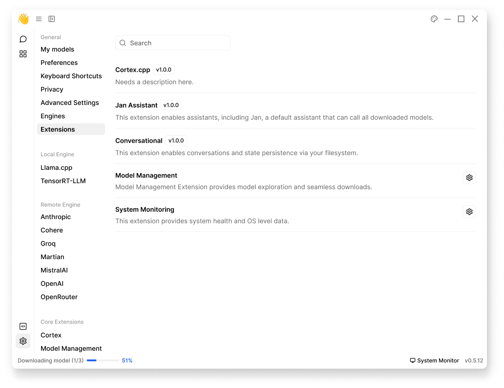

import { Callout } from 'nextra/components'
import { Settings, EllipsisVertical } from 'lucide-react'

# Extensions 

## Overview
Extensions are modular components that add functionality to Jan. Each extension is designed to handle specific features. 

Extensions can be managed through **Settings** (<Settings width={16} height={16} style={{display:"inline"}}/>) > **Extensions**:

 

 

## Core Extensions 

### Cortex
The primary extension that manages both **local** and **remote engines** capabilities:

#### Local Engines
[llama.cpp](/docs/local-engines/llama-cpp): Fast, efficient local inference engine that runs GGUF models directly on your device. Powers Jan's default local AI capabilities with support for multiple hardware configurations.

#### Remote Engines
- [Anthropic](/docs/remote-models/anthropic): Access Claude models
- [Cohere](/docs/remote-models/cohere): Access Cohere's models
- [Groq](/docs/remote-models/groq): High-performance inference
- [Martian](/docs/remote-models/martian): Specialized model access
- [MistralAI](/docs/remote-models/mistralai): Access Mistral models
- [NVIDIA NIM](/docs/remote-models/nvidia-nim) (NVIDIA Inference Microservices): Platform for deploying and serving GPU-accelerated AI models, providing enterprise-grade reliability and scalability.
- [OpenAI](/docs/remote-models/openai): Access GPT models
- [OpenRouter](/docs/remote-models/openrouter): Multi-provider model access
- [Triton-TRT-LLM](/docs/remote-models/triton): High-performance inference backend using NVIDIA Triton Inference Server with TensorRT-LLM optimization, designed for large-scale model deployment.

### Jan Assistant
Enables assistants functionality, including Jan - the default assistant that can utilize all downloaded models. This extension manages:
- Default assistant configurations
- Model selection
- Conversation management

### Conversational 
Manages all chat-related functionality and data persistence:

### [Model Management](/docs/extensions-settings/model-management)
Provides model exploration and seamless downloads:
- Model discovery and browsing
- Version control & configuration handling
- Download management

### [System Monitoring](/docs/extensions-settings/system-monitoring)
Provides system health and OS level data:
- Hardware utilization tracking
- Performance monitoring
- Error logging
