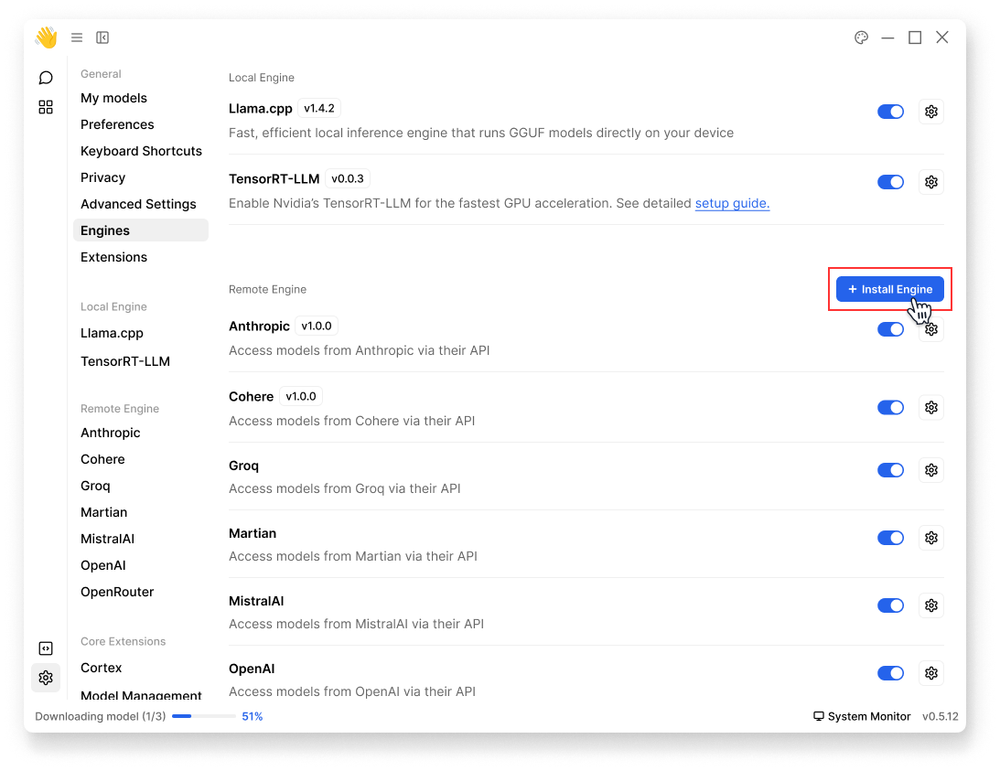
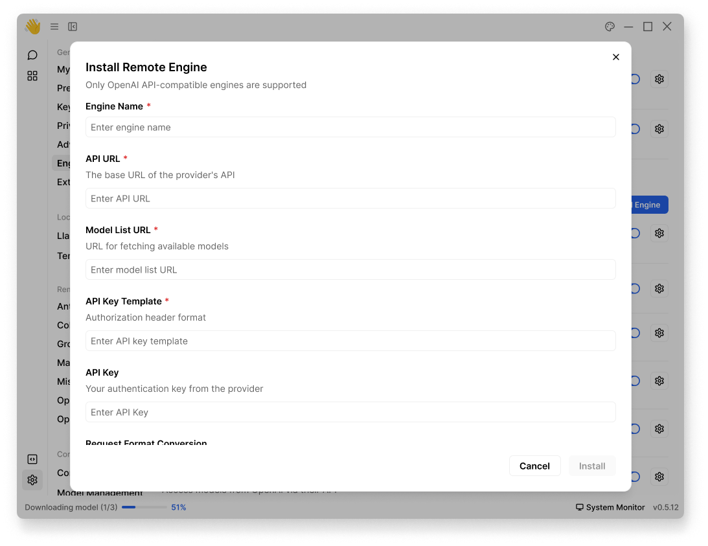
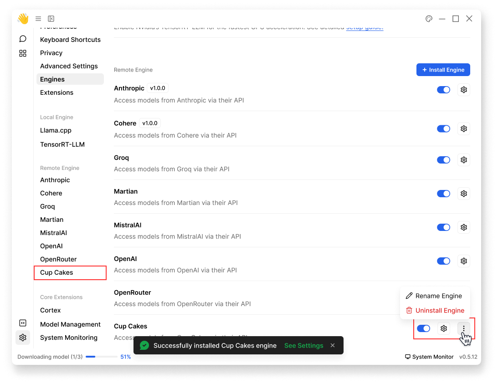

import { Callout } from 'nextra/components'
import { Settings, EllipsisVertical } from 'lucide-react'

# Install Engines

## Install Local Engines
Jan currently doesn't support installing a local engine yet.

## Install Remote Engines

### Step-by-step Guide
You can add any OpenAI API-compatible providers like OpenAI, Anthropic, or others.
To add a new remote engine:

1. Navigate to **Settings** (<Settings width={16} height={16} style={{display:"inline"}}/>) > **Engines**
1. At **Remote Engine** category, click **+ Install Engine** 

<br/>

<br/>

2. Fill in the following required information:

<br/>

<br/>

| Field | Description | Required |
|-------|-------------|----------|
| Engine Name | Name for your engine (e.g., "OpenAI", "Claude") | ✓ |
| API URL | The base URL of the provider's API | ✓ |
| API Key | Your authentication key from the provider | ✓ |
| Model List URL | URL for fetching available models | |
| API Key Template | Custom authorization header format | |
| Request Format Conversion | Function to convert Jan's request format to provider's format | |
| Response Format Conversion | Function to convert provider's response format to Jan's format | |


> - The conversion functions are only needed for providers that don't follow the OpenAI API format. For OpenAI-compatible APIs, you can leave these empty.
> - For OpenAI-compatible APIs like OpenAI, Anthropic, or Groq, you only need to fill in the required fields. Leave optional fields empty.

4. Click **Install** 
5. Once completed, you should see your engine in **Engines** page:
    - You can rename or uninstall your engine
    - You can navigate to its own settings page

<br/>

<br/>

### Examples
#### OpenAI-Compatible Setup
Here's how to set up OpenAI as a remote engine:

1. Engine Name: `OpenAI`
2. API URL: `https://api.openai.com`
3. Model List URL: `https://api.openai.com/v1/models`
4. API Key: Your OpenAI API key
5. Leave other fields as default


#### Custom APIs Setup
If you're integrating an API that doesn't follow OpenAI's format, you'll need to use the conversion functions. 
Let's say you have a custom API with this format:

```javascript
// Custom API Request Format
{
  "prompt": "What is AI?",
  "max_length": 100,
  "temperature": 0.7
}

// Custom API Response Format
{
  "generated_text": "AI is...",
  "tokens_used": 50,
  "status": "success"
}
```

Here's how to set it up in Jan:
```
Engine Name: Custom LLM
API URL: https://api.customllm.com
API Key: your_api_key_here
```

**Conversion Functions:**
> - Request: Convert from Jan's OpenAI-style format to your API's format
> - Response: Convert from your API's format back to OpenAI-style format

1. Request Format Conversion:
```javascript
function convertRequest(janRequest) {
  return {
    prompt: janRequest.messages[janRequest.messages.length - 1].content,
    max_length: janRequest.max_tokens || 100,
    temperature: janRequest.temperature || 0.7
  }
}
```

2. Response Format Conversion:
```javascript
function convertResponse(apiResponse) {
  return {
    choices: [{
      message: {
        role: "assistant",
        content: apiResponse.generated_text
      }
    }],
    usage: {
      total_tokens: apiResponse.tokens_used
    }
  }
}
```


**Expected Formats:**

1. Jan's Request Format
```javascript
{
  "messages": [
    {"role": "user", "content": "What is AI?"}
  ],
  "max_tokens": 100,
  "temperature": 0.7
}
```

2. Jan's Expected Response Format
```javascript
{
  "choices": [{
    "message": {
      "role": "assistant",
      "content": "AI is..."
    }
  }],
  "usage": {
    "total_tokens": 50
  }
}
```

<Callout type="warning">
Make sure to test your conversion functions thoroughly. Incorrect conversions may cause errors or unexpected behavior.
</Callout>


