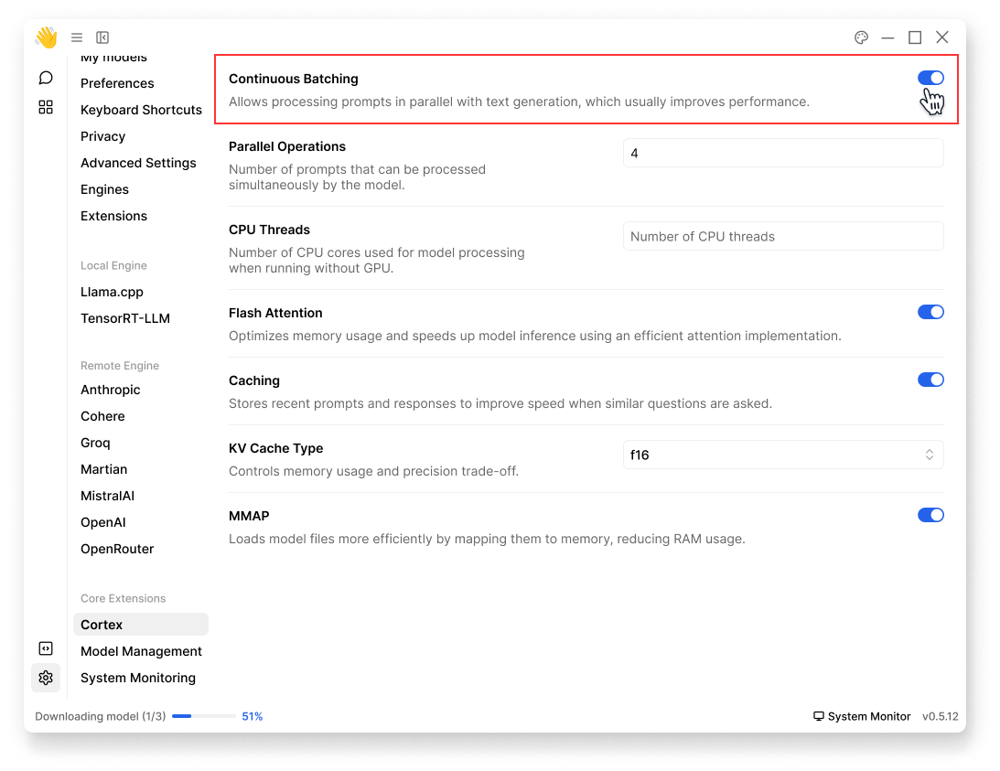

import { Callout } from 'nextra/components'
import { Settings, Plus } from 'lucide-react'


# Install Extensions

Jan uses a modular extension system that allows developers to add new functionality to the application. By default, Jan comes with several [pre-installed extensions](/docs/extensions#core-extensions) that provide core functionalities. You can manually add custom third-party extensions at your own risk.

## Prerequisites

### Required Tools
- Node.js (version 20.0.0 or higher)
- Basic understanding of TypeScript

### Jan's Architecture
Jan is built on:
- **Electron**: Powers the desktop application
  - Extensions run in the main process
  - Access to Node.js APIs and filesystem
  - Cannot use browser-only libraries
- **Next.js**: Handles the user interface
- **Node.js**: Runs extension logic

This architecture means your extensions:
- Can use Node.js packages and system APIs
- Need to handle client/server communication properly
- Should follow Electron's security practices

## Create Extensions

<Callout type="info">
Jan currently only accepts `.tgz` file format for extensions.
</Callout>

> **Heads Up:**
> - Use the following structure and setup as a **reference** only.
> - You're free to develop extensions using any approach or structure that works for your needs. Feel free to experiment and innovate.
> - If you already have your own `.tgz` extension file, please move forward to [install extension](/docs/install-extensions#install-extensions) step. 

### Extension Structure
Your extension should follow this basic structure:

```
my-extension/
├── package.json           # Extension metadata and dependencies
├── dist/                 # Compiled JavaScript files
│   └── index.js         # Main extension entry point
├── src/                 # Source code
│   └── index.ts        # TypeScript source
└── README.md           # Extension documentation
```

### Required package.json Fields
```json
{
  "name": "@your-org/extension-name",
  "version": "1.0.0",
  "main": "dist/index.js",
  "types": "dist/index.d.ts",
  "jan": {
    "type": "extension",
    "displayName": "Your Extension Name",
    "description": "Description of what your extension does"
  },
  "scripts": {
    "build": "tsc",
    "package": "npm pack"
  },
  "dependencies": {
    // List your dependencies
  },
  "devDependencies": {
    "typescript": "^5.0.0"
  }
}
```

### Example Extension Template

You can find a template for creating Jan extensions in our [example repository](https://github.com/janhq/extension-template).
## Install Extensions 

To install a custom extension in Jan:

1. Open Jan, navigate to **Settings** (<Settings width={16} height={16} style={{display:"inline"}}/>) > **Extensions**
2. Click **<Plus width={16} height={16} style={{display:"inline"}}/> Install Extension**
3. Select your extension `.tgz` file & save
4. Restart Jan

After restart, the `~/jan/data/extensions/extensions.json` file will be updated automatically to include your new extension.

<br/>

<br/>

## Troubleshooting
**Check Extensions Logs**

```bash
# View application logs
~/jan/logs/app.log

# Open Developer Tools
Mac: Cmd + Option + I
Windows/Linux: Ctrl + Shift + I
```
**Common Error Patterns**

1. Initialization Failures
   - Extension fails to load/activate
   - Verify package.json configuration
   - Check extension dependencies

2. Runtime Errors
   - Node.js module errors
   - API connection issues
   - Authentication failures

3. Build Problems
```bash
rm -rf dist/
npm run build
```

