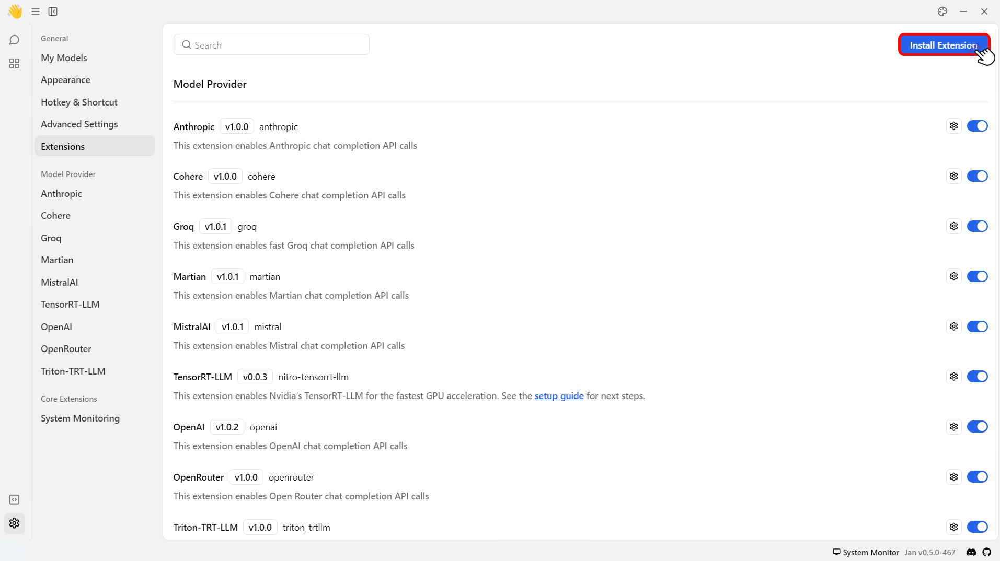

import { Callout } from 'nextra/components'

## Installing an Extension

Jan automatically installs 11 default extensions when you set up the application. You can also add a custom third-party extension at your own risk.

Here are the steps to install a custom extension:
<Callout type="info">
Jan only accepts the `.tgz` file format for installing a custom extension.
</Callout>

1. Click the **Gear Icon (⚙️)** on the bottom left of your screen.
 

 
2. Click the **Extensions** button.
 

 
2. Select **Install Extension** on top right corner.
 

 
3. Select a `.tgz` extension file.
4. Restart the Jan application.
5. Then, the `~/jan/data/extensions/extensions.json` file will be updated automatically.