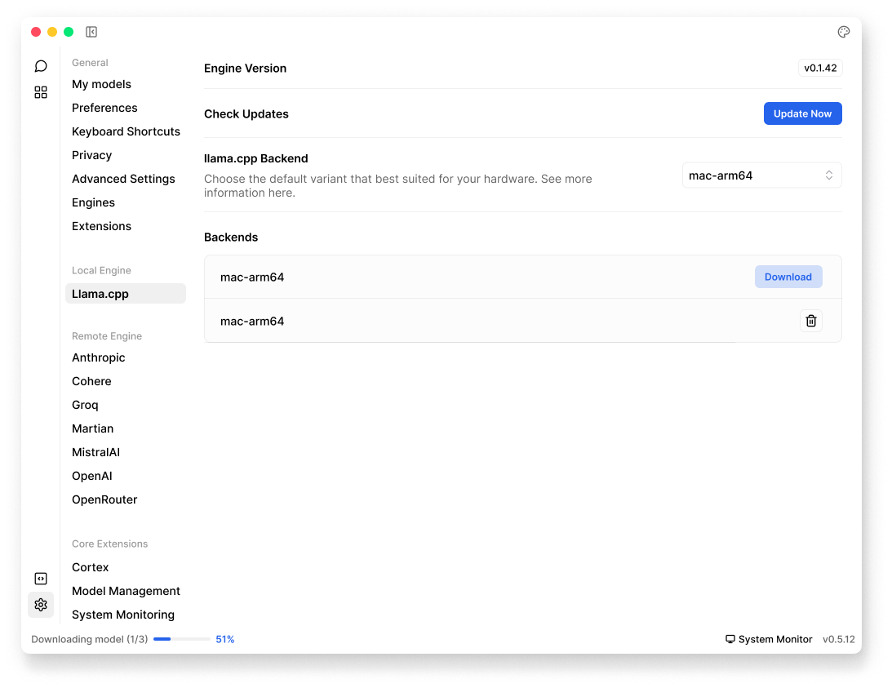

import { Tabs } from 'nextra/components'
import { Callout, Steps } from 'nextra/components'
import { Settings, EllipsisVertical, Plus, FolderOpen, Pencil } from 'lucide-react'

# llama.cpp (Cortex)

## Overview
Jan uses **llama.cpp** for running local AI models. You can find its settings in **Settings** (<Settings width={16} height={16} style={{display:"inline"}}/>) > **Local Engine** > **llama.cpp**:

 

 

These settings are for advanced users, you would want to check these settings when:
- Your AI models are running slowly or not working
- You've installed new hardware (like a graphics card)
- You want to tinker & test performance with different [backends](/docs/local-engines/llama-cpp#available-backends)

## Engine Version and Updates
- **Engine Version**: View current version of llama.cpp engine
- **Check Updates**: Verify if a newer version is available & install available updates when it's available

## Available Backends

Jan offers different backend variants for **llama.cpp** based on your operating system, you can:
- Download different backends as needed
- Switch between backends for different hardware configurations
- View currently installed backends in the list

<Callout type="warning">
Choose the backend that matches your hardware. Using the wrong variant may cause performance issues or prevent models from loading.
</Callout>

<Tabs items={['Windows', 'Linux', 'macOS']}>

<Tabs.Tab>
### CUDA Support (NVIDIA GPUs)
- `llama.cpp-avx-cuda-11-7`
- `llama.cpp-avx-cuda-12-0`
- `llama.cpp-avx2-cuda-11-7`
- `llama.cpp-avx2-cuda-12-0`
- `llama.cpp-avx512-cuda-11-7`
- `llama.cpp-avx512-cuda-12-0`
- `llama.cpp-noavx-cuda-11-7`
- `llama.cpp-noavx-cuda-12-0`

### CPU Only
- `llama.cpp-avx`
- `llama.cpp-avx2`
- `llama.cpp-avx512`
- `llama.cpp-noavx`

### Other Accelerators
- `llama.cpp-vulkan`

<Callout type="info">
- For detailed hardware compatibility, please visit our guide for [Windows](/docs/desktop/windows#compatibility).
- AVX, AVX2, and AVX-512 are CPU instruction sets. For best performance, use the most advanced instruction set your CPU supports.
- CUDA versions should match your installed NVIDIA drivers.
</Callout>

</Tabs.Tab>

<Tabs.Tab>
### CUDA Support (NVIDIA GPUs)
- `llama.cpp-avx-cuda-11-7`
- `llama.cpp-avx-cuda-12-0`
- `llama.cpp-avx2-cuda-11-7`
- `llama.cpp-avx2-cuda-12-0`
- `llama.cpp-avx512-cuda-11-7`
- `llama.cpp-avx512-cuda-12-0`
- `llama.cpp-noavx-cuda-11-7`
- `llama.cpp-noavx-cuda-12-0`

### CPU Only
- `llama.cpp-avx`
- `llama.cpp-avx2`
- `llama.cpp-avx512`
- `llama.cpp-noavx`

### Other Accelerators
- `llama.cpp-vulkan`
- `llama.cpp-arm64`

<Callout type="info">
- For detailed hardware compatibility, please visit our guide for [Linux](docs/desktop/linux).
- AVX, AVX2, and AVX-512 are CPU instruction sets. For best performance, use the most advanced instruction set your CPU supports.
- CUDA versions should match your installed NVIDIA drivers.
</Callout>

</Tabs.Tab>

<Tabs.Tab>
### Apple Silicon
- `llama.cpp-mac-arm64`: For M1/M2/M3 Macs

### Intel
- `llama.cpp-mac-amd64`: For Intel-based Macs

<Callout type="info">
For detailed hardware compatibility, please visit our guide for [Mac](/docs/desktop/mac#compatibility).
</Callout>

</Tabs.Tab>

</Tabs>

## Performance Settings

| Setting | Description | Default |
|---------|-------------|---------|
| **Continuous Batching** | - Enables processing multiple requests simultaneously  - Improves throughput for concurrent operations | Enabled |
| **Parallel Operations** | - Number of prompts to run in parallel  - Affects model inference speed | 4 |
| **CPU Threads** | - Number of CPU cores to use when running without GPU  - Higher thread counts may improve performance but increase CPU usage | Auto-detected based on your system's capabilities |

## Memory Settings

| Setting | Description | Default |
|---------|-------------|---------|
| **Flash Attention** | - Optimizes attention computation  - Reduces memory usage  - Recommended for most cases | Enabled |
| **Caching** | - Enable to store recent prompts and responses  - Improves response time for repeated prompts | Enabled |
| **KV Cache Type** | - KV cache implementation type; controls memory usage and precision trade-off  - Options:  • f16 (most stable)  • q8_0 (balanced)  • q4_0 (lowest memory) | f16 |
| **mmap** | - Enables memory-mapped model loading  - Reduces memory usage  - Recommended for large models | Enabled |

## Best Practices
- Start with default settings
- Adjust based on your hardware capabilities
- Monitor system performance
- Test changes with your specific use case

<Callout type="info">
Performance impact varies by hardware, model size, and usage patterns.
</Callout>

