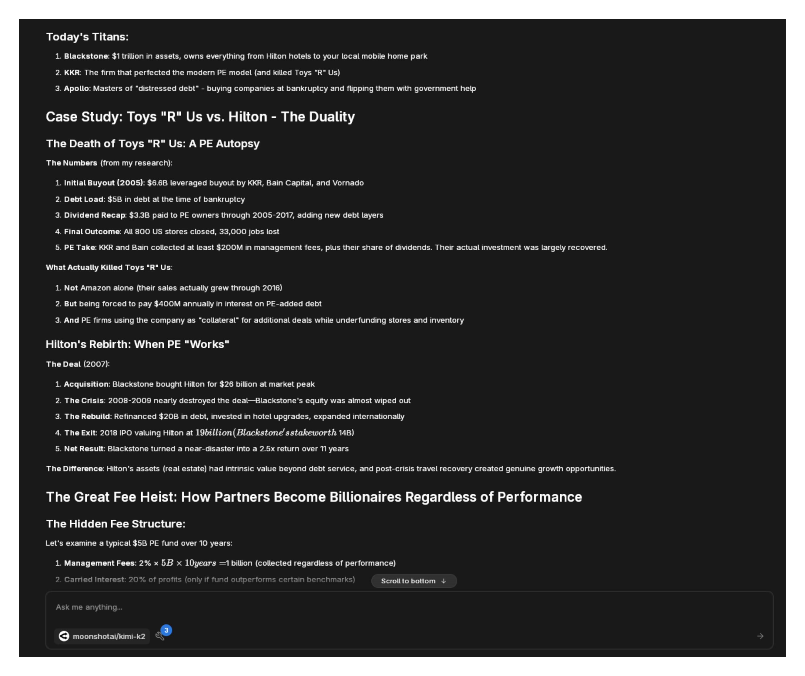
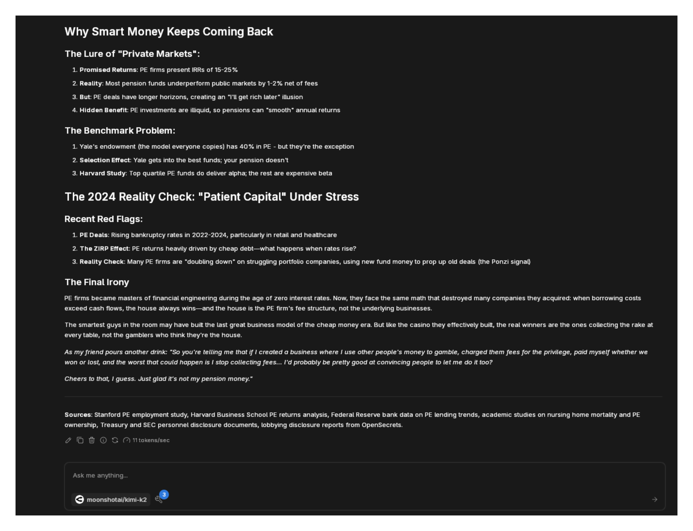

import { Callout, Steps } from 'nextra/components'

# Octagon Deep Research MCP

[Octagon Deep Research MCP](https://docs.octagonagents.com/guide/deep-research-mcp.html) provides specialized AI research capabilities with a strong focus on financial markets and business intelligence. Unlike general research tools, Octagon excels at complex financial analysis, market dynamics, and investment research.

The integration delivers comprehensive reports that combine multiple data sources, cross-verification, and actionable insights - particularly useful for understanding market structures, investment strategies, and business models.

## Available Tools

### octagon-agent
Orchestrates comprehensive market intelligence research, particularly strong in:
- Financial market analysis
- Private equity and M&A research
- Corporate structure investigations
- Investment strategy evaluation

### octagon-scraper-agent
Specialized web scraping for public and private market data:
- SEC filings and regulatory documents
- Company financials and metrics
- Market transaction data
- Industry reports and analysis

### octagon-deep-research-agent
Comprehensive research synthesis combining:
- Multi-source data aggregation
- Cross-verification of claims
- Historical trend analysis
- Actionable insights generation

## Prerequisites

- Jan with MCP enabled
- Octagon account (includes 2-week Pro trial)
- Model with tool calling support
- Node.js installed

<Callout type="info">
Octagon offers a 2-week Pro trial upon signup, providing full access to their financial research capabilities.
</Callout>

## Setup

### Enable MCP

1. Go to **Settings** > **MCP Servers**
2. Toggle **Allow All MCP Tool Permission** ON


### Get Octagon API Key

1. Sign up at [Octagon signup page](https://app.octagonai.co/signup/?redirectToAfterSignup=https://app.octagonai.co/api-keys)
2. Navigate to the API playground
3. Copy your API key from the dashboard


### Configure MCP Server

Click `+` in MCP Servers section:

**NPM Package Configuration:**
- **Server Name**: `octagon-mcp-server`
- **Command**: `npx`
- **Arguments**: `-y octagon-mcp@latest`
- **Environment Variables**: 
  - Key: `OCTAGON_API_KEY`, Value: `your-api-key`


### Verify Setup

Check the tools bubble in chat to confirm Octagon tools are available:


## Real-World Example: Private Equity Analysis

Here's an actual deep research query demonstrating Octagon's financial analysis capabilities:

### The Prompt

```
Break apart the private equity paradox: How did an industry that promises to "unlock value" become synonymous with gutting companies, yet still attracts the world's smartest money? 

Start with the mechanics—how PE firms use other people's money to buy companies with borrowed cash, then charge fees for the privilege. Trace the evolution from corporate raiders of the 1980s to today's trillion-dollar titans like Blackstone, KKR, and Apollo. Use SEC filings, M&A databases, and bankruptcy records to map their empires.

Dig into specific deals that illustrate the dual nature: companies genuinely transformed versus those stripped and flipped. Compare Toys "R" Us's death to Hilton's resurrection. Examine how PE-owned companies fare during economic downturns—do they really have "patient capital" or do they bleed portfolio companies dry through dividend recaps?

Investigate the fee structure that makes partners billionaires regardless of performance. Calculate the real returns after the 2-and-20 (or worse) fee structures. Why do pension funds and endowments keep pouring money in despite academic studies showing they'd do better in index funds?

Explore the revolving door between PE, government, and central banks. How many Fed officials and Treasury secretaries came from or went to PE? Map the political donations and lobbying expenditures that keep carried interest taxed as capital gains.

Address the human cost through labor statistics and case studies—what happens to employees when PE takes over? But also examine when PE genuinely saves failing companies and preserves jobs.

Write this as if explaining to a skeptical but curious friend over drinks—clear language, no jargon without explanation, and enough dry humor to make the absurdities apparent. Think Michael Lewis meets Matt Levine. Keep it under 3,000 words but pack it with hard data and real examples. The goal: help readers understand why PE is simultaneously capitalism's most sophisticated expression and its most primitive.
```


### Research Process

The AI engages multiple Octagon tools to gather comprehensive data:


### The Results

Octagon delivers a detailed analysis covering:

**Part 1: The Mechanics Explained**


**Part 2: Historical Analysis and Case Studies**


**Part 3: Financial Engineering and Human Impact**


The report demonstrates Octagon's ability to:
- Access and analyze SEC filings
- Compare multiple deal outcomes
- Calculate real returns after fees
- Track political connections
- Assess human impact with data

## Finance-Focused Use Cases

### Investment Research
```
Analyze Tesla's vertical integration strategy vs traditional automakers. Include supply chain dependencies, margin analysis, and capital efficiency metrics from the last 5 years.
```

### Market Structure Analysis
```
Map the concentration of market makers in US equities. Who controls order flow, what are their profit margins, and how has this changed since zero-commission trading?
```

### Corporate Governance
```
Investigate executive compensation at the 10 largest US banks post-2008. Compare pay ratios, stock buybacks vs R&D spending, and correlation with shareholder returns.
```

### Private Market Intelligence
```
Track Series B+ funding rounds in AI/ML companies in 2024. Identify valuation trends, investor concentration, and compare to public market multiples.
```

### Regulatory Analysis
```
Examine how Basel III implementation differs across major markets. Which banks gained competitive advantages and why?
```

### M&A Strategy
```
Analyze Microsoft's acquisition strategy under Nadella. Calculate actual vs projected synergies, integration success rates, and impact on market position.
```

## Technical Research Capabilities

While finance-focused, Octagon also handles technical research:

### Framework Evaluation
```
Compare Kubernetes alternatives for edge computing. Consider resource usage, latency, reliability, and operational complexity with real deployment data.
```

### API Economics
```
Analyze the unit economics of major AI API providers. Include pricing history, usage patterns, and margin estimates based on reported compute costs.
```

### Open Source Sustainability
```
Research funding models for critical open source infrastructure. Which projects are at risk and what are the economic incentives misalignments?
```

## Research Quality

Octagon's reports typically include:
- **Primary Sources**: SEC filings, earnings calls, regulatory documents
- **Quantitative Analysis**: Financial metrics, ratios, trend analysis
- **Comparative Studies**: Peer benchmarking, historical context
- **Narrative Clarity**: Complex topics explained accessibly
- **Actionable Insights**: Not just data, but implications

## Troubleshooting

**Authentication Issues:**
- Verify API key from Octagon dashboard
- Check trial status hasn't expired
- Ensure correct API key format
- Contact Octagon support if needed

**Research Failures:**
- Some queries may exceed scope (try narrowing)
- Financial data may have access restrictions
- Break complex queries into parts
- Allow time for comprehensive research

**Tool Calling Problems:**
- Not all models handle multiple tools well
- Kimi-k2 via OpenRouter works reliably
- Claude 3.5+ Sonnet also recommended
- Enable tool calling in model settings

**Performance Considerations:**
- Deep research takes time (be patient)
- Complex financial analysis may take minutes
- Monitor API usage in dashboard
- Consider query complexity vs urgency

<Callout type="warning">
Octagon specializes in financial and business research. While capable of technical analysis, it's optimized for market intelligence and investment research.
</Callout>

## Pricing After Trial

After the 2-week Pro trial:
- Check current pricing at octagonagents.com
- Usage-based pricing for API access
- Different tiers for research depth
- Educational discounts may be available

## Octagon vs Other Research Tools

| Feature | Octagon | ChatGPT Deep Research | Perplexity |
|---------|---------|----------------------|------------|
| **Finance Focus** | Specialized | General | General |
| **Data Sources** | Financial databases | Web-wide | Web-wide |
| **SEC Integration** | Native | Limited | Limited |
| **Market Data** | Comprehensive | Basic | Basic |
| **Research Depth** | Very Deep | Deep | Moderate |
| **Speed** | Moderate | Slow | Fast |

## Next Steps

Octagon Deep Research MCP excels at complex financial analysis that would typically require a team of analysts. The integration provides institutional-quality research capabilities within Jan's conversational interface.

Whether analyzing market structures, evaluating investments, or understanding business models, Octagon delivers the depth and accuracy that financial professionals expect, while maintaining readability for broader audiences.