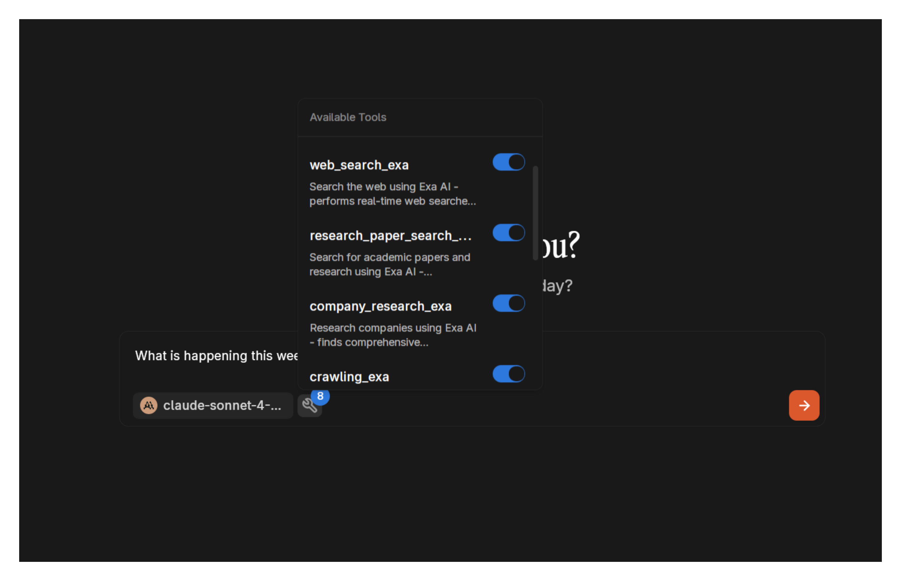

import { Callout, Steps } from 'nextra/components'

# Exa Search MCP

[Exa MCP](https://docs.exa.ai/examples/exa-mcp) provides real-time web search capabilities for AI models. Instead of relying on training data, 
models can access current web content through Exa's search API.

## Available Tools

Exa MCP includes eight search functions:

- `web_search_exa`: General web search with content extraction
- `research_paper_search`: Academic papers and research content
- `company_research`: Company analysis and business intelligence
- `crawling`: Extract content from specific URLs
- `competitor_finder`: Find business competitors
- `linkedin_search`: Search LinkedIn profiles and companies
- `wikipedia_search_exa`: Wikipedia content retrieval
- `github_search`: Repository and code search

## Prerequisites

- Jan with MCP enabled
- Exa API key from [dashboard.exa.ai](https://dashboard.exa.ai/api-keys)
- Model with tool calling support
- Node.js installed

<Callout type="info">
Tool calling support varies by model. Jan Nano 32k and 128k, Claude, Gemini, GPT-4o and above models work reliably. For both local and remote models, 
verify tool calling is enabled in model parameters.
</Callout>

## Setup

### Enable MCP

1. Go to **Settings** > **MCP Servers**
2. Toggle **Allow All MCP Tool Permission** ON


### Get API Key

1. Visit [dashboard.exa.ai/api-keys](https://dashboard.exa.ai/api-keys)
2. Create account or sign in
3. Generate API key
4. Save the key


### Configure MCP Server

Click `+` in MCP Servers section:


**Configuration:**
- **Server Name**: `exa`
- **Command**: `npx`
- **Arguments**: `-y exa-mcp-server`
- **Environment Variables**: 
  - Key: `EXA_API_KEY`
  - Value: `your-api-key`


### Verify Setup

Check server status in the MCP Servers list.


### Model Configuration

Use a compatible model provider:

- **Jan Nano 32k**
- **Anthropic**
- **OpenAI**
- **OpenRouter**


## Usage

Start a new chat with a tool-enabled model. Exa tools will appear in the available tools list.



### Example Queries

**Current Events & Activities:**
```
What is happening this week, mid July 2025, in Sydney, Australia?
```


**Investment Research:**
```
Find recent research papers about quantum computing startups that received Series A funding in 2024-2025
```

**Tech Discovery:**
```
Find GitHub repositories for WebAssembly runtime engines written in Rust with active development
```

**Career Intelligence:**
```
Search LinkedIn for AI safety researchers at major tech companies who published papers in the last 6 months
```

**Competitive Analysis:**
```
Research emerging competitors to OpenAI in the large language model space, focusing on companies founded after 2023
```

**Travel & Local Research:**
```
Find authentic local food experiences in Tokyo that aren't in typical tourist guides, mentioned in recent travel blogs
```

**Academic Research:**
```
Find recent papers about carbon capture technology breakthroughs published in Nature or Science during 2025
```

**Creator Economy:**
```
Research successful creators who transitioned from TikTok to longer-form content platforms in 2024-2025
```

**Emerging Tech Trends:**
```
Find startups working on brain-computer interfaces that have raised funding in the past 12 months
```

**Health & Wellness:**
```
Extract information about the latest longevity research findings from Peter Attia's recent podcast episodes
```

**Regulatory Intelligence:**
```
Find recent AI regulation developments in the EU that could impact US companies, focusing on July 2025 updates
```

**Supply Chain Research:**
```
Research companies developing sustainable packaging alternatives that have partnerships with major retailers
```

## Use Cases

### Academic Research
Literature reviews, finding recent papers, tracking research trends.

### Business Intelligence
Competitor analysis, market research, company information gathering.

### Technical Research
Finding libraries, tools, and code repositories. Documentation research.

### Content Analysis
Extracting and analyzing content from specific URLs for research.

### Professional Search
LinkedIn searches for industry connections and expertise.

## Troubleshooting

**Connection Issues:**
- Verify API key accuracy
- Check Node.js installation
- Restart Jan
- Make sure you have enough credits in your Exa account

**Tool Calling Problems:**
- Confirm tool calling is enabled for your model
- Try Jan Nano 32k, Claude, Gemini, GPT-4o and above models
- Check MCP server status

**Search Quality:**
- Use specific, descriptive queries
- Prefer natural language over keywords

**API Errors:**
- Verify API key at [dashboard.exa.ai](https://dashboard.exa.ai)
- Check rate limits on your plan
- Regenerate API key if needed

<Callout type="warning">
Exa has API rate limits. Check your plan limits to avoid interruptions.
</Callout>

## Next Steps

Exa MCP enables real-time web search within Jan's privacy-focused environment. Models can access current information while maintaining 
local conversation processing.