import { Callout, Steps } from 'nextra/components'

# Using the Model Context Protocol (MCP) in Jan

```mermaid
graph TD
    subgraph "What is MCP?"
        You[You using Jan Desktop]
        Claude[Jan AI Assistant]
        
        subgraph "Your Connected Tools"
            Files[📁 Your Files<br/>Documents, folders,<br/>text files]
            Database[📊 Your Data<br/>Spreadsheets,<br/>databases]
            WebServices[🌐 Online Services<br/>GitHub, Slack,<br/>Google Drive]
            Custom[🔧 Custom Tools<br/>Special programs<br/>you've added]
        end
        
        subgraph "What Jan Can Do"
            Read[Read & Understand<br/>- View your files<br/>- Check your data<br/>- See updates]
            Action[Take Actions<br/>- Search for info<br/>- Create content<br/>- Run commands]
            Templates[Use Templates<br/>- Common tasks<br/>- Saved prompts<br/>- Workflows]
        end
    end
    
    You --> Claude
    Claude -->|"Can I see this file?"| Files
    Claude -->|"What's in my database?"| Database
    Claude -->|"Check my GitHub"| WebServices
    Claude -->|"Run this tool"| Custom
    
    Files --> Read
    Database --> Read
    WebServices --> Action
    Custom --> Templates
    
    style You fill:transparent
    style Claude fill:transparent
    style Files fill:transparent
    style Database fill:transparent
    style WebServices fill:transparent
    style Custom fill:transparent
    style Read fill:transparent
    style Action fill:transparent
    style Templates fill:transparent
```

Jan now supports the **Model Context Protocol (MCP)**, an open standard designed to allow language models to
interact with external tools and data sources.

MCPs act as a common interface, standardizing the way an AI model can interact with external tools and data
sources. This enables a model to connect to any MCP-compliant tool without requiring custom
integration work. The way this works is via clients and servers. Clients are connected to an AI model and a host
where a user will describe the task needed to be done. These applications hosting client will want to connect
to different data sources to accomplish a task, for example, notion, google sheets, or even custom APIs. These
applications will be connected to a server with prompts, tools, and data sources which will be used to complete
the task.

Jan is an MCP host that allows you to download different clients and servers and use them to accomplish a task.

This document outlines the benefits, risks, and implementation of MCPs within Jan.

## Core Benefits of MCP

Integrating MCP provides a structured way to extend the capabilities of the models you use in Jan. Here are the three

* **Standardization:** MCP aims to solve the "M x N" integration problem, where every model (M) needs a
unique connector for every tool (N). By adapting to a single standard, any compliant model can interface with any compliant tool.
* **Extensibility:** This allows you to augment your models with new abilities. For instance, an AI can be granted
access to search your local codebase, query a database, or interact with web APIs, all through the same protocol.
* **Flexibility:** Because the interface is standardized, you can swap out models or tools with minimal friction,
making your workflows more modular and adaptable over time.

<Callout type="warning">
  Please note that not all models that you can download and use, whether in Jan or other tools, may be good at
  tool calling or compatible with MCP. Make sure that the model you choose is MCP-compliant before integrating
  it into your workflows. This might be available in the model card or you may need to implement it yourself to
  test the capabilities of the model.
</Callout>

<Callout type="info">
  To use MCP effectively, ensure your AI model supports tool calling capabilities:
  - For cloud models (like Claude or GPT-4): Verify tool calling is enabled in your API settings
  - For local models: Enable tool calling in the model parameters [click the edit button in Model Capabilities](/docs/model-parameters#model-capabilities-edit-button)
  - Check the model's documentation to confirm MCP compatibility
</Callout>

## Considerations and Risks

While powerful, MCP is an evolving standard, and its use requires careful consideration of the following points:

* **Security:** Granting a model access to external tools is a significant security consideration. A compromised
tool or a malicious prompt could potentially lead to unintended actions or data exposure. Jan's implementation
focuses on user-managed permissions to mitigate this risk, meaning, you have to turn on the permission for each
tool individually.
* **Standard Maturity:** As a relatively new protocol, best practices or sensible defaults are still being
established. Users should be aware of potential issues like prompt injection, where an input could be crafted to
misuse a tool's capabilities.
* **Resource Management:** Active MCP connections may consume a portion of a model's context window, which could
affect performance (i.e., the more tools the model and the larger the context of the conversation has the longer
you will need to wait for a response). Efficient management of tools and their outputs is important.

## Configure and Use MCPs within Jan

To illustrate how MCPs can be used within Jan, we will walk through an example using the [Browser MCP](https://browsermcp.io/).

Before we begin, you will need to enable experimental features at `General` > `Advanced`. Next, go to `Settings` > `MCP Servers`, and toggle
the `Allow All MCP Tool Permission` switch ON.

Please note that you will also need to have **NodeJS** and/or **Python** installed on your machine. In case you don't
have either, you can download them from the official websites at the links below:
- [Node.js](https://nodejs.org/)
- [Python](https://www.python.org/)

### Browser MCP

- Click on the `+` sign on the upper right-hand corner of the MCP box.

- Enter the following details to configure the BrowserMCP:
  - **Server Name**: `browsermcp`
  - **Command**: `npx`
  - **Arguments**: `@browsermcp/mcp`
  - **Environment Variables**: You can leave this field empty.

- Check that the server has been activated successfully.

- Open your favorite chrome-based browser (e.g., Google Chrome, Brave, Vivaldi, Microsoft Edge, etc...) and navigate to the
[Browser MCP Extension Page](https://chromewebstore.google.com/detail/browser-mcp-automate-your/bjfgambnhccakkhmkepdoekmckoijdlc).

- Make sure to enable the extension to run on private windows. Since Browser Use will have access to all sites you've
already logged into in your regular browser session, it is best to give it a clean slate to start from.

- Enable the extension to run on private windows by clicking on it and Connecting to the Browser MCP server.

- Go back to Jan and pick a model with good tool use capabilities, for example, Claude 3.7 and 4 Sonnet, or Claude 4 Opus,
and make sure to enable tool calling via the UI by going to **Model Providers > Anthropic** and, after you have entered your
API key, enable tool from the **+** button.

You can check and see if this was accurate below.

## Troubleshooting

- The MCP server won't connect even though I've already added it to my list of MCP Servers?
  - Make sure you have NodeJS and Python installed
  - Make sure you typed the commands correctly in the MCP Server form
  - Make sure the model you are using has tools enabled
  - Restart Jan
- The open source model I picked won't use the MCPs I enabled.
  - Make sure the model you are using has tools enabled
  - Lots of open source models are not designed to use tools or simply don't work well with them, so you may need to try a different model
  - The model you have selected might be good at tool calling but it is possible that it does not support images, effectively making it unsuitable for some tools that take screenshots of a website like the Browser MCP

## Future Potential

This integration is the foundation for creating more capable and context-aware AI assistants within Jan. The
long-term goal is to enable more sophisticated workflows that make use of your local environment securely as
well as your favorite tools.

For example, an AI could cross-reference information between a local document and a remote API, or use a
local script toanalyze data and then summarize the findings, all orchestrated through Jan's interface. As
the MCP ecosystem grows, so will the potential applications within Jan.
