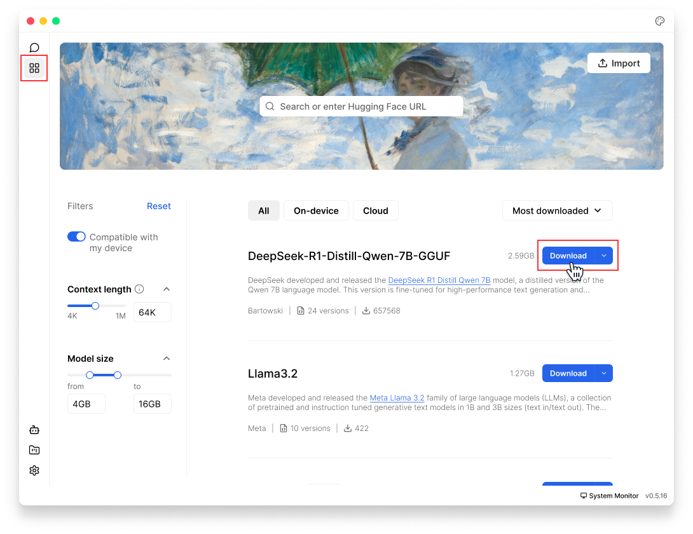
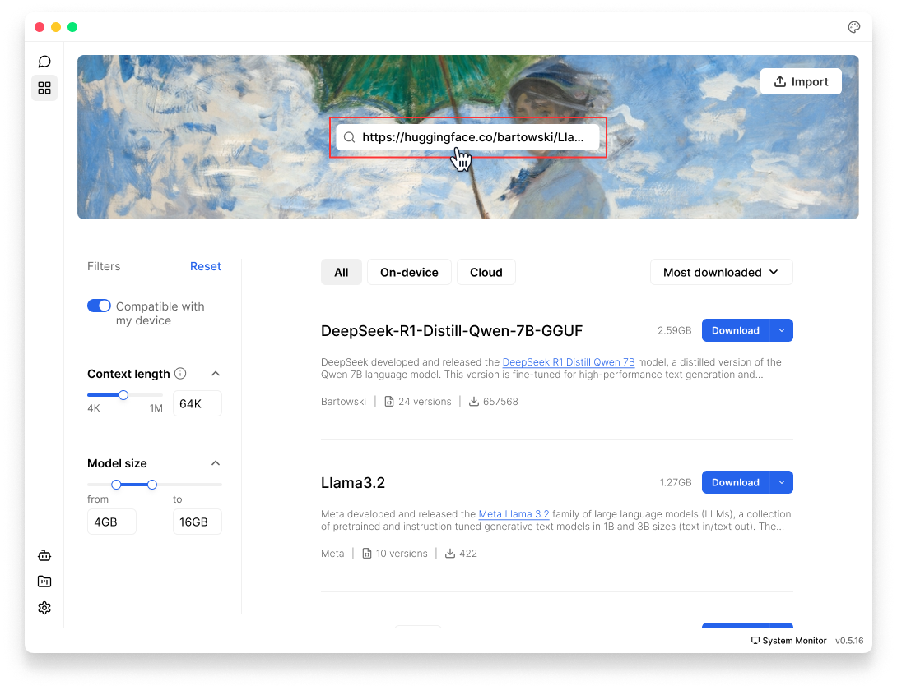

import { Callout, Steps } from 'nextra/components'
import { Settings, Trash2, EllipsisVertical, Plus, FolderOpen, Pencil } from 'lucide-react'


# Model Management
This guide provides comprehensive instructions on adding, customizing, and deleting models within Jan. 

## Local Model

Jan offers flexible options for managing local models through its [Cortex](https://cortex.so/) engine. Currently, Jan only supports **GGUF format** models.
<Callout type="info">
Local models run directly on your computer, which means they use your computer's memory (RAM) and processing power. Please choose models carefully based on your hardware specifications for [Mac](/docs/desktop/mac#compatibility), [Windows](/docs/desktop/windows#compatibility), & [Linux](/docs/desktop/linux#compatibility).
</Callout>

### Add Models

#### 1. Download from Jan Hub (Recommended)
The easiest way to get started is using Jan's built-in model hub:
1. Go to **Hub**
2. Browse available models and click on any model to see details about it
3. Choose a model that fits your needs & hardware specifications
4. Click **Download** on your chosen model

<Callout type="info">
Jan will indicate if a model might be **Slow on your device** or **Not enough RAM** based on your system specifications.
</Callout>

<br/>

<br/>

#### 2. Import from [Hugging Face](https://huggingface.co/) 
You can import GGUF models directly from [Hugging Face](https://huggingface.co/):

##### Option A: Import in Jan
1. Visit [Hugging Face Models](https://huggingface.co/models).
2. Find a GGUF model you want to use
3. Copy the **model ID** (e.g., TheBloke/Mistral-7B-v0.1-GGUF) or its **URL**
4. In Jan, paste the model ID/URL to **Search** bar in **Hub** or in  **Settings** (<Settings width={16} height={16} style={{display:"inline"}}/>) > **My Models**
5. Select your preferred quantized version to download

<br/>

<br/>

##### Option B: Use Deep Link
You can use Jan's deep link feature to quickly import models:
1. Visit [Hugging Face Models](https://huggingface.co/models).
2. Find the GGUF model you want to use
3. Copy the **model ID**, for example: `bartowski/Llama-3.2-3B-Instruct-GGUF`
4. Create a **deep link URL** in this format:
```
jan://models/huggingface/<model_id>
```
5. Enter the URL in your browser & **Enter**, for example:
```
jan://models/huggingface/bartowski/Llama-3.2-3B-Instruct-GGUF
```
6. A prompt will appear: `This site is trying to open Jan`, click **Open** to open Jan app.
7. Select your preferred quantized version to download

<Callout type="warning">
Deep linking won't work for models requiring API tokens or usage agreements. You'll need to download these models manually through the Hugging Face website.
</Callout>

<br/>

<br/>


#### 3. Import Local Files
If you already have GGUF model files on your computer:
1. In Jan, go to **Hub** or **Settings** (<Settings width={16} height={16} style={{display:"inline"}}/>) > **My Models**
2. Click **Import Model**
3. Select your **GGUF** file(s)
4. Choose how you want to import:
  - **Link Files:** Creates symbolic links to your model files (saves space)
  - **Duplicate:** Makes a copy of model files in Jan's directory
5. Click **Import** to complete

<Callout type="warning">
You need to own your **model configurations**, use at your own risk. Misconfigurations may result in lower quality or unexpected outputs. 
</Callout>

<br/>

<br/>

#### 4. Manual Setup
For advanced users who add a specific model that is not available within Jan **Hub**:
<Steps>
##### Step 1: Create Model File
1. Navigate to [Jan Data Folder]()
2. Open `models` folder
3. Create a new **Folder** for your model
4. Add a `model.json` file with your configuration:
```bash
  "id": "<unique_identifier_of_the_model>",
  "object": "<type_of_object, e.g., model, tool>",
  "name": "<name_of_the_model>",
  "version": "<version_number>",
  "description": "<brief_description_of_the_model>",
  "format": "<format_of_the_model_api_or_other>",
  "settings": "<additional_settings_as_needed>",
  "parameters": {
    "max_tokens": "<maximum_number_of_tokens_the_model_can_generate>",
    "temperature": "<temperature_setting_for_randomness_in_generation>"
  },
  "metadata": {
    "author": "<name_of_the_creator_or_organization>",
    "tags": ["<list_of_relevant_tags_describing_the_model>"]
  },
  "engine": "<engine_or_platform_the_model_runs_on>",
  "source": "<url_or_source_of_the_model_information>"
```
Here's model "TinyLlama Chat 1.1B Q4" as an example:
```json
{
  "sources": [
    {
      "filename": "tinyllama-1.1b-chat-v1.0.Q4_K_M.gguf",
      "url": "https://huggingface.co/TheBloke/TinyLlama-1.1B-Chat-v1.0-GGUF/resolve/main/tinyllama-1.1b-chat-v1.0.Q4_K_M.gguf"
    }
  ],
  "id": "tinyllama-1.1b",
  "object": "model",
  "name": "TinyLlama Chat 1.1B Q4",
  "version": "1.0",
  "description": "TinyLlama is a tiny model with only 1.1B. It's a good model for less powerful computers.",
  "format": "gguf",
  "settings": {
    "ctx_len": 4096,
    "prompt_template": "<|system|>\n{system_message}<|user|>\n{prompt}<|assistant|>",
    "llama_model_path": "tinyllama-1.1b-chat-v1.0.Q4_K_M.gguf"
  },
  "parameters": {
    "temperature": 0.7,
    "top_p": 0.95,
    "stream": true,
    "max_tokens": 2048,
    "stop": [],
    "frequency_penalty": 0,
    "presence_penalty": 0
  },
  "metadata": {
    "author": "TinyLlama",
    "tags": [
      "Tiny",
      "Foundation Model"
    ],
    "size": 669000000
  },
  "engine": "nitro"
}
```
##### Step 2: Modify Model Parameters
Modify model parameters under the settings array. Key fields to configure:
1. **Settings** is where you can set your engine configurations.
2. [**Parameters**](/docs/models/model-parameters) are the adjustable settings that affect how your model operates or processes the data. The fields in parameters are typically general and can be the same across models. Here is an example of model parameters:
```
"parameters":{
  "temperature": 0.7,
  "top_p": 0.95,
  "stream": true,
  "max_tokens": 4096,
  "frequency_penalty": 0,
  "presence_penalty": 0,
}
```
</Steps>

### Delete Models
1. Go to **Settings** (<Settings width={16} height={16} style={{display:"inline"}}/>) > **My Models**
2. Find the model you want to remove
3. Select the three dots <EllipsisVertical width={16} height={16} style={{display:"inline"}}/> icon next to it and select **Delete Model**

<br/>

<br/>


## Cloud model
<Callout type="info">
When using cloud models, be aware of any associated costs and rate limits from the providers. See detailed guide for each cloud model provider [here](/docs/remote-models/anthropic).
</Callout>

Jan supports connecting to various AI cloud providers that are OpenAI API-compatible, including: OpenAI (GPT-4, o1,...), Anthropic (Claude), Groq, Mistral, and more.
1. Navigate to **Settings** (<Settings width={16} height={16} style={{display:"inline"}}/>)
2. Under **Remote Engine** section in the left sidebar, choose your preferred engines (OpenAI, Anthropic, etc.)
3. Enter your API key
4. The activated cloud models will be available in your model selector in **Threads**

<br/>

<br/>

You can manage & hide respective provider engines in **Settings** > **Engines**:
<br/>

<br/>

### Add Models
1. In your respective provider's settings page, click **Add Model**
2. Enter the **model ID**. Check detailed model IDs in the provider's model list, for example, `claude-3-opus-latest`.
3. A success message will appear when the model is added

<br/>

<br/>

### Delete Models
1. In your respective provider's settings page, choose the model you want to delete
2. Click **Trash Bin** (<Trash2 width={16} height={16} style={{display:"inline"}}/>) icon
3. The model will be removed from your available models list

<br/>

<br/>