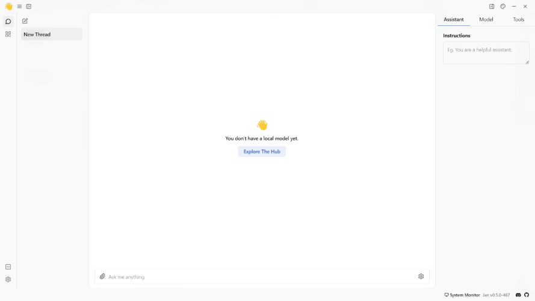
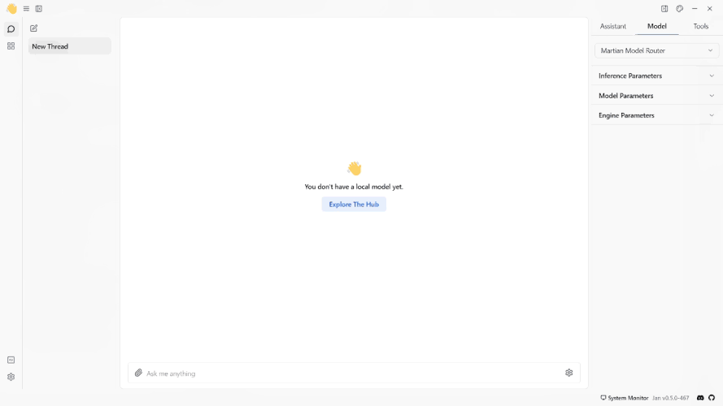
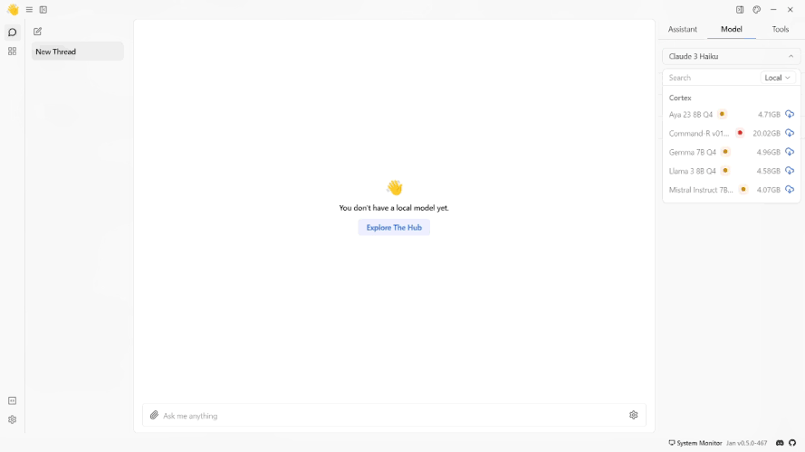
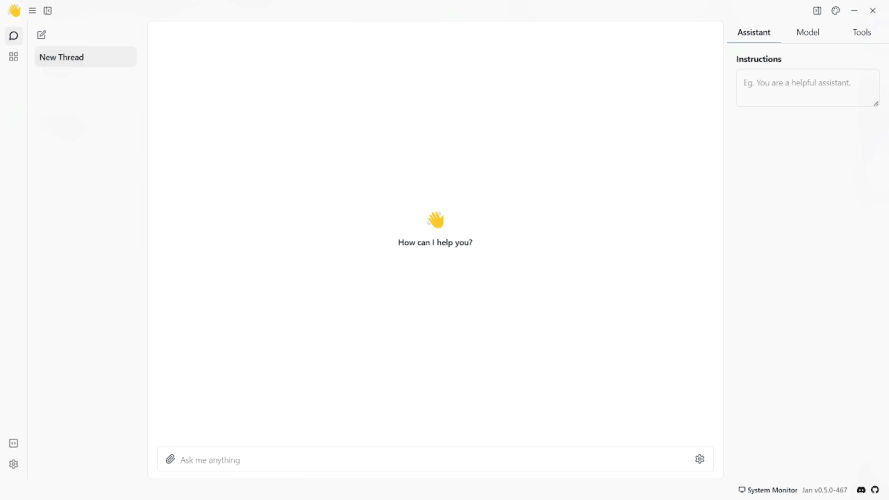
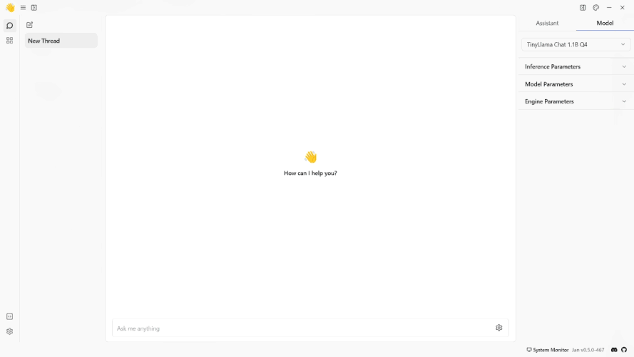
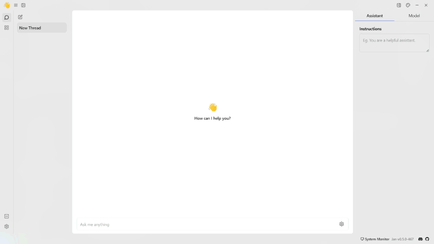

import { Tabs } from 'nextra/components'
import { Callout, Steps } from 'nextra/components'

# Quickstart
<Steps>

### Step 1: Install Jan
1. [Download Jan](/download)
2. Install the application on your system ([Mac](/docs/desktop/mac), [Windows](/docs/desktop/windows), [Linux](/docs/desktop/linux))
3. Launch Jan

Once installed, you'll see the Jan application interface with no local models pre-installed yet. You'll be able to:
- Download and run local AI models 
- Connect to cloud AI providers if desired
 

 

### Step 2: Download a Model
Jan offers various local AI models, from smaller efficient models to larger more capable ones:
1. Go to the **Hub**
2. Browse available models and click on any model to see details about it
3. Choose a model that fits your needs & hardware specifications
4. Click **Download** to begin installation
<Callout type="info">
Unlike cloud-based AI, local models run directly on your computer, which means they use your computer's memory (RAM) and processing power. Please choose models carefully based on your hardware specifications.
</Callout>

For more model installation methods, please visit [Model Management](/docs/models/manage-models).

 

 

### Step 3: Turn on the GPU Acceleration (Optional)
While waiting for model downloading, let's customize your hardware setup. If you have a graphics card, boost model performance by enabling GPU acceleration:
1. Open Jan application.
2. Go to **Settings** -> **Advanced Settings** -> **GPU Acceleration**.
3. Click the Slider and choose your preferred GPU.
3. A success notification saying **Successfully turned on GPU acceleration** will appear when GPU acceleration is activated.
<Callout type="info">
Ensure you have installed your GPU driver. Please see [Desktop](/docs/desktop) for more information on activating the GPU acceleration.
</Callout>
 

### Step 4: Customize the Assistant Instruction
Customize Jan's assistant behavior by specifying queries, commands, or requests in the Assistant Instructions field to get the most responses from your assistant. To customize, follow the steps below:
1. On the **Thread** section, navigate to the right panel.
2. Select the **Assistant** tab menu.
3. Provide a specific guideline under the **Instructions** field.
 

 
### Step 5: Start Thread

Once you have downloaded a model and customized your assistant instruction, you can start chatting with the model.

 

 

### Step 6: Connect to a Remote API
Jan also offers access to remote models hosted on external servers. You can link up with any Remote AI APIs compatible with OpenAI. Jan comes with numerous extensions that facilitate connections to various remote AI APIs. To explore and connect to Remote APIs, follow these steps:
1. On the **Thread** section, navigate to the right panel.
2. Select the **Model** tab menu.
3. Next to the **OpenAI** models -> click the **Gear Icon (⚙️)**.
4. Enter your OpenAI API **Keys**.

 

 
</Steps>

## What's Next?
Now that Jan is up and running, explore further:
1. Learn how to download and manage your [models](/docs/models).
2. Customize Jan's [application settings](/docs/settings) according to your preferences.