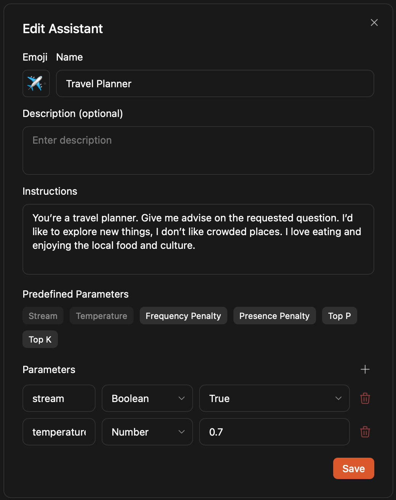

import { Callout, Steps } from 'nextra/components'
import { Settings } from 'lucide-react'

# Quickstart

<Steps>

### Step 1: Install Jan

1. [Download Jan](/download)
2. Install the app on your system ([Mac](/docs/desktop/mac), [Windows](/docs/desktop/windows), [Linux](/docs/desktop/linux))
3. Launch Jan

Once installed, you'll see Jan's interface with no pre-installed models. You can:
- Download and run local AI models
- Connect to cloud-based AI model providers if desired
 

 

### Step 2: Download a Model

Jan offers various local AI models, from nimble lightweights to hefty powerhouses:
1. Go to the **Hub Tab** or to [HuggingFace](https://huggingface.co/models) where you will be able
to find even more models alongside their details. (TIP: You can copy the URL or name of the model on the Hub Tab
and download it there.)
2. Browse models and tap any for details (Models need to be in GGUF format)
3. Select one that matches your needs & hardware specs
4. Hit **Download** to begin (a progress bar will appear for the duration of the download)

 

 

<Callout type="warning">
Local models consume your computer's memory and processing power. Choose carefully based on your hardware
specifications ([Mac](/docs/desktop/mac#minimum-requirements), [Windows](/docs/desktop/windows#compatibility),
[Linux](/docs/desktop/linux#compatibility)).
</Callout>

**Note:** Some Hugging Face models require an access token. Enter yours
in **Settings > Model Providers > Llama.cpp > Hugging Face Access Token** before importing.

 

 

For alternative installation methods, see the [Model Management](/manage-models) section.

### Step 3: Turn on GPU Acceleration (Optional)

While your model downloads, let's supercharge your setup. On **Windows** or **Linux** with
a compatible graphics card, you can dramatically boost performance with GPU acceleration.
1. Head to **(<Settings width={16} height={16} style={{display:"inline"}}/>) Settings** > **Hardware**
2. Under **GPUs**, toggle the setting to ON if not already enabled.

<Callout type="info">
Install all required dependencies and drivers before enabling GPU acceleration. Check the **GPU Setup Guide** for [Windows](/docs/desktop/windows#gpu-acceleration) & [Linux](/docs/desktop/linux#gpu-acceleration).
</Callout>
 

### Step 4: Customize Assistant Instructions

With your model ready to roll, you can tailor how it responds by tweaking instructions or model configurations
through the [Assistants feature](/docs/assistants).

 

 

You can also go to the assistant tab to manage all of your personalized instructions. The cool thing about
these is that you can use them no matter which model you choose.

 

 

### Step 5: Start Chatting and Update the Settings

Model downloaded? Instructions set? Time to chat. Type your message in the **input field** at
the bottom to kickstart the conversation.

Fine-tune your experience by:
- Tweaking [model parameters](/docs/model-parameters) via the **Gear icon** next to your model or in **Assistant Settings**
- Switching models for different tasks through the **model selector** in **Model** tab or **input field**
- [Creating new threads](/docs/threads#creating-new-thread) with custom instructions and configurations

 

 

### Step 6: Connect to cloud models (Optional)

Jan plays nice with both open source and cloud models. Connect to OpenAI (GPT-4o, o1), Anthropic (Claude), Groq, Mistral, and others:
1. Open any **Thread**
2. Select a model from the **model selector** dropdown
3. Pick your provider, click the **Gear icon** beside it
4. Grab a valid API key from your chosen provider (make sure it has sufficient credits)
5. Paste your **API Key** into Jan

For detailed setup, check [Remote APIs](/docs/remote-models/openai).

 

 

</Steps>
