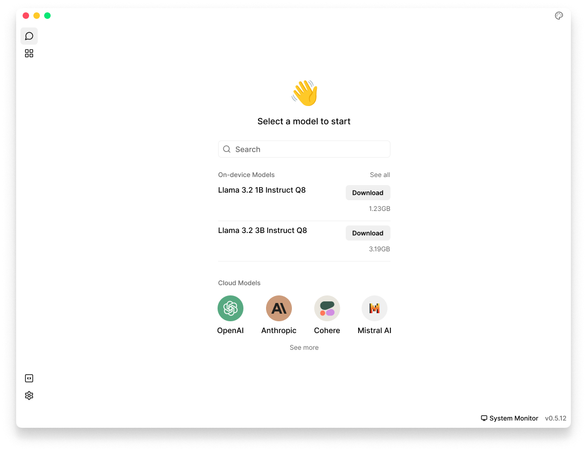
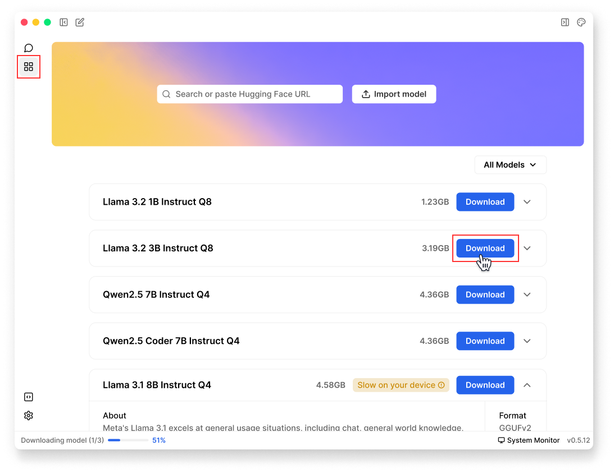
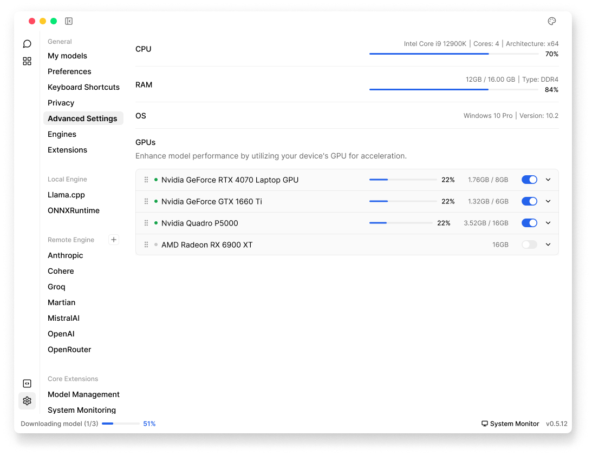
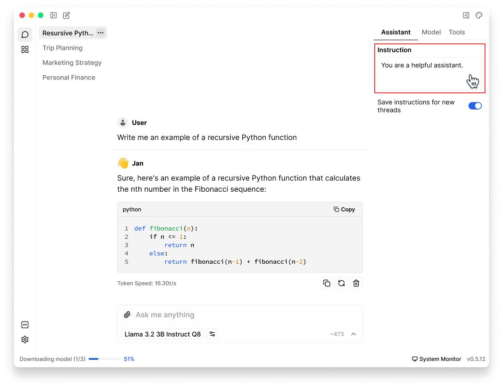
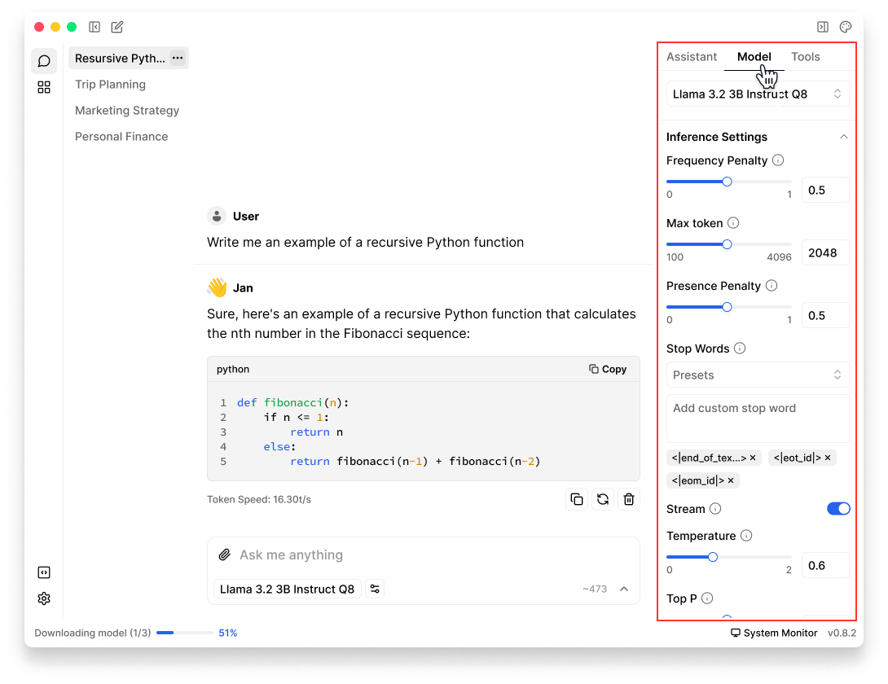
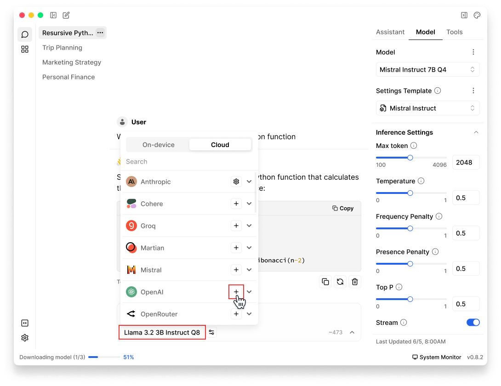

import { Tabs } from 'nextra/components'
import { Callout, Steps } from 'nextra/components'
import { Settings } from 'lucide-react'

# Quickstart
<Steps>

### Step 1: Install Jan
1. [Download Jan](/download)
2. Install the application on your system ([Mac](/docs/desktop/mac), [Windows](/docs/desktop/windows), [Linux](/docs/desktop/linux))
3. Launch Jan

Once installed, you'll see Jan application interface with no models pre-installed yet. You'll be able to:
- Download and run local AI models 
- Connect to cloud AI providers if desired
 

 

### Step 2: Download a Model
Jan offers various local AI models, from smaller efficient models to larger more capable ones:
1. Go to **Hub**
2. Browse available models and click on any model to see details about it
3. Choose a model that fits your needs & hardware specifications
4. Click **Download** to begin installation
<Callout type="info">
Local models run directly on your computer, which means they use your computer's memory (RAM) and processing power. Please choose models carefully based on your hardware specifications ([Mac](/docs/desktop/mac#minimum-requirements), [Windows](/docs/desktop/windows#compatibility), [Linux](/docs/desktop/linux#compatibility)).
</Callout>

For more model installation methods, please visit [Model Management](/docs/models/manage-models).

 

 

### Step 3: Turn on GPU Acceleration (Optional)
While the model downloads, let's optimize your hardware setup. If you're on **Windows** or **Linux** and have a compatible graphics card, you can significantly boost model performance by enabling GPU acceleration.
1. Navigate to **Settings** (<Settings width={16} height={16} style={{display:"inline"}}/>) > **Advanced Settings** 
2. At **GPU Acceleration**, toggle on and select your preferred GPU(s)
3. App reload is required after the selection

<Callout type="info">
Ensure you have installed all required dependencies and drivers before enabling GPU acceleration. See **GPU Setup Guide** on [Windows](/docs/desktop/windows#gpu-acceleration) & [Linux](/docs/desktop/linux#gpu-acceleration) for detailed instructions.
</Callout>
 

### Step 4: Customize Assistant Instructions
Once your model has been downloaded and you're ready to start your first conversation, you can customize how it responds by setting specific instructions:
1. In any **Thread**, click the **Assistant** tab in the **right sidebar**
2. Enter your instructions in **Instructions** field to define how Jan should respond

You can modify these instructions at any time during your conversation to adjust Jan's behavior for that specific thread. See detailed guide at [Assistant](/docs/assistants).
 

 
### Step 5: Start Chatting and Fine-tune Settings
Now that your model is downloaded and instructions are set, you can begin chatting with Jan. Type your message in the **input field** at the bottom of the thread to start the conversation.

You can further customize your experience by:
- Adjust [model parameters](/docs/models/model-parameters) in the **Model** tab in the **right sidebar**
- Try different models for different tasks by clicking the **model selector** in **Model** tab or **input field**
- [Create new threads](/docs/threads#creating-new-thread) with different instructions and model configurations

 

 

### Step 6: Connect to cloud models (Optional)
Jan supports both local and cloud AI models. You can connect to cloud AI services that are OpenAI API-compatible, including: OpenAI (GPT-4, o1,...), Anthropic (Claude), Groq, Mistral, and more.
1. Open any **Thread**
2. Click **Model** tab in the **right sidebar** or **model selector** in input field
3. Once the selector is poped up, choose the **Cloud** tab
4. Select your preferred provider (Anthropic, OpenAI, etc.), click **Add (➕)** icon next to the provider
5. Obtain a valid API key from your chosen provider, ensure the key has sufficient credits & appropriate permissions
6. Copy & insert your **API Key** in Jan

See [Remote APIs](/docs/remote-models/openai) for detailed configuration.

 

 

</Steps>

## What's Next?
Now that Jan is up and running, explore further:
1. Learn how to download and manage your [models](/docs/models).
2. Customize Jan's [application settings](/docs/settings) according to your preferences.