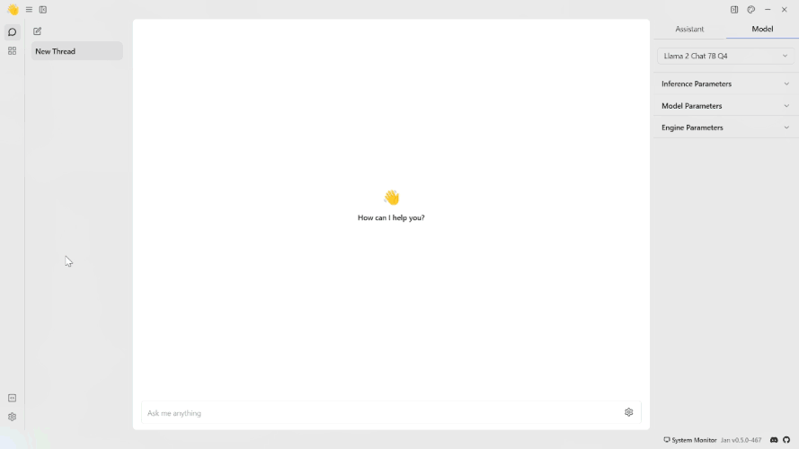
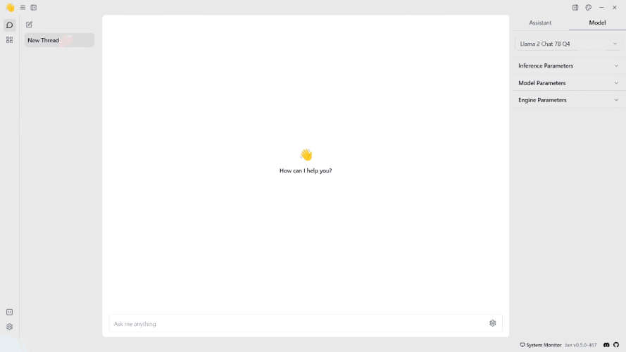

import { Callout, Steps } from 'nextra/components'

# Any OpenAI-compatible API
This guide outlines the process for configuring Jan as a client for both remote and local API servers, using the `mistral-ins-7b-q4` model for illustration. We'll show how to connect to Jan's API-hosting servers.

<Callout type='info'>
  Currently, you can only connect to one OpenAI-compatible endpoint at a time.
</Callout>

<Steps>
### Step 1: Configure a Client Connection

1. Navigate to the **Jan app** > **Settings**.
2. Select the **OpenAI**.

<Callout type='info'>
The **OpenAI** fields can be used for any OpenAI-compatible API.
</Callout>

3. Insert the **API Key** and the **endpoint URL** into their respective fields. For example, if you're going to communicate to Jan's API server, you can configure it as follows:
```json
"full_url": "https://<server-ip-address>:1337/v1/chat/completions"
```
<Callout type='info'>
  Please note that currently, the code that supports any OpenAI-compatible endpoint only reads the `~/jan/data/extensions/@janhq/inference-openai-extension/settings.json` file, which is OpenAI Inference Engines in the extensions page. Thus, it will not search any other files in this directory.
</Callout>
<br/>


### Step 2: Start Chatting with the Model

1. Navigate to the **Hub** section.
2. Select the model you want to use.
3. Specify the model's parameters.
4. Start the conversation with the model.
<br/>

</Steps>
<Callout type='info'>
  If you have questions or want more preconfigured GGUF models, please join our [Discord community](https://discord.gg/Dt7MxDyNNZ) for support, updates, and discussions.
</Callout>

## Troubleshooting

If you encounter any issues during the integration process or while using OpenAI with Jan, consider the following troubleshooting steps:

- Double-check your API credentials to ensure they are correct.
- Check for error messages or logs that may provide insight into the issue.
- Reach out to their API support for assistance if needed.