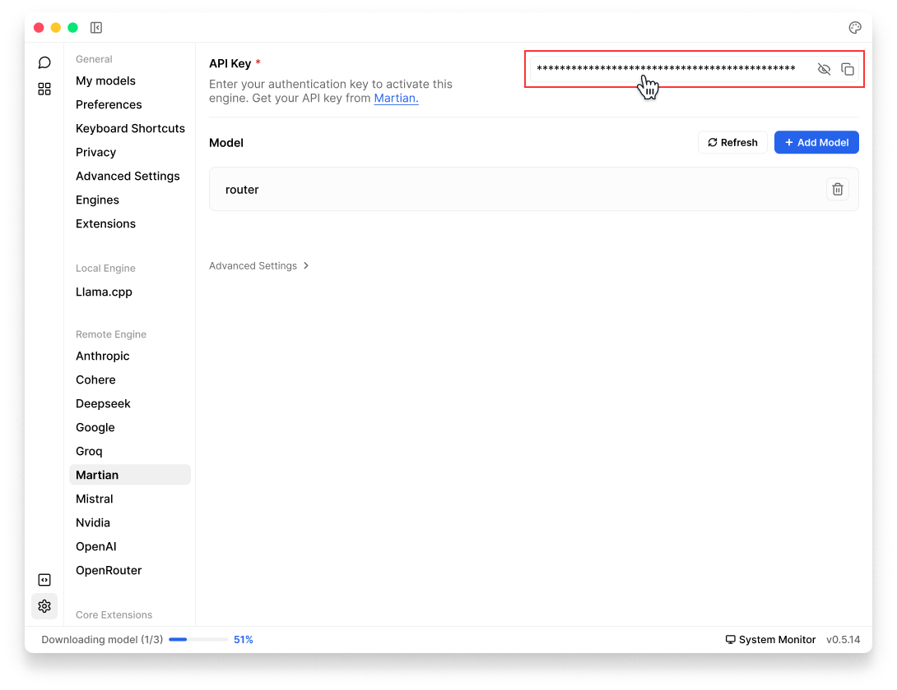

import { Callout, Steps } from 'nextra/components'
import { Settings, Plus } from 'lucide-react'

# Martian

Jan supports [Martian](https://withmartian.com/) API integration, allowing you to use Martian's models through Jan's interface.

## Integrate Martian with Jan

<Steps>
### Step 1: Get Your API Key
1. Visit [Martian API Keys](https://www.withmartian.com/dashboard/undefined/api-keys) and sign in
2. Create & copy a new API key or copy your existing one

<Callout type='info'>
Ensure your API key has sufficient credits
</Callout>

### Step 2: Configure Jan
There are two ways to add your Martian key in Jan:

**Through Threads:**
1. In Threads, click **Model** tab in the **right sidebar** or **model selector** in input field
2. Once the selector is poped up, choose the **Cloud** tab
3. Click **Add** (<Plus width={16} height={16} style={{display:"inline"}}/>) icon next to **Martian**
4. Once you are directed to Martian settings, insert your **API Key**

**Through Settings:**
1. Navigate to **Settings** (<Settings width={16} height={16} style={{display:"inline"}}/>)
2. Under **Remote Engines**, select **Martian**
3. Insert your **API Key**

 

 

### Step 3: Start Using Martian Models

1. In any existing **Threads** or create a new one
2. Select a Martian model from **model selector**
3. Start chatting
</Steps>

## Available Models

Jan includes the Martian Model Router which automatically selects the best model for your use case. You can start using it right away after configuring your API key. See list of available models in [Martian Documentation](https://docs.withmartian.com/martian-model-router/getting-started/supported-models-gateway).

## Troubleshooting

Common issues and solutions:

**1. API Key Issues**
- Verify your API key is correct and not expired
- Check if you have billing set up on your Martian account
- Ensure you have access to the model you're trying to use

**2. Connection Problems**
- Check your internet connection
- Verify Martian's system status
- Look for error messages in [Jan's logs](/docs/troubleshooting#how-to-get-error-logs)

**3. Model Unavailable**
- Confirm your API key has access to the model
- Check if you're using the correct model ID
- Verify your Martian account has the necessary permissions

Need more help? Join our [Discord community](https://discord.gg/FTk2MvZwJH) or check the [Martian documentation](https://docs.withmartian.com/martian-model-router).