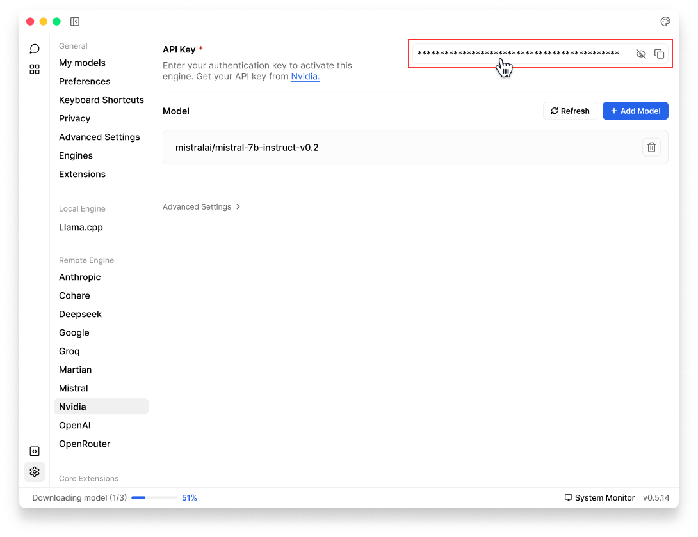

import { Callout, Steps } from 'nextra/components'
import { Settings, Plus } from 'lucide-react'

# NVIDIA NIM

Jan supports [Nvidia](https://www.nvidia.com/en-us/ai/) API integration, allowing you to use Nvidia's Large Language Models through Jan's interface.

<Callout type='info'>
Nvidia engine is only supported on Jan version 0.5.1 or later.
</Callout>

## Integrate Nvidia NIM API with Jan

<Steps>
### Step 1: Get Your API Key 
1. Visit [Nvidia](https://docs.nvidia.com/nim/nemo-retriever/text-reranking/latest/getting-started.html#generate-an-api-key) and generate an API key
2. Copy your API key 

<Callout type='info'>
Ensure your API key has sufficient credits
</Callout>

### Step 2: Configure Jan
There are two ways to add your Nvidia API keys in Jan:

**Through Threads:**
1. In Threads, click **Model** tab in the **right sidebar** or **model selector** in input field
2. Once the selector is poped up, choose the **Cloud** tab
3. Click **Add** (<Plus width={16} height={16} style={{display:"inline"}}/>) icon next to **Nvidia**
4. Once you are directed to Nvidia settings, insert your **API Key**  

**Through Settings:**
1. Navigate to **Settings** (<Settings width={16} height={16} style={{display:"inline"}}/>)
2. Under **Remote Engines**, select **Nvidia**
3. Insert your **API Key**  

 

 

### Step 3: Start Using Nvidia NIM Models

1. In any existing **Threads** or create a new one
2. Select a Nvidia model from **model selector**
3. Start chatting
</Steps>

## Available Nvidia NIM Models

Jan automatically includes Nvidia's available models. In case you want to use a specific model that you cannot find in **Jan**, follow instructions in [Add Cloud Models](/docs/models/manage-models#add-models-1):
  - See list of available models in [Nvidia Documentation](https://build.nvidia.com/models).
  - The `id` property must match the model name in the list.

## Troubleshooting

Common issues and solutions:

**1. API Key Issues**
- Verify your API key is correct and not expired
- Check if you have billing set up on your Nvidia account
- Ensure you have access to the model you're trying to use

**2. Connection Problems**
- Check your internet connection
- Verify Nvidia's system status
- Look for error messages in [Jan's logs](/docs/troubleshooting#how-to-get-error-logs)

**3. Model Unavailable**
- Confirm your API key has access to the model
- Check if you're using the correct model ID
- Verify your Nvidia account has the necessary permissions
- Make sure you're using Jan version 0.5.1 or later

Need more help? Join our [Discord community](https://discord.gg/FTk2MvZwJH) or check the [Nvidia documentation](https://docs.nvidia.com/nim/large-language-models/latest/getting-started.html).