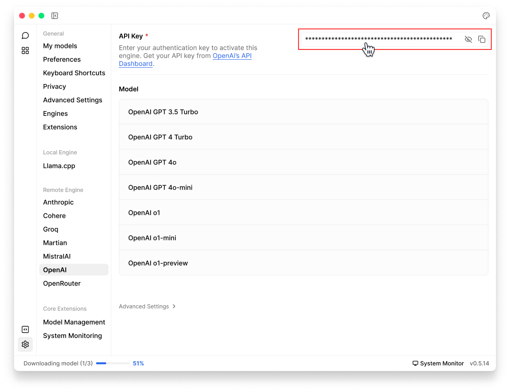

import { Callout, Steps } from 'nextra/components'
import { Settings, Plus } from 'lucide-react'

# OpenAI 

Jan supports [OpenAI](https://openai.com/) and OpenAI-compatible APIs, allowing you to use all models from OpenAI (GPT-4, GPT o1 and more) through Jan's interface.

## Integrate OpenAI API with Jan

<Steps>
### Step 1: Get Your API Key 
1. Visit [OpenAI Platform](https://platform.openai.com/api-keys) and sign in 
2. Create & copy a new API key or copy your existing one

<Callout type='info'>
Ensure your API key has sufficient credits
</Callout>

### Step 2: Configure Jan
There are two ways to add your OpenAI API keys in Jan:

Through Threads:
1. In Threads, click Model tab in the right sidebar or model selector in input field
2. Once the selector is poped up, choose the Cloud tab
3. Click Add (<Plus width={16} height={16} style={{display:"inline"}}/>) icon next to OpenAI
4. Once you are directed to OpenAI settings, insert your API Key  

Through Settings:
1. Navigate to Settings (<Settings width={16} height={16} style={{display:"inline"}}/>)
2. Under Remote Engines, select OpenAI
3. Insert your API Key  

 

 

### Step 3: Start Using OpenAI's Models

In any existing Threads or create a new one
Select an OpenAI model from model selector
Start chatting 

</Steps>

## Available OpenAI Models

Jan automatically includes popular OpenAI models. In case you want to use a specific OpenAI model that you cannot find in Jan, follow instructions in [Add Cloud Models](/docs/models/manage-models#add-models-1):
  - See list of available models in [OpenAI Platform](https://platform.openai.com/docs/models/overview).
  - The id property must match the model name in the list. For example, if you want to use the [GPT-4 Turbo](https://platform.openai.com/docs/models/gpt-4-and-gpt-4-turbo), you must set the id property to gpt-4-1106-preview.

## Troubleshooting

Common issues and solutions:

1. API Key Issues
- Verify your API key is correct and not expired
- Check if you have billing set up on your OpenAI account
- Ensure you have access to the model you're trying to use

2. Connection Problems
- Check your internet connection
- Verify OpenAI's [system status](https://status.openai.com)
- Look for error messages in [Jan's logs](/docs/troubleshooting#how-to-get-error-logs)

3. Model Unavailable
- Confirm your API key has access to the model
- Check if you're using the correct model ID
- Verify your OpenAI account has the necessary permissions

Need more help? Join our [Discord community](https://discord.gg/FTk2MvZwJH) or check the [OpenAI documentation](https://platform.openai.com/docs).