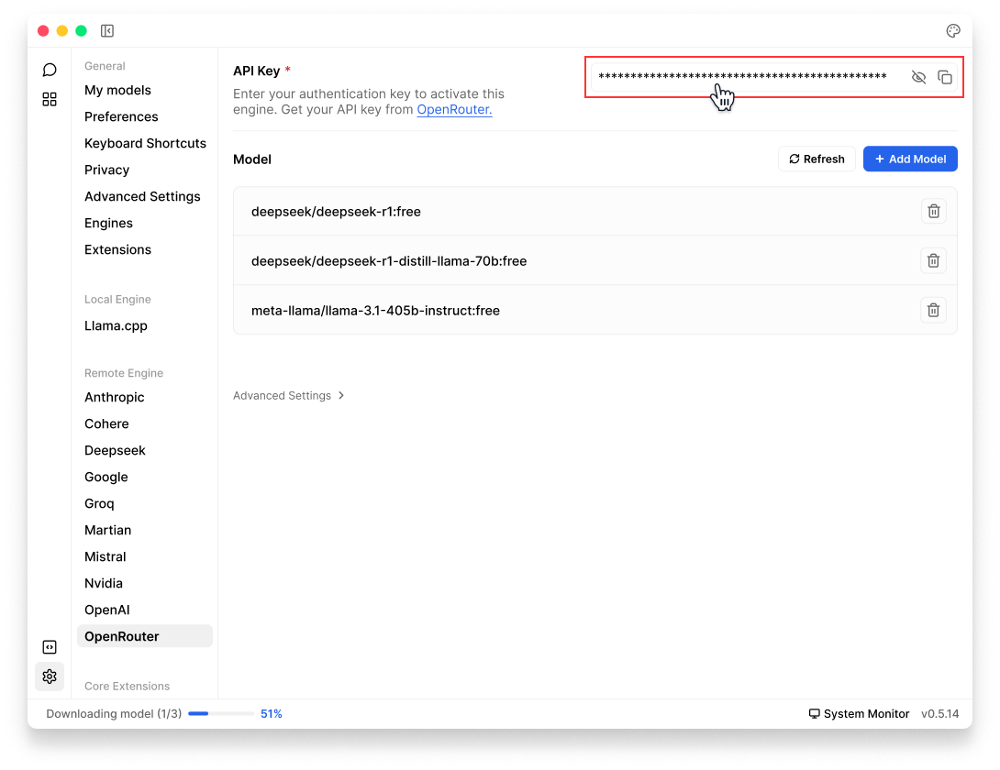

import { Callout, Steps } from 'nextra/components'
import { Settings, Plus } from 'lucide-react'

# OpenRouter

## Integrate OpenRouter with Jan

[OpenRouter](https://openrouter.ai/) is a tool that gathers AI models. Developers can utilize its API to engage with diverse large language models, generative image models, and generative 3D object models with a competitive pricing.

Jan supports OpenRouter API integration, allowing you to use models from various providers (Anthropic, Google, Meta and more) through a single API.

## Integrate OpenRouter with Jan

<Steps>
### Step 1: Get Your API Key
1. Visit [OpenRouter](https://openrouter.ai/keys) and sign in
2. Create & copy a new API key or copy your existing one

<Callout type='info'>
Ensure your API key has sufficient credits. OpenRouter credits work across all available models.
</Callout>

### Step 2: Configure Jan
There are two ways to add your OpenRouter key in Jan:

**Through Threads:**
1. In Threads, click **Model** tab in the **right sidebar** or **model selector** in input field
2. Once the selector is poped up, choose the **Cloud** tab
3. Click **Add** (<Plus width={16} height={16} style={{display:"inline"}}/>) icon next to **OpenRouter**
4. Once you are directed to OpenRouter settings, insert your **API Key**

**Through Settings:**
1. Navigate to **Settings** (<Settings width={16} height={16} style={{display:"inline"}}/>)
2. Under **Remote Engines**, select **OpenRouter**
3. Insert your **API Key**

 

 

### Step 3: Start Using OpenRouter Models

1. In any existing **Threads** or create a new one
2. Select any model from **model selector** under OpenRouter
3. Start chatting
</Steps>

## Available Models Through OpenRouter

Jan automatically use your default OpenRouter's available models. For custom configurations:

**Model Field Settings:**
- Leave empty to use your account's default model
- Specify a model using the format: `organization/model-name`
- Available options can be found in [OpenRouter's Model Reference](https://openrouter.ai/models)

**Examples of Model IDs:**
- Claude 3 Opus: `anthropic/claude-3-opus-20240229`
- Google Gemini Pro: `google/gemini-pro`
- Mistral Large: `mistralai/mistral-large`

## Troubleshooting

Common issues and solutions:

**1. API Key Issues**
- Verify your API key is correct and not expired
- Check if you have sufficient credits in your OpenRouter account
- Ensure you have access to the model you're trying to use

**2. Connection Problems**
- Check your internet connection
- Verify OpenRouter's [system status](https://status.openrouter.ai)
- Look for error messages in [Jan's logs](/docs/troubleshooting#how-to-get-error-logs)

**3. Model Unavailable**
- Confirm the model is currently available on OpenRouter
- Check if you're using the correct model ID format
- Verify the model provider is currently operational

Need more help? Join our [Discord community](https://discord.gg/FTk2MvZwJH) or check the [OpenRouter documentation](https://openrouter.ai/docs).