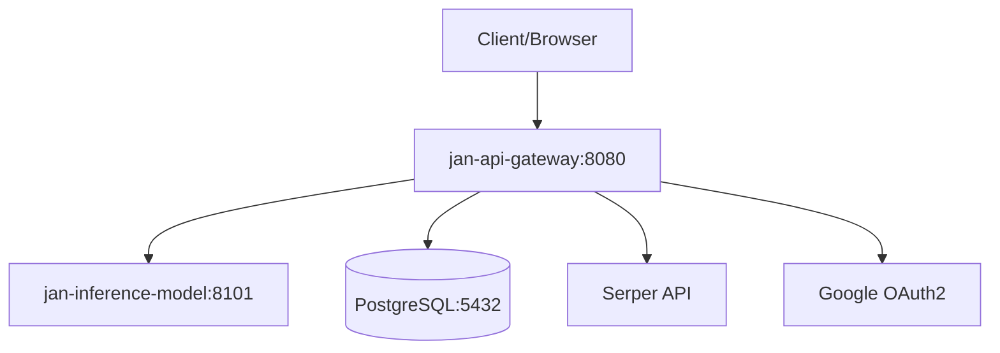

## System Overview

Jan Server implements a microservices architecture on Kubernetes with three core components communicating over HTTP and managed by Helm charts.



## Components

### API Gateway (`jan-api-gateway`)

**Technology Stack:**
- **Language**: Go 1.24.6
- **Framework**: Gin web framework
- **ORM**: GORM with PostgreSQL driver
- **DI**: Google Wire for dependency injection
- **Documentation**: Swagger/OpenAPI auto-generated

**Responsibilities:**
- HTTP request routing and middleware
- User authentication via JWT and OAuth2
- Database operations and data persistence
- External API integration (Serper, Google OAuth)
- OpenAI-compatible API endpoints
- Request forwarding to inference service

**Key Directories:**
```
application/
├── cmd/server/          # Main entry point and DI wiring
├── app/                 # Core business logic
├── config/              # Environment variables and settings
└── docs/                # Auto-generated Swagger docs
```

### Inference Model (`jan-inference-model`)

**Technology Stack:**
- **Base Image**: VLLM OpenAI v0.10.0
- **Model**: Jan-v1-4B (downloaded from Hugging Face)
- **Protocol**: OpenAI-compatible HTTP API
- **Features**: Tool calling, reasoning parsing

**Configuration:**
- **Model Path**: `/models/Jan-v1-4B`
- **Served Name**: `jan-v1-4b`
- **Port**: 8101
- **Batch Tokens**: 1024 max
- **Tool Parser**: Hermes
- **Reasoning Parser**: Qwen3

**Capabilities:**
- Text generation and completion
- Tool calling and function execution
- Multi-turn conversations
- Reasoning and chain-of-thought

### Database (PostgreSQL)

**Configuration:**
- **Database**: `jan`
- **User**: `jan-user`
- **Password**: `jan-password`
- **Port**: 5432

**Schema:**
- User accounts and authentication
- Conversation history
- Project and organization management
- API keys and access control

## Data Flow

### Request Processing

1. **Client Request**: HTTP request to API gateway on port 8080
2. **Authentication**: JWT token validation or OAuth2 flow
3. **Request Routing**: Gateway routes to appropriate handler
4. **Database Operations**: GORM queries for user data/state
5. **Inference Call**: HTTP request to model service on port 8101
6. **Response Assembly**: Gateway combines results and returns to client

### Authentication Flow

**JWT Authentication:**
1. User provides credentials
2. Gateway validates against database
3. JWT token issued with HMAC-SHA256 signing
4. Subsequent requests include JWT in Authorization header

**OAuth2 Flow:**
1. Client redirected to Google OAuth2
2. Authorization code returned to redirect URL
3. Gateway exchanges code for access token
4. User profile retrieved from Google
5. Local JWT token issued

## Deployment Architecture

### Kubernetes Resources

**Deployments:**
- `jan-api-gateway`: Single replica Go application
- `jan-inference-model`: Single replica VLLM server
- `postgresql`: StatefulSet with persistent storage

**Services:**
- `jan-api-gateway`: ClusterIP exposing port 8080
- `jan-inference-model`: ClusterIP exposing port 8101
- `postgresql`: ClusterIP exposing port 5432

**Configuration:**
- Environment variables via Helm values
- Secrets for sensitive data (JWT keys, OAuth credentials)
- ConfigMaps for application settings

### Helm Chart Structure

```
charts/
├── umbrella-chart/           # Main deployment chart
│   ├── Chart.yaml
│   ├── values.yaml          # Configuration values
│   └── Chart.lock
└── apps-charts/             # Individual service charts
    ├── jan-api-gateway/
    └── jan-inference-model/
```

## Security Architecture

### Authentication Methods
- **JWT Tokens**: HMAC-SHA256 signed tokens for API access
- **OAuth2**: Google OAuth2 integration for user login
- **API Keys**: HMAC-SHA256 signed keys for service access

### Network Security
- **Internal Communication**: Services communicate over Kubernetes cluster network
- **External Access**: Only API gateway exposed via port forwarding or ingress
- **Database Access**: PostgreSQL accessible only within cluster

### Data Security
- **Secrets Management**: Kubernetes secrets for sensitive configuration
- **Environment Variables**: Non-sensitive config via environment variables
- **Database Encryption**: Standard PostgreSQL encryption at rest

Production deployments should implement additional security measures including TLS termination, network policies, and secret rotation.

## Scalability Considerations

**Current Limitations:**
- Single replica deployments
- No horizontal pod autoscaling
- Local storage for database

**Future Enhancements:**
- Multi-replica API gateway with load balancing
- Horizontal pod autoscaling based on CPU/memory
- External database with clustering
- Redis caching layer
- Message queue for async processing

## Development Architecture

### Code Generation
- **Swagger**: API documentation generated from Go annotations
- **Wire**: Dependency injection code generated from providers
- **GORM Gen**: Database model generation from schema

### Build Process
1. **API Gateway**: Multi-stage Docker build with Go compilation
2. **Inference Model**: Base VLLM image with model download
3. **Helm Charts**: Dependency management and templating
4. **Documentation**: Auto-generation during development

### Local Development
- **Hot Reload**: Source code changes reflected without full rebuild  
- **Database Migrations**: Automated schema updates
- **API Testing**: Swagger UI for interactive testing
- **Logging**: Structured logging with configurable levels
