import { Tabs, Steps, Callout } from 'nextra/components'
import { Settings, EllipsisVertical, Plus, FolderOpen, Pencil } from 'lucide-react'


# Settings

This guide explains how to customize your Jan application settings.
To access **Settings**, click <Settings width={16} height={16} style={{display:"inline"}}/> icon in the bottom left corner of Jan.

## My models

Here's at **Settings** (<Settings width={16} height={16} style={{display:"inline"}}/>) > **My Models** you can manage all your installed AI models:

### Manage Downloaded Models

**1. Import Models:** You can import model here as how you can do in **Hub**
  - Option 1: Import from [Hugging Face](/docs/models/manage-models#option-a-import-in-jan) by entering model Hugging Face URL in **Search** bar
  - Option 2: [Import local files](/docs/models/manage-models#option-a-import-in-jan)

<br/>
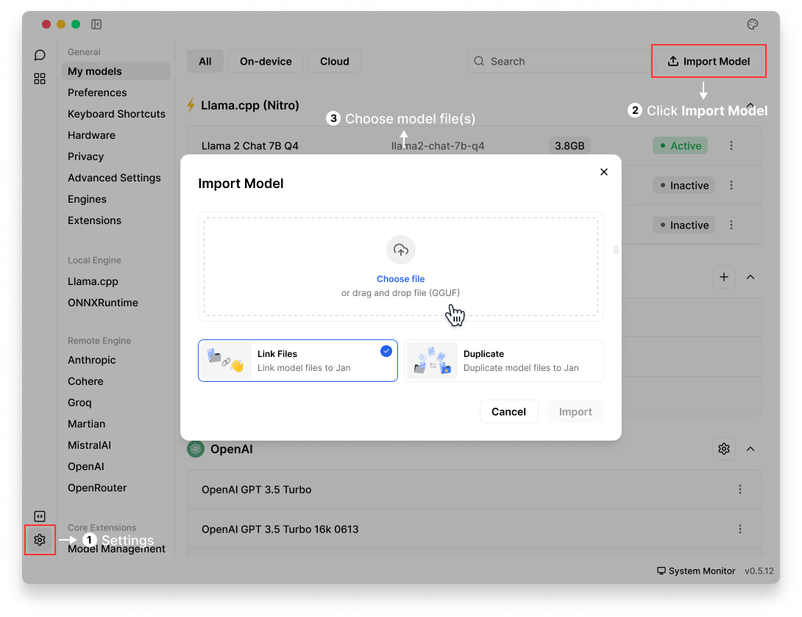
<br/>


**2. Remove Models**: Use the same instructions in [Delete Local Models](/docs/models/manage-models#delete-models)

<br/>
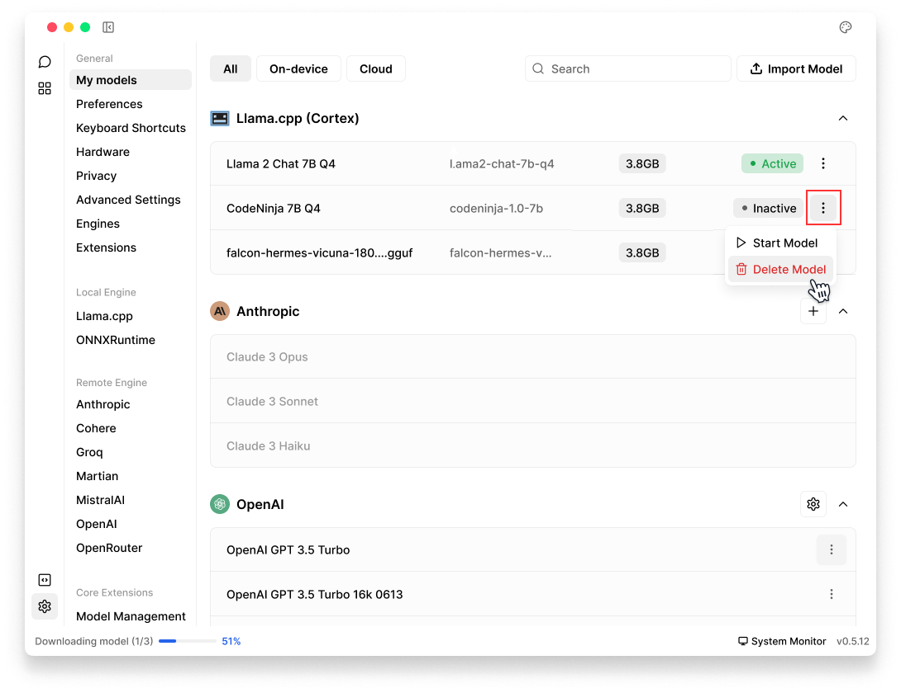
<br/>


**3. Start Models**
1. Choose the model you want to start
2. Click **three dots** <EllipsisVertical width={16} height={16} style={{display:"inline"}}/> icon next to the model
3. Select **Start Model**

<br/>
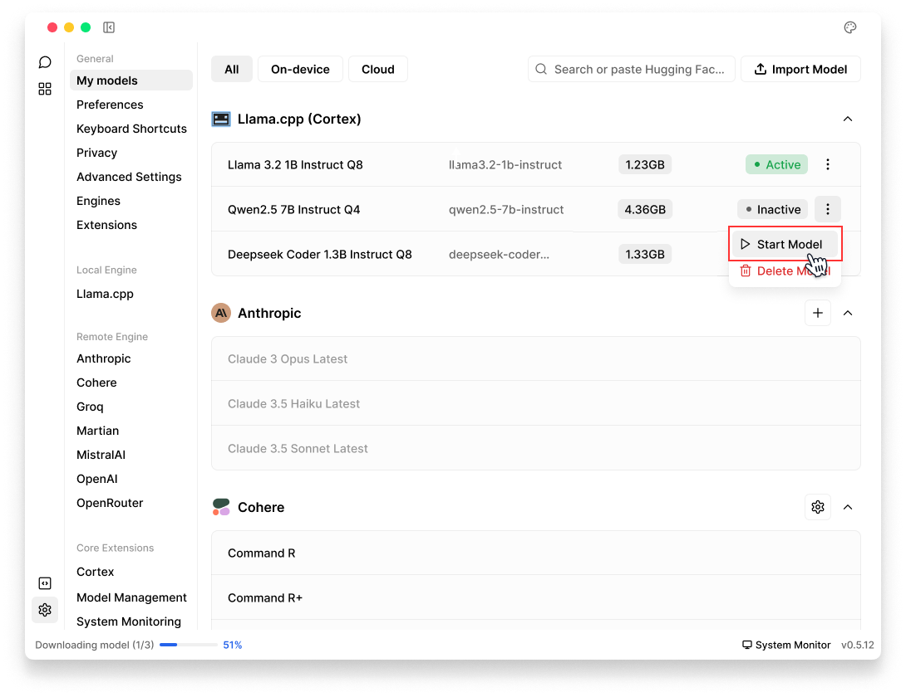
<br/>


### Manage Cloud Models

1. To install cloud models, click the **Add** (<Plus width={16} height={16} style={{display:"inline"}}/>) icon next your preferred providers (e.g., Anthropic, OpenAI, Groq), and add **API Key** to use. See [detailed instructions](/docs/remote-models/openai) for each provider.
2. Once a provider is installed, you can use its models & manage its settings by clicking on the **Settings** (<Settings width={16} height={16} style={{display:"inline"}}/>) icon next to it.

<br/>
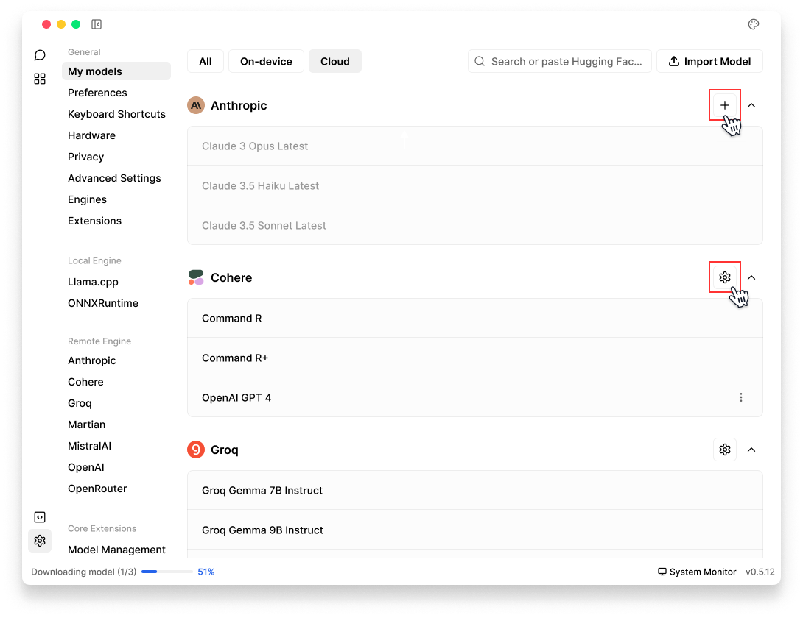
<br/>

## Preferences

At **Settings** (<Settings width={16} height={16} style={{display:"inline"}}/>) > **Preferences**, you can customize how Jan looks.

### Appearance & Theme
Control the visual theme of Jan's interface.
- **Joi Light:** Clean, bright theme for daytime use
- **Joi Dark:** Dark theme with high contrast
- **Dark Dimmed:** Softer dark theme to reduce eye strain
- **Night Blue:** Dark theme with blue accents

To change:
1. Choose your preferred **Appearance** from the dropdown
2. With **Joi Dark** & **Joi Light**, you can choose additional options:
  - **Solid:** Traditional opaque background
  - **Translucent:** Semi-transparent interface 
3. Changes apply immediately

<br/>
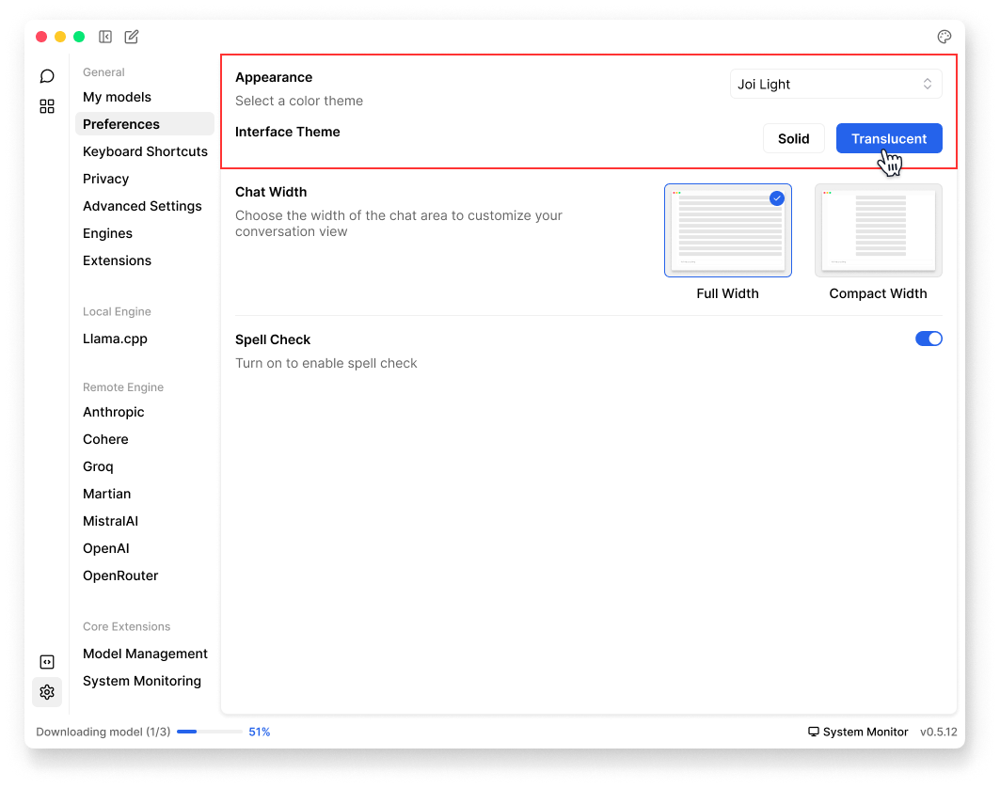
<br/>

### Chat Width
Adjust how chat content is displayed.
1. In **Chat Width** section, select either 
- **Full Width:** Maximizes the chat area to use the full width of the window. This is ideal for viewing longer messages or when working with code snippets that benefit from more horizontal space.
- **Compact Width:** Creates a more focused chat experience with a narrower conversation view. This setting is useful for reading conversations more comfortably, especially on larger screens.
2. Changes apply immediately to your conversation view

<br/>
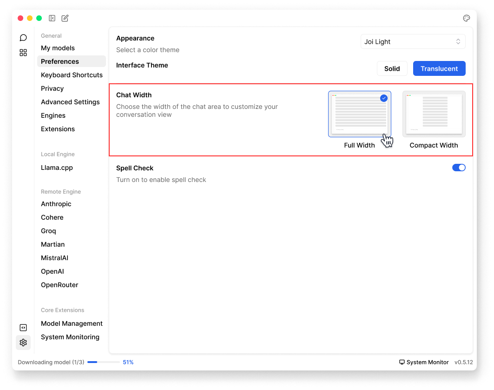
<br/>


### Spell Check
Jan includes a built-in spell check feature to help catch typing errors in your messages.
1. Switch the toggle on to enable spell checking, or off to disable it
2. Changes apply immediately for all new messages you type

<br/>

<br/>

## Keyboard Shortcuts
At **Settings** (<Settings width={16} height={16} style={{display:"inline"}}/>) > **Keyboard shortcuts**, you can see Jan's shortcuts list:

**1. Thread Management**
- `⌘ N` - Create a new thread
- `⌘ Shift Backspace` - Delete current active thread
- `⌘ Shift C` - Clean current active thread

**2. Navigation**
- `⌘ B` - Toggle left panel
- `⌘ Shift B` - Toggle right panel
- `⌘ ,` - Navigate to settings

**3. Message Input**
- `Enter` - Send a message (in input field)
- `Shift Enter` - Insert a new line (in input field)

> Note: On **Windows** and **Linux**, use `Ctrl` (Control) instead of `⌘` (Command)

## Hardware
At **Settings** (<Settings width={16} height={16} style={{display:"inline"}}/>) > **Hardware**, you can monitor and manage your system resources when running local models.

### CPU & RAM

<Callout type="info">
See detailed minimum system requirements to run local models on [Mac](/docs/desktop/mac#compatibility), [Windows](/docs/desktop/windows#compatibility) & [Linux](/docs/desktop/linux#compatibility).
</Callout>

- **CPU:** important for model processing speed. With CPU only, 20-90% usage during model running is normal.

- **RAM:**
  - Different models require different amounts of RAM.
  - When running local models, please keep at least **4GB free**.
  - If usage is near max, try closing other applications or use smaller models.


### GPU Acceleration

<Callout type="info">
Ensure you have installed all required dependencies and drivers before enabling GPU acceleration. See **GPU Setup Guide** on [Windows](/docs/desktop/windows#gpu-acceleration) & [Linux](/docs/desktop/linux#gpu-acceleration) for detailed instructions.
</Callout>

Turn on GPU acceleration to improve performance:
1. Select and **enable** your prefered GPU(s)
2. App reload is required after the selection

<br/>

<br/>

**GPU Performance Optimization**
- Monitor VRAM usage - should not exceed 90%. Higher **VRAM** capacity typically enables better performance for larger language models.
- Adjust `ngl` ([number of GPU Layers](/docs/models/model-parameters#engine-parameters)) in **Model** settings:
  - Higher NGL = more VRAM used with faster performance
  - Lower NGL = Less VRAM used with slower performance
  - Start with 35 layers for 8GB VRAM. Increase if you have more VRAM available & decrease if you see **out-of-memory** errors.


## Privacy 
At **Settings** (<Settings width={16} height={16} style={{display:"inline"}}/>) > **Privacy**, you can control analytics & logs in Jan:

### Analytics
Jan is built with privacy at its core. By default, no data is collected. Everything stays local on your device.
You can help improve Jan by sharing anonymous usage data:
1. Toggle on **Analytics** to share anonymous data
2. You can change this setting at any time

<Callout type="info">
Read more about that we collect with opt-in users at [Privacy](/docs/privacy). 
</Callout>

<br/>
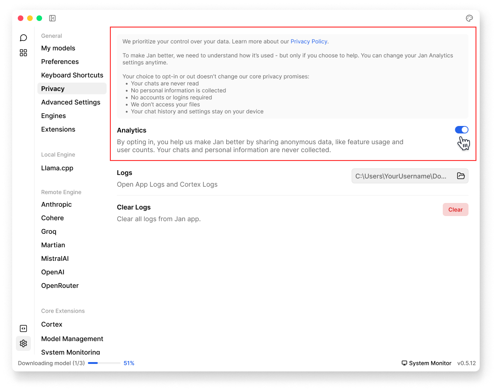
<br/>

### Log Management

**1. View Logs**
- Logs are stored at:
  - App log: `~/Library/Application\ Support/jan/data/logs/app.log`
  - Cortex log: `~/Library/Application\ Support/jan/data/logs/cortex.log`
- To open logs from Jan's interface: at **Logs**, click <FolderOpen width={16} height={16} style={{display:"inline"}}/> icon to open App Logs & Cortex Logs:

<br/>

<br/>

**2. Clear Logs**

Jan retains your logs for only **24 hours**. To remove all logs from Jan, at **Clear Logs**, click the **Clear** button:

<Callout type="warning">
This action cannot be undone. 
</Callout>

<br/>
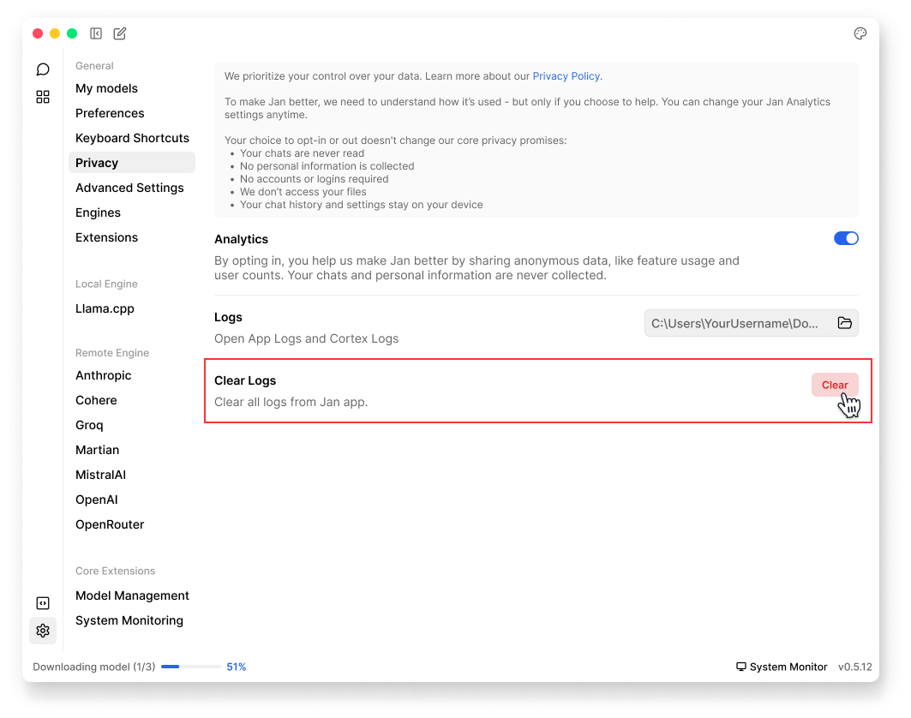
<br/>


## Advanced Settings
At **Settings** (<Settings width={16} height={16} style={{display:"inline"}}/>) > **Advanced Settings**, Jan stores settings for advanced use cases.
### Experimental Mode
<Callout type="warning">
Experimental features are unstable and are recommended only for testing purposes. Please turn on with caution!
</Callout>

Current experimental features:

| Feature | Description | 
|---------|-------------|
| [Tools](/docs/tools/retrieval) | Advanced tooling capabilities including web search, file operations, and code interpretation | 
| Vulkan Settings | GPU acceleration using Vulkan API for improved model performance | 
| [Jan Quick Ask](/docs/settings#jan-quick-ask) | Streamlined interface for rapid AI queries and responses | 


To try out these beta features, turn on **Experimental Mode** setting:
<br/>
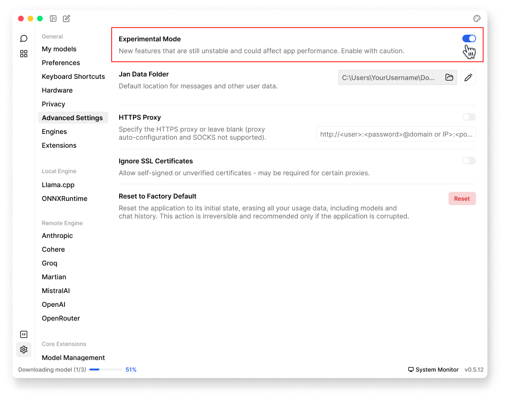
<br/>

### Jan Data Folder
Jan stores your data locally in your own filesystem in a universal file format. See detailed [Jan Folder Structure](docs/data-folder#folder-structure).

**1. Open Jan Data Folder**

At **Jan Data Folder**, click <FolderOpen width={16} height={16} style={{display:"inline"}}/> icon to open Jan application's folder: 
<br/>
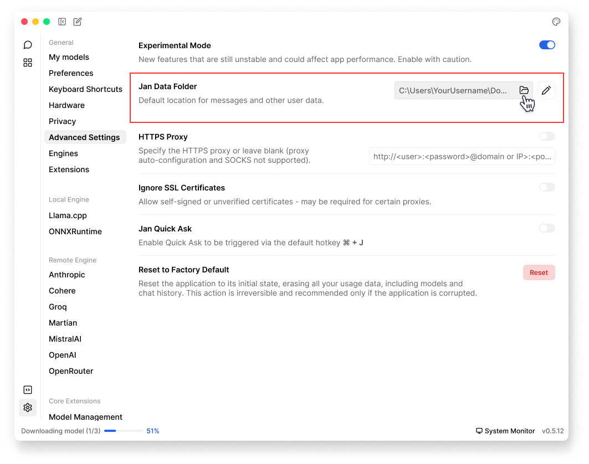
<br/>

**2. Edit Jan Data Folder**

1. At **Jan Data Folder**, click <Pencil width={16} height={16} style={{display:"inline"}}/> icon to edit Jan application's folder
2. Choose a new directory & click **Select**, make sure the new folder is empty
3. Confirmation pop-up shows up: 

> Are you sure you want to relocate Jan Data Folder to `new directory`?
Jan Data Folder will be duplicated into the new location while the original folder remains intact.
An app restart will be required afterward.

4. Click **Yes, Proceed**

<br/>
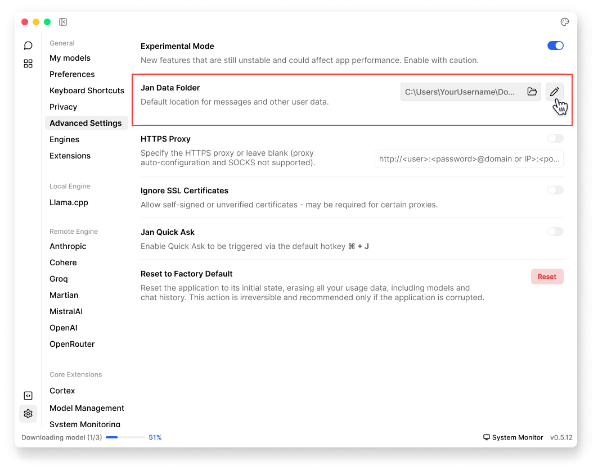
<br/>

### HTTPs Proxy 
HTTPS Proxy encrypts data between your browser and the internet, making it hard for outsiders to intercept or read. It also helps you maintain your privacy and security while bypassing regional restrictions on the internet.

<Callout type="info">
- Model download speeds may be affected due to the encryption/decryption process and your cloud service provider's networking
- HTTPS Proxy does not affect the remote model usage.
</Callout>

1. **Enable** the proxy toggle
2. Enter your proxy server details in the following format:
```
http://<user>:<password>@<domain or IP>:<port>
```
Where:
- `<user>`: Your proxy username (if authentication is required)
- `<password>`: Your proxy password (if authentication is required)
- `<domain or IP>`: Your proxy server's domain name or IP address
- `<port>`: The port number for the proxy server

<br/>
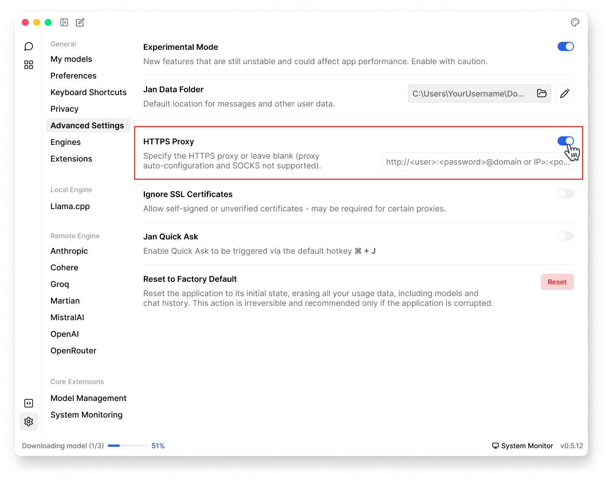
<br/>

**Ignore SSL Certificates**

This setting allows Jan to accept self-signed or unverified SSL certificates. This may be necessary when:
- Working with corporate proxies using internal certificates
- Testing in development environments
- Connecting through specialized network security setups

<Callout type="info">
Only enable this option if you trust your network environment.
</Callout>

<br/>
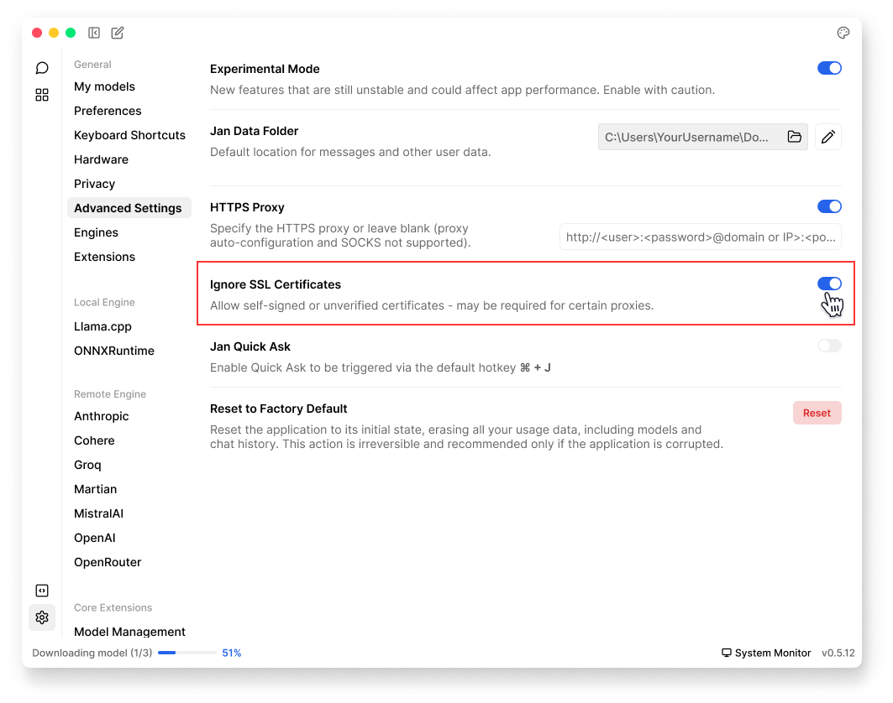
<br/>

### Jan Quick Ask
Jan Quick Ask provides a faster way to interact with Jan without opening the full application window. It's designed for quick queries and responses when you need immediate assistance.
<Callout type="warning">
 This feature is currently experimental and must be enabled through [Experimental Mode](/docs/settings#experimental-mode) in **Advanced Settings**.
</Callout>

1. Once you've turned on [Experimental Mode](/docs/settings#experimental-mode), toggle on **Jan Quick Ask**
2. App restart is required upon selection

<br/>
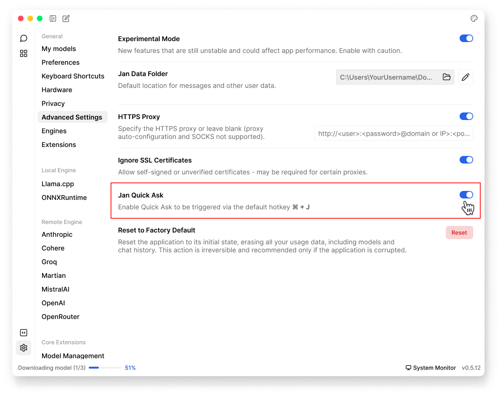
<br/>

3. Once enabled, you can open **Quick Ask** overlay with default shortcut: `CMD/Ctr` + `J`

<br/>
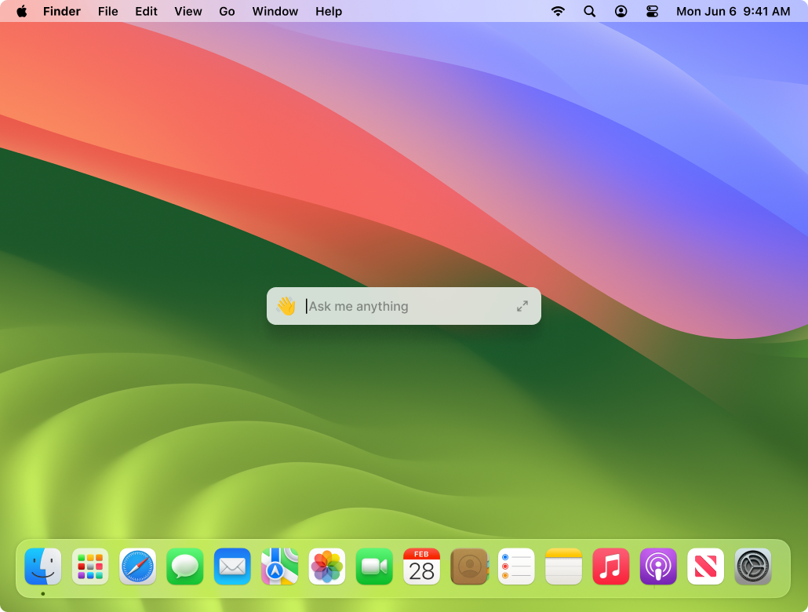
<br/>

### Factory Reset
Reset to Factory Settings restores Jan to its initial state by erasing all user data, including downloaded models and chat history. This action is irreversible and should only be used as a last resort when experiencing serious application issues.

<Callout type="warning">
This action cannot be undone. All data will be permanently deleted.
</Callout>

Only use factory reset if:
- The application is corrupted
- You're experiencing persistent technical issues that other solutions haven't fixed
- You want to completely start fresh with a clean installation

To begin the process:
1. At  **Reset to Factory Settings**, click **Reset** button 
<br/>
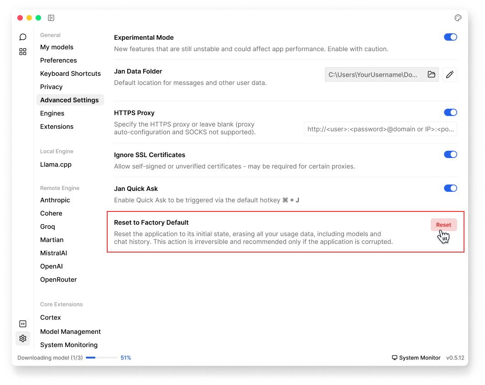
<br/>
2. In the confirmation dialog:
- Type the word **RESET** to confirm
- Optionally check **Keep the current app data location** to maintain the same data folder
- Click **Reset Now**
3. App restart is required upon confirmation
<br/>

<br/>


