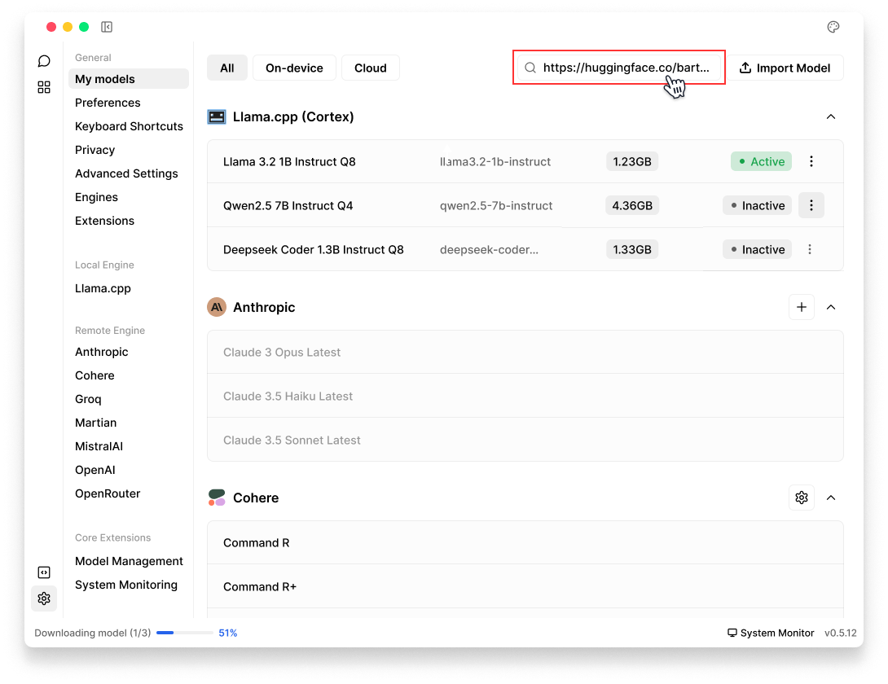

import { Tabs, Steps, Callout } from 'nextra/components'
import { Settings, EllipsisVertical, Plus, FolderOpen, Pencil } from 'lucide-react'

# Settings

This guide explains how to customize your Jan application settings.
To access **Settings**, click <Settings width={16} height={16} style={{display:"inline"}}/> icon in the bottom left corner of Jan.

<Callout type="info">
Settings are stored in a `cortex.db` file in [Jan Data Folder](/docs/data-folder), ensuring they persist across sessions.
</Callout>

## My models

Here's where you can manage all your installed AI models.

### Manage Downloaded Models

#### Import Models

You can import model here as how you can do in **Hub**:

**Option 1:** Import from [Hugging Face](/docs/models/manage-models#option-a-import-in-jan)

 

 

**Option 2:** [Import local files](/docs/models/manage-models#option-a-import-in-jan)

 

 

#### Remove Models
Use the same instructions in [Delete Local Models](/docs/models/manage-models#delete-models)

 

 

#### Start Models

You can start downloaded model from **My Models**:
1. Choose the model you want to start
2. Click **three dots** <EllipsisVertical width={16} height={16} style={{display:"inline"}}/> icon next to the model
3. Select **Start Model**

 

 

### Manage Cloud Models

You can add and configure **Cloud Providers** here:
1. Click the **Add** (<Plus width={16} height={16} style={{display:"inline"}}/>) icon next to the provider name (e.g., Anthropic, Cohere, Groq), add API Key to use. See detailed instructions for each provider [here](/docs/remote-models/openai).
2. Once a provider is installed, you can manage its settings by clicking on the **Settings** (<Settings width={16} height={16} style={{display:"inline"}}/>) icon next to it.

 

 

## Preferences

### Appearance & Theme
Control the visual theme of Jan's interface.
- **Joi Light:** Clean, bright theme for daytime use
- **Joi Dark:** Dark theme with high contrast
- **Dark Dimmed:** Softer dark theme to reduce eye strain
- **Night Blue:** Dark theme with blue accents

To change:
1. Choose your preferred **Appearance** from the dropdown
2. With **Joi Dark** & **Joi Light**, you can choose additional options:
  - **Solid:** Traditional opaque background
  - **Translucent:** Semi-transparent interface 
3. Changes apply immediately

 

 

### Chat width
Adjust how chat content is displayed.
1. In **Chat Width** section, select either 
- **Full Width:** Maximizes the chat area to use the full width of the window. This is ideal for viewing longer messages or when working with code snippets that benefit from more horizontal space.
- **Compact Width:** Creates a more focused chat experience with a narrower conversation view. This setting is useful for reading conversations more comfortably, especially on larger screens.
2. Changes apply immediately to your conversation view

 

 

### Spell Check
Jan includes a built-in spell check feature to help catch typing errors in your messages.
1. Switch the toggle on to enable spell checking, or off to disable it
2. Changes apply immediately for all new messages you type

 

 

## Keyboard Shortcuts

**1. Thread Management**
- `⌘ N` - Create a new thread
- `⌘ Shift Backspace` - Delete current active thread
- `⌘ Shift C` - Clean current active thread

**2. Navigation**
- `⌘ B` - Toggle left panel
- `⌘ Shift B` - Toggle right panel
- `⌘ ,` - Navigate to settings

**3. Message Input**
- `Enter` - Send a message (in input field)
- `Shift Enter` - Insert a new line (in input field)

> Note: On **Windows** and **Linux**, use `Ctrl` (Control) instead of `⌘` (Command)

## Hardware

## Privacy 

### Analytics
Jan is built with privacy at its core. By default, no data is collected. Everything stays local on your device.
You can help improve Jan by sharing anonymous usage data:
1. Toggle on **Analytics** to share anonymous data
2. You can change this setting at any time

<Callout type="info">
Read more about that we collect with opt-in users at [Privacy](/docs/privacy). 
</Callout>

 

 

### Log Management

#### View Logs
- Logs are stored at:
  - App log: `~/Library/Application\ Support/jan/data/logs/app.log`
  - Cortex log: `~/Library/Application\ Support/jan/data/logs/cortex.log`
- At **Logs**, click <FolderOpen width={16} height={16} style={{display:"inline"}}/> icon to open App Logs & Cortex Logs:

 

 

#### Clear Logs

Click the **Clear** button to remove all logs from the Jan app:

<Callout type="warning">
This action cannot be undone. 
</Callout>

 

 

## Advanced Settings

### Experimental Mode
<Callout type="warning">
Experimental features are unstable and are recommended only for testing purposes. Please turn on with caution!
</Callout>

To try out new features that are still in testing phase, turn on **Experimental Mode** setting:
 

 

### Jan Data Folder
Jan stores your data locally in your own filesystem in a universal file format. See detailed [Jan Folder Structure](docs/data-folder#folder-structure).

#### Open Jan Data Folder
At **Jan Data Folder**, click <FolderOpen width={16} height={16} style={{display:"inline"}}/> icon to open Jan application's folder: 
 

 

#### Edit Jan Data Folder
1. At **Jan Data Folder**, click <Pencil width={16} height={16} style={{display:"inline"}}/> icon to edit Jan application's folder
2. Choose a new directory & click **Select**, make sure the new folder is empty
3. Confirmation pop-up shows up: 

> Are you sure you want to relocate Jan Data Folder to `new directory`?
Jan Data Folder will be duplicated into the new location while the original folder remains intact.
An app restart will be required afterward.

4. Click **Yes, Proceed**

 

 

### HTTPs Proxy 

### Factory Reset

## Engines

## Extensions

