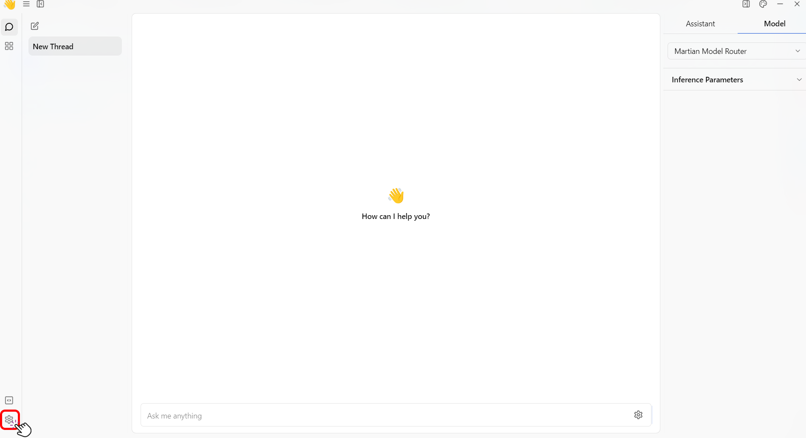
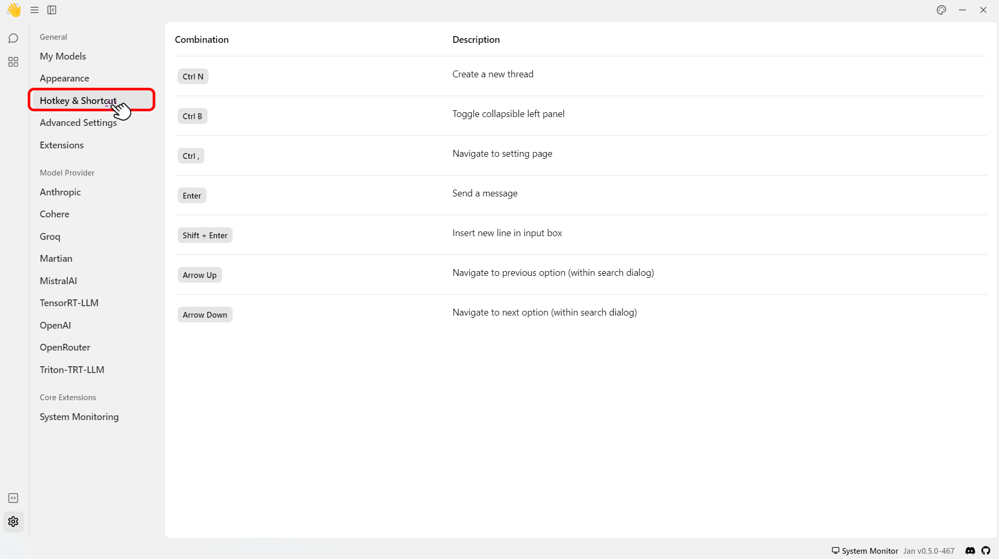

import { Tabs, Steps, Callout } from 'nextra/components'

## Keyboard Shortcuts
To find the list of all the available shortcuts within Jan app, please follow the steps below:
1. Navigate to the main dashboard.
2. Click the **Gear Icon (⚙️)** on the bottom left of your screen.
 

 
3. Click the **Hotkey & Shortcut**.
 

 

Here are some of the keyboard shortcuts that you can use in Jan.

<Tabs items={['Mac', 'Windows', 'Linux']}>
    <Tabs.Tab>
      | Combination     | Description                                        |
      | --------------- | -------------------------------------------------- |
      | `⌘ N`           | Create a new thread.                              |
      | `⌘ B`           | Toggle collapsible left panel.                      |
      | `⌘ Shift B`           | Toggle collapsible right panel.                      |
      | `⌘ ,`           | Navigate to the setting page.                           |
      | `Enter`         | Send a message.                                     |
      | `Shift + Enter` | Insert new line in input box.                       |
      | `Arrow Up`      | Navigate to the previous option (within the search dialog). |
      | `Arrow Down`    | Navigate to the next option (within the search dialog).     |
    </Tabs.Tab>

    <Tabs.Tab>

      | Combination     | Description                                                |
      | --------------- | ---------------------------------------------------------- |
      | `Ctrl N`        | Create a new thread.                                      |
      | `Ctrl B`        | Toggle collapsible left panel.                              |
      | `Ctrl Shift B`           | Toggle collapsible right panel.                      |
      | `Ctrl ,`        | Navigate to the setting page.                                   |
      | `Enter`         | Send a message.                                             |
      | `Shift + Enter` | Insert new line in input box.                               |
      | `Arrow Up`      | Navigate to the previous option (within the search dialog). |
      | `Arrow Down`    | Navigate to the next option (within the search dialog).     |

    </Tabs.Tab>
    <Tabs.Tab>

      | Combination     | Description                                                |
      | --------------- | ---------------------------------------------------------- |
      | `Ctrl N`        | Create a new thread.                                       |
      | `Ctrl B`        | Toggle collapsible left panel.                              |
      | `Ctrl Shift B`           | Toggle collapsible right panel.                      |
      | `Ctrl ,`        | Navigate to the setting page.                                   |
      | `Enter`         | Send a message.                                             |
      | `Shift + Enter` | Insert new line in input box.                               |
      | `Arrow Up`      | Navigate to the previous option (within the search dialog). |
      | `Arrow Down`    | Navigate to the next option (within the search dialog).     |

    </Tabs.Tab>

</Tabs>

