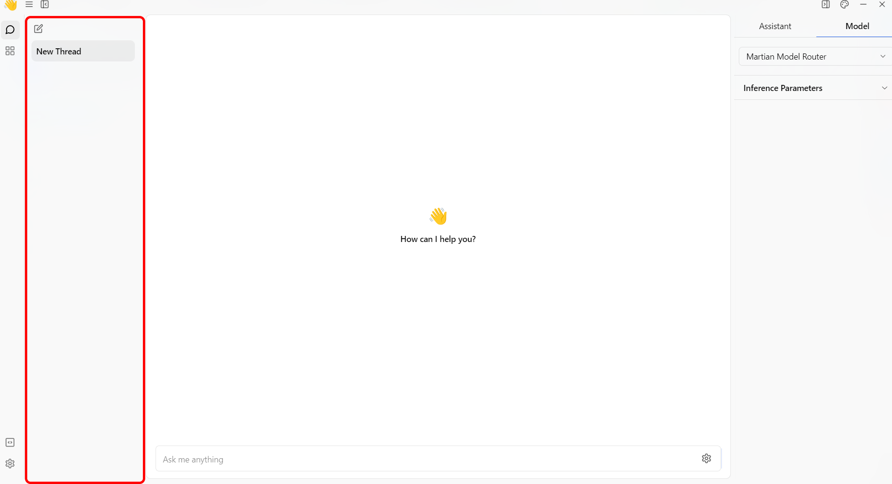
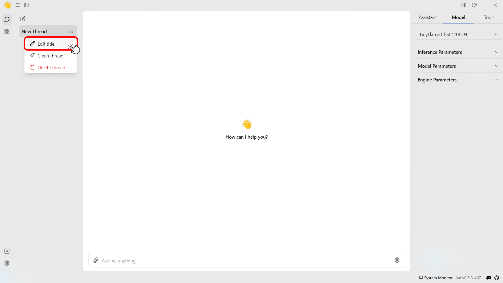
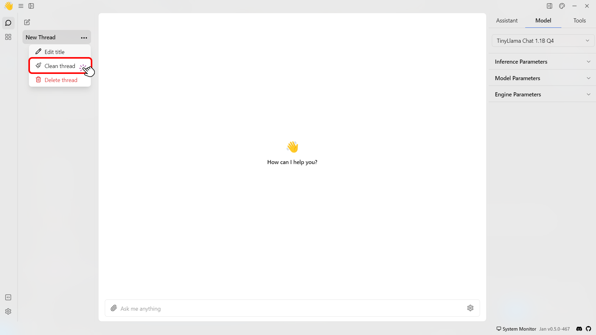
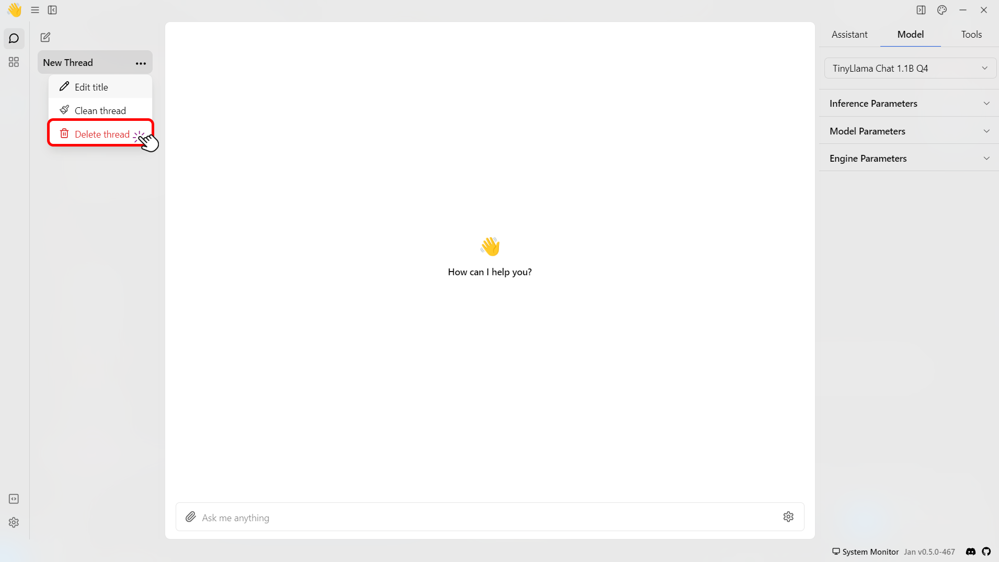

import { Callout } from 'nextra/components'

# Using Threads

Jan provides a straightforward and private solution for managing your threads with AI on your device. As you interact with AI using Jan, you'll accumulate a history of threads.
Jan offers easy tools to organize, delete, or review your past threads with AI. This guide will show you how to keep your threads private and well-organized.

## View Thread History

To view your thread history, follow the steps below:

1. Navigate to the main dashboard.
2. Locate the list of threads screen on the left side.
3. To view a specific thread, choose the one you're interested in and then scroll up or down to explore the entire conversation.
 

## Change the Thread's Title
To change a thread's title, follow the steps below:

1. Navigate to the Thread that you want to edit.
2. Hover to a thread and click on the **three dots (⋮)** in the Thread section.
3. Select the **Edit Title** button.
 

## Clean Threads History

To clean all the messages from a thread, follow the steps below:

1. Navigate to the Thread that you want to clean.
2. Hover to a thread and click on the **three dots (⋮)** in the Thread section.
3. Select the **Clean Thread** button.
 

<Callout type="info">
  This will delete all messages in the thread while keeping the thread settings.
</Callout>

### Delete Threads History

To delete a thread, follow the steps below:

1. Navigate to the Thread that you want to delete.
2. Hover to a thread and click on the **three dots (⋮)** in the Thread section.
3. Select the **Delete Thread** button.
 

<Callout type="info">
  This will delete all messages and the thread settings.
</Callout>
