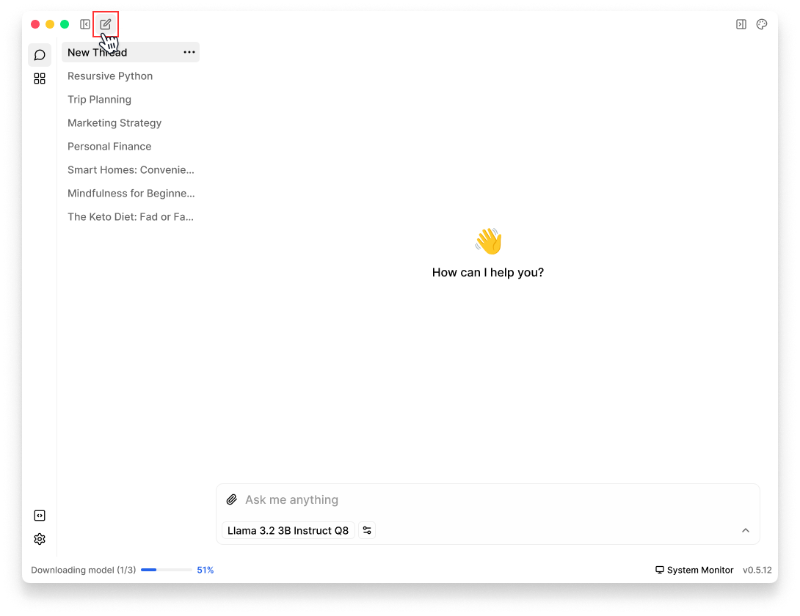
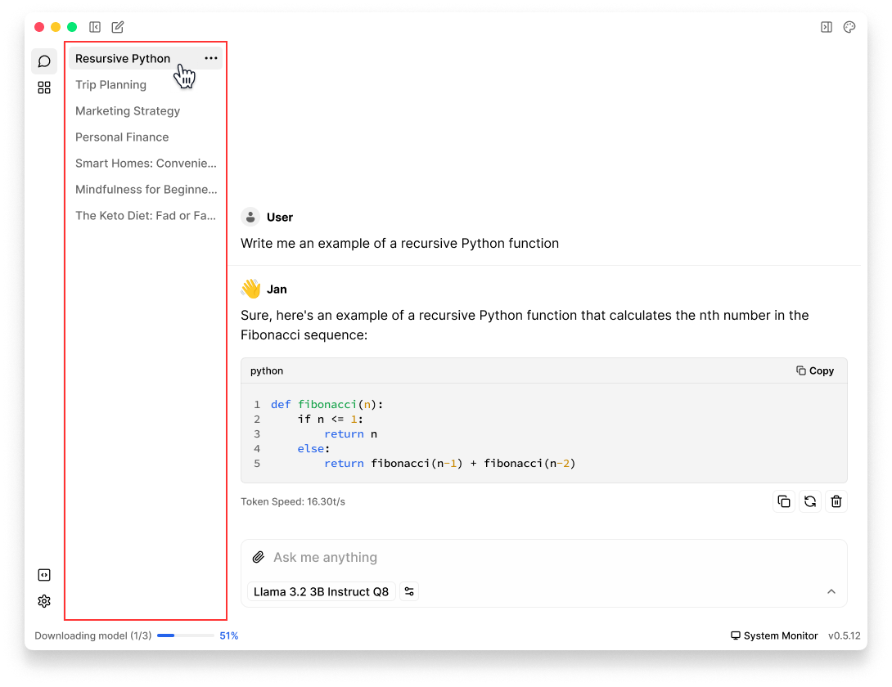
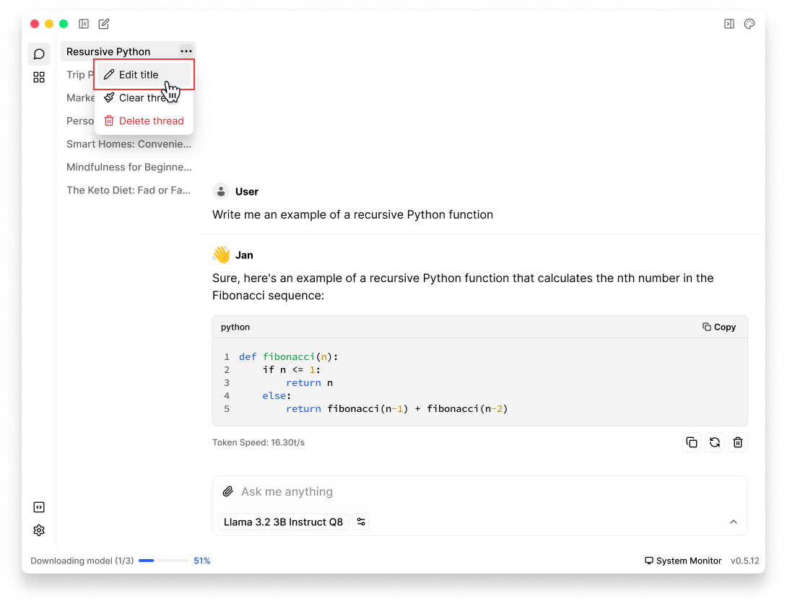
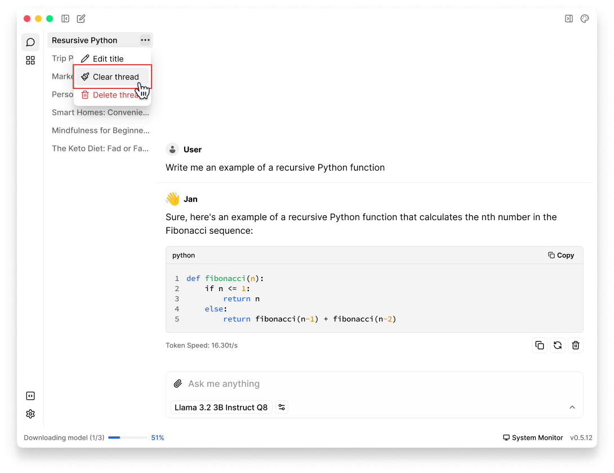
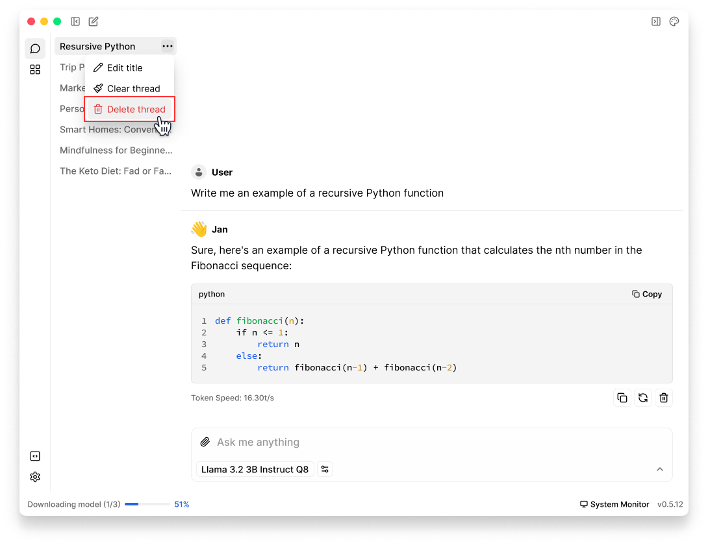

import { Callout } from 'nextra/components'
import { SquarePen, Pencil, Ellipsis, Paintbrush, Trash2 } from 'lucide-react'

# Using Threads

Jan organizes your AI conversations into threads, making it easy to track and revisit your interactions. This guide will help you effectively manage your chat history.

## Creating New Thread
1. Click **New Thread** (<SquarePen width={16} height={16} style={{display:"inline"}}/>) icon at the left of Jan top navigation
2. Select your preferred model in **Model Selector** in input field & start chatting

 

## View Threads History

1. Once you open Jan, the default screen is **Threads**
2. On the **left sidebar**, you can:
- View **Thread List**, scroll through your threads history
- Click any thread to open the full conversation

 

## Edit Thread Title
1. Navigate to the **Thread** that you want to edit title in left sidebar
2. Hover on the thread and click on **three dots** (<Ellipsis width={16} height={16} style={{display:"inline"}}/>) icon
3. Select <Pencil width={16} height={16} style={{display:"inline"}}/> **Edit Title** 
4. Add new title & save

 

## Clean Thread

To remove all messages while keeping the thread & its settings:

1. Navigate to the **Thread** that you want to clean in left sidebar
2. Hover on the thread and click on **three dots** (<Ellipsis width={16} height={16} style={{display:"inline"}}/>) icon
3. Select <Paintbrush width={16} height={16} style={{display:"inline"}}/> **Clean Thread** 

<Callout type="info">
This will delete all messages in the thread while preserving thread settings
</Callout>

 

## Delete Thread
<Callout type="warning">
There's no undo for thread deletion, so make sure you want to remove the thread permanently.
</Callout>
### Delete a specific thread
When you want to completely remove a thread:

1. Navigate to the **Thread** that you want to delete in left sidebar
2. Hover on the thread and click on **three dots** (<Ellipsis width={16} height={16} style={{display:"inline"}}/>) icon
3. Select <Trash2 width={16} height={16} style={{display:"inline"}}/> **Delete Thread** 

 

### Delete all threads at once

In case you need to remove all threads at once, you'll need to manually delete the `threads` folder:
1. Open [Jan Data Folder](docs/settings#access-the-jan-data-folder)
2. Delete the `threads` folder
3. Restart Jan