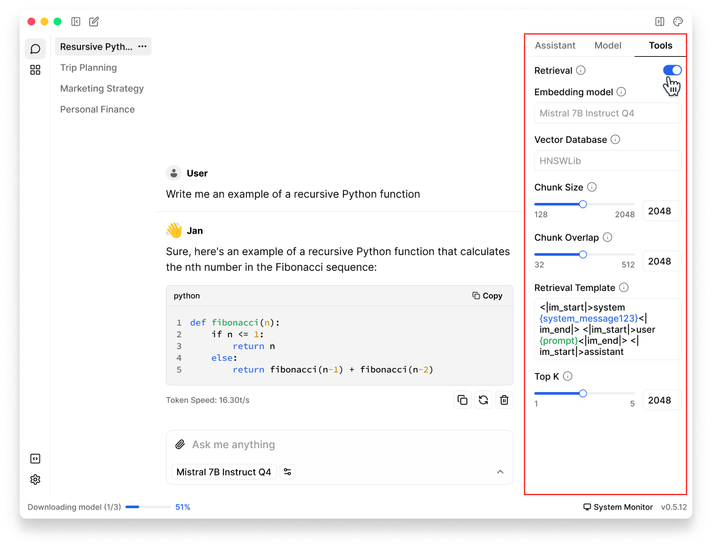
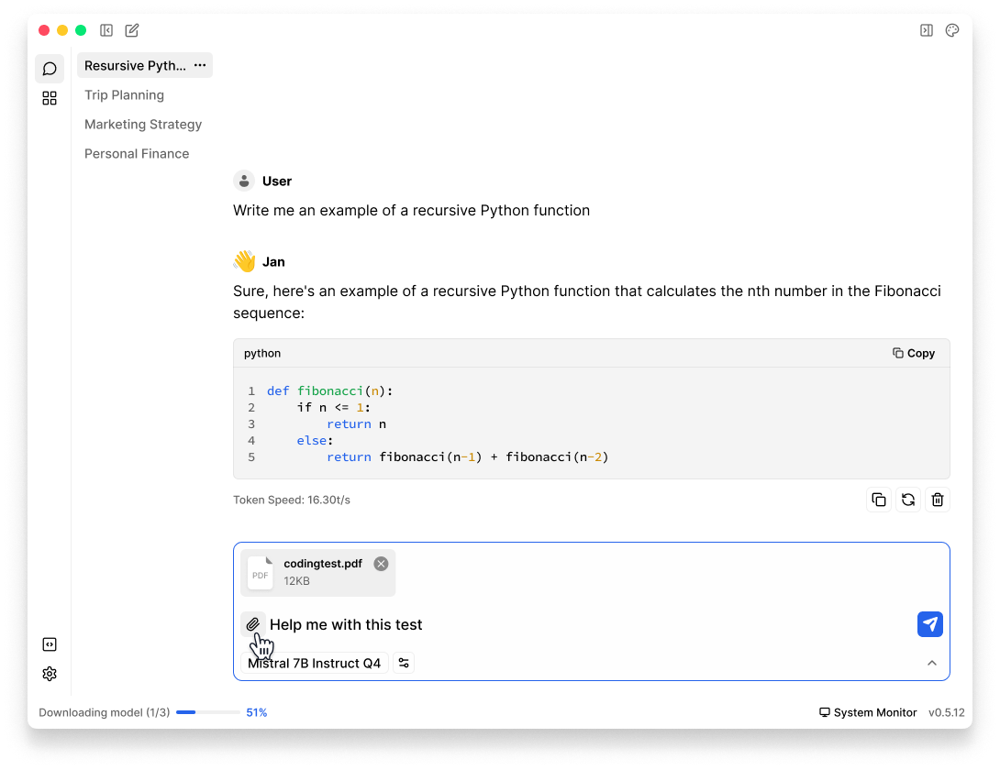

import { Callout, Steps } from 'nextra/components' 

# Knowledge Retrieval
Chat with your documents and images using Jan's RAG (Retrieval-Augmented Generation) capability.

<Callout type="warning">
 This feature is currently experimental and must be enabled through [Experimental Mode](/docs/settings#experimental-mode) in **Advanced Settings**.
</Callout>

## Enable File Search & Vision

To chat with PDFs & images in Jan, follow these steps:

1. In any **Thread**, click the **Tools** tab in right sidebar
2. Enable **Retrieval**

 

 

3. Once enabled, you should be able to **upload file(s) & image(s)** from threads input field
<Callout type="info">
Ensure that you are using a multimodal model.
- File Search: Jan currently supports PDF format 
- Vision: only works with local models or [OpenAI](/docs/remote-models/openai) models for now
</Callout>

 

 

## Knowledge Retrieval Parameters

| Feature               | Description                                                                                                                                                   |
|-----------------------|---------------------------------------------------------------------------------------------------------------------------------------------------------------|
| **Retrieval**         | - Utilizes information from uploaded files, automatically retrieving content relevant to your queries for enhanced interaction.  - Use this for complex inquiries where context from uploaded documents significantly enhances response quality.                                  |
| **Embedding Model**   | - Converts text into numerical representations for machine understanding.  - Choose a model based on your needs and available resources, balancing accuracy and computational efficiency.              |
| **Vector Database**   | - Facilitates quick searches through stored numerical text representations to find relevant information efficiently.  - Optimize your vector database settings to ensure quick retrieval without sacrificing accuracy, particularly in applications with large data sets.                                           |
| **Top K**             | - Determines the number of top-ranked documents to retrieve, allowing control over search result relevance.  - Adjust this setting based on the precision needed. A lower value for more precise, focused searches and a higher value for broader, more comprehensive searches.                                                     |
| **Chunk Size**        | - Sets the maximum number of tokens per data chunk, which is crucial for managing processing load and maintaining performance.  - Increase the chunk size for processing large blocks of text efficiently, or decrease it when dealing with smaller, more manageable texts to optimize memory usage.                                           |
| **Chunk Overlap**     | - Specifies the overlap in tokens between adjacent chunks to ensure continuous context in split text segments.  - Adjust the overlap to ensure smooth transitions in text analysis, with higher overlap for complex texts where context is critical.                                                  |
| **Retrieval Template**| - Defines the query structure using variables like `{CONTEXT}` and `{QUESTION}` to tailor searches to specific needs.  - Customize templates to closely align with your data's structure and the queries' nature, ensuring that retrievals are as relevant as possible.                                               |

