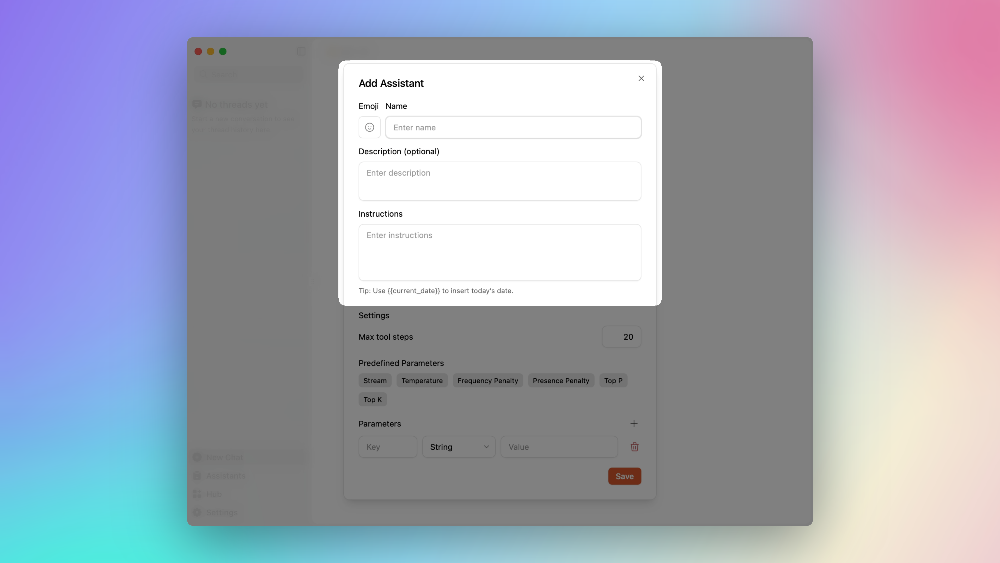
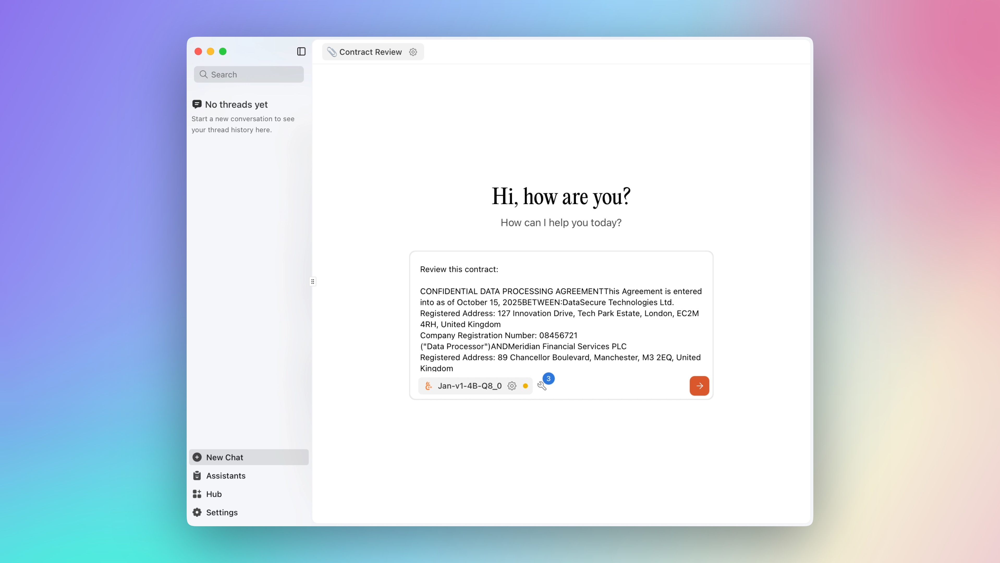

import { Callout } from 'nextra/components'
import CTABlog from '@/components/Blog/CTA'
import { OpenAIStatusChecker } from '@/components/OpenAIStatusChecker'

# Private AI for legal professionals who need confidentiality

  

Yes, it's possible to use AI in legal work without risking client data.  

<Callout type="warning">  
Client trust depends on privacy. Sending documents into public AI tools risks compliance and reputation.  
</Callout>   

Start by [downloading Jan](/download) and installing the **Jan v1 model**. Once installed, you can create assistants tailored to your practice and keep contracts, case notes, and client files under your control.  

<Callout type="info">  
**Why use Jan for legal tasks**  
- Runs locally on your hardware, no cloud uploads  
- Keeps chats and interactions private  
- Works offline once installed  
- Lets you build assistants for your own workflows  
</Callout>  

---

## Create your assistant

Once Jan is installed with the **Jan v1 model**, onboarding will guide you through downloading and setup.  

Click **Create assistant** to start:  
  
*Create your first assistant in Jan*  

Add an assistant name and prompt:  
  
*Example of a Jan assistant for contract review*  

You can create assistants using specific prompts. Below are examples for common legal workflows.  

---

## Contract review assistant  

AI can help lawyers move faster through long contracts by pointing out what matters most.  

**Prompt for Jan:**  
> You are a contract review assistant.  
> When I paste a contract:  
> - Highlight risky or unusual clauses  
> - Flag ambiguous or missing terms  
> - Summarize the agreement in plain English for a non-lawyer client  
> Format your response with sections: **Risks**, **Ambiguities/Missing**, **Summary**.  
> Do not provide legal advice.  

---

## Drafting assistant  

Use AI to create first drafts of NDAs, service agreements, or client letters. You still refine the output, but AI saves time on boilerplate.  

**Prompt for Jan:**  
> You are a drafting assistant.  
> When asked to draft a legal agreement or client letter:  
> - Produce a professional first version  
> - Use clear, concise language  
> - Leave placeholders like [Party Name], [Date], [Amount] for details  
> - Structure output with headings, numbered clauses, and consistent formatting  
> Do not provide legal advice.  

---

## Case preparation assistant  

Case prep often means reading hundreds of pages. AI can turn depositions, discovery files, or judgments into concise notes.  

  
*Jan chat interface for case preparation — process documents and extract key information*  

**Prompt for Jan:**  
> You are a case preparation assistant.  
> When I provide case materials:  
> - Extract key facts, issues, and arguments  
> - Present them as bullet points under headings: **Facts**, **Issues**, **Arguments**  
> - Keep summaries concise (under 500 words unless I request more)  
> Use plain English, no speculation or legal conclusions.  

---

## Knowledge management assistant  

Law firms accumulate memos, policies, and precedents. AI can help organize and retrieve them quickly.  

**Prompt for Jan:**  
> You are a knowledge management assistant.  
> When I ask questions about internal documents:  
> - Return concise summaries or direct excerpts  
> - Always cite the source (e.g., “Policy Manual, Section 4”)  
> - If not found in provided material, reply “Not found in documents.”  
> Do not invent information.  

---

## Final note  

AI in legal practice is not about replacing lawyers. It’s about handling repetitive tasks safely so you can focus on real decisions.  
With private AI, you gain efficiency without compromising client confidentiality.  

<CTABlog />  
