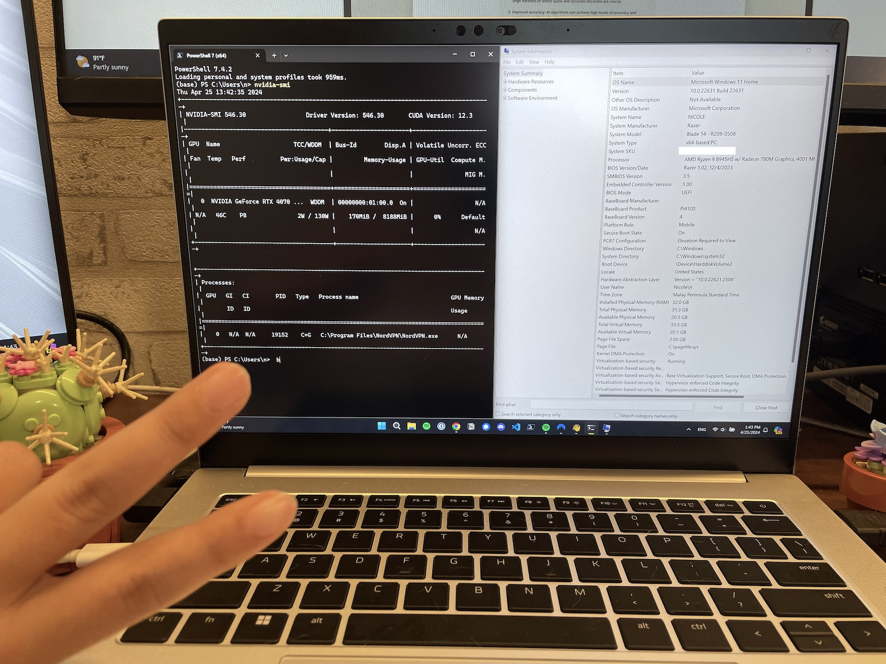
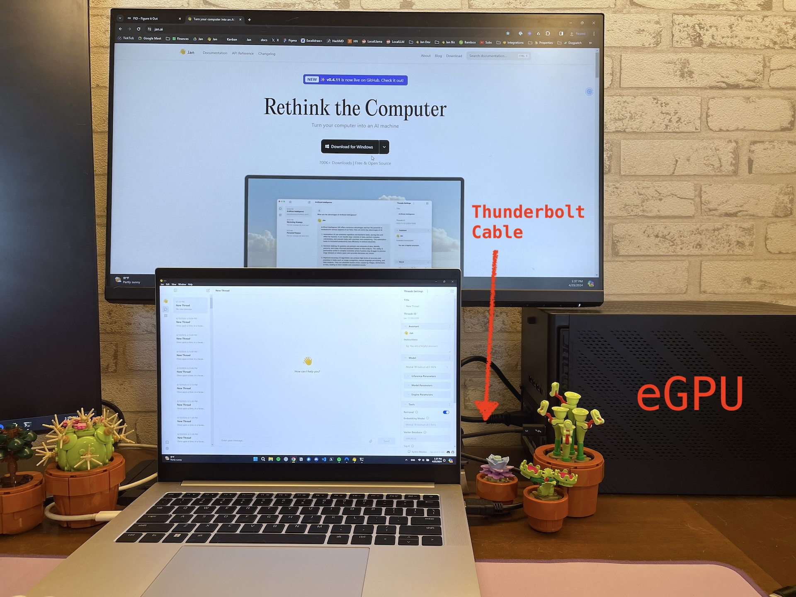

import { Callout } from 'nextra/components'
import CTABlog from '@/components/Blog/CTA'

# Benchmarking NVIDIA TensorRT-LLM

Jan now supports [NVIDIA TensorRT-LLM](https://github.com/NVIDIA/TensorRT-LLM) in addition to [llama.cpp](https://github.com/ggerganov/llama.cpp), making Jan multi-engine and ultra-fast for users with Nvidia GPUs.

We've been excited for TensorRT-LLM for a while, and [had a lot of fun implementing it](https://github.com/janhq/nitro-tensorrt-llm). As part of the process, we've run some benchmarks, to see how TensorRT-LLM fares on consumer hardware (e.g. [4090s](https://www.nvidia.com/en-us/geforce/graphics-cards/40-series/), [3090s](https://www.nvidia.com/en-us/geforce/graphics-cards/30-series/)) we commonly see in the [Jan's hardware community](https://discord.com/channels/1107178041848909847/1201834752206974996).

<Callout type="info" >
  **Give it a try!** Jan's TensorRT-LLM extension is available in Jan v0.4.9. We precompiled some TensorRT-LLM models for you to try: `Mistral 7b`, `TinyLlama-1.1b`, `TinyJensen-1.1b` 😂

  Bugs or feedback? Let us know on [GitHub](https://github.com/janhq/jan) or via [Discord](https://discord.com/channels/1107178041848909847/1201832734704795688).
</Callout>

<Callout type="info" >
  **An interesting aside:** Jan actually started out in June 2023 building on [NVIDIA FastTransformer](https://github.com/NVIDIA/FasterTransformer), the precursor library to TensorRT-LLM. TensorRT-LLM was released in September 2023, making it a very young library. We’re excited to see its roadmap develop!
</Callout>

## Key Findings

TensorRT-LLM was: 

- **30-70% faster** than llama.cpp on the same hardware
- **Consumes less memory on consecutive runs** and **marginally more GPU VRAM utilization** than llama.cpp
- **20%+ smaller compiled model sizes** than llama.cpp
- **Less convenient** as models have to be compiled for a specific OS and GPU architecture, vs. llama.cpp's "Compile once, run everywhere" portability
- **Less accessible** as it does not support older-generation NVIDIA GPUs

## Why TensorRT-LLM?

[TensorRT-LLM](https://github.com/NVIDIA/TensorRT-LLM) is Nvidia's open-source inference library that incorporates Nvidia's proprietary optimizations beyond the open-source [cuBLAS](https://developer.nvidia.com/cublas) library. 

As compared to [llama.cpp](https://github.com/ggerganov/llama.cpp), which today dominates Desktop AI as a cross-platform inference engine, TensorRT-LLM is highly optimized for Nvidia GPUs. While llama.cpp compiles models into a [single, generalizable CUDA "backend"](https://github.com/ggerganov/llama.cpp/blob/master/ggml-cuda.cu)  that can run on a wide range of Nvidia GPUs, TensorRT-LLM compiles models into a [GPU-specific execution graph](https://www.baseten.co/blog/high-performance-ml-inference-with-nvidia-tensorrt/) that is highly optimized for that specific GPU's Tensor Cores, CUDA cores, VRAM and memory bandwidth.

TensorRT-LLM is typically used in datacenter-grade GPUs, where it produces a [face-melting 10,000 tokens/s](https://nvidia.github.io/TensorRT-LLM/blogs/H100vsA100.html) on [NVIDIA H100 Tensor Core GPUs](https://www.nvidia.com/en-us/data-center/h100/). We were curious for how TensorRT-LLM performs on consumer-grade GPUs, and gave it a spin.

| Llama.cpp                                                                                                                 | TensorRT-LLM                                                                                                                      |
| ------------------------------------------------------------------------------------------------------------------------- | --------------------------------------------------------------------------------------------------------------------------------- |
| Baseline                                                                                                                  | Blazing fast (30-70% faster)                                                                                                      |
| Compile once, run cross-platform                                                                                          | Compiled and highly optimized for specific GPU architecture                                                                       |
| Generalizable and Portable                                                                                                | Highly-optimized                                                                                                                  |
| Model compiles to [single, generalizable CUDA "backend"](https://github.com/ggerganov/llama.cpp/blob/master/ggml-cuda.cu) | Model compiles to [GPU-specific execution graph](https://www.baseten.co/blog/high-performance-ml-inference-with-nvidia-tensorrt/) |

## Experiment Setup

We ran the experiment using standardized inference requests in a sandboxed environment:
- **Model**: Mistral 7b model, compiled and quantized at a comparable `int4` quantization.
- **Test runs**: 5 batches of 10 runs each, per inference engine, on a bare metal PC with no other applications.
- **Parameters**: User defaults, i.e. `batch_size 1`, `input_len 2048` and `output_len 512`
- **Measurements**:
  - CPU, memory from Jan system monitor
  - GPU VRAM utilization metrics from `nvidia-smi`, and taken over an interval of 14 seconds. 
  - Throughput (token/sec) using [Jan's built-in Tokens/sec perf stat](https://github.com/search?q=repo%3Ajanhq%2Fjan%20timeDiffInSeconds&type=code).

<Callout>
We picked a [batch size of 1](https://www.reddit.com/r/LocalLLaMA/comments/17sbwo5/what_does_batch_size_mean_in_inference/) to simulate realistic real-world use cases, as Jan users are likely to make one inference request at a time. We also used a `input_len` of 2048 and `output_len` of 512 to simulate a typical chatbot use case.
</Callout>

<Callout>
**Further Research**: We found GPU VRAM Utilization to be difficult to measure, with `nvidia-smi` on Windows producing a different result from Windows Task Manager's Resource Monitor for NVIDIA GPUs. After some [research](https://forums.developer.nvidia.com/t/how-to-evaluate-gpu-utilization-usage-on-windows/245451/3), we have gone with `nvidia-smi`'s measurement. 
</Callout>

### Hardware Selection

We chose the following GPUs based on our users' preferences:

| NVIDIA GPU                        | VRAM (GB) | CUDA Cores | Tensor Cores | Memory Bus Width (bit) | Memory Bandwidth (GB/s) | Connection (GB/s)                            |
| --------------------------------- | --------- | ---------- | ------------ | ---------------------- | ----------------------- | -------------------------------------------- |
| GeForce RTX 4090 (Ada)            | 24        | 16,384     | 512          | 384                    | ~1000                   | PCIe4.0 x16 (~32)                        |
| GeForce RTX 3090 (Ampere)         | 24        | 10,496     | 328          | 384                    | 935.8                   | PCIe4.0 x16 (~32)                        |
| GeForce RTX 4070 Laptop GPU (Ada) | 8         | 7680       | 144          | 192                    | 272                     | PCIe4.0 x4 (~8)                         |
| GeForce RTX 4090 eGPU (Ada)       | 24        | 16,384     | 512          | 384                    | ~1000                   | Thunderbolt 3 connected to a USB4 USB-C port ([~1.25-5?](https://www.cablematters.com/Blog/Thunderbolt/usb4-vs-thunderbolt-3)) |

### llama.cpp Setup

- llama.cpp commit [15499eb](https://github.com/ggerganov/llama.cpp/commit/15499eb94227401bdc8875da6eb85c15d37068f7)
- We used `Mistral-7b-q4_k_m` in `GGUF` with `ngl` at `100`

<Callout>
Note: `ngl` is the abbreviation of `Number of GPU Layers` with the range from `0` as no GPU acceleration to `120` as full on GPU for some big models.
</Callout>

### TensorRT-LLM Setup

- TensorRT-LLM version [0.7.1](https://github.com/NVIDIA/TensorRT-LLM/releases/tag/v0.7.1) and build on Windows
- For TensorRT-LLM, we used `Mistral-7b-int4 AWQ`
- We ran TensorRT-LLM with `free_gpu_memory_fraction` to test it with the lowest VRAM consumption
- Note: We picked AWQ for TensorRT-LLM to be a closer comparison to GGUF's Q4.

## Results

### NVIDIA GeForce RTX 4090 GPU

*Jan is built on this Dual-4090 workstation, which recently got upgraded to a nice case*

*The original case (or lack thereof) for our Dual-4090 cluster, as posted on [r/localllama](https://www.reddit.com/r/LocalLLaMA/comments/16lxt6a/case_for_dual_4090s/)*

<Callout type="info" >
  **Hardware Details**
- CPU: Intel 13th series
- GPU: NVIDIA GeForce RTX 4090 (Ada - sm 89)
- RAM: 32GB
- OS: Windows 11 Pro

**Model Details**
- llama.cpp model: Mistral 7B v0.2 GGUF Q4_K_M
- TensorRT-LLM model: Mistral 7B v0.2 AWQ, quantized for single GPU (Ada)
</Callout>

For this test, we used Jan's [Dual-4090 workstation](https://www.reddit.com/r/LocalLLaMA/comments/16lxt6a/case_for_dual_4090s/), which our engineers timeshare to build Jan.

The [NVIDIA GeForce RTX 4090](https://www.nvidia.com/en-us/geforce/graphics-cards/40-series/) is the latest top-of-the-line desktop GPU, with an MSRP of $1,599, and uses the Ada architecture. It has a ~1000 GB/s memory bandwidth within VRAM, and a PCIe4 x16 lane (~32 GB/s) between the GPU and the CPU. 

| Metrics                  | GGUF (using CPU) | GGUF (using GPU) | TensorRT-LLM | How TensorRT-LLM Compares |
| ------------------------ | ---------------- | ---------------- | ------------ | ------------------------- |
| Throughput (token/s)     | 14.0             | 100.43           | 170.63       | ✅ 69.89% faster          |
| Max GPU Utilization (%)  | N/A              | 83.50            | 88.50        | 5.99% more                |
| Max VRAM Utilization (%) | N/A              | 64               | 72.1         | 12.66% more               |
| Avg RAM Used (GB)        | 0.611            | 7.105            | 4.98         | ✅ 29.88% less            |
| Disk Size (GB)           | 4.07             | 4.06             | 3.05         | ✅ 24.88% smaller         |

TensorRT-LLM was almost 70% faster than llama.cpp by building the model for the GeForce RTX 4090 GPU’s Ada architecture for optimal graph execution, fully utilizing the 512 Tensor Cores, 16,384 CUDA cores, and 1,000 GB/s of memory bandwidth.

The intuition for why llama.cpp is slower is because it compiles a model into a [single, generalizable CUDA “backend”](https://github.com/ggerganov/llama.cpp/blob/master/ggml-cuda.cu) that can run on many NVIDIA GPUs. Doing so requires llama.cpp to sacrifice all the optimizations that TensorRT-LLM makes with its compilation to a GPU-specific execution graph.

### NVIDIA GeForce RTX 3090 GPU

*Our 3090 Machine, now used by one of our engineers to build Jan*

<Callout type="info" >
  **Hardware Details**
- CPU: Intel 13th series
- GPU: NVIDIA GeForce RTX 3090 (Ampere - sm 86)
- RAM: 64GB
- OS: Windows 11 Pro

**Model Details**
- llama.cpp model: Mistral 7B v0.2 GGUF Q4_K_M
- TensorRT-LLM model: Mistral 7B v0.2 AWQ, quantized for single GPU (Ampere)
</Callout>

The [NVIDIA's GeForce RTX 3090](https://www.nvidia.com/en-us/geforce/graphics-cards/30-series/rtx-3090-3090ti/) is a popular desktop GPU, and retails for approximately $1,500 (as of April 24). It uses the NVIDIA Ampere architecture. As compared to its successor GeForce RTX 4090, it has 33% fewer CUDA cores (10,496) and Tensor Cores (328) and 7% less memory bandwidth (~930 GB/s).

| Metrics                  | GGUF (using CPU) | GGUF (using GPU) | TensorRT-LLM | How TensorRT-LLM Compares |
| ------------------------ | ---------------- | ---------------- | ------------ | ------------------------- |
| Throughput (token/s)     | 11.42            | 88.70            | 144.19       | ✅ 62.57% faster          |
| Max GPU Utilization (%)  | N/A              | 80.40            | 89.10        | 10.82% more               |
| Max VRAM Utilization (%) | N/A              | 66.80            | 76.20        | 14.07% more               |
| Avg RAM Used (GB)        | 0.611            | 2.60             | 0.98         | 62.41%% less              |
| Disk Size (GB)           | 4.07             | 4.06             | 3.05         | ✅ 24.88% smaller         |

Interestingly, the GeForce RTX 3090 was only 16.6% slower compared with the GeForce RTX 4090. On TPS, TensorRT-LLM outperformed llama.cpp by 62.57%. Curiously, it also used negligible RAM for subsequent inference requests after the initial model warmup.

### NVIDIA GeForce RTX 4070 Laptop GPU

<Callout type="info" >
  **Hardware Details**
- Laptop: Razer Blade 14
- CPU: AMD Ryzen™ 9 8945HS, 8C/16T
- GPU: NVIDIA GeForce RTX 4070 Laptop GPU (Ada - sm 89) on PCIe 4.0 x16 (32 GB/s)
- RAM: 32GB
- OS: Windows 11 Pro

**Model Details**
- llama.cpp model: Mistral 7B v0.2 GGUF `Q4_K_M`
- TensorRT-LLM model: Mistral 7B v0.2 AWQ, quantized for single GPU (Ada)
</Callout>

We also benchmarked an NVIDIA GeForce RTX 4070 Laptop GPU with 8gb of VRAM, which is a popular configuration among Jan users. Laptop GPUs are less powerful than their desktop counterparts, as they trade portability for reduced energy consumption and thermal constraints.

| Metrics                  | GGUF (using CPU) | GGUF (using GPU) | TensorRT-LLM | Difference on GPU |
| ------------------------ | ---------------- | ---------------- | ------------ | ----------------- |
| Throughput (token/s)     | 11.57            | 39.70            | 51.57        | ✅ 29.9% faster   |
| Max GPU Utilization (%)  | N/A              | 80.00            | 84.67        | 5.83% more        |
| Max VRAM Utilization (%) | N/A              | 72.78            | 81.22        | 11.60% more       |
| Avg RAM Used (GB)        | 4.49             | 4.44             | 1.04         | ✅ 76.55%% less   |
| Disk Size (GB)           | 4.07             | 4.06             | 3.05         | ✅ 24.88% smaller |

TensorRT-LLM on the laptop dGPU was 29.9% faster in tokens per second throughput than llama.cpp, but significantly slower than the desktop GPUs. 

The intuition for this is fairly simple: the GeForce RTX 4070 Laptop GPU has 53.1% fewer CUDA cores and Tensor Cores (compared to the 4090), and less VRAM (8gb vs. 24gb). This reduces the surface area for GPU-specific optimizations for TensorRT-LLM.

The GeForce RTX 4070 Laptop GPU is also ~70% slower than the GeForce RTX 4090 desktop GPU, showing the hardware effect of less electricity draw, less VRAM, and thermal constraints on inference speed.

### Laptop with NVIDIA GeForce RTX 4090 eGPU

<Callout type="info" >
  **Hardware Details**
- Laptop: Razer Blade 14
- eGPU box: AORUS RTX 4090 GAMING BOX
- CPU: AMD Ryzen™ 9 8945HS, 8C/16T
- GPU: NVIDIA GeForce RTX 4090 (Ada - sm 89) on eGPU with Thunderbolt 3 connection
- RAM: 32GB
- OS: Windows 11 Pro

**Model Details**
- llama.cpp model: Mistral 7B v0.2 GGUF `Q4_K_M`
- TensorRT-LLM model: Mistral 7B v0.2 AWQ, quantized for single GPU (Ampere)
</Callout>

Our last benchmark was to experiment with an [Asus RTX 4090 eGPU](https://www.gigabyte.com/Graphics-Card/GV-N4090IXEB-24GD), that was connected via a [Thunderbolt 3 port](https://www.gigabyte.com/Graphics-Card/GV-N4090IXEB-24GD) to the [Razer Blade 14's USB4 port](https://www.razer.com/sg-en/gaming-laptops/razer-blade-14). Theoretically, the results should be fairly similar to the GeForce RTX 4090 desktop GPU as they have identical underlying GPUs, but with very different connection speeds.

We thought it would be an interesting to see how TensorRT-LLM handles a 68.4% reduction in communication bandwidth between the CPU and GPU:
- Thunderbolt 3 connection (1.25-5 GB/s?) for eGPUs
- PCIe 4.0 x4 (~8 GB/s) for "on device" desktops

<Callout>
**Help Needed:** We are actually not 100% sure what the actual Connection Speed is [between Thunderbolt 3 to USB4](https://www.cablematters.com/Blog/Thunderbolt/usb4-vs-thunderbolt-3), as the actual speed seems different from the advertised speed of 5 GB/s. There seem to be a lot of factors involved, including the actual cable itself. We'd love if someone in the community can guide us!
</Callout>

Overall, we used mid-to-high-end NVIDIA desktop GPUs for our tests, as TensorRT-LLM’s performance enhancements are most apparent on bigger VRAMs. For users with lower-spec machines, llama.cpp is better.

| Metrics                  | GGUF (using CPU) | GGUF (using GPU) | TensorRT-LLM | Difference on GPU |
| ------------------------ | ---------------- | ---------------- | ------------ | ----------------- |
| Throughput (token/s)     | 11.56            | 62.22            | 104.95       | ✅ 68.66% faster  |
| Max VRAM Utilization (%) | 0                | 65               | 99           | 52.31% more       |
| RAM Used (GB)            | 0.611            | 5.38             | 4.11         | ✅ 23.61% less    |
| Disk Size (GB)           | 4.07             | 4.06             | 3.05         | ✅ 24.88% smaller |

The Thunderbolt 3 eGPU had a 38.5% lower tokens/s as compared to the PCIe4.0 x16 connected GPU. But the % speedup vs. llama.cpp was similar, at around 69%.

Interestingly, the VRAM used with the eGPU was variably higher. Our hypothesis is that the slower communication bandwidth results in more VRAM being allocated, as memory is released mostly slowly as well.

## Conclusion

### Token Speed

| Throughput (Higher is Better)      | TensorRT-LLM    | Llama.cpp   | % Difference  |
| ---------------------------------- | --------------- | ----------- | ------------- |
| GeForce RTX 4090 desktop GPU       | ✅ 170.63t/s    | 100.43t/s   | 69.89% faster |
| GeForce RTX 3090 desktop GPU       | ✅ 144.19t/s    | 88.70t/s    | 62.57% faster |
| GeForce RTX 4090 eGPU              | ✅ 104.95t/s    | 62.22t/s    | 68.66% faster |
| GeForce RTX 4070 Laptop GPU        | ✅ 51.57t/s     | 39.70t/s    | 29.90% faster |
| Laptop AMD Ryzen™ 9 8945HS, 8C/16T | (Not supported) | ✅ 11.57t/s |               |

- TensorRT-LLM is up to **70% faster** than llama.cpp on desktop GPUs (e.g. 3090 GPU, 4090 GPUs) while using less RAM & CPU (but more fully utilizing VRAM)
- TensorRT-LLM is up to **30% faster** on laptop GPUs (e.g. 4070 GPUs) with smaller VRAM

### Max VRAM Utilization

| Average VRAM utilization %   | TensorRT-LLM | Llama.cpp | % Difference |
| ---------------------------- | ------------ | --------- | ------------ |
| GeForce RTX 4090 desktop GPU | 72.10        | 64.00     | 12.66% more  |
| GeForce RTX 3090 desktop GPU | 76.20        | 66.80     | 14.07% more  |
| GeForce RTX 4070 Laptop GPU  | 81.22        | 72.78     | 11.06% more  |
| GeForce RTX 4090 eGPU        | N/A          | N/A       | N/A          |

- TensorRT-LLM used marginally more average VRAM utilization at peak utilization vs. llama.cpp (up to 14%). Though this could have interesting implications on consuming more electricity over time.
- Note: we used comparable (but not identical) quantizations, and TensorRT-LLM’s `AWQ INT4` is implemented differently from llama.cpp’s `q4_k_m`

### Max RAM Usage

| Max RAM utilization          | TensorRT-LLM | Llama.cpp | % Difference     |
| ---------------------------- | ------------ | --------- | ---------------- |
| GeForce RTX 4090 desktop GPU | ✅ 4.98      | 7.11      | ✅ 29.88% less   |
| GeForce RTX 3090 desktop GPU | ✅ 0.98      | 2.60      | ✅ 62.41% less   |
| GeForce RTX 4070 Laptop GPU  | ✅ 1.04      | 4.44      | ✅  76.55%% less |
| GeForce RTX 4090 eGPU        | ✅ 4.11      | 5.38      | ✅ 23.61% less   |

TensorRT-LLM uses a lot less Max RAM vs. llama.cpp on slower connection (PCIe 3.0 or Thunderbolt 3) due to better memory management and efficient delegation to VRAM. On faster connection, it’s at least equal to llama.cpp.

### Compiled Model Size and Number of Files
- Contrary to popular belief, TensorRT-LLM prebuilt models turned out to not be that huge
- Mistral 7b int4 was actually 25% smaller in TensorRT-LLM, at 3.05gb vs. 4.06gb
- Note: These are approximate comparisons, as TensorRT-LLM’s AWQ INT4 is implemented differently from llama.cpp’s q4_k_m
- The bigger takeaway is that the Compiled model sizes are roughly in the same ballpark, while the number of files for TensorRT-LLM is 7x the GGUF number of files.

| Model size (Lower is better) | TensorRT-LLM AWQ int4 | Llama.cpp GGUF Q4 | % Difference      |
| ---------------------------- | --------------------- | ----------------- | ----------------- |
| Mistral 7B                   | ✅ 3.05GB               | 4.06GB              | ✅ 24.88% smaller |

### Convenience
- Llama.cpp still wins on cross-platform versatility and convenience of a “compile once, run everywhere” approach
- TensorRT-LLM still requires compilation to specific OS and architecture, though this could be solved by pre-compiling and publishing models on [Nvidia's NGC Model Catalog](https://catalog.ngc.nvidia.com/orgs/nvidia/teams/ai-foundation/collections/codellama)

### Accessibility
- Llama.cpp unsurprisingly beats TensorRT-LLM in terms of accessibility
- TensorRT-LLM does not support older NVIDIA GPUs and won’t work well on smaller VRAM cards (e.g. 2-4gb VRAM)

## Final Notes

Our benchmarking is not perfect. We evaluated over a dozen tools ([llmperf](https://github.com/ray-project/llmperf), [psutil](https://pypi.org/project/psutil/), [gpustat](https://github.com/wookayin/gpustat), native utilities, and more) and found that everyone measures TPS, common metrics differently. We eventually settled on using our own tools in Jan, which are consistent across any inference engine and hardware. As for runtime parameters, we went with default settings, likely representing the typical user experience.

We also did not overclock for this benchmark , as it is not a default setting for most users. But we've measured in our tests that TensorRT-LLM can go even faster with a few tweaks. We see this as a pretty exciting future direction. 

<Callout type="info" >
  **How to Overclock:** We found an additional **15% increase in performance** with TensorRT-LLM by:
- Enabling [XMP](https://www.intel.com/content/www/us/en/gaming/extreme-memory-profile-xmp.html)
- Overclocking RAM bus speed in BIOS from `3600` to `5600`. 
</Callout>

We're also publishing the underlying [raw experimental data](https://drive.google.com/file/d/1rDwd8XD8erKt0EgIKqOBidv8LsCO6lef/view?usp=sharing), and would encourage the community to scrutinize and help us improve.

Special thanks to Asli Sabanci Demiroz, Annamalai Chockalingam, Jordan Dodge from Nvidia, and Georgi Gerganov from llama.cpp for feedback, review and suggestions. 

<CTABlog />
