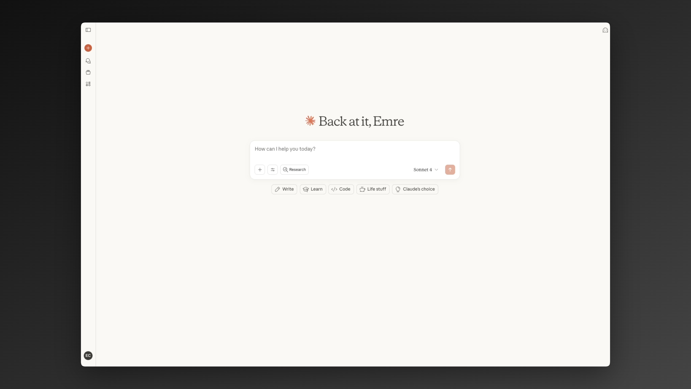
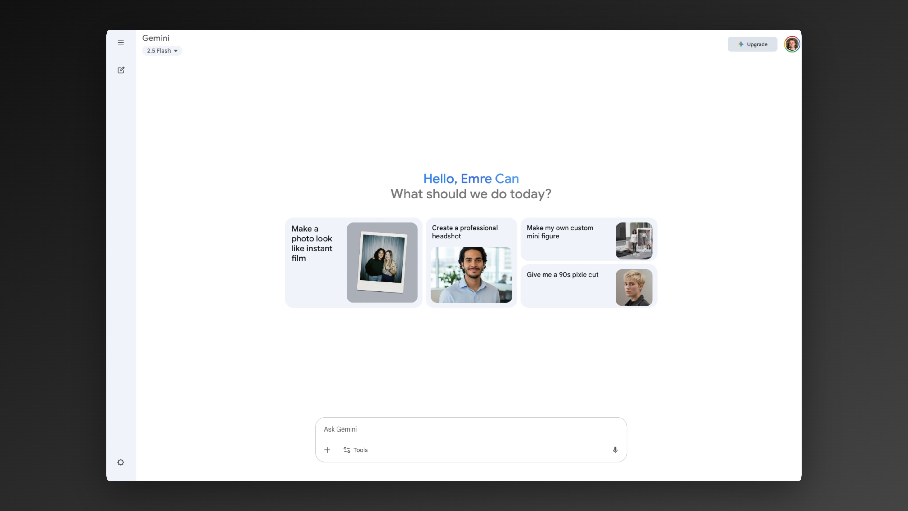
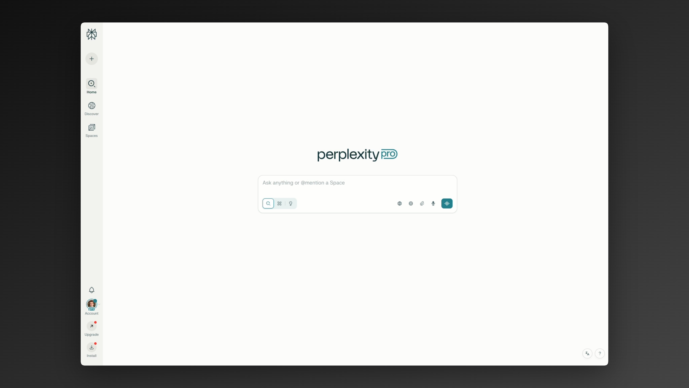
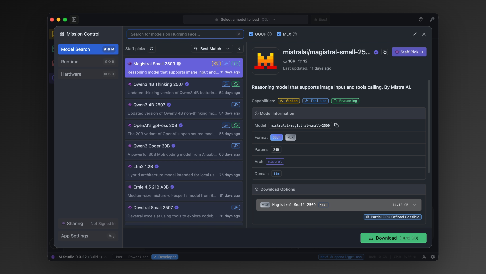

import { Callout } from 'nextra/components'
import CTABlog from '@/components/Blog/CTA'

# Best ChatGPT Alternatives

ChatGPT works well, but it always needs internet, has usage limits, and isn't private. 

If you want options that fit different needs, offline use, privacy, or specialized tasks, see the best alternatives to ChatGPT available for specific use cases.

## Comparison: ChatGPT Alternatives 

| ChatGPT Alternative       | Offline | Key Strength                 | Best For                   |
| ------------------------- | ------- | ---------------------------- | -------------------------- |
| **[Jan](https://jan.ai)** | Yes   | Runs Cloud + Offline, open-source  | Best overall ChatGPT replacement   |
| Claude                    | -    | Strong writing and reasoning | Creative text & code             |
| Gemini                    | -    | Integrated with Google       | Research tasks, image generation            |
| Perplexity                | -    | Fast, with cited answers     | Research and fact-checking |
| LM Studio                 | Yes   | Runs open models on PC       | Coding and experiments     |

### Jan is the best ChatGPT alternative

*Jan as an open-source alternative to ChatGPT*

Jan is the most complete ChatGPT alternative available today. It enables:
- Use AI in online & offline (even on a plain)
- Agentic actions supported
- MCP servers supported for tools

Unlike ChatGPT, it runs on your computer, which means:
- Offline AI capabilities (see [Offline ChatGPT post](https://www.jan.ai/post/offline-chatgpt-alternative) for details)
- 100% private
- Open-source & Free

<Callout> Jan is an [open-source replacement for ChatGPT.](https://www.jan.ai/) </Callout>

### Claude is the most notable online alternative

Claude has become the main online rival to ChatGPT. It stands out for writing, reasoning, and coding.

- Handles very long documents and context well
- Strong for essays, research papers, and structured text
- Popular with developers for code explanations and debugging
- Cloud-only, no offline mode
- Filters outputs heavily, sometimes too restrictive

### Gemini is the Google's integrated alternative

Gemini ties directly into Google’s apps and search. Great for users in the Google ecosystem.

- Built into Gmail, Docs, and Google Search
- Good for real-time research and fact-checking
- Strong at pulling web context into answers
- Requires Google account, fully online
- Privacy concerns: all tied to Google services

### Perplexity is the research-focused alternative

Perplexity is built for fact-checking and quick research, not creativity.

- Always cites sources for answers
- Strong at summarizing current web info
- Very fast for Q&A style use
- Limited in creativity and open-ended writing
- Cloud-only, daily free usage caps

### LM Studio is the experimental alternative 

LM Studio is not a ChatGPT replacement but a local tool for running open models.

- Lets you test and run open-source models on PC
- Offline by default, works without internet
- Flexible setup for developers and technical users
- Requires decent hardware (RAM/VRAM)

LM Studio is not beginner-friendly compared to Jan.

## Choosing the right ChatGPT alternative for you:

- Best overall replacement: [Jan](https://www.jan.ai/)
- For writing & storytelling: Claude
- For research & web knowledge: Perplexity or Gemini
- For productivity & office work: Microsoft Copilot
- For experimentation with open-source models for technical people: LM Studio

Most ChatGPT alternatives are still cloud-based and limited. If you want full privacy, offline use, and no restrictions, the best ChatGPT alternative is [Jan](https://www.jan.ai/).

### Can I use ChatGPT offline?
No. ChatGPT always requires internet. For offline AI, use Jan.

### What’s the best free ChatGPT alternative?
Jan is free, open-source, and runs offline. Others like Claude or Perplexity have limited free tiers but are cloud-based.

### Which ChatGPT alternative is best for writing?
Claude is strong for essays, reports, and structured writing. You could use [open-source models](https://www.jan.ai/post/run-ai-models-locally) in Jan too.

### Which ChatGPT alternative is best for research?
Perplexity and Gemini pull real-time web data with citations. 

### What’s the closest full replacement to ChatGPT?
Jan. It runs locally, works offline, and feels like ChatGPT without restrictions.