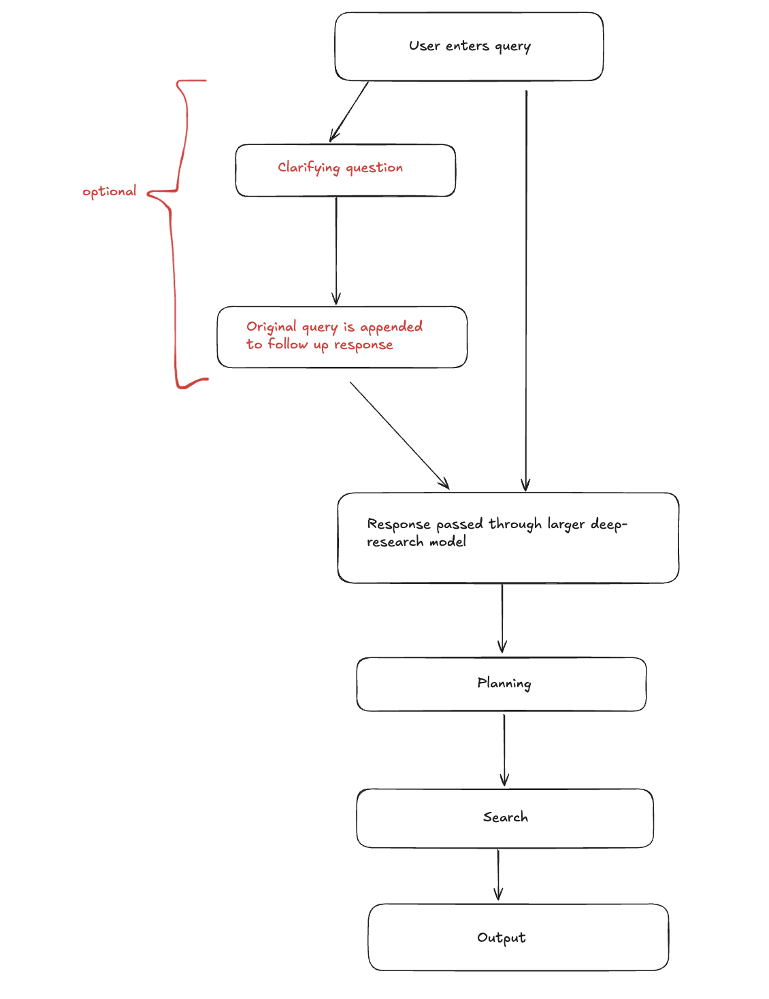
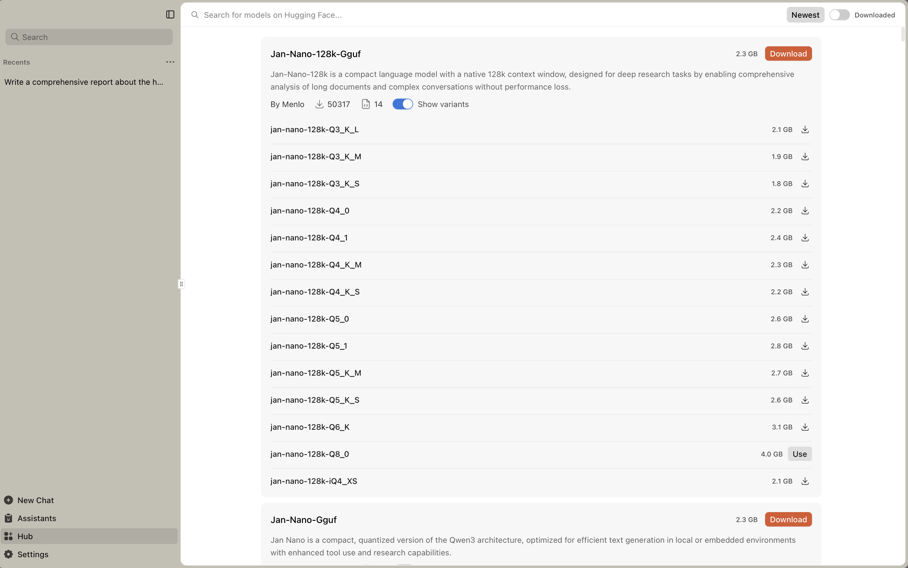
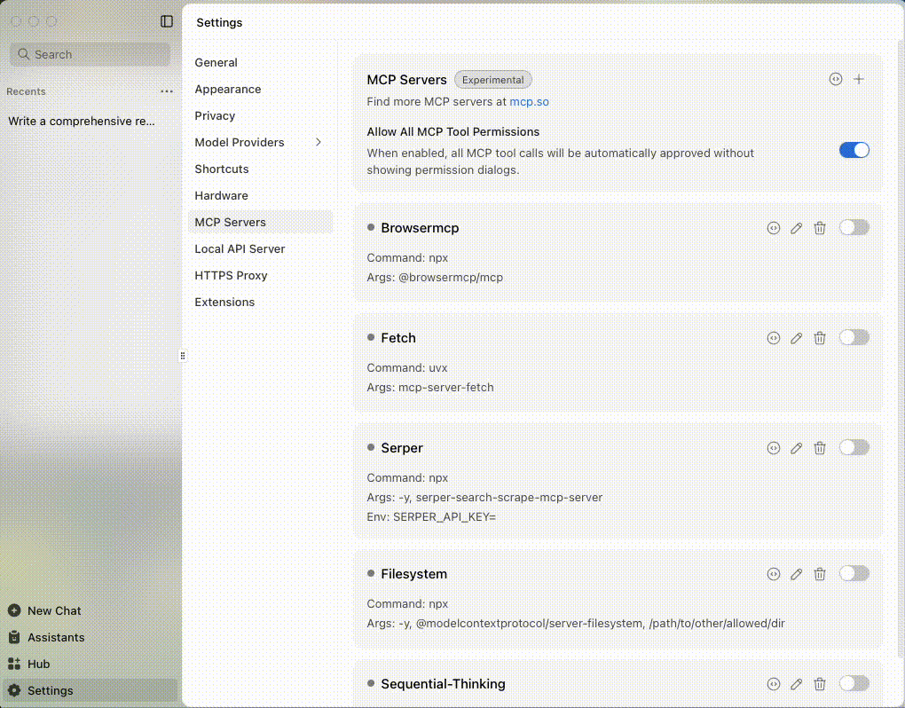

import { Callout } from 'nextra/components'
import CTABlog from '@/components/Blog/CTA'

# Replicating Deep Research in Jan

Ever wondered how OpenAI’s Deep Research works? Since the release of Deep Research in February 2025, it has been lauded as a tool that is able to “output thorough research”. 

There are two core features of Deep Research: 

- Exhaustive searching: all major model providers that offer deep research as a service (proceed to list) would search from a variety of sources. This can be broken down (largely) into two forms of search: **breadth-first search** and **depth-first search**. There will be more of this later!
- Report generation: most major model providers will provide an exhaustive, lengthy report at the end of completing the deep research task. For instance, OpenAI gives users the ability to export this to a PDF, while Kimi would also provide an interactive HTML webpage in their UI for easier visualization.

## Unpacking Deep Research
While the outputs of deep research might be mind blowing at first glance, it is possible to reverse engineer the process through which such a comprehensive output is generated! OpenAI’s [Deep Research API cookbook](https://cookbook.openai.com/examples/deep_research_api/introduction_to_deep_research_api) gives us some insight into the flow that they adopt:


Deep Research, at a high level, is essentially a pipeline / tool chain through which a user would go through. The inner workings of this pipeline might vary from provider to provider, but we’ve done up a table for you to compare the results below. 

At a high level, the pipeline would look something like this: 

The crux of Deep Research lies in the pipeline’s ability to output a substantiated report which has cited information from a variety of sources. 

<Callout type="info">
**Different Flows for Different Providers**

Note that not all Deep Research flows are the same as what's shown in the above diagram, only OpenAI and Kimi does this currently! Most providers would adopt a simpler approach, as shown below in the comparison table.
</Callout>

| Platform | Pipeline Flow | Planning Approach | Sources Used | Duration (mins)  | Export Options | Unique Features | Deep Research Usage |
| --- | --- | --- | --- | --- | --- | --- | --- |
| OpenAI | Original prompt → clarification (smaller model) → user answers → rewriter bundles prompts → specific model → output | Chain of thought (COT), no explicit planning | 10–30 | 10–15 | PDF, Markdown with inline references | Clarification questions, lightweight rewriter model | Paid |
| Grok’s DeeperSearch  | Planning → research execution → output with survey notes | Planning phase before research | 70–100 | 5–10  | Not specified | Heavy Twitter/X source integration, "Survey Note" reasoning | Free |
| Claude | Research plan → breadth-first search → depth-first search | Research plan generated, multiple subagents for complex queries | 100+ | 5–10  | Artifact format | Breadth-first then depth-first approach, metadata extraction | Paid |
| Gemini | Original prompt → editable research plan → execution | Editable research plan (user can modify) | 50+ | 10–20  | Google Docs export | Editable planning phase, newer pipeline | Free |
| Perplexity | Research plan → execution with speed options | Research plan crafted and followed | 50–100 | 3–5  | Not specified | "Answer now" option for quick results | Paid |
| Kimi | Query → clarifying questions → planning → research → synthesis | Explicit planning with clear phase transitions | 50–100 | 30–60+ (slower inference)  | PDF, Interactive website | Distinction between "search" vs "browser use", interactive output | Free |

### Understanding Search Strategies

In general, when looking at the number of sources that are used, we can classify whether a search is *breadth first* or *depth first*. 

*Breadth first* searches would result in a greater number of sources that are used, which might be better for a brief survey over a landscape for instance. 

*Depth first* searches would entail diving deeper into a few particular sources (or have multiple search variations between a particular context), which might be better for extracting nuanced insight. 

<Callout>
In Claude’s Deep Research, a *classifier* is used to determine whether a user query is *breadth first* or *depth first*. This results in a customization of the pipeline that is used for conducting research. For instance, a complex *breadth first* query might result in *sub-agents* being spun up to research various parts of the research query in parallel. 
</Callout>

## Replicating Deep Research Results with Jan
Given this overview, how would we replicate this in Jan? 

We’ll make use of features that are available to us in order to customize the model output such that it gets as gets as close to a Deep Research output without having to spend a cent, and having full control over your data!

<Callout>
This is using the latest version of Jan (v0.6.6!) The features in this guide require at least 0.6.3 but for the best experience please use 0.6.6!
</Callout>

### Setting up a Purpose Built Model for Deep Research with Jan
1. Under `Hub`, go to `Jan-Nano-128k-Gguf` and enable `Show variants`. Download the largest model that your computer can run! Jan-nano is a 4B model, so even with the largest quantization it should be able to run on your hardware comfortably. 


### Enabling Search through MCP
2. Once the model has been downloaded, it should appear under the `llama.cpp` provider.
3. Go to `Settings` > `General` and click on the toggle button next to `Experimental Features`. `MCP Servers` should then appear on the side bar. 

4. Upon clicking on `MCP Servers`, click on the toggle beside `Allow All Tool Permissions` as well as the toggle beside `Serper`. Feel free to look through [this guide in our documentation](https://jan.ai/docs/mcp-examples/search/exa) if you would like to play around with different providers.
5. Click on the pencil (edit) button on `Serper` and navigate to [Serper login](https://serper.dev/login) to retrieve your Serper API key. Ensure that that is loaded under `Environment Variables` as shown below. 

6. Upon inputting that, the following should appear on the top right hand of the screen. 

7. Ensure that the downloaded model has access to tools by navigating to the following: `Settings` > `Model Providers` > Clicking on the `Pencil` icon and toggling `Tools` on!


### Customizing Assistants
8. Great! Now that you have search set up, let’s [configure assistants](https://jan.ai/docs/assistants) to ensure that you make the most out of the model. Here’s the prompt that we used for our assistant “Report Writer”:
```
Report Writing Instructions
You are a research analyst. Follow this exact process:
MANDATORY RESEARCH PHASE (Do this first)

Conduct 5-10 searches maximum - then STOP searching and write the report
Each search query must be unique - no repeating previous searches
Search different angles: statistics, expert opinions, case studies, recent news, industry reports
Use web_fetch to read full articles from search results

WRITING PHASE (Do this after research is complete)
Write a comprehensive report with:

Executive summary with key findings
Evidence-based analysis with citations for every claim
Actionable recommendations with rationale

CRITICAL: After 10 searches, immediately stop searching and write the report. Do not continue searching beyond 10 calls.
```

## Piecing it All Together
The final result should look something like this! And violá, you would have replicated the Deep Research flow on Jan!


## Need help?

<Callout type="info">
[Join our Discord community](https://discord.gg/Exe46xPMbK) for support and tips on using Jan as your offline ChatGPT alternative.
</Callout>

<CTABlog />