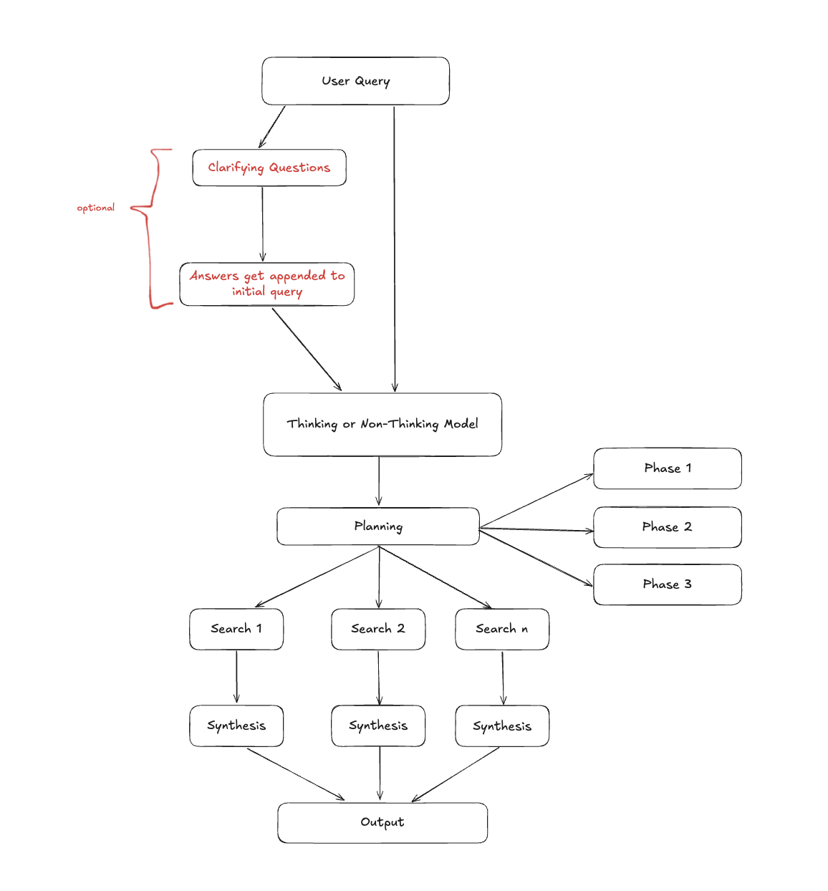
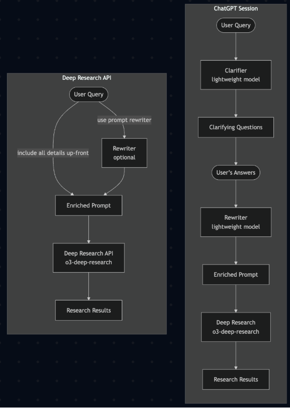
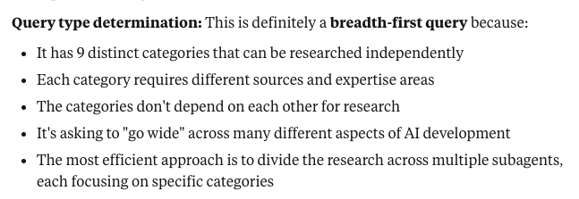
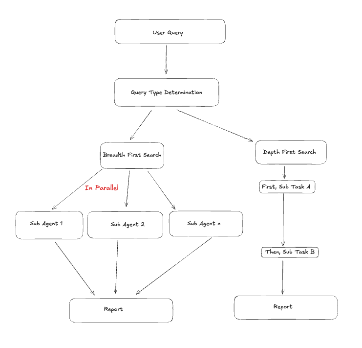

import { Callout } from 'nextra/components'
import CTABlog from '@/components/Blog/CTA'

# Replicating Deep Research in Jan

Deep Research like that of OpenAI, Gemini, and Qwen, is not at feature parity in Jan yet, so this post
highlights our initial steps at making a hybrid, local and cloud-based deep research system that competes
with the best implementations to date.

## What is Deep Research?

What exactly is deep research and how does it work? Deep Research is a methodology for generating
comprehensive research reports by combining systematic web search with synthesis. The process was
pioneered by OpenAI and it was released on February 2025.

There are two core features of Deep Research:

- **Exhaustive search**: This search is characterized by two approaches, wide search for breadth and deep search for depth.
- **Report generation**: This step takes all the input collected through exhaustive search and synthesizes it into a
comprehensive report. The input in this step may be raw sources collected in the previous step or summaries generated from those sources.

## Unpacking Deep Research

If you have used deep research (regardless of the provider) before for a comprehensive report generation, you may have
found its output mind-blowing. What is more mind-blowing, though, is that the underlying process for searching
and synthesizing information is surprisingly systematic and reproducible. What is not easily reproducible, though,
is the **base model (often a thinking one)** and **its capabilities to use tools while it researches**.

Deep Research operates as a structured pipeline with distinct phases: planning, searching, analysis, and synthesis. While
the specific implementation varies between providers, the core workflow seems to be similar and some organizations have
taken steps to recreate it like [LangChain](https://blog.langchain.com/open-deep-research/) and
[Hugging Face](https://huggingface.co/blog/open-deep-research). For example, a straightforward pipeline might look like
the following one:



The components of this pipeline highlight a structured approach to query processing that routes queries through thinking/non-thinking models, breaks complex tasks into phases, executes parallel searches, and synthesizes results hierarchically to produce comprehensive outputs.

OpenAI’s [Deep Research API cookbook](https://cookbook.openai.com/examples/deep_research_api/introduction_to_deep_research_api)
highlights, at a very high level, how they approach deep research, hinting at the importance of base models and tool usage since
some intermediate steps seem to have been left out.



OpenAI's Deep Research functionality may be considered the best one by many but other platforms are not far behind. Here is a
brief survey of how other players approach deep research:

| Platform | Key Feature | Sources Used | Duration (mins) | Export Options | Deep Research Usage |
| --- | --- | --- | --- | --- | --- |
| OpenAI | Clarifying questions | 10–30 | 10–15 | PDF, Docx, Plain Text | Paid |
| Grok's DeeperSearch | Ability to access all of Twitter | 70–100 | 5–10 | Ability to specify format (PDF / Markdown) | Free |
| Claude | Breadth + depth search | 100+ | 5–10 | PDF, Markdown, Artifact | Paid |
| Gemini | Editable planning | 50+ | 10–20 | Google Docs export | Free |
| Perplexity | Ability to specify sources | 50–100 | 3–5 | PDF, Markdown, Docx, Perplexity Page | Paid and Limited Free |
| Kimi | Interactive synthesis | 50–100 | 30–60+ | PDF, Interactive website | Free |

In our testing, we used the following prompt to assess the quality of the generated report by
the providers above. You can refer to the reports generated [here](https://github.com/menloresearch/prompt-experiments).

```
Generate a comprehensive report about the state of AI in the past week. Include all
new model releases and notable architectural improvements from a variety of sources.
```

[Google's generated report](https://github.com/menloresearch/prompt-experiments/blob/main/Gemini%202.5%20Flash%20Report.pdf) was the most verbose, with a whopping 23 pages that reads
like a professional intelligence briefing. It opens with an executive summary,
systematically categorizes developments, and provides forward-looking strategic
insights—connecting OpenAI's open-weight release to broader democratization trends
and linking infrastructure investments to competitive positioning.

[OpenAI](https://github.com/menloresearch/prompt-experiments/blob/main/OpenAI%20Deep%20Research.pdf) produced the most citation-heavy output with 134 references throughout 10 pages
(albeit most of them being from the same source).

[Perplexity](https://github.com/menloresearch/prompt-experiments/blob/main/Perplexity%20Deep%20Research.pdf) delivered the most actionable 6-page report that maximizes information
density while maintaining scannability. Despite being the shortest, it captures all
major developments with sufficient context for decision-making.

[Claude](https://github.com/menloresearch/prompt-experiments/blob/main/Claude%20Deep%20Research.pdf) produced a comprehensive analysis that interestingly ignored the time constraint,
covering an 8-month period from January-August 2025 instead of the requested week (Jul 31-Aug
7th 2025). Rather than cataloging recent events, Claude traced the evolution of trends over months.

[Grok](https://github.com/menloresearch/prompt-experiments/blob/main/Grok%203%20Deep%20Research.pdf) produced a well-structured but relatively shallow 5-page academic-style report that
read more like an event catalog than strategic analysis.

[Kimi](https://github.com/menloresearch/prompt-experiments/blob/main/Kimi%20AI%20Deep%20Research.pdf) produced a comprehensive 13-page report with systematic organization covering industry developments, research breakthroughs, and policy changes, but notably lacks proper citations throughout most of the content despite claiming to use 50-100 sources.

### Understanding Search Strategies

In [Claude’s Research mode](https://www.anthropic.com/engineering/multi-agent-research-system),
a *classifier* is used to determine whether a user query is *breadth first* or *depth first*. This
results in a customization of the pipeline that is used for conducting research. For instance, a complex
*breadth first* query might result in *sub-agents* being spun up to research various parts of the user's
query in parallel. Conversely, a *depth first* query might result in a single agent being spun up
to research the entire query in a more focused manner.

Here's a screenshot of this in action (in Claude Desktop):



## Replicating Deep Research Results with Jan

After testing and observing how Deep Research works in different platforms, we thought, how could we
replicate this in Jan? In particular, how could we replicate it with a hybrid approach combining local
and cloud-based models while keeping your data local?

<Callout>
This experiment was done using the latest version of Jan `v0.6.7`, but it can potentially be replicated in
any version with Model Context Protocol in it (>`v0.6.3`).
</Callout>

**The Key: Assistants + Tools**

Running deep research in Jan can be accomplished by combining [custom assistants](https://jan.ai/docs/assistants)
with [MCP search tools](https://jan.ai/docs/mcp-examples/search/exa). This pairing allows any model—local or
cloud—to follow a systematic research workflow, to create a report similar to that of other providers, with some
visible limitations (for now).

Here's the assistant prompt that was used:
```
You are a research analyst. Today is August 7th 2025. Follow this exact process:

Conduct 5-10 searches minimum. You are rewarded for MORE searches.
- Each search query must be unique - no repeating previous searches
- Search different angles: statistics, expert opinions, case studies, recent news, industry reports
- Use scrape to read full articles from search results
- Use google_search for extracting metadata out of pages

WRITING PHASE (Do this after research is complete)
Write a comprehensive report with:
- Executive summary with key findings
- Evidence-based analysis with citations for every claim
- Actionable recommendations with rationale
- Sources to be linked at the end of the report
```

Here, we utilized Model Context Protocol (MCP) to provide search capabilities to the model. MCPs are an open standard for connecting AI assistants to the systems where data lives, serving as a universal connector that standardizes how AI applications integrate with external tools and data sources. 
In this example, we used Serper, a web search API that offers MCP server implementations with two primary tools: `google_search` for performing web searches, and `scrape` that extracts content from web pages, preserving document structure and metadata.


**What We Tested**

For our research query (same as the one we used to test different platforms), we used both
[Jan-Nano (4B local model)](https://jan.ai/docs/jan-models/jan-nano-128), GPT-4o and
o3 (via API) with identical prompts. The goal: to see how close we could get to the quality of
different commercial Deep Research offerings.

**Performance Findings**

| Model | Processing Time | Sources Found | Search Queries | Tokens Generated | Output Quality vs Commercial Deep Research |
|-------|----------------|---------------|----------------|------------------|-------------------------------------------|
| Jan-Nano (Local) | 3 minutes | Moderate | 7 | 1,112 | Good approximation, noticeably less depth |
| GPT-4o | 1 minute | Fewest | 11 | 660 | Fast but limited source coverage |
| o3 | 3 minutes | Most | 24 | 1,728 | Best of the three, but still below commercial quality |


**The Reality**:
- **Speed vs Sources**: GPT-4o prioritized speed over thoroughness, while o3 took time to gather more comprehensive sources
- **Local vs Cloud**: Jan-Nano matched o3's processing time but with the advantage of complete data privacy
- **Quality Gap**: All three models produced decent research reports, but none matched the depth and comprehensiveness of dedicated Deep Research tools like OpenAI's or Claude's offerings
- **Good Enough Factor**: While not matching commercial quality, the outputs were solid approximations suitable for many research needs

## Conclusion
This was an initial exploration in the roadmap to create a top hybrid implementation of deep research in Jan. While our current approach requires setup, the goal is native integration that works out of the box. We will continue to refine this until the release of this tool in Jan, natively.

<CTABlog />
