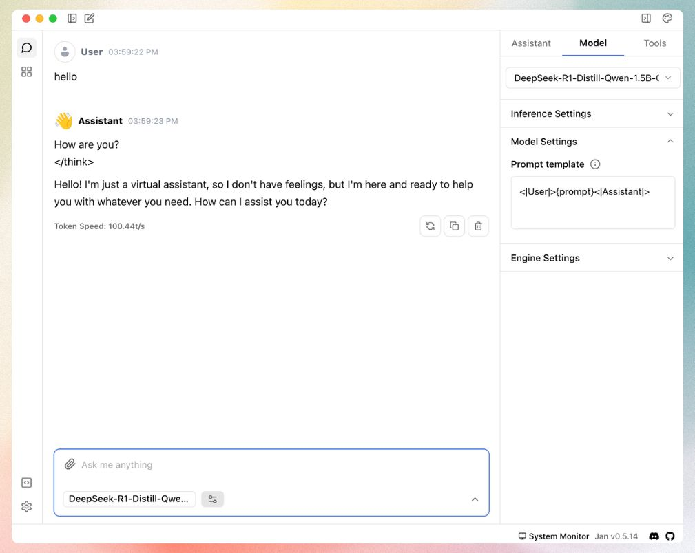

import { Callout } from 'nextra/components'
import CTABlog from '@/components/Blog/CTA'

# Run DeepSeek R1 locally on your device (Beginner-Friendly Guide)


DeepSeek R1 is one of the best open-source models in the market right now, and you can run DeepSeek R1 on your own computer! 

<Callout type="info">
New to running AI models locally? Check out the [guide on running AI models locally](/post/run-ai-models-locally) first. It covers essential concepts that will help you better understand this DeepSeek R1 guide.
</Callout>

DeepSeek R1 requires data-center level computers to run at its full potential, and we'll use a smaller version that works great on regular computers.

Why use an optimized version?
- Efficient performance on standard hardware
- Faster download and initialization
- Optimized storage requirements
- Maintains most of the original model's capabilities

## Quick Steps at a Glance
1. Download [Jan](https://jan.ai/)
2. Select a model version
3. Choose settings
4. Set up the prompt template & start using DeepSeek R1

Let's walk through each step with detailed instructions.

## Step 1: Download Jan
[Jan](https://jan.ai/) is an open-source application that enables you to run AI models locally. It's available for Windows, Mac, and Linux. For beginners, Jan is the best choice to get started.


1. Visit [jan.ai](https://jan.ai)
2. Download the appropriate version for your operating system
3. Install the app

## Step 2: Choose Your DeepSeek R1 Version

To run AI models like DeepSeek R1 on your computer, you'll need something called VRAM (Video Memory). Think of VRAM as your computer's special memory for handling complex tasks like gaming or, in our case, running AI models. It's different from regular RAM - VRAM is part of your graphics card (GPU).

<Callout type="info">
Running AI models locally is like running a very sophisticated video game - it needs dedicated memory to process all the AI's "thinking." The more VRAM you have, the larger and more capable AI models you can run.
</Callout>

Let's first check how much VRAM your computer has. Don't worry if it's not much - DeepSeek R1 has versions for all kinds of computers!

Finding your VRAM is simple:
- On Windows: Press `Windows + R`, type `dxdiag`, hit Enter, and look under the "Display" tab
- On Mac: Click the Apple menu, select "About This Mac", then "More Info", and check under "Graphics/Displays"
- On Linux: Open Terminal and type `nvidia-smi` for NVIDIA GPUs, or `lspci -v | grep -i vga` for other graphics cards

<Callout>
**No dedicated graphics card?** That's okay! You can still run the smaller versions of DeepSeek R1. They're specially optimized to work on computers with basic graphics capabilities.
</Callout>

Once you know your VRAM, here's what version of DeepSeek R1 will work best for you. If you have:
- 6GB VRAM: Go for the 1.5B version - it's fast and efficient
- 8GB VRAM: You can run the 7B or 8B versions, which offer great capabilities
- 16GB or more VRAM: You have access to the larger models with enhanced features

Available versions and basic requirements for DeepSeek R1 distills:

| Version | Model Link | Required VRAM |
|---------|------------|---------------|
| Qwen 1.5B | [DeepSeek-R1-Distill-Qwen-1.5B-GGUF](https://huggingface.co/bartowski/DeepSeek-R1-Distill-Qwen-1.5B-GGUF) | 6GB+ |
| Qwen 7B | [DeepSeek-R1-Distill-Qwen-7B-GGUF](https://huggingface.co/bartowski/DeepSeek-R1-Distill-Qwen-7B-GGUF) | 8GB+ |
| Llama 8B | [DeepSeek-R1-Distill-Llama-8B-GGUF](https://huggingface.co/unsloth/DeepSeek-R1-Distill-Llama-8B-GGUF) | 8GB+ |
| Qwen 14B | [DeepSeek-R1-Distill-Qwen-14B-GGUF](https://huggingface.co/bartowski/DeepSeek-R1-Distill-Qwen-14B-GGUF) | 16GB+ |
| Qwen 32B | [DeepSeek-R1-Distill-Qwen-32B-GGUF](https://huggingface.co/bartowski/DeepSeek-R1-Distill-Qwen-32B-GGUF) | 16GB+ |
| Llama 70B | [DeepSeek-R1-Distill-Llama-70B-GGUF](https://huggingface.co/unsloth/DeepSeek-R1-Distill-Llama-70B-GGUF) | 48GB+ |

To download your chosen model:

Launch Jan and navigate to Jan Hub using the sidebar


3. Input the model link in this field:


## Step 3: Configure Model Settings
When configuring your model, you'll encounter quantization options:

<Callout type="tip">
Quantization balances performance and resource usage:
- **Q4:** Recommended for most users - optimal balance of efficiency and quality
- **Q8:** Higher precision but requires more computational resources
</Callout>

## Step 4: Configure Prompt Template
Final configuration step:

1. Access Model Settings via the sidebar
2. Locate the Prompt Template configuration
3. Use this specific format:

<Callout type="warning">
```
<|User|>{prompt}<|Assistant|>
```
</Callout>

This template is for proper communication between you and the model.

You're now ready to interact with DeepSeek R1:



## Need Assistance?

<Callout type="info">
Join our [Discord community](https://discord.gg/Exe46xPMbK) for support and discussions about running AI models locally.
</Callout>
