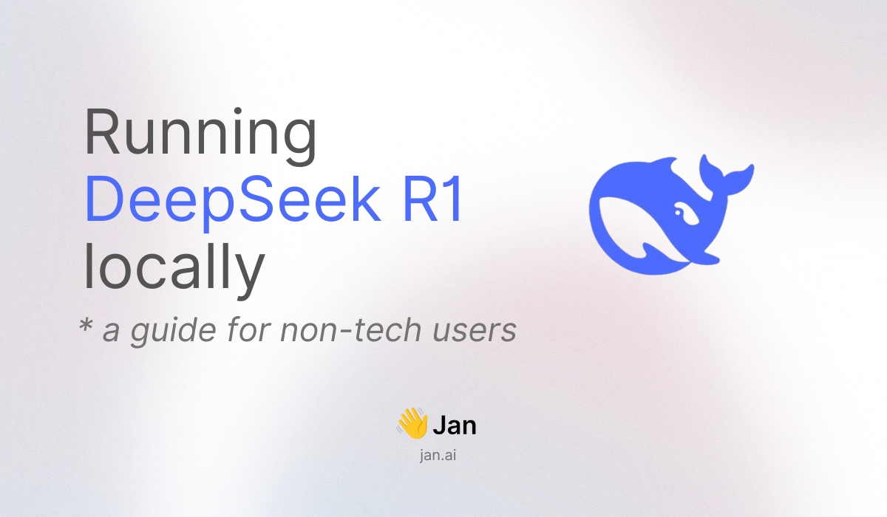

import { Callout } from 'nextra/components'
import CTABlog from '@/components/Blog/CTA'

# Beginner's Guide: Run DeepSeek R1 Locally 



DeepSeek R1 brings state-of-the-art AI capabilities to your local machine. With optimized versions available for different hardware configurations, you can run this powerful model directly on your laptop or desktop computer. This guide will show you how to run open-source AI models like DeepSeek, Llama, or Mistral locally on your computer, regardless of your background.

Why use an optimized version?
- Efficient performance on standard hardware
- Faster download and initialization
- Optimized storage requirements
- Maintains most of the original model's capabilities

## Quick Steps at a Glance
1. Download [Jan](https://jan.ai/)
2. Select a model version suited to your hardware
3. Configure optimal settings
4. Set up the prompt template & begin interacting

Let's walk through each step with detailed instructions.

## Step 1: Download Jan
[Jan](https://jan.ai/) is an open-source application that enables you to run AI models locally. It's available for Windows, Mac, and Linux, with a streamlined setup process.


1. Visit [jan.ai](https://jan.ai)
2. Download the appropriate version for your operating system
3. Follow the standard installation process

## Step 2: Choose Your DeepSeek R1 Version
DeepSeek R1 is available in different architectures and sizes. Here's how to select the right version for your system.

<Callout type="info">
To check your system's VRAM:
- Windows: Press Windows + R, type "dxdiag", press Enter, click "Display" tab
- Mac: Apple menu > About This Mac > More Info > Graphics/Displays
- Linux: Open Terminal, run `nvidia-smi` (NVIDIA GPUs) or `lspci -v | grep -i vga`
</Callout>

Understanding the versions:
- **Qwen architecture:** Optimized for efficiency while maintaining high performance
- **Llama architecture:** Known for robust performance and reliability
- **Original vs Distilled:** Distilled versions are optimized models that preserve core capabilities while reducing resource requirements

| Version | Model Link | Required VRAM |
|---------|------------|---------------|
| Qwen 1.5B | [DeepSeek-R1-Distill-Qwen-1.5B-GGUF](https://huggingface.co/bartowski/DeepSeek-R1-Distill-Qwen-1.5B-GGUF) | 6GB+ |
| Qwen 7B | [DeepSeek-R1-Distill-Qwen-7B-GGUF](https://huggingface.co/bartowski/DeepSeek-R1-Distill-Qwen-7B-GGUF) | 8GB+ |
| Llama 8B | [DeepSeek-R1-Distill-Llama-8B-GGUF](https://huggingface.co/unsloth/DeepSeek-R1-Distill-Llama-8B-GGUF) | 8GB+ |
| Qwen 14B | [DeepSeek-R1-Distill-Qwen-14B-GGUF](https://huggingface.co/bartowski/DeepSeek-R1-Distill-Qwen-14B-GGUF) | 16GB+ |
| Qwen 32B | [DeepSeek-R1-Distill-Qwen-32B-GGUF](https://huggingface.co/bartowski/DeepSeek-R1-Distill-Qwen-32B-GGUF) | 16GB+ |
| Llama 70B | [DeepSeek-R1-Distill-Llama-70B-GGUF](https://huggingface.co/unsloth/DeepSeek-R1-Distill-Llama-70B-GGUF) | 48GB+ |

<Callout type="info">
Recommendations based on your hardware:
- 6GB VRAM: The 1.5B version offers efficient performance
- 8GB VRAM: 7B or 8B versions provide a balanced experience
- 16GB+ VRAM: Access to larger models for enhanced capabilities
</Callout>

To download your chosen model:
1. Launch Jan and navigate to Jan Hub using the sidebar
2. Locate the "Add Model" section:


3. Input the model link in the designated field:


## Step 3: Configure Model Settings
When configuring your model, you'll encounter quantization options:

<Callout type="tip">
Quantization balances performance and resource usage:
- **Q4:** Recommended for most users - optimal balance of efficiency and quality
- **Q8:** Higher precision but requires more computational resources
</Callout>

## Step 4: Configure Prompt Template
Final configuration step:

1. Access Model Settings via the sidebar
2. Locate the Prompt Template configuration
3. Use this specific format:

<Callout type="warning">
```
<|User|>{prompt}<|Assistant|>
```
</Callout>

This template ensures proper communication between you and the model.

You're now ready to interact with DeepSeek R1:


## Need Assistance?

<Callout type="info">
Join our [Discord community](https://discord.gg/Exe46xPMbK) for support and discussions about running AI models locally.
</Callout>
