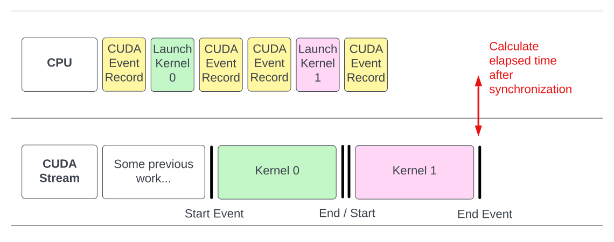
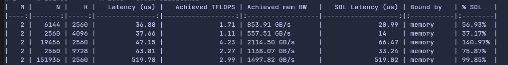
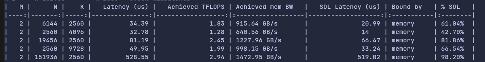
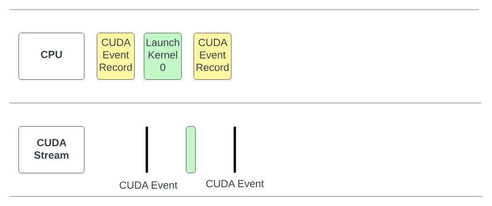
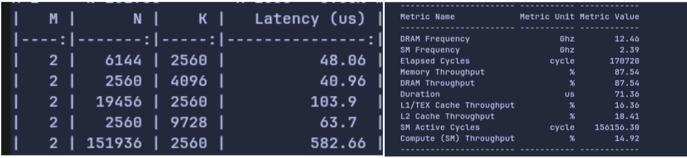
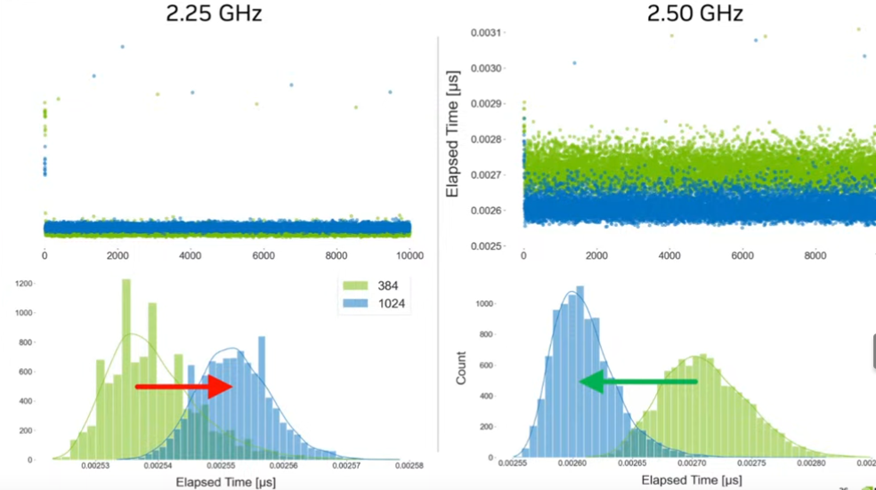
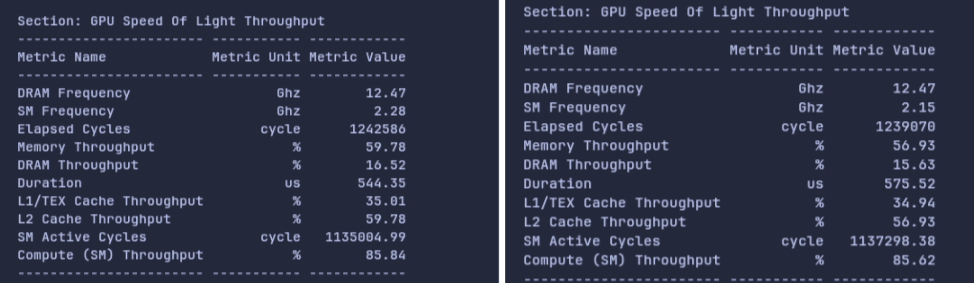
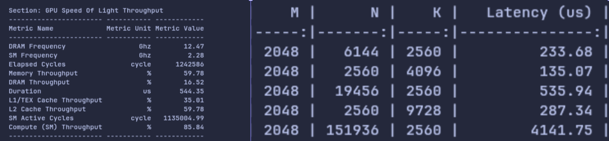

# How we (try to) benchmark GPU kernels accurately
 
If you've read any other kernel benchmarking article before, then a lot of the information in this blogpost might be second-hand nature to you already. In fact, we would like to start off by thanking the blood, sweat and tears poured into many other kernel benchmarking guides made before us, which helped guide us in writing better benchmarking code, as well as in the creation of this blogpost.

Over here at Menlo, we recently acquired some [RTX PRO 6000 Blackwell Workstation Edition](https://www.nvidia.com/en-sg/products/workstations/professional-desktop-gpus/rtx-pro-6000/), and we are trying to make LLM inference engines like [vLLM](https://github.com/vllm-project/vllm) run faster on it. We've been writing our own kernels specifically for the RTX PRO 6000, and seeing if we can improve inference times on our hardware.

This blog will detail more of our own processes of how our ML Efficiency team identified problems in our benchmarking code, and how we iterated on it following the various cool benchmarking guides out there! Without further ado, let's start benchmarking from simple programs, to GPU kernels.


## Introduction to kernels and benchmarking

For those new to GPU programming, a [kernel](https://modal.com/gpu-glossary/device-software/kernel) is a piece of CUDA code that programmers write to execute a desired sequence of operations on the GPU. These kernels are launched once and is executed by threads that run concurrently, and we tend to launch these kernels from a [thread block grid](https://modal.com/gpu-glossary/device-software/thread-block-grid), which executes our kernel across multiple [Streaming Multiprocessors (SMs)](https://modal.com/gpu-glossary/device-hardware/streaming-multiprocessor) across the whole GPU.

Benchmarking is a fundamental aspect of high-performance computing. It enables us to quantitatively compare kernel performance across different problem sizes and understand how various hyperparameters impact execution speed. For GPU kernel development, benchmarking serves to assist us in iteratively optimizing our kernels to make them utilize the GPU better. 

That being said, **accurate kernel benchmarking** is much more important, as benchmarking kernels that run on the GPU can become very complex, and there are many traps one might fall into if not enough care is taken when writing benchmarking scripts. A great alternative is to use tools that NVIDIA offers via their [CUDA Toolkit](https://developer.nvidia.com/cuda-toolkit), such as [Nsight CUDA Profiling Tools Interface](https://developer.nvidia.com/cupti) (cupti) or use the [Nsight Compute CLI](https://docs.nvidia.com/nsight-compute/NsightComputeCli/index.html) (`ncu`), which provide accurate measurements to benchmarking various characteristics of kernels. For us, we wanted to use Python as it made it more convenient to sweep across different problem shapes and kernels quickly, but that meant we also had to learn how to properly benchmark kernels from scratch.

We will showcase some examples of how we can benchmark kernels on the GPU. Moreover, we have chosen Python for most of our benchmarking code, as most of our own codebase is in Python, making it simple to integrate in.

## Benchmarking CUDA programs
Pytorch provides a very basic API to help time `torch` programs, by following along this [tutorial](https://docs.pytorch.org/tutorials/recipes/recipes/benchmark.html).

We can see a basic implementation could be something as simple as:

```python
def batched_dot_mul_sum(a, b):
    '''Computes batched dot by multiplying and summing'''
    return a.mul(b).sum(-1)

num_threads = torch.get_num_threads()
print(f'Benchmarking on {num_threads} threads')

t0 = benchmark.Timer(
    stmt='batched_dot_mul_sum(x, x)',
    setup='from __main__ import batched_dot_mul_sum',
    globals={'x': x},
    num_threads=num_threads,
    label='Multithreaded batch dot',
    sub_label='Implemented using mul and sum')
```

When benchmarking kernels, there are a few tips that we should do, in order to ensure that we accurately benchmark our kernels.

### 1.  Always benchmark the code not with settings from your machine, but with **settings the user will see**.
  Benchmarking how fast your kernels take on a 3090 is meaningless if you are serving your models on a H100 DGX node. It is always a good idea to benchmark your kernels on the hardware you plan to serve on.

### 2. **Warmup your kernels** 
Take a look at this snippet from the tutorial.
  ```
   mul_sum(x, x):   27.6 μs
   mul_sum(x, x):   25.3 μs
   bmm(x, x):      2775.5 μs
   bmm(x, x):       22.4 μs
  ```
  The first kernel for `bmm` takes way longer to run. This is because most of the time is spent loading [cuBLAS](https://developer.nvidia.com/cublas) kernels when running for the first time. 

  Warming up your kernels can be as simple as running the kernel before timing it. This helps to preliminarily load these kernels so that we only measure how long it takes for the kernel to run.

### 3. `torch.cuda.synchronize` and CUDA Events

Now we'll also introduce a new API, which is the standard to benchmarking kernels. [CUDA events](https://docs.pytorch.org/docs/stable/generated/torch.cuda.Event.html) are awesome for a variety of reasons. The simplest reason is that it measures timing from the perspective from the GPU, whereas `time.time()` and `time.perf_counter()` measure time from the perspective of the CPU.

Moreover, its simplistic API allows you to call benchmarking code like this:

```python
steps = 10
start_events = [torch.cuda.Event(enable_timing=True) for _ in range(steps)]
end_events = [torch.cuda.Event(enable_timing=True) for _ in range(steps)]

for i in range(steps):
    start_events[i].record()
    run_kernel()
    end_events[i].record()

torch.cuda.synchronize()
times = [s.elapsed_time(e) for s, e in zip(start_events, end_events)]
```

The `torch.cuda.synchronize` tells the CPU to wait for the work on the GPU to finish, so that it can calculate the elapsed time after synchronization, which can be visualised here:


_Figure 1: Illustration taken from https://www.speechmatics.com/company/articles-and-news/timing-operations-in-pytorch_


### 4. Flush your L2 Cache

#### What is the L2 Cache
When data is read or written from [HBM or GDDR](https://www.exxactcorp.com/blog/hpc/gddr6-vs-hbm-gpu-memory), it goes through the [L2 cache](https://docs.nvidia.com/cuda/cuda-c-programming-guide/#architecture) first, which is shared by all [streaming multiprocessors (SM)](https://modal.com/gpu-glossary/device-hardware/streaming-multiprocessor). This L2 cache caches data accesses to local and global memory, and helps reuse data instead of loading it to shared memory again (which can be slow!).

Moreover, unlike the L1 cache, which is present on each SM, all SMs share the same L2 cache!


#### Why we need to flush the L2 Cache

Following this [guide](https://guillesanbri.com/CUDA-Benchmarks/#caches), if you had warmed up or run the kernel before, some of the intermediate data might be stored on the L2 cache, which means the kernel might be deceptively faster. 

However, in a real world setting, you want to measure the time it takes realistically for the kernel to run, and more often than not, when running large models, you will be running more than 1 kernel. This means your cache will probably thrash often, and not have data from a specific kernel stored for reuse. Thus, to simulate this behaviour, we would flush the L2 cache beforehand to eliminate "help" from the L2 cache.

Moreover, this also makes it much easier when calculating data reuse for the kernel, as now any L2 cache usage is independent of other kernels or runs.

#### Example of not flushing L2 cache
Previously when we were initially benchmarking our kernels, we had a small mistake of not flushing the L2 cache.


_Figure 2: Our SOL %  (which is a percentage of our observed maximum speed) is over 100% for the row for shape [2, 19456, 2560]._

#### How to flush the L2 Cache

To flush it, we should add the following lines:

```python
l2_size = torch.cuda.get_device_properties().L2_cache_size
cache = torch.empty(l2_size, dtype=torch.uint8, device="cuda")
#<your benchmarking code here>
cache.zero_()  # flush L2 cache

# You should flush your L2 cache within the benchmarking code if you're repeating the same process multiple times
```

This instantiates data the size of the L2 cache, and by zeroing it in place, we call a write operation which goes through the L2 cache and flushes it.

After flushing the L2 cache, we get a more sensible result here:


_Figure 3: New SOL% has all values under 100% now after flushing L2 cache._

### 5. Timing short-lived kernels

Initially, we used [Triton's](https://triton-lang.org/main/getting-started/installation.html) [`do_bench`](https://triton-lang.org/main/python-api/generated/triton.testing.do_bench.html) for benchmarking, as it has done everything we have mentioned above, such as warmup, CUDA Events and flushing L2 cache. However, we observed an issue with accurately benchmarking our kernels on smaller shapes. On smaller shapes, the kernel might be too fast, so it may finish before CPU issues a CUDA end event in Python.


_Figure 4: Taken from [Speechmatics](https://www.speechmatics.com/company/articles-and-news/timing-operations-in-pytorch), kernel is faster than CUDA event end launch, and therefore the true timing for the kernel is not recorded._

This results in kernels that look very slow:


_Figure 5: Side by side comparison of Python benchmark latencies vs `ncu`'s timing (right) for shape [2, 19456,2560]. `ncu` records a much faster duration of 71.36 μs compared to Python's 103.9 μs_

To fix this, we wrote a custom `do_bench_cuda()`, that inserts a dummy, untimed FP32 matmul before benchmarking each shape, so that the CPU has enough time to enqueue the CUDA end event.

This led to more accurate latencies for our small M kernels.


_Figure 6: There is a significant improvement in SOL% after inserting the dummy matmul._

We then also repeat the benchmark function for each shape on 5 copies of input/output data to make the CUDA event duration longer.

In the end, this is our `do_bench_cuda` function that we used to benchmark our kernels.

```python
import statistics

import torch

def do_bench_cuda(f, n_warmup: int = 10, n_repeats: int = 20):
    l2_size = torch.cuda.get_device_properties().L2_cache_size
    cache = torch.empty(l2_size, dtype=torch.uint8, device="cuda")

    # Matmul in case of short lived CUDA Events
    A = torch.randn(4096, 4096, dtype=torch.float32, device="cuda")
    B = torch.randn(4096, 4096, dtype=torch.float32, device="cuda")
    A @ B

    # L2 cache flush + Warmup
    for _ in range(n_warmup):
        cache.zero_()
        f()

    start_list = [torch.cuda.Event(enable_timing=True) for _ in range(n_repeats)]
    end_list = [torch.cuda.Event(enable_timing=True) for _ in range(n_repeats)]

    torch.cuda.synchronize()

    for start, end in zip(start_list, end_list):
        cache.zero_()  # flush L2 cache
        A @ B  # add a heavy task to fill GPU pipeline

        start.record()
        f()
        end.record()

    torch.cuda.synchronize()
    timings = [start.elapsed_time(end) for start, end in zip(start_list, end_list)]
    return statistics.median(timings)
```


### 6. Clock Speed

This was a silent problem, and it was very hard to find out that this was causing issues on our kernels. We initially found discrepancies between `ncu`'s latency (676.64 μs) and `do_bench_cuda` latency (535 μs) when profiling on the shape [2048, 19456, 2560], as `do_bench` was reporting ~140 μs faster timings than `ncu`'s latency.

As seen, although most of our codebase for benchmarking kernels in Python, developer errors might occur, and it is always good to have a point of reference for the accurate kernel timing. Nsight Compute CLI (`ncu` for short) is a tool that can help us measure the latency of our kernels accurately, and the values obtained from here is a good figure to sanity-check our own benchmarking code. 

#### 6.1 Clock Speed

Firstly, we suspected that clock speed could play a part in causing the discrepancy between `ncu`'s timings and our own benchmarking code. Clock speed can affect benchmarking times as it is the rate at which the GPU's processing units operate, and a higher clock speed translates to more operations per second, which can both speed up and slow down the kernel depending on how it was implemented.


_Figure 7: Taken from [GPU Mode Lecture 56](https://www.youtube.com/watch?v=CtrqBmYtSEk). We can see clock speed affects kernel performance. For problem shape of 1024, it got faster after increasing clock speed, while for problem shape of 384, it became slower after clock speed increased._

Looking at this [forum post](https://forums.developer.nvidia.com/t/nsight-compute-clock-speed-during-profiling/208646/3), we realised that one of the issues causing the discrepancy was because `ncu` by default locks the clock speed to the GPU base clock speed. We tried investigating by locking the clock speed to base clock speed, and also tried locking to max clock speed using `nvidia-smi -ac=<memClk>,<smClk>`. According to the GPU Mode lecture, this was not a proper solution.

This is due to the following reasons:
- Locking to max clock speed doesn't help as it just sets the ceiling of the GPU performance, our GPU can always go back to base clock speed of ~ 2287 Hz instead of boosted clock speed of 2617 Hz.

- Locking to base clock speed is also not meaningful, as it does not properly reflect the performance and experience users will get on our kernels, which at best will run on boosted clock speed.

However, we did find out that we should set the `ncu` `--clock-control` to `None`, so that it would not limit itself to just the base clock speeds. This helped improve the latency on `ncu` from 676.64 μs to 575 μs when profiled on the same problem shape  of [2048, 19456, 2560].

#### 6.2 Discrepancies after `clock-control`

At the time of writing, we have observed that `ncu` sometimes gives different latency results on the same benchmarking code with the same problem shapes. The cause of this is because when we set `clock-control` speed to `None`, the GPU clock speed is stochastic, and therefore affect the latency of the kernels measured. A more holistic approach would be to also benchmark kernels across different fixed clock speeds. 

_Figure 8: On the same benchmarking code and problem shapes, we can see vast deviations in duration, which is caused by the differences in SM Frequency. This resonates with the graphs shown in Figure 7._

As a result, there can be some discrepancy in `ncu`'s and our own benchmark timings. To figure out if your discrepancy is caused by the SM frequency, you can use the relationship
that FLOPS is directly proportional to SM clock, so their durations are inversely proportional.

In our case:
`544 / 2.14 (SM freq for 575 μs kernel) * 2.28 (SM freq for 544 μs kernel) = ~579`, so most of the discrepancy was coming from the SM frequency being different. 

The final command we used was:

`ncu -s 5 -k $kernel_name --clock-control none python3 benchmarks/bench_mm.py --profile 2048 19456 2560`

Explanation of arguments:
`-s`: Number of kernels skipped 
`-k`: name of kernel to profile
`--clock-control`: Whether clock speed is controlled 

Below is a side to side comparison of `ncu`'s benchmarked latency and our script after all the adjustments made.


_Figure 9: Side by side comparison of the above `ncu` command (left) (measuring shape [2048,19456,2560]) with our own Python benchmarking script (right). We can see at most 10us difference between `Duration` in `ncu` and our benchmarking script's `Latency (us)` measurement._

## Conclusion and TLDR;

TLDR, when benchmarking
1. Make sure to use the hardware you intend to deploy on
2. Warmup before benchmarking your kernels
3. Use CUDA events
4. Flush your L2 Cache
5. Use a dummy matmul to make timings more accurate for short lived kernels
6. Ensure your clock speed doesn't cause inconsistent readings

We hope that this helps anyone who are interested in benchmarking their own kernels, or are interested in how GPU kernels are benchmarked. Happy benchmarking!

### Acknowledgements and Related Resources:

We would like to give thanks and credit to the many resources and guides that we used in our own journey of finding out how to best benchmark our kernels on our GPUs, and a lot of our work would probably not be possible if it was not for these amazing guides.

- GPU Mode Lecture 56, presented by Georgii Evtushenko : https://www.youtube.com/watch?v=CtrqBmYtSEk
- https://www.spatters.ca/mma-matmul (Benchmarking using ncu for matrix multiplications)
- https://www.speechmatics.com/company/articles-and-news/timing-operations-in-pytorch (CUDA Events)
- https://guillesanbri.com/CUDA-Benchmarks/ (Good resource for introduction to benchmarking)
- https://modal.com/gpu-glossary/device-hardware/cuda-device-architecture (Glossary of Architecture in general)
- https://docs.nvidia.com/cuda/cuda-c-programming-guide/#global-memory-5-x (L2 cache explanation)
- https://cvw.cac.cornell.edu/gpu-architecture/gpu-memory/memory_types (L1 vs L2 cache)