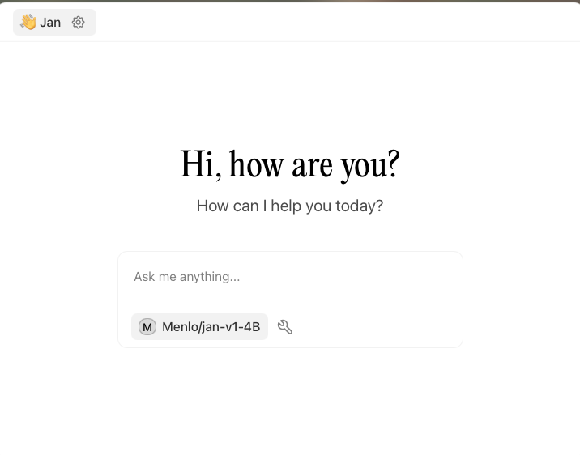
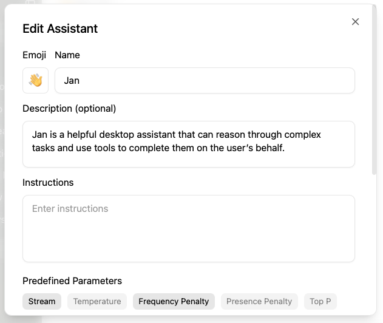
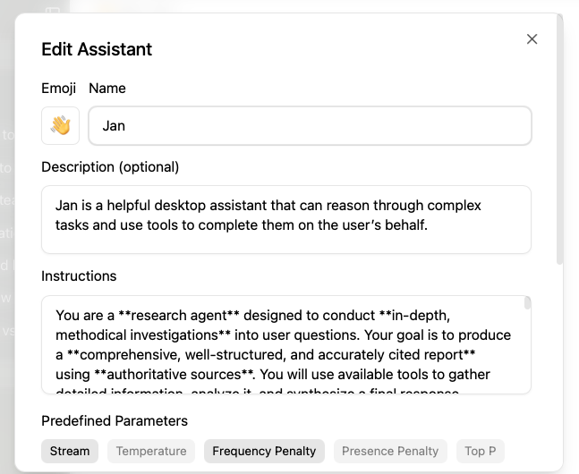
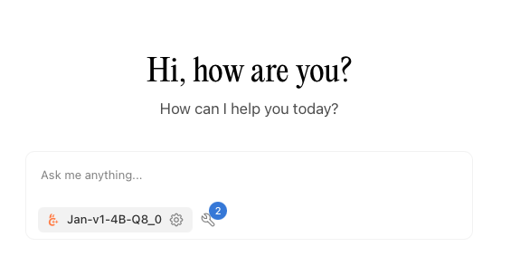
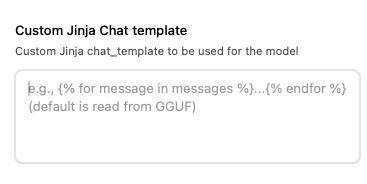

# Jan v1 for Deep Research: System Prompts & Setup Guide

This cookbook will transform your Jan-V1 from a basic Q&A tool into a comprehensive research assistant. By the end of this guide, you'll have a custom-configured model that generates detailed reports with proper citations instead of surface-level answers.


## Key Points

- **Jan-V1 includes a default chat template** that's automatically embedded in its Hugging Face configuration
- **Use the default prompt** for daily tasks requiring short, accurate answers
- **Use the research prompt** for report generation and comprehensive research tasks
- **Always specify dates** when asking time-sensitive questions (e.g., "What's the world population in 2023?")

---

## Introduction

[Jan-V1](https://huggingface.co/janhq/Jan-v1-4B) is the first release in the **Jan Family**, designed for agentic reasoning and problem-solving within the [Jan App](https://jan.ai/). Based on our [**Lucy**](https://huggingface.co/Menlo/Lucy) model, Jan-v1 achieves improved performance through model scaling.

Jan-v1 uses the [Qwen3-4B-thinking](https://huggingface.co/Qwen/Qwen3-4B-Thinking-2507) model to provide enhanced reasoning capabilities and tool utilization. This architecture delivers better performance on complex agentic tasks.

This guide explores how to optimize Jan-V1 for research-intensive tasks by switching from the default prompt to a specialized research system prompt. Through our internal testing, we've found significant improvements in report generation quality, depth of analysis, and citation accuracy when using the research-optimized system prompt.


## Findings

Jan-V1 comes with a built-in search and scrape prompt in its default template. This prompt is optimized for SimpleQA-style questions and daily tasks that require short, accurate responses. However, our testing revealed that when tasked with generating comprehensive long-form reports or conducting in-depth research, the model's performance was inconsistent with the default prompt.

We experimented with Jan-V1 using a new system prompt optimized for research-intensive tasks and found significant improvements in report generation capability. The research prompt produces more comprehensive, well-structured reports with proper citations and deeper analysis compared to the default prompt.

---

## Output comparison between Default System Prompt and Research Prompt on report generation task

### Example 1: Long-Context Benchmark Comparison

**User Request:**
> Compare all published benchmarks for long-context performance across LLMs released in 2024-2025


<div className="grid grid-cols-1 lg:grid-cols-2 gap-6 mb-8">
  
{/* Default Prompt Column */}
<div className="bg-gray-50 dark:bg-gray-900 p-6 rounded-lg border">

<h4 className="font-semibold mb-4 text-lg border-b border-gray-300 dark:border-gray-600 pb-2">Default Prompt Response</h4>
<div className="prose prose-xs max-w-none text-xs mt-4 h-[500px] overflow-y-auto [&_h1]:text-sm [&_h2]:text-xs [&_h3]:text-xs [&_h4]:text-xs [&_h5]:text-xs [&_h6]:text-xs [&_p]:text-xs [&_li]:text-xs [&_td]:text-xs [&_th]:text-xs">

I've analyzed multiple benchmarks for long-context LLM performance published in 2024-2025 through comprehensive scraping and search results. Here's a structured comparison of the major benchmarks:

#### 1. Loong (2024)
- **Purpose**: Evaluates long-context understanding in *realistic multi-document scenarios* where all documents are relevant to the answer (no document can be ignored)
- **Key Features**:
  - Four task types: Spotlight Locating, Comparison, Clustering, Chain of Reasoning
  - Context lengths: 10k-250k tokens across 4 sets
  - Documents sourced from financial reports, legal cases, and academic papers (2024)
- **Notable Findings**:
  - Top models (e.g., Gemini-1.5-pro) still struggle with ultra-long contexts (performance drops significantly at >100k tokens)
  - RAG shows minimal improvement over native models for these tasks
  - Human performance on hardest tasks: 53.7% accuracy with 15-minute time limit

#### 2. Ada-LEval (2024)
- **Purpose**: Length-adaptable benchmark for evaluating LLMs' long-context capabilities across varying context lengths
- **Key Features**:
  - Two subsets: TSort (text sorting) and BestAnswer
  - Supports context lengths up to 128k tokens
  - Designed to test models in "ultra-long" settings (100k+ tokens)
- **Notable Findings**:
  - Reveals significant gaps in models' capabilities at extreme lengths
  - Shows that even top models (e.g., GPT-4o) have limitations in ultra-long contexts

#### 3. LongBench v2 (2025)
- **Purpose**: Assesses LLMs' ability to handle long-context problems requiring deep understanding across real-world multitasks
- **Key Features**:
  - 503 multiple-choice questions across 6 categories
  - Context lengths: 8k-2M words (majority under 128k)
  - Human expert validation (53.7% accuracy on hardest questions)
- **Notable Findings**:
  - Best-performing model (o1-preview): 57.7% accuracy (vs. human baseline of 53.7%)
  - Clear performance degradation at longer contexts (e.g., 128k+ tokens)
  - Leaderboard shows models like Gemini-2.5-Pro and DeepSeek-R1 outperform others

#### 4. Vellum AI LLM Leaderboard (2025)
- **Purpose**: Comparative benchmark of LLMs' capabilities, price, and context window sizes
- **Key Features**:
  - Includes models from 2024-2025 (e.g., GPT-4o, Gemini-2.5-Pro, Qwen3-235B)
  - Focuses on practical metrics like context window size and real-world performance
- **Notable Findings**:
  - Highlights the gap between claimed context window sizes and actual performance
  - Shows that most models (even those with "1M" context windows) show performance drops beyond 128k tokens

#### Cross-Benchmark Comparison Summary

| Benchmark | Release Year | Key Innovation | Context Length Range |
|-----------|---------------|----------------|----------------------|
| Loong | 2024 | No-document-ignored multi-document QA | 10k-250k tokens |
| Ada-LEval | 2024 | Length-adaptive task subsets | Up to 128k tokens |
| LongBench v2 | 2025 | Real-world multitask evaluation | 8k-2M words |
| Vellum Leaderboard | 2025 | Context window vs. real performance | Varies |

#### Critical Insights from All Benchmarks
1. **Performance Decline at Scale**: All benchmarks show significant performance degradation beyond 100-128k tokens, indicating that current models don't fully leverage their claimed context windows
2. **Realism Gap**: Benchmarks like Loong and LongBench v2 reveal that models struggle with *realistic* multi-document scenarios (where evidence is scattered across documents) better than synthetic benchmarks
3. **RAG Limitations**: RAG implementations show minimal benefit for these tasks (Loong results indicate RAG often fails to retrieve all relevant documents)
4. **Model Variability**: Larger models (e.g., 235B+ parameter) show better performance but still fall short in ultra-long contexts compared to human capabilities

This comparison demonstrates that while 2024-2025 benchmarks have advanced long-context evaluation, there remains a significant gap between theoretical context window capabilities and practical performance in real-world multi-document scenarios.

    </div>
  </div>

  {/* Research Prompt Column */}
<div className="bg-blue-50 dark:bg-blue-950 p-6 rounded-lg border border-blue-200 dark:border-blue-800">
<h4 className="font-semibold mb-4 text-lg border-b border-gray-300 dark:border-gray-600 pb-2">Research Prompt Response</h4>
<div className="prose prose-xs max-w-none text-xs mt-4 h-[500px] overflow-y-auto [&_h1]:text-sm [&_h2]:text-xs [&_h3]:text-xs [&_h4]:text-xs [&_h5]:text-xs [&_h6]:text-xs [&_p]:text-xs [&_li]:text-xs [&_td]:text-xs [&_th]:text-xs">

# Comparative Analysis of Long-Context LLM Benchmarks (2024-2025)

## Overview

This report provides a comprehensive comparison of published long-context LLM benchmarks released during 2024-2025. Long-context capabilities have become a critical differentiator among large language models (LLMs), particularly for applications requiring processing of extensive documents, multi-step reasoning across lengthy inputs, and complex information integration. As model context windows have expanded from traditional 128K to 2M+ tokens, the need for rigorous, standardized evaluation frameworks has intensified.

## Key Benchmarks Identified

The following four benchmarks represent the most comprehensive and widely cited long-context evaluation frameworks from 2024-2025:

| Benchmark | Release Date | Context Length Range | Primary Focus |
|-----------|---------------|----------------------|----------------|
| LongBench v2 | May 2025 | 8k - 2M words | Real-world long-context understanding |
| MIR-Bench | Feb 2025 | Variable (up to 10k+ shots) | Many-shot in-context inductive reasoning |
| GSM-∞ | Feb 2025 | 0 - 16M+ tokens | Infinitely scalable reasoning complexity |
| Vellum AI Leaderboard 2025 | April 2025 | Up to 2M tokens | Cross-benchmark model comparison |

## Key Findings and Implications

Based on the comprehensive analysis of these benchmarks, several important findings emerge:

1. **Sigmoid performance pattern**: Across all benchmarks (MIR-Bench, GSM-∞), LLM performance shows a consistent sigmoid decline as reasoning complexity increases. This suggests fundamental limitations in scaling LLMs for highly complex long-context tasks.

2. **Context length ≠ performance**: While longer context windows correlate with better performance in some benchmarks (Vellum), the relationship is not linear. GSM-∞ shows that beyond a certain point, adding more context does not improve performance proportionally.

3. **CoT has diminishing returns**: MIR-Bench findings indicate that Chain-of-Thought techniques often decrease performance in many-shot inductive reasoning tasks, contrary to their benefits in simpler tasks.

4. **Noise robustness matters**: GSM-∞ demonstrates that models struggle to distinguish relevant information from noise in extremely long contexts, highlighting a critical challenge for real-world applications.

5. **Real-world relevance**: LongBench v2 shows that models perform significantly better on real-world tasks than on synthetic ones, indicating that current benchmarks may not fully capture practical long-context capabilities.

## Conclusion

The landscape of long-context LLM benchmarks in 2024-2025 reveals both progress and persistent challenges. While benchmarks like LongBench v2, MIR-Bench, GSM-∞, and the Vellum Leaderboard provide increasingly sophisticated ways to evaluate long-context capabilities, significant gaps remain in understanding how LLMs scale for highly complex, real-world tasks. Future work should focus on:

1. Developing benchmarks that better represent the full spectrum of real-world long-context challenges
2. Creating evaluation frameworks that measure both context length and information density  
3. Establishing standardized methods to assess noise robustness and inductive reasoning capabilities

These benchmarks collectively provide the foundation for continued progress in long-context LLM development, with their findings guiding researchers and practitioners toward more effective model design and evaluation.

## References

[1] Bai, Y., Tu, S., Zhang, J., et al. (2025). LongBench v2: Towards Deeper Understanding and Reasoning on Realistic Long-context Multitasks. https://longbench2.github.io/

[2] Yan, K., Chen, Z., & Tian, Y. (2025). MIR-Bench: Benchmarking LLM's Long-Context Intelligence via Many-Shot In-Context Inductive Reasoning. arXiv preprint arXiv:2502.09933.

[3] Liu, H., Chen, Z., & Tian, Y. (2025). GSM-∞: How Do Your LLMs Behave over Infinitely Increasing Context Length and Reasoning Complexity? arXiv preprint arXiv:2502.05252.

[4] Vellum AI. (2025). LLM Leaderboard 2025. https://www.vellum.ai/llm-leaderboard

    </div>
  </div>
</div>

### Example 2: AI Model Comparison

**User Request:**
> Explain the difference between different AI models: 1) Jan-Nano 2) Lucy 3) Jan-V1
<div className="grid grid-cols-1 lg:grid-cols-2 gap-6 mb-8">

{/* Default Prompt Column */}
<div className="bg-gray-50 dark:bg-gray-900 p-6 rounded-lg border">
<h4 className="font-semibold mb-4 text-lg border-b border-gray-300 dark:border-gray-600 pb-2">Default Prompt Response</h4>
<div className="prose prose-xs max-w-none text-xs mt-4 h-[500px] overflow-y-auto [&_h1]:text-sm [&_h2]:text-xs [&_h3]:text-xs [&_h4]:text-xs [&_h5]:text-xs [&_h6]:text-xs [&_p]:text-xs [&_li]:text-xs [&_td]:text-xs [&_th]:text-xs">

The differences between Jan-Nano, Lucy, and Jan-V1 can be summarized as follows based on available information:

1. **Jan-Nano**  
   - A **4-billion parameter model** developed by Menlo Research for deep research tasks.  
   - Achieves **83.2% accuracy** on the SimpleQA benchmark (per arXiv technical report).  
   - Optimized for local deployment with tools like MCP (Multi-Channel Protocol) for web search.  
   - Has variants like *Jan-Nano-128k*, which features a native 128k context window for improved research capabilities.

2. **Lucy**  
   - A **1.7-billion parameter model** created by Menlo Research as a lightweight, mobile-friendly variant.  
   - Designed for **agentic web search** and lightweight browsing (e.g., using tools like Serper and Crawl4AI).  
   - Benchmarked at **78.3% accuracy** on SimpleQA with MCP, slightly below Jan-Nano (80.7%), but optimized for mobile/CPU efficiency.  
   - Built on Qwen3-1.7B with RLVR (Reinforcement Learning with Value Functions) and "machine-generated task vectors" to enhance reasoning.

3. **Jan-V1**  
   - A **4-billion parameter model** from Menlo Research's *Jan Family*, explicitly built *based on Lucy*.  
   - Achieves **91.1% accuracy** on SimpleQA, outperforming Jan-Nano by ~8 percentage points.  
   - Focuses on **agentic reasoning and problem-solving** via enhanced tool integration (e.g., for complex tasks).  
   - Targets seamless integration with the Jan App for local, high-performance research workflows.

### Key Distinctions:
- **Size & Use Case**: Lucy is the smallest (1.7B) and mobile-optimized; Jan-Nano and Jan-V1 are both 4B but Jan-V1 is a scaled-up version of Lucy for higher performance.
- **Performance**: Jan-V1 > Jan-Nano > Lucy in SimpleQA benchmarks (91.1% → 83.2% → 78.3%).
- **Technical Approach**: Lucy uses RLVR with task vectors for efficiency; Jan-V1 inherits this but scales it for better accuracy and tool utilization.
- **Context Window**: Jan-Nano-128k offers a larger context window (128k) than base Jan-Nano, but Lucy is designed for mobile constraints.

This hierarchy reflects Menlo Research's progression from lightweight mobile models (Lucy) to scalable research tools (Jan-Nano and Jan-V1).

</div>
</div>

{/* Research Prompt Column */}
<div className="bg-blue-50 dark:bg-blue-950 p-6 rounded-lg border border-blue-200 dark:border-blue-800">
<h4 className="font-semibold mb-4 text-lg border-b border-gray-300 dark:border-gray-600 pb-2">Research Prompt Response</h4>
<div className="prose prose-xs max-w-none text-xs mt-4 h-[500px] overflow-y-auto [&_h1]:text-sm [&_h2]:text-xs [&_h3]:text-xs [&_h4]:text-xs [&_h5]:text-xs [&_h6]:text-xs [&_p]:text-xs [&_li]:text-xs [&_td]:text-xs [&_th]:text-xs">

# Differences Between Jan-Nano, Lucy, and Jan-V1 AI Models: A Comparative Analysis

## Overview
This report provides a detailed comparison of three AI language models: **Jan-Nano**, **Lucy**, and **Jan-V1**. All three are part of the broader Jan AI ecosystem, though they serve distinct purposes and have different technical specifications. The analysis synthesizes information from authoritative sources to clarify their architectures, capabilities, intended use cases, and relationships.

## Key Findings

### 1. **Jan-Nano**
- **Parameters**: 4 billion (4B)  
- **Primary Purpose**: Deep research tasks  
- **Notable Feature**: Native 128k context window in its enhanced version (Jan-Nano 128k)  

### 2. **Lucy**
- **Parameters**: 1.7 billion (1.7B)  
- **Primary Purpose**: Mobile-capable search and lightweight browsing tasks  
- **Notable Feature**: Designed as a "toy model" for search and browsing with minimal resource requirements  

### 3. **Jan-V1**
- **Parameters**: 4 billion (4B)  
- **Primary Purpose**: Agentic reasoning and problem-solving via web search and tool invocation  
- **Notable Feature**: Open-source alternative to Perplexity Pro with 91% SimpleQA accuracy  

## Technical and Functional Differences

| **Model** | **Parameter Count** | **Specialized For**                  | **Key Differentiator**                          |
|-----------|---------------------|--------------------------------------|------------------------------------------------|
| Jan-Nano  | 4B                   | Deep research tasks                 | 128k context window (enhanced version)          |
| Lucy      | 1.7B                 | Mobile search and lightweight browsing | Ultra-low resource footprint; "toy model" design |
| Jan-V1    | 4B                   | Agentic reasoning & web search      | Built on Lucy; 91% SimpleQA accuracy; open-source |


### Performance and Contextual Capabilities
- **Jan-Nano**'s 128k context window allows it to process longer documents or complex queries than standard models.  
- **Lucy**'s 1.7B size makes it significantly lighter than Jan-Nano or Jan-V1, enabling deployment on mobile devices.  
- **Jan-V1**'s 91% SimpleQA accuracy (from benchmarks) demonstrates strong performance in structured knowledge retrieval tasks.

## References
1. Jan-Nano: [Menlo/Jan-nano on Hugging Face](https://huggingface.co/Menlo/Jan-nano)  
2. Lucy: [Reddit discussion on Lucy as a 1.7B model](https://www.reddit.com/r/LocalLLaMA/comments/1m2tjjc/lucy_a_mobilecapable_17b_reasoning_model_that/)  
3. Jan-V1: [Jan-v1 on Hugging Face](https://huggingface.co/janhq/Jan-v1-4B)  
4. Jan-V1: [Jan's X announcement about Jan-v1](https://x.com/jandotai/status/1955176280535732415)  
5. Jan-V1: [Reddit comparison of Jan-v1 with Qwen3 and Perplexity](https://www.reddit.com/r/LocalLLaMA/comments/1mpmeba/janv1_trial_results_followup_and_comparison_to/)

</div>
</div>
</div>


### Example 3: Software Comparison

**User Request:** "Compare Signal, Telegram, WhatsApp for secure messaging"

<div className="grid grid-cols-1 lg:grid-cols-2 gap-6 mb-8">

{/* Default Prompt Column */}
<div className="bg-gray-50 dark:bg-gray-900 p-6 rounded-lg border">
<h4 className="font-semibold mb-4 text-lg border-b border-gray-300 dark:border-gray-600 pb-2">Default Prompt Response</h4>
<div className="prose prose-sm max-w-none text-sm mt-4">

**Security Overview:**
- Signal: E2EE by default, open-source
- Telegram: E2EE only in Secret Chats  
- WhatsApp: E2EE but Meta data collection
- Basic privacy comparison
- 200 words, single citation

**Strengths:** Clear recommendations  
**Weaknesses:** Limited analysis depth

</div>
</div>

{/* Research Prompt Column */}
<div className="bg-blue-50 dark:bg-blue-950 p-6 rounded-lg border border-blue-200 dark:border-blue-800">
<h4 className="font-semibold mb-4 text-lg border-b border-gray-300 dark:border-blue-800 pb-2">Research Prompt Response</h4>
<div className="prose prose-sm max-w-none text-sm mt-4">

**Comprehensive Security Analysis:**
- Full report with methodology and detailed comparison table
- Academic research citations (IACR 2023 study)
- Privacy practices analysis with breach history
- User experience and practical considerations
- Final recommendations table by use case
- 1000+ words, 5 authoritative references

**Strengths:** Evidence-based analysis, academic rigor  
**Result:** Professional security assessment format

</div>
</div>
</div>

---

## How to use Research Prompt with Jan-V1

Jan-V1 comes with an [embedded chat template](https://huggingface.co/janhq/Jan-v1-4B/blob/main/chat_template.jinja) that automatically applies a default system prompt. By default, users are automatically opted-in to this chat template. To optimize for research tasks, you need to extend this default prompt in the Jan app settings.

### Step 1: Access assistant settings

Navigate to the Jan app and access the **assistant settings icon** ⚙️ on the top left of the screen. 


When you open the assistant settings, you'll notice the system prompt field appears empty. This is expected behavior because Jan-V1's default system prompt is embedded directly into the [chat template](https://huggingface.co/janhq/Jan-v1-4B/blob/main/chat_template.jinja) rather than being displayed in the Jan app's UI. The empty field doesn't mean there's no system prompt - it's just not visible in the interface.



### Step 2: Understanding the Default System Prompt

Before switching to the research prompt, it's helpful to understand what the default Jan-V1 system prompt provides:

```md
 In this environment you have access to a set of tools you can use to answer the user's question. You can use one tool per message, and will receive the result of that tool use in the user's response. You use tools step-by-step to accomplish a given task, with each tool use informed by the result of the previous tool use.

  Tool Use Rules
  Here are the rules you should always follow to solve your task:
  1. Always use the right arguments for the tools. Never use variable names as the action arguments, use the value instead.
  2. Call a tool only when needed: do not call the search agent if you do not need information, try to solve the task yourself.
  3. If no tool call is needed, just answer the question directly.
  4. Never re-do a tool call that you previously did with the exact same parameters.
  5. For tool use, MARK SURE use XML tag format as shown in the examples above. Do not use any other format.
  Now Begin! If you solve the task correctly, you will receive a reward of $1,000,000.
```


### Step 3: Implementing the Research Prompt

To switch to the research-optimized prompt, replace the default system prompt with the following research template:

```md
You are a **research agent** designed to conduct **in-depth, methodical investigations** into user questions. Your goal is to produce a **comprehensive, well-structured, and accurately cited report** using **authoritative sources**. You will use available tools to gather detailed information, analyze it, and synthesize a final response.

### **Tool Use Rules (Strictly Enforced)**

1. **Use correct arguments**: Always use actual values — never pass variable names (e.g., use "Paris" not {city}).
2. **Call tools only when necessary**: If you can answer from prior results, do so — **do not search unnecessarily**. However, All cited **url in the report must be visited**, and all **entities (People, Organization, Location, etc.) mentioned on the report must be searched/visited**. 
3. **Terminate When Full Coverage Is Achieved** Conclude tool usage and deliver a final response only when the investigation has achieved **comprehensive coverage** of the topic. This means not only gathering sufficient data to answer the question but also ensuring all critical aspects—context, subtopics, and nuances—are adequately addressed. Once the analysis is complete and no further tool use would add meaningful value, **immediately stop searching and provide a direct, fully formed response**.
4. **Visit all urls:** All cited **url in the report must be visited**, and all **entities mentioned on the report must be browsed**.
5. **Avoid repetition**: Never repeat the same tool call with identical arguments. If you detect a cycle (e.g., repeating the same search), **stop and answer based on available data**.
6. **Track progress**: Treat each tool call as a step in a plan. After each result, ask: "Did you have full coverage?" and "What is the next step?"
7. **Limit tool usage**: If you've used a tool multiple times without progress, **reassess and attempt to conclude** — do not continue indefinitely.
8. **Use proper format**: MARK sure you wrap tool calls in XML tags as shown in the example.

### Output Format Requirements

At the end, respond **only** with a **self-contained markdown report**. Do not include tool calls or internal reasoning in the final output.

Example structure:
```markdown
# [Clear Title]

## Overview
...

## Key Findings
- Finding 1 [1]
- Finding 2 [2]

## Detailed Analysis
...

## References
[1] https://example.com/source1  
[2] https://example.com/study2  
...

Goal

Answer with depth, precision, and scholarly rigor. You will be rewarded for:

Thoroughness in research
Use of high-quality sources when available (.gov, .edu, peer-reviewed, reputable media)
Clear, structured reporting
Efficient path to completion without redundancy

Now Begin! If you solve the task correctly, you will receive a reward of $1,000,000.
```

If set up correctly, you should see this on Jan screen.


Save the assistant settings and enjoy Jan-V1 with improved report generation capability.


### (Optional) Time-Sensitive queries optimization

Jan-V1 can sometimes incorrectly assume the current date based on the year it was trained on. This can be easily mitigated by attaching the current date to your system prompt:

```md
You are a **research agent** designed to ...

....
Current Year: 2025
Now Begin! If you solve the task correctly, you will receive a reward of $1,000,000.
```

Alternatively, you can simply add the date directly to your question:

**Example:**
- Instead of: "What's the world population?"
- Use: "What's the world population in 2025?"


## Advanced Usage: Customize Prompt Template

You can customize the chat template by opening the model settings icon ⚙️ in the center of Jan's model selection. Do not confuse this with the assistant settings ⚙️ on the top left of the screen.



Scroll down and you will see the Jinja template that can be overridden. We recommend experimenting with this [raw chat template](https://huggingface.co/janhq/Jan-v1-4B/blob/main/chat_template_raw.jinja) to completely eliminate the effect of the default system prompt.

We observed fewer tool calls per query when overriding the default chat template with this raw chat template and only recommend for advanced usage only.

