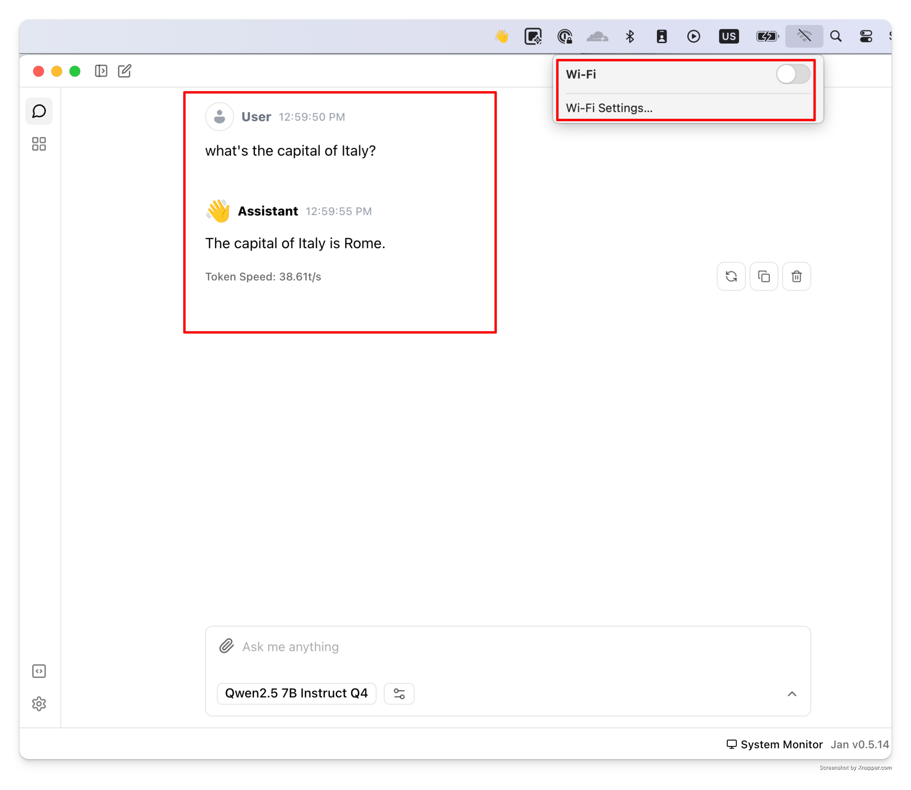
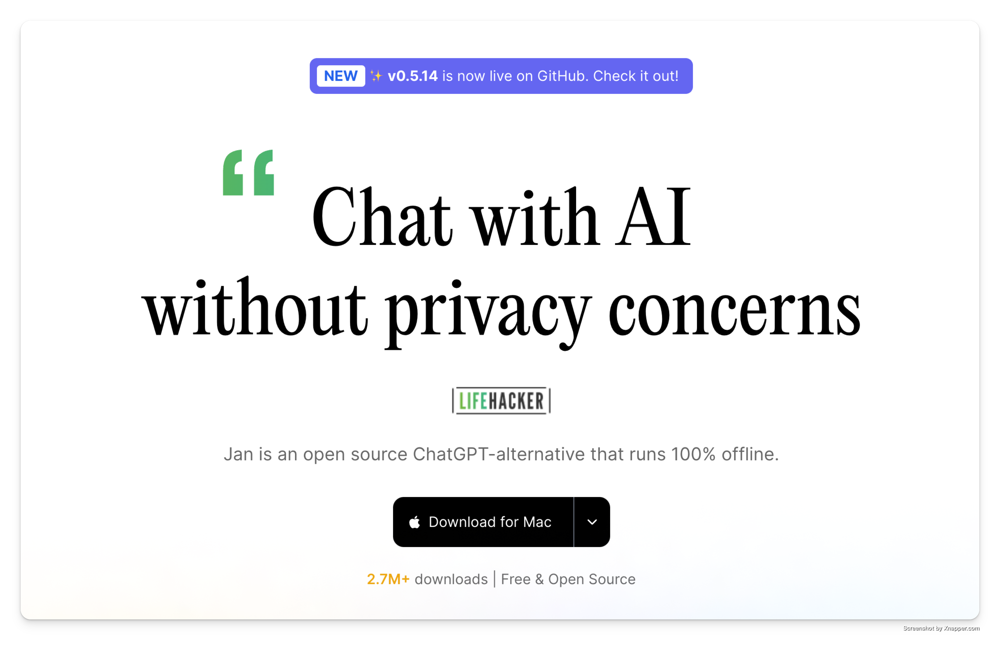
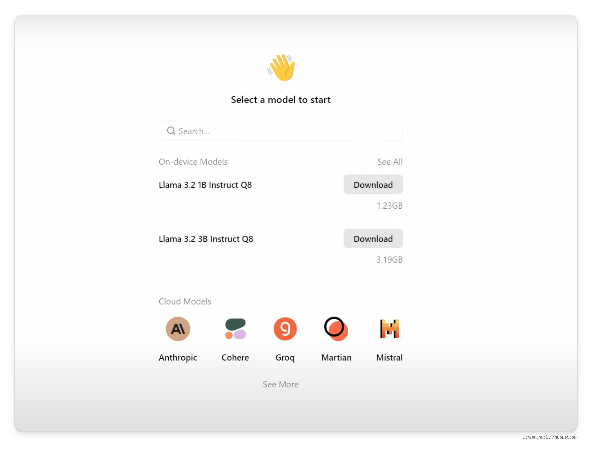

import { Callout } from 'nextra/components'
import CTABlog from '@/components/Blog/CTA'

# Offline ChatGPT: You can't run ChatGPT offline, do this instead

ChatGPT is a cloud-based service that requires internet access. However, it's not the only way to use AI. You can run AI models offline on your device with [Jan](https://jan.ai/). It's completely free, open-source, and gives you 100% offline capability. You can even use AI on a plane!

<Callout>
**Quick Summary:**
- ChatGPT always needs internet - it can't run offline
- Jan lets you run AI models 100% offline on your computer
- It's free and open-source
- Works on Mac, Windows, and Linux
</Callout>

## Jan as an offline ChatGPT alternative

*Jan lets you use AI offline - no internet connection needed*

Here's how to get started with offline AI in 3 simple steps:

### 1. Download Jan

Go to [jan.ai](https://jan.ai) and download the version for your computer (Mac, Windows, or Linux). It's completely free.

### 2. Download an AI model

You'll need an AI model to use AI offline, so download a model from Jan. Once it's on your computer, you don't need internet anymore.

*Select an AI model that matches your needs and computer capabilities*

<Callout>
**Which model should you choose?**
- For most computers: Try Mistral 7B or DeepSeek - they're similar to ChatGPT 3.5
- For older computers: Use smaller 3B models
- For gaming PCs: You can try larger 13B models

Don't worry about choosing - Jan will automatically recommend models that work well on your computer.
</Callout>

### 3. Start using AI offline

*Use Jan's clean interface to chat with AI - no internet required*

Once downloaded, you can use AI anywhere, anytime:

- Chat like you do with ChatGPT
- Work on documents offline
- Get coding help without internet
- Keep your conversations private
- Use AI even when servers are down

## How to chat with your docs in Jan?

To chat with your docs in Jan, you need to activate experimental mode. 

*Turn on experimental mode in settings to chat with your docs*

After activating experimental mode, simply add your files and ask questions about them.

*Chat with your documents privately - no internet needed*

I did this for you and got a reply from a 7B parameter model. If you'd like to learn what "7B" means and understand other local AI terms, check our [guide on running AI models locally](/post/run-ai-models-locally).

A response from AI, Qwen2.5 7B Instruct Q4:

`This document appears to be about the benefits and advantages of running artificial intelligence (AI) models locally on your device rather than using cloud-based or remote AI services. The key points it highlights include data privacy, offline functionality, freedom from paywalls and restrictions, and giving users full control over their AI models. Additionally, the text mentions that local AI is becoming a new trend and provides a link to a guide for beginners who want to learn more about this topic.`

Local AI makes possible offline AI use, so Jan is going to be your first step to get started. 

## Why choose Jan over ChatGPT?

1. **True Offline Use:** Unlike ChatGPT, Jan works without internet
2. **100% Private:** Your data never leaves your computer
3. **Free Forever:** No subscriptions or API costs
4. **No Server Issues:** No more "ChatGPT is at capacity"
5. **Your Choice of Models:** Use newer models as they come out

**"Is it really free? What's the catch?"**
Yes, it's completely free and open source. Jan is built by developers who believe in making AI accessible to everyone.

**"How does it compare to ChatGPT?"**
Modern open-source models like DeepSeek and Mistral are very capable. While they might not match GPT-4, they're perfect for most tasks and getting better every month.

**"Do I need a powerful computer?"**
If your computer is from the last 5 years, it will likely work fine. You need about 8GB of RAM and 10GB of free space for comfortable usage.

**"What about my privacy?"**
Everything stays on your computer. Your conversations, documents, and data never leave your device unless you choose to share them.

Want to learn more about the technical side? Check our detailed [guide on running AI models locally](/post/run-ai-models-locally). It's not required to [use AI offline](https://jan.ai/) but helps understand how it all works.

## Need help?

<Callout type="info">
[Join our Discord community](https://discord.gg/Exe46xPMbK) for support and tips on using Jan as your offline ChatGPT alternative.
</Callout>
