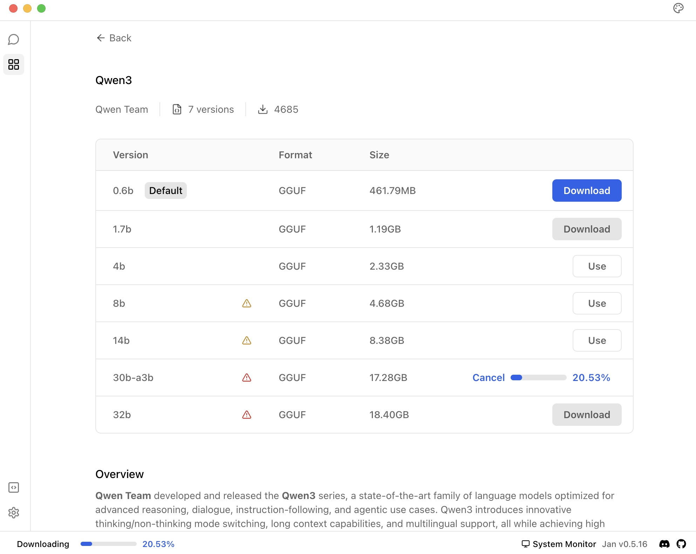
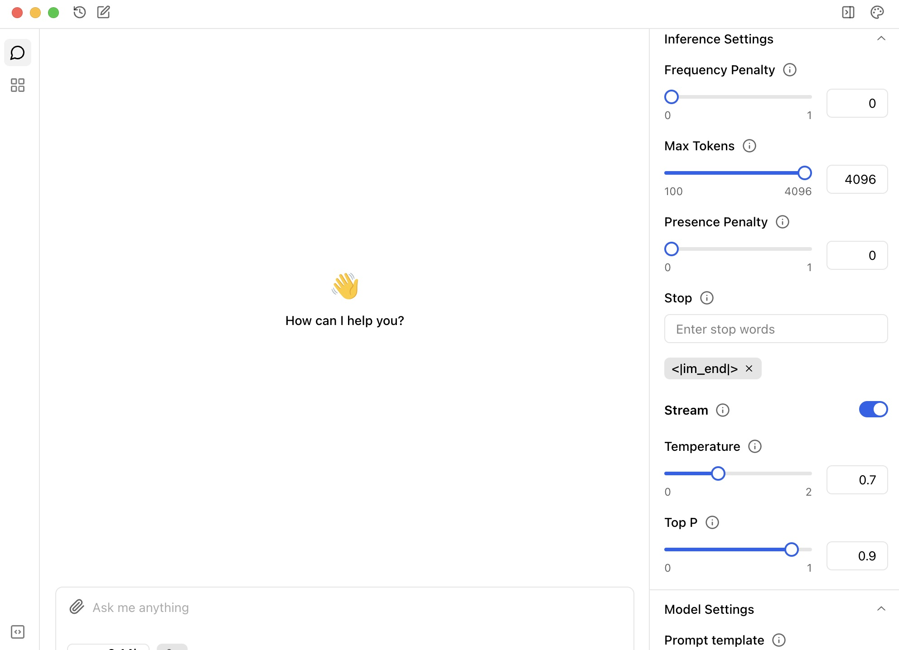

import { Callout } from 'nextra/components'
import CTABlog from '@/components/Blog/CTA'

# Best Settings to Run Qwen3-30B-A3B Locally

If you're running Qwen3-30B-A3B locally, don't guess your way through the settings. This guide tells you what actually works based on Qwen's own documentation and what we've seen hold up in practice.

<Callout>
**Quick Summary:**
- Qwen3-30B-A3B has two modes: thinking and non-thinking
- Each mode needs different generation settings
- Greedy decoding breaks thinking mode - avoid it
- Don't log &lt;think&gt; blocks in chat history
</Callout>

Qwen3 comes with a unique toggle: `enable_thinking`. When it's on, the model "thinks", it breaks down problems, reasons step-by-step, and wraps part of its output in a `<think>...</think>` block. When it's off, the model skips all that and just gives you an answer.

That changes how you configure it.

---

### Thinking mode (`enable_thinking=True`)

This is the mode for reasoning, math, coding, logic — anything that benefits from step-by-step generation.

**Use these generation settings:**

```vbnet
Temperature: 0.6  
TopP: 0.95  
TopK: 20  
Max tokens: 32,768  
Do not use greedy decoding
```

<Callout type="info">
**Why it matters:**
Thinking mode is powerful, but greedy decoding kills its output. It'll repeat or get stuck. Stick to sampling, and give it enough token space to finish its thoughts.
</Callout>

---

## Quick summary 


### Non-thinking mode (`enable_thinking=False`)

This is for fast, general-purpose replies. Instruction following, chat, creative writing — no `<think>` block, no extra steps.

**Use these settings:**

```makefile
Temperature: 0.7  
TopP: 0.8  
TopK: 20
```

<Callout type="info">
Non-thinking mode is faster and more efficient, so the default token length is usually enough. If you're not doing long-form tasks, don't worry about it.
</Callout>

---

## Soft vs. hard switch

You can toggle thinking dynamically in the prompt using:

```bash
/think      # turns thinking ON
/no_think   # turns it OFF
```

This works only if `enable_thinking=True` is set in the code. If you set it to False, the soft switch won't do anything.

---

### What most people miss

- **Don't log the `think` block in chat history.** Qwen recommends keeping only the final answer. Otherwise, the next reply gets bloated and off-topic.
- **Greedy decoding is a trap.** It's tempting to use for consistency, but Qwen3's output gets worse - and sometimes broken - without sampling.
- **YaRN isn't always needed.** The model supports up to 32k context by default. Use YaRN only if you regularly go beyond that.

---

## Running Qwen3 locally with Jan

The easiest way to run Qwen3-30B-A3B locally is through Jan.

1. Download and install [Jan](https://jan.ai)
2. Open Jan and navigate to Jan Hub
3. Find `Qwen3` and `Qwen3-30B-A3B` in the model list
4. Click "Download" to get the model

### Qwen3 in Jan Hub

You can easily find Qwen3 models in Jan Hub:



Once downloaded, Jan handles all the technical setup, so you can focus on using the model rather than configuring it. The settings we covered in this guide are automatically applied when you use Qwen3 through Jan.

### How to customize Qwen3-30B-A3B settings in Jan

You can also customize these settings anytime by opening the right panel in Jan and adjusting the parameters to match your needs.



## Bottom Line

If you're running Qwen3-30B-A3B locally, treat it like two models in one. Flip the thinking mode based on the task, adjust the generation settings accordingly, and let it work how it was meant to.

## Need help?

<Callout type="info">
[Join our Discord community](https://discord.gg/Exe46xPMbK) for support and tips on using Jan as your offline ChatGPT alternative.
</Callout>

<CTABlog />
