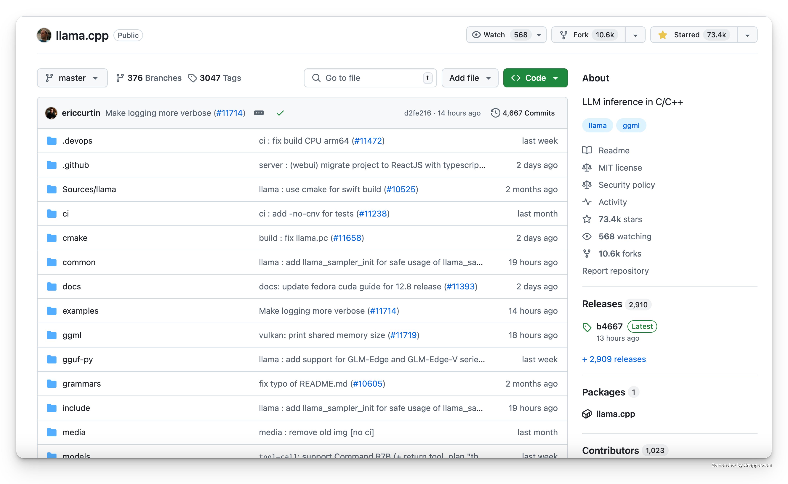
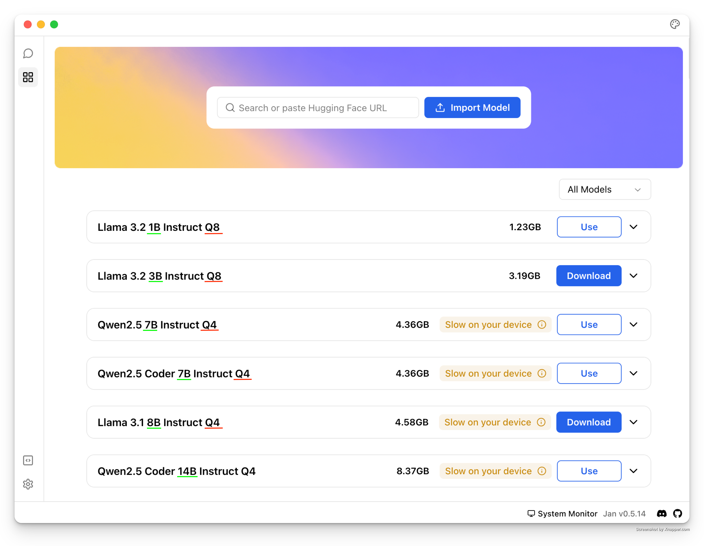
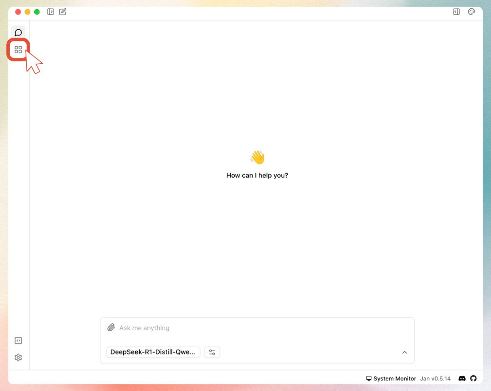
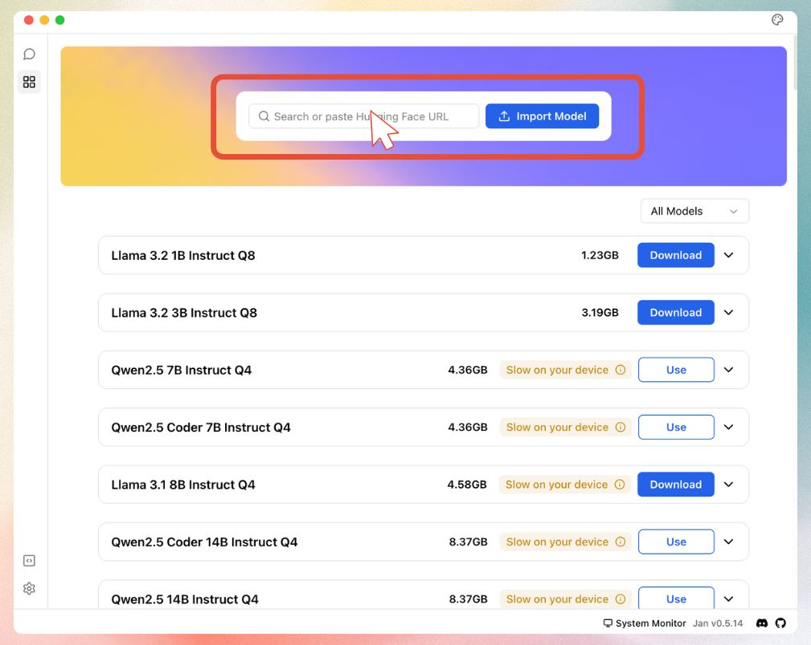
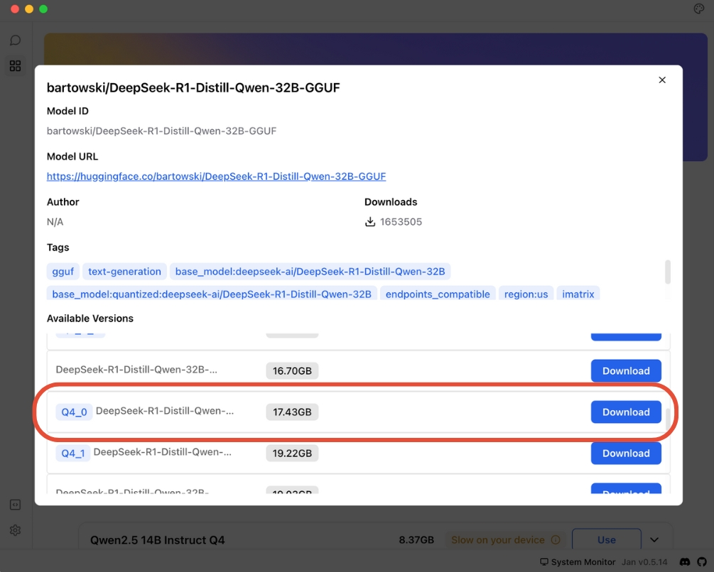

import { Callout } from 'nextra/components'
import CTABlog from '@/components/Blog/CTA'

# How to run AI models locally as a beginner?

Running AI locally is fastest when you take these 3 actions in order. This walkthrough gets you from zero to a working offline AI on your computer.

1. Download [Jan](https://www.jan.ai/) (free, open source)
2. Pick a model to use
3. Start chatting

The rest of this guide explains each step and answers common questions.

### 1. Download [Jan](https://jan.ai)

*Download Jan from [jan.ai](https://jan.ai) - it's free and open source.*

### 2. Choose a model that fits your hardware

*Jan helps you pick the right AI model for your computer.*

### 3. Start using AI locally

That's all to run your first AI model locally!

*Start chatting with local AI models using Jan.*

Keep reading to learn key terms of local AI and the things you should know before running AI models locally.

## Running AI Locally on Windows, Mac, and Linux

[Jan](https://www.jan.ai/) works on all major operating systems with the same features:

**Windows (10, 11)**  
Download the `.exe` installer from jan.ai. Works on Windows 10 and 11 with no additional setup.

**macOS (Intel and Apple Silicon)**  
Download the `.dmg` file. Supports both Intel Macs and Apple Silicon (M1, M2, M3) natively.

**Linux (Ubuntu, Debian, Fedora)**  
Download the `.AppImage` or `.deb` package. Works on most modern Linux distributions.

All platforms get the same models and features. The rest of this guide applies to all operating systems.

## Common Questions for Beginners

### Do I need coding skills?
No. Jan handles installation, GGUF downloads, and updates. You point and click, then start chatting.

### Is running AI locally free?
Yes. Jan is open source, local AI models are free, and offline AI replies cost nothing to run on your computer.

### Will AI on my computer slow it down?
Only during inference. Close big apps or pause the model if you need the CPU or GPU for other work.

### Do I need internet access after setup?
You only need it to download Jan and your first model. After that, you can run AI locally offline whenever you want.

### Is my data private?
Everything stays on-device unless you choose to share it. No prompts are sent to Jan’s servers by default.

## How Local AI Works
With the basics and beginner FAQs out of the way, here's what is happening under the hood when you run AI on your computer.

Before diving into the details, let's understand how AI runs on your computer:

<Callout>
**Why do we need special tools for local AI?**
Think of AI models like compressed files - they need to be "unpacked" to work on your computer. Tools like llama.cpp do this job:
- They make AI models run efficiently on regular computers
- Convert complex AI math into something your computer understands
- Help run large AI models even with limited resources
</Callout>

*llama.cpp helps millions of people run AI locally on their computers.*

<Callout>
**What is GGUF and why do we need it?**

Original AI models are huge and complex - like trying to read a book in a language your computer doesn't understand. Here's where GGUF comes in:

1. **Problem it solves:**
   - Original AI models are too big (100s of GB)
   - They're designed for specialized AI computers
   - They use too much memory

2. **How GGUF helps:**
   - Converts models to a smaller size
   - Makes them work on regular computers
   - Keeps the AI smart while using less memory

When browsing models, you'll see "GGUF" in the name (like "DeepSeek-R1-GGUF"). Don't worry about finding them - Jan automatically shows you the right GGUF versions for your computer.
</Callout>

## Understanding AI Models

Think of AI models like apps on your computer - some are light and quick to use, while others are bigger but can do more things. When you're choosing an AI model to run on your computer, you'll see names like "Llama-3-8B" or "Mistral-7B". Let's break down what this means in simple terms.

<Callout>
The "B" in model names (like 7B) stands for "billion" - it's just telling you the size of the AI model. Just like how some apps take up more space on your computer, bigger AI models need more space on your computer.

- Smaller models (1-7B): Work great on most computers
- Bigger models (13B+): Need more powerful computers but can do more complex tasks
</Callout>

*Jan Hub makes it easy to understand different model sizes and versions*

Running local AI models becomes easier once you understand how size affects speed; next you'll see what you can do after the install.

**Good news:** Jan helps you pick the right model size for your computer automatically! You don't need to worry about the technical details - just choose a model that matches what Jan recommends for your computer.

## What You Can Do with Local AI

<Callout type="info">
Running AI locally gives you:
- Complete privacy - your data stays on your computer
- No internet needed - works offline
- Full control - you decide what models to use
- Free to use - no subscription fees
</Callout>

## Hardware Requirements: Running AI on Your Laptop or Desktop

Most modern computers can run AI locally. Here's what you need:

**Minimum requirements (works on most laptops):**
- CPU from the last 5 years (Intel i5/AMD Ryzen 5 or better)
- 8GB RAM minimum - 16GB recommended for better performance
- 5GB+ free storage per model
- No GPU required - runs on CPU only

### What AI models can run on your laptop or desktop?

| | | |
|---|---|---|
| Regular Laptop | 3B-7B models | Good for chatting and writing. Like having a helpful assistant |
| Gaming Laptop | 7B-13B models | More capable. Better at complex tasks like coding and analysis |
| Powerful Desktop | 13B+ models | Better performance. Great for professional work and advanced tasks |

<Callout type="info">
**Not Sure About Your Computer?**
Start with a smaller model (3B-7B) - Jan will help you choose one that works well on your system.
</Callout>

## Getting Started with Models

### Model Versions

When browsing models in Jan, you'll see terms like "Q4", "Q6", or "Q8". Here's what that means in simple terms:

<Callout>
These are different versions of the same AI model, just packaged differently to work better on different computers:

- **Q4 versions**: Like a "lite" version of an app - runs fast and works on most computers
- **Q6 versions**: The "standard" version - good balance of speed and quality
- **Q8 versions**: The "premium" version - highest quality but needs a more powerful computer
</Callout>

**Pro tip**: Start with Q4 versions - they work great for most people and run smoothly on regular computers!

### Getting Models from Hugging Face

You'll often see links to "Hugging Face" when downloading AI models. Think of Hugging Face as the "GitHub for AI" - it's where the AI community shares their models. Jan makes it super easy to use:

1. Jan has a built-in connection to Hugging Face
2. You can download models right from Jan's interface
3. No need to visit the Hugging Face website unless you want to explore more options

## Setting up your local AI

### Getting Models from Hugging Face

You'll often see links to "Hugging Face" when downloading AI models. Think of Hugging Face as the "GitHub for AI" - it's where the AI community shares their models. This sounds technical, but Jan makes it super easy to use:

1. Jan has a built-in connection to Hugging Face
2. You can download models right from Jan's interface
3. No need to visit the Hugging Face website unless you want to explore more options

<Callout>
**What powers local AI?**
Jan uses [llama.cpp](https://github.com/ggerganov/llama.cpp), an inference that makes AI models run efficiently on regular computers. It's like a translator that helps AI models speak your computer's language, making them run faster and use less memory.
</Callout>

### 1. Get Started
Download Jan from [jan.ai](https://jan.ai) - it sets everything up for you.

### 2. Get an AI Model

You can get models two ways:

#### 1. Use Jan Hub (Recommended):
   - Click "Download Model" in Jan
   - Pick a recommended model
   - Choose one that fits your computer

*Use Jan Hub to download AI models*

#### 2. Use Hugging Face:

<Callout type="warning">
Important: Only GGUF models will work with Jan. Make sure to use models that have "GGUF" in their name.
</Callout>

##### Step 1: Get the model link
Find and copy a GGUF model link from [Hugging Face](https://huggingface.co)

*Look for models with "GGUF" in their name*

##### Step 2: Open Jan
Launch Jan and go to the Models tab

*Navigate to the Models section in Jan*

##### Step 3: Add the model
Paste your Hugging Face link into Jan

*Paste your GGUF model link here*

##### Step 4: Download
Select your quantization and start the download

*Choose your preferred model size and download*

## Technical FAQs

### Can I run AI locally without a GPU?
Yes. CPU-only inference works fine for 3B-7B models. Expect slower responses, so keep prompts short and close other heavy apps.

### Which local AI model should I start with for free?
Pick any Jan-recommended 7B GGUF model like DeepSeek-R1 7B Q4 or Llama-3.1 8B Q4. They balance accuracy, speed, and memory use for most laptops.

### How much RAM and storage do I need to run AI locally?
Reserve 5 GB storage per model plus 2× the model size in free RAM. Example: a 4 GB Q4 file needs roughly 8 GB of RAM to run smoothly.

### How do I run larger AI models on my computer?
Move up to Q6 or Q8 quantization or 13B+ models if you have a desktop GPU. Jan shows real-time VRAM and RAM requirements before download.

## Need help?
<Callout type="info">
[Join our Discord community](https://discord.gg/Exe46xPMbK) for support.
</Callout>
