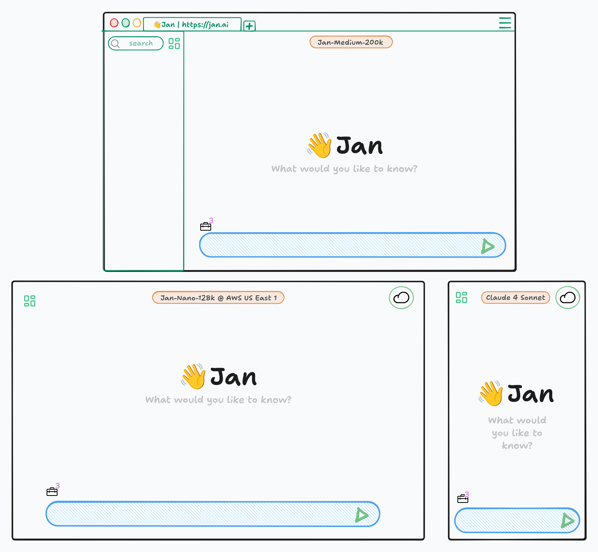
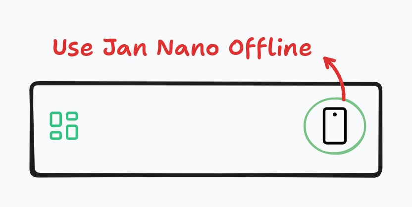

import { Callout } from 'nextra/components'

# Products

Jan is moving from a local AI application to a complete full-stack AI solution that you can self-host. This
includes models, applications, and tools that delights users and help them solve their problems.

## What We're Building

**Jan Factory (or Agent)** = Jan Models + Jan Application + Jan Tools

Unlike other AI assistants that do specific tasks with one model or have many models with a myriad of solutions, Jan provides:
- Its own specialised models that are optimised at specific tasks like web-search, creative writing, and translation
- Applications that work across all of your devices in an integrated way
- Tools to help youget things done

## Two Modes

### Local Mode

Run AI models entirely on your device, giving you complete privacy with no internet required.

### Cloud Mode

Connect to more powerful models when needed - either self-hosted or via jan.ai.

<Callout type="info">
Users shouldn't need to understand models, APIs, or technical details. Just choose Local for privacy or Cloud for power.
</Callout>

## Our Product Principles

### 1) It Just Works

1. Open Jan, start chatting
2. Onboarding is fully available but optional
3. Setting up an API key is optional
4. Selecting a local model is optional
5. Become a power user at your own pace, if you want to

We handle the complexity.

### 2) Cloud When Needed

Start completely locally and own your AI models. Add cloud capabilities only when you choose to.

### 3) Solve Problems, Not Settings

We help users get to answers quickly and leave the configurations as optional. Power users can
dig deeper, but it's never required.

## Available on Every Device

### Jan Desktop

This is how Jan started and it has been available since day 1.

Jan Desktop stives to be:

> Your personal AI workstation that helps with your use cases and powers other devices. Run
models locally right away or bring an API key to connect to your favorite cloud-based models.

**Key Features:**
- Runs models locally on your hardware
- GPU acceleration support
- Powers other devices via network connection
- Complete privacy and control
- Windows, macOS, and Linux support

**Requirements:**
- Minimum 8GB RAM
- 10GB+ storage space
- Optional: NVIDIA GPU for acceleration

### Jan Web

**Status:** Beta Launch Soon

Web-based version of 👋 Jan with no setup required. Same default cloud mode for mobile and desktop users.

**Key Features:**
- No installation needed
- Instant access from any browser
- Automatic updates and maintenance
- Default cloud backend for mobile apps
- Team collaboration features
  - Share prompts
  - Share workflows
  - Collaborate on threads
  - Share threads

**Pricing:**
- Free for everyone
- Pro:
  - Access our latest models
  - Access other cloud providers, no need to bring their API keys
- Enterprise:
  - Self-host or we host it for you
  - Active support and SLAs
  - SSO
  - Team featues

### Jan Mobile

**Status:** Coming Q4 2025

Connect to Desktop/Server, run local mode with Jan Nano or our upcoming Jan v1, same experience everywhere.

Jan Mobile adapts to your situation:

At Home, you can connect to your Jan Desktop over WiFi

At Work, you can connect to your company Jan Server

On the Go, you can run Jan Nano on your phone or talk to your favourite cloud-based model

**Key Features:**
- iOS and Android support
- Three adaptive modes (Desktop, Server, Local)
- Voice-first interface
- Seamless device switching
- Jan Nano for on-device AI

### Jan Server

**Status:** Coming Q3 2025

Self-hosted solution or connect to Jan via API.

**Key Features:**
- Docker and Kubernetes deployment
- Admin dashboard
- Team knowledge sharing

**Deployment Options:**
- Docker compose: Single command setup
- Kubernetes: Enterprise scale
- Bare metal: Maximum control

## What Makes Jan Different

| Feature | Other AI Assistants | Jan |
| :--- | :--- | :--- |
| **Models** | Wrapper around Claude/GPT | Our own models + You can own them |
| **Dual mode** | Your data on their servers | Your data stays yours |
| **Deployment** | Cloud only | Local, self-hosted, or cloud |
| **Cost** | Subscription forever | Free locally, pay for cloud |

## Development Timeline

Jan is actively developed with regular releases. Our development follows these key milestones:

### Current Focus
- **Jan Desktop**: Continuous improvements and model support
- **Jan Web**: Beta launch preparation
- **Model Development**: Jan Nano optimization and v1 launch

### Next 6 Months
- Jan Web public beta
- Mobile app development
- Server deployment tools

### Future Vision
- Complete full-stack AI solution
- Advanced tool integration
- Enterprise features

<Callout>
We're building AI that respects your choices. Run it locally and power other app, connect to
cloud for power, or self-host for both.
</Callout>
