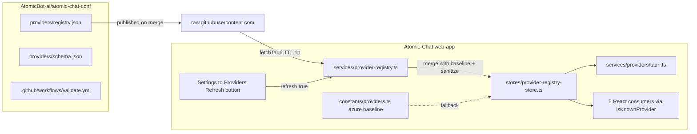
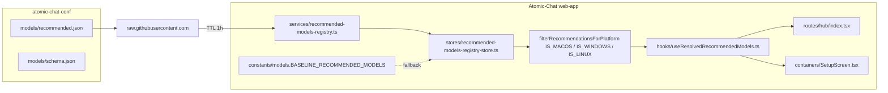
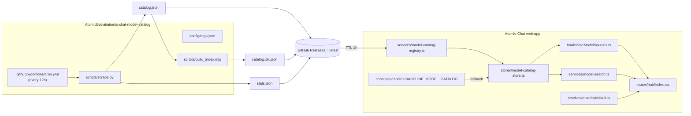

# Remote Registries — Agent Notes

This file documents two parallel remote-configuration features:

1. **Provider registry** — cloud-provider catalog (OpenAI, Anthropic, …).
2. **Recommended-models registry** — Hub + onboarding recommendation list.

Both follow the same architecture (loader → cache → store → consumers, with a
bundled baseline fallback) and are published from the same upstream repo
[`AtomicBot-ai/atomic-chat-conf`](https://github.com/AtomicBot-ai/atomic-chat-conf).
Section 1 below covers the provider registry; **section 2** covers the
recommended-models registry.

# 1. Provider Registry

> **Scope**: this section applies when editing files that participate in the
> remote provider-registry feature:
>
> - [provider-registry.ts](./provider-registry.ts) — the network loader.
> - [providers/tauri.ts](./providers/tauri.ts) — desktop providers service.
> - [providers/default.ts](./providers/default.ts) / [providers/types.ts](./providers/types.ts).
> - [../stores/provider-registry-store.ts](../stores/provider-registry-store.ts) — Zustand wrapper.
> - [../constants/providers.ts](../constants/providers.ts) — bundled baseline (Azure + `openAIProviderSettings`).
>
> It does **not** apply to unrelated services in this folder (extensions, MCP,
> hardware, etc.). For those, follow the rules in their own AGENTS.md, if any,
> or the project root guidance.

## Why this exists

Most cloud providers (OpenAI, Anthropic, OpenRouter, Mistral, Groq, xAI,
Gemini, MiniMax, Hugging Face, NVIDIA, …) are no longer hard-coded in the
TypeScript source. They live in a public Git registry,
[AtomicBot-ai/atomic-chat-conf](https://github.com/AtomicBot-ai/atomic-chat-conf),
under `providers/registry.json`. The desktop client fetches that file at
startup, caches it for one hour, and falls back to a small bundled baseline
when the network is unreachable. Adding a new provider or model now means
opening a Pull Request against the registry repo — no app release required.

## Data flow



## Where things live

| Concern                                  | File                                                                                                |
| ---------------------------------------- | --------------------------------------------------------------------------------------------------- |
| Remote manifest                          | `AtomicBot-ai/atomic-chat-conf/providers/registry.json`                                             |
| JSON Schema for the manifest             | `AtomicBot-ai/atomic-chat-conf/providers/schema.json`                                               |
| Loader (fetch, cache, sanitize, fallback)| [provider-registry.ts](./provider-registry.ts)                                                      |
| Zustand store + auto-bootstrap           | [../stores/provider-registry-store.ts](../stores/provider-registry-store.ts)                        |
| Sync helper for non-React code           | `getRegistryProvidersSync()` in the same store                                                      |
| Bundled baseline (Azure + custom-form)   | [../constants/providers.ts](../constants/providers.ts) (`BASELINE_PROVIDERS`, `openAIProviderSettings`) |
| Desktop providers service                | [providers/tauri.ts](./providers/tauri.ts) — uses `ensureRegistryLoaded()`                          |
| UI refresh button + last-updated label   | [../routes/settings/providers/index.tsx](../routes/settings/providers/index.tsx)                    |
| Locale strings (`provider:registry.*`)   | `../locales/*/providers.json` (13 locales)                                                          |
| Loader tests                             | [./__tests__/provider-registry.test.ts](./__tests__/provider-registry.test.ts)                      |

### Consumer files migrated to `isKnownProvider`

These five files used to import `predefinedProviders` to test "is this
provider system-defined?". They now ask the registry store via
`isKnownProvider(name)`:

- [../routes/index.tsx](../routes/index.tsx)
- [../routes/settings/providers/$providerName.tsx](../routes/settings/providers/$providerName.tsx)
- [../containers/DropdownModelProvider.tsx](../containers/DropdownModelProvider.tsx)
- [../containers/dialogs/DeleteProvider.tsx](../containers/dialogs/DeleteProvider.tsx)
- [../hooks/useJanModelPrompt.ts](../hooks/useJanModelPrompt.ts)

## Schema versioning

The manifest carries `schema_version`. The client embeds
`SUPPORTED_SCHEMA_VERSION` in `provider-registry.ts`. Rules:

- **Bump `SUPPORTED_SCHEMA_VERSION` _before_ shipping a manifest with a
  higher version.** Otherwise old clients reject the new manifest and stay on
  the cached/baseline copy.
- Adding a new provider or a new model is **not** a schema change.
- Adding/removing required fields, changing field types, or renaming fields
  on `provider`/`model`/`providerSetting` IS a schema change — bump it.
- Always update `providers/schema.json` in the registry repo when you change
  the shape, and re-run `ajv validate` locally.

## Cache rules

- TTL: `CACHE_TTL_MS = 60 * 60 * 1000` (1 hour).
- Keys in `localStorage`:
  - `jan_provider_registry_cache_v1` — JSON-stringified manifest.
  - `jan_provider_registry_cache_ts_v1` — number, `Date.now()` at write time.
- `clearRegistryCache()` wipes both keys; tests use it for isolation.
- The Refresh button in Settings → Providers calls `refresh({ force: true })`,
  which bypasses freshness and writes a new cache entry on success.
- A stale cache (`isCacheFresh === false`) is still used as **fallback** if
  the network attempt fails. Only when there is no cache at all do we fall
  through to `BASELINE_PROVIDERS`.

## Failure modes (and what to render)

| Trigger                                | Source returned | UI behavior                                                  |
| -------------------------------------- | --------------- | ------------------------------------------------------------ |
| Fresh cache present, no force          | `cache`         | Silent — same providers shown.                               |
| Fetch succeeds                         | `remote`        | Silent. Cache and store are updated.                         |
| Fetch fails, stale cache exists        | `cache`         | Silent. `error` field is set so explicit Refresh shows toast.|
| Fetch fails, no cache                  | `baseline`      | Silent (Azure-only catalog). User can add custom providers.  |
| `schema_version` exceeds support       | `baseline`      | Silent. Encourage update via separate UX (future work).      |
| Manifest payload malformed             | `baseline`      | Silent. Logged via `console.warn`.                           |
| Tauri fetch unavailable (web/test env) | uses `globalThis.fetch` | Same outcomes as above.                              |

`getProvidersOrFallback()` is documented as **never throwing** — UI code must
not wrap it in `try/catch` for control flow.

## How to add a provider

### For non-developers (preferred path)

1. Open `providers/registry.json` in `AtomicBot-ai/atomic-chat-conf` on GitHub.
2. Click **Edit**, append a new entry, bump `updated_at`, open a PR.
3. CI (`ajv validate` + the integrity script) must be green before merge.
4. After merge, every Jan client picks up the change within an hour, or
   immediately on Settings → Providers → **Refresh catalog**.

### For developers (only when shape changes)

1. Update [./provider-registry.ts](./provider-registry.ts):
   - Bump `SUPPORTED_SCHEMA_VERSION` if breaking.
   - Add new field handling in `sanitizeProvider` / `isManifest`.
2. Update `providers/schema.json` in the registry repo.
3. Ship the client first (so deployed clients can read the new shape).
4. Then publish the registry change.

## Do NOT

- **Do not** restore the old `predefinedProviders` array. Use
  `useProviderRegistryStore` (React) or `getRegistryProvidersSync()` /
  `ensureRegistryLoaded()` (non-React).
- **Do not** put `api_key` values in the manifest. The loader strips them on
  every fetch (`sanitizeProvider`), but committing one is still a security
  incident — rotate the key immediately.
- **Do not** delete `azure` or `openAIProviderSettings` from
  `BASELINE_PROVIDERS`. Azure cannot live in the shared registry (its
  `base_url` is per-customer), and `openAIProviderSettings` is the form
  template the "Add Provider" dialog clones for custom providers.
- **Do not** call `getProvidersOrFallback()` from render-critical code paths
  on every render. Use the store (`useProviderRegistryStore(s => s.providers)`)
  so a single fetch backs every component.
- **Do not** edit `registry.json` inside `Atomic-Chat`. It does not exist
  here. The single source of truth is the `atomic-chat-conf` repo.
- **Do not** widen the cache TTL beyond 24h without coordinating with
  release/communications — users expect changes within an hour.

## Tests

Run only the relevant suites while iterating:

```bash
npx vitest run src/services/__tests__/provider-registry.test.ts
npx vitest run src/routes/settings/providers/__tests__/index.test.tsx
npx vitest run src/containers/__tests__/DropdownModelProvider.displayName.test.tsx
```

The full suite has pre-existing unrelated failures
(`models.test.ts`, `useReleaseNotes.test.ts`, `interface.test.tsx`,
`SettingsMenu.test.tsx`, `utils.test.ts > getProviderTitle`); investigate
those independently, do not block registry work on them.

# 2. Recommended-Models Registry

> **Scope**: this section applies when editing files that participate in the
> remote recommended-models feature:
>
> - [recommended-models-registry.ts](./recommended-models-registry.ts) — the network loader.
> - [../stores/recommended-models-registry-store.ts](../stores/recommended-models-registry-store.ts) — Zustand wrapper.
> - [../constants/models.ts](../constants/models.ts) — bundled `BASELINE_RECOMMENDED_MODELS`.
> - [../hooks/useResolvedRecommendedModels.ts](../hooks/useResolvedRecommendedModels.ts) — sole React consumer.

## Why this exists

The `Recommended` section in **Hub** (`/hub`) and the **Setup / onboarding**
screen used to read from a hard-coded `HUB_RECOMMENDED_MODELS` array in
`constants/models.ts`. Adding or rotating a recommendation required a full
release. The recommended-models registry moves that list into a public
manifest at
[`AtomicBot-ai/atomic-chat-conf/models/recommended.json`](https://github.com/AtomicBot-ai/atomic-chat-conf/blob/main/models/recommended.json),
fetched at startup and cached for one hour. Adding a new model = open a PR
against that repo.

## Manifest shape

```json
{
  "schema_version": 1,
  "updated_at": "2026-04-30T12:00:00Z",
  "recommendations": [
    { "model_name": "owner/repo", "description_key": "hub:recEverydayUse" },
    {
      "model_name": "mlx-community/...",
      "description_key": "hub:recForMlx",
      "platforms": ["macos"]
    }
  ]
}
```

| Field             | Required | Notes                                                           |
| ----------------- | -------- | --------------------------------------------------------------- |
| `model_name`      | yes      | Hugging Face repo id.                                            |
| `description_key` | yes      | Must start with `hub:` and exist in `locales/*/hub.json`.        |
| `platforms`       | no       | Subset of `["macos", "windows", "linux"]`. Omit ⇒ all platforms. |
| `active`          | no       | Defaults to `true`. Set to `false` to hide an entry.             |

## Data flow



## Cache rules

- TTL: `CACHE_TTL_MS = 60 * 60 * 1000` (1 hour) — same as the provider registry.
- `localStorage` keys (intentionally distinct from the provider-registry keys):
  - `jan_recommended_models_cache_v1`
  - `jan_recommended_models_cache_ts_v1`
- A stale cache is reused as **fallback** only when the network attempt
  fails. If there is no cache at all, `BASELINE_RECOMMENDED_MODELS` wins.

## Schema versioning

Same rules as the provider registry: bump `SUPPORTED_SCHEMA_VERSION` in
`recommended-models-registry.ts` **before** publishing a manifest with a
higher version. Adding a new recommendation entry is **not** a schema change.

## Platform filtering

The store keeps the platform-neutral list (so the cache stays portable). All
filtering happens via the pure helper
`filterRecommendationsForPlatform(list, os)` exposed by the loader and used
by both `useResolvedRecommendedModels` and the
`getRecommendationsForCurrentPlatformSync` accessor.

The legacy MLX defense-in-depth check inside
`useResolvedRecommendedModels.ts` (`if (!IS_MACOS && processed.is_mlx) return`)
stays — it runs *after* the manifest filter and protects against future
manifests that forget to mark MLX entries as `platforms: ["macos"]`.

## Heavy `RECOMMENDED_MODEL_FALLBACKS` does NOT live in the registry

`RECOMMENDED_MODEL_FALLBACKS` in [`../constants/models.ts`](../constants/models.ts)
is the offline-only `CatalogModel` snapshot (full quants/mmproj/file paths)
used by [`../routes/hub/$modelId.tsx`](../routes/hub/$modelId.tsx) when the
HF API is unreachable. It is intentionally **not** moved into the manifest
— that would bloat the file by ~10× without any operational benefit. Treat
it as a separate concern.

## How to add or update a recommendation

### For non-developers (preferred path)

1. Open `models/recommended.json` in `AtomicBot-ai/atomic-chat-conf` on
   GitHub, click **Edit**, append (or modify) an entry, bump `updated_at`.
2. CI runs `ajv validate` and a duplicate-entry check; both must be green.
3. After merge, every Atomic Chat client picks up the change within an
   hour, or immediately on next launch.

### For developers (only when the entry shape changes)

1. Update `recommended-models-registry.ts`:
   - Bump `SUPPORTED_SCHEMA_VERSION` if breaking.
   - Extend `sanitizeRecommendation` / `Recommendation` for the new field.
2. Update `models/schema.json` in the registry repo.
3. Ship the client first, **then** publish the registry change.
4. Mirror the new shape in `BASELINE_RECOMMENDED_MODELS` so first-launch
   parity is preserved.

## Do NOT

- **Do not** restore the old `HUB_RECOMMENDED_MODELS` constant. Read from
  `useRecommendedModelsRegistryStore` (React) or
  `getRecommendationsForCurrentPlatformSync()` (non-React).
- **Do not** inline `IS_MACOS` ternaries inside `BASELINE_RECOMMENDED_MODELS`
  — keep `platforms: ["macos"]` declarative so the baseline mirrors the
  manifest verbatim.
- **Do not** move `RECOMMENDED_MODEL_FALLBACKS` into the manifest.
- **Do not** share cache keys with the provider registry.
- **Do not** edit `models/recommended.json` inside `Atomic-Chat`. It does
  not exist here. The single source of truth is the `atomic-chat-conf` repo.

## Tests

```bash
npx vitest run src/services/__tests__/recommended-models-registry.test.ts
```

Covers the loader's six failure-mode branches plus
`filterRecommendationsForPlatform`. As with the provider registry, do not
block on pre-existing unrelated failures elsewhere in the suite.

# 3. Model Catalog Registry

> **Scope**: this section applies when editing files that participate in
> the curated model catalog + search feature:
>
> - [model-catalog-registry.ts](./model-catalog-registry.ts) — network loader.
> - [model-search.ts](./model-search.ts) — MiniSearch-powered ranking.
> - [../stores/model-catalog-store.ts](../stores/model-catalog-store.ts) — Zustand wrapper.
> - [../constants/models.ts](../constants/models.ts) — bundled `BASELINE_MODEL_CATALOG`.
> - [../hooks/useModelSources.ts](../hooks/useModelSources.ts) — compatibility shim.
> - [../routes/hub/index.tsx](../routes/hub/index.tsx) — primary consumer.

## Why this exists

Before 2026-05-27, the Hub page fetched the legacy `janhq/model-catalog`
file straight from raw.githubusercontent.com and ran a per-keystroke
[Fuse.js](https://www.fusejs.io/) search over the raw JSON. The catalog
had grown unmaintained (mixed-quality models, stale GGUF links, no MLX
discipline) and Fuse's small-corpus scoring scaled badly past a few
thousand entries — long-tail queries (`"qwen3.5 mlx 4bit"`) routinely
ranked irrelevant matches first.

The new pipeline owns a curated catalog at
[`AtomicBot-ai/atomic-chat-model-catalog`](https://github.com/AtomicBot-ai/atomic-chat-model-catalog).
A scheduled scraper enumerates a whitelist of trusted Hugging Face orgs
(GGUF quantizers + MLX contributors), emits `catalog.json` mirroring the
client's `CatalogModel` shape and a pre-built MiniSearch snapshot
`catalog.idx.json`, and publishes both to a GitHub Release tagged
`latest`. The client loads the snapshot via `MiniSearch.loadJSON(...)`
and answers BM25 / fuzzy / prefix queries instantly — no per-launch
indexing cost.

The Hub keeps a long-tail Hugging Face fallback ("Path B") so users can
still find models outside the curated orgs by repo id or search term.

## Manifest shape

```json
{
  "manifest_version": 1,
  "schema_version": 1,
  "updated_at": "2026-05-27T12:00:00Z",
  "orgs": ["unsloth", "bartowski", "mlx-community", "..."],
  "stats": { "total_models": 1234, "by_org": { "unsloth": 421 }, ... },
  "models": [
    {
      "model_name": "owner/repo",
      "developer": "owner",
      "downloads": 12345,
      "description": "**Tags**: gguf, qwen3, ...",
      "num_quants": 8,
      "quants": [
        {
          "model_id": "owner/repo-q4_k_m",
          "path": "https://huggingface.co/owner/repo/resolve/main/repo-q4_k_m.gguf",
          "file_size": "5.0 GB"
        }
      ],
      "num_mmproj": 1,
      "mmproj_models": [...],
      "num_safetensors": 0,
      "safetensors_files": [],
      "is_mlx": false,
      "tags_normalized": ["gguf", "qwen3", "q4_k_m"],
      "created_at": "2026-04-15T...",
      "last_modified": "2026-05-10T...",
      "readme": "https://huggingface.co/owner/repo/resolve/main/README.md"
    }
  ]
}
```

`models[]` is a strict superset of the client's `CatalogModel`
interface: every download URL, hash, mmproj reference, and safetensors
entry is preserved verbatim so the existing llama.cpp / MLX download
pipelines work unchanged.

`tags_normalized` is derived (synonyms, quant codes pulled from
filenames, library_name, pipeline_tag) and powers the search index'
tag field. It is intentionally lowercase + deduplicated.

## Index shape

`catalog.idx.json` wraps the raw `MiniSearch.toJSON()` snapshot:

```json
{
  "index_version": 1,
  "catalog_updated_at": "2026-05-27T12:00:00Z",
  "catalog_total_models": 1234,
  "minisearch": { /* MiniSearch internal state */ }
}
```

Field weights, tokenisation, and `processTerm` MUST stay in sync
between the scraper's `scripts/build_index.mjs` and the client's
[model-search.ts](./model-search.ts). When they diverge, bump
`SUPPORTED_INDEX_VERSION` in [model-catalog-registry.ts](./model-catalog-registry.ts)
**before** publishing a snapshot built with the new config — the
client refuses snapshots with `index_version` greater than the
supported one and falls back to on-the-fly indexing.

## Data flow



## Cache rules

- TTL: `CACHE_TTL_MS = 60 * 60 * 1000` (1 hour) — same posture as the
  provider / recommended-models registries.
- `localStorage` keys (distinct from sibling registries):
  - `atomic_model_catalog_cache_v1` — JSON-stringified manifest.
  - `atomic_model_catalog_cache_ts_v1` — `Date.now()` at write time.
  - `atomic_model_catalog_idx_v1` — JSON-stringified MiniSearch payload.
  - `atomic_model_catalog_idx_ts_v1` — `Date.now()` at write time.
- A stale cache is reused as **fallback** only when the network attempt
  fails. If there is no cache at all, `BASELINE_MODEL_CATALOG` wins
  for the catalog half; the search service rebuilds the index locally
  when no snapshot is available.
- The catalog can be a few MB; `QuotaExceededError` is caught and
  reduces the cache to a no-op for the rest of the session.

## Search ranking

`ModelSearchService.search(query)` pipeline:

1. **MiniSearch BM25** over `model_name` (×5), `developer` (×3),
   `tags_normalized` (×2), `description` (×1). Fuzzy=0.2, prefix=true,
   combineWith=AND.
2. **Platform-aware ORG_BOOST** multiplier (e.g. `mlx-community` is
   1.5 on macOS, 0 elsewhere). Lives in the client so the artefact
   stays OS-agnostic.
3. **Popularity weight**: `log(1 + downloads / 100)`.
4. **Recency decay**: exponential with 180-day half-life on
   `created_at`.

When the query is empty (Hub default view), only steps 2–4 apply —
this is the "default ranking" used to order the catalog.

If MiniSearch ever throws or the curated catalog returns < 5 hits for a
3+ character query, [routes/hub/index.tsx](../routes/hub/index.tsx)
falls back to the **long-tail Hugging Face search** via
`services/models/default.ts :: searchHuggingFaceCandidates`. Those
candidates are appended at the tail of the virtual list so curated
results always rank first.

## Schema versioning

Two independent version dials:

- `schema_version` on the manifest — bump in
  [model-catalog-registry.ts](./model-catalog-registry.ts)
  (`SUPPORTED_SCHEMA_VERSION`) **before** publishing a manifest with a
  higher version. Adding a model is not a schema change. Renaming a
  field IS.
- `index_version` on the MiniSearch snapshot — bump
  `SUPPORTED_INDEX_VERSION` in the same file before changing the
  tokenize / boosts / fields config.

## Failure modes

| Trigger                          | Catalog source | Index source | UI behavior                                                 |
| -------------------------------- | -------------- | ------------ | ----------------------------------------------------------- |
| Fresh cache, no force            | `cache`        | `cache`      | Silent. Catalog renders instantly.                          |
| Fetch succeeds                   | `remote`       | `remote`     | Silent. Cache updated.                                      |
| Fetch fails, stale cache exists  | `cache`        | `cache`      | Silent. `error` field is set.                               |
| Fetch fails, no cache            | `baseline`     | `baseline`   | Tiny seed list rendered. Search rebuilds index locally.     |
| `schema_version` exceeds support | `baseline`     | n/a          | Silent. Encourage update via separate UX (future work).     |
| `index_version` exceeds support  | n/a            | `baseline`   | Search rebuilds index locally — slightly higher first-paint cost. |
| Manifest payload malformed       | `baseline`     | as above     | Logged via `console.warn`.                                  |

`getCatalogOrFallback()` / `getIndexOrFallback()` are documented as
**never throwing** — UI code must not wrap them in `try/catch`.

## How to add or rotate a model

### For non-developers (preferred path)

1. Open `config/orgs.json` in the catalog repo, click **Edit**, append
   or modify an entry, bump `updated_at`. CI runs `ajv validate` plus
   integrity checks; both must be green.
2. After merge, the next 12-hour cron run (or a manual
   `workflow_dispatch`) refreshes the catalog Release. Atomic Chat
   clients pick up the change within an hour, or immediately on next
   launch.

### For developers (only when the entry shape changes)

1. Update [model-catalog-registry.ts](./model-catalog-registry.ts):
   bump `SUPPORTED_SCHEMA_VERSION` if breaking.
2. Update `scripts/scrape.py` and `config/schema.catalog.json` in the
   catalog repo to emit the new shape.
3. Ship the client first, then publish the catalog change.
4. Mirror the new shape in `BASELINE_MODEL_CATALOG` so first-launch
   parity is preserved.

## Do NOT

- **Do not** persist the catalog through `zustand/middleware:persist` in
  `useModelSources` — `model-catalog-store` owns the localStorage cache
  via `model-catalog-registry`. Double-writing a multi-MB catalog hits
  `QuotaExceededError` fast.
- **Do not** reach for the old `MODEL_CATALOG_URL` global. It still
  exists in `vite.config.ts` as a transitional alias but new code must
  read from `useModelCatalogStore` (React) or `getCatalogSync()`
  (non-React).
- **Do not** introduce another search library on top of MiniSearch.
  The Hub UI used to keep Fuse.js around for this; it is now removed
  from `package.json` and must not return.
- **Do not** mutate `tags_normalized` on the client. It is the canonical
  search field — read-only by convention.
- **Do not** widen the cache TTL beyond 24h without coordinating with
  release/communications. Users expect catalog changes within an hour.
- **Do not** edit `catalog.json` inside Atomic-Chat. It does not exist
  here. The single source of truth is the `atomic-chat-model-catalog`
  repo + its Releases.

## Tests

```bash
npx vitest run src/services/__tests__/model-catalog-registry.test.ts
npx vitest run src/services/__tests__/model-search.test.ts
npx vitest run src/hooks/__tests__/useModelSources.test.ts
```

The loader test covers six failure-mode branches (remote / cache / stale
cache / baseline / version mismatch / malformed). The search test pins
the ranking properties (popularity beats downloads-only, MLX queries
prefer mlx-community on macOS, janhq is suppressed by ORG_BOOST). The
shim test covers compatibility with the legacy `useModelSources` API.
