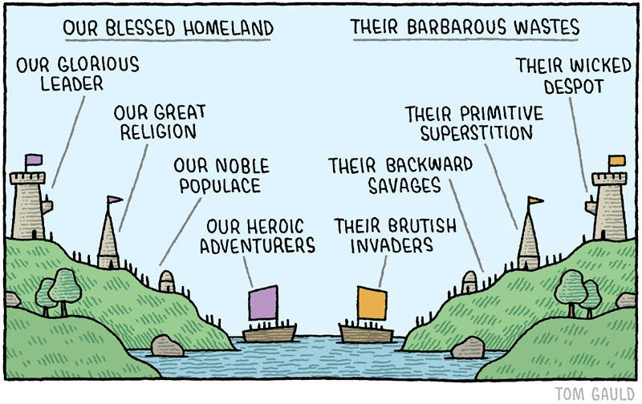

> "The imagined community of the nation is always limited and sovereign, yet human connections and cooperation stretch far beyond borders." — Benedict Anderson

## Why this matters

- AI is geopolitical. Nation-states compete to control it
- We are concerned about those using AI to stoke division, profit from lies, and spur conflict
- Some of us come from places where war isn't distant—it's family history
- Technology should unite, not divide

## Who we are

- Remote team across 7 countries
- Diverse backgrounds, united by mission
- Many of us are [third culture kids](https://en.wikipedia.org/wiki/Third_culture_kid)—growing up between worlds
- We often find ourselves misunderstood: an Asian-majority team, English-speaking, influenced by global philosophies
- Crossroad cultures shape us:
  - Turkiye: Europe, Asia, Middle East converge
  - Singapore: Trade hub bridging worlds
- We respect each other's cultures and build on shared values

## Jan's stance

- Humanity first. We build for people, not governments or factions
- AI should enable:
  - Shared prosperity
  - Universal education
  - Peaceful collaboration
- Technology **must** empower humanity to do more—together

## The bigger picture

- Human history is one of scaling cooperation:
  - Small-scale [kin groups](https://www.sciencedirect.com/science/article/pii/S0960982219303343) → diverse political formations → [modern nation-states](https://en.wikipedia.org/wiki/Westphalian_system) → global networks
  - Empires rose and fell. Nationalism united and divided. Globalization connected and excluded
- History doesn't progress. It moves—messy, cyclical, and full of contradiction
- Technology changes the terrain:
  - Like ant colonies forming complex systems from simple interactions, humans have always built networks beyond central control
  - Complexity emerges from countless small decisions—but unlike ants, we carry ideologies, ambitions, and fears
- AI is another fork in the road. It can reinforce old hierarchies or dismantle them. It can be used to surveil or to liberate

## Why we exist

- 30 people, from different countries, met online to build together
- The internet enables connections that were impossible a generation ago
- Ideas cross borders: an anthropologist in Turkiye collaborates with a roboticist in Saigon
- Jan exists because technology lets humanity work as one

## Our vision

- AI can accelerate global coordination and shared progress
- Our goal: help humanity align, collaborate, and solve collective challenges
- Success = contributing to humanity's long arc toward unity

If our work helps the world coordinate better—even slightly—we've done something that matters
