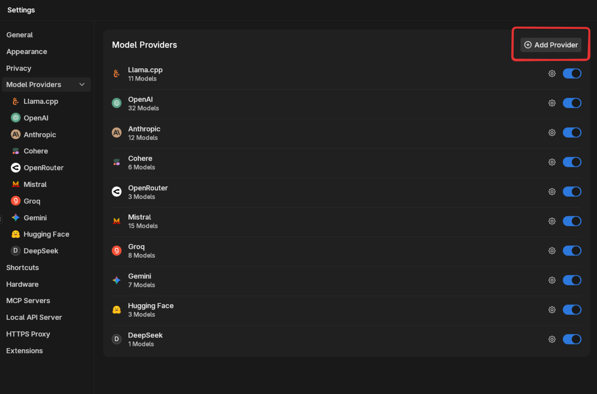
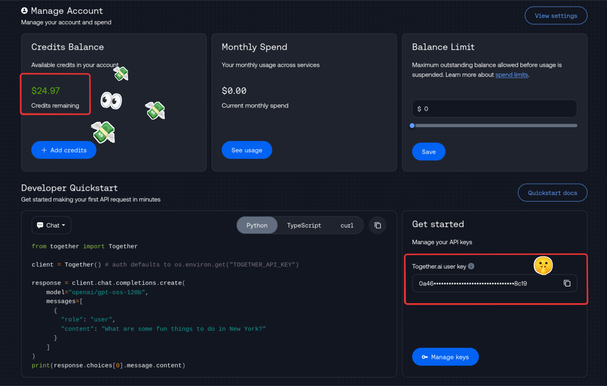
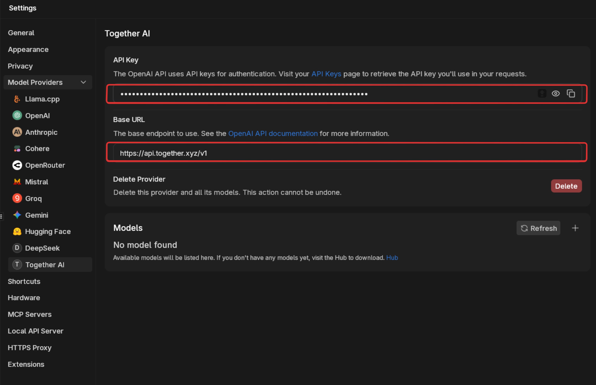
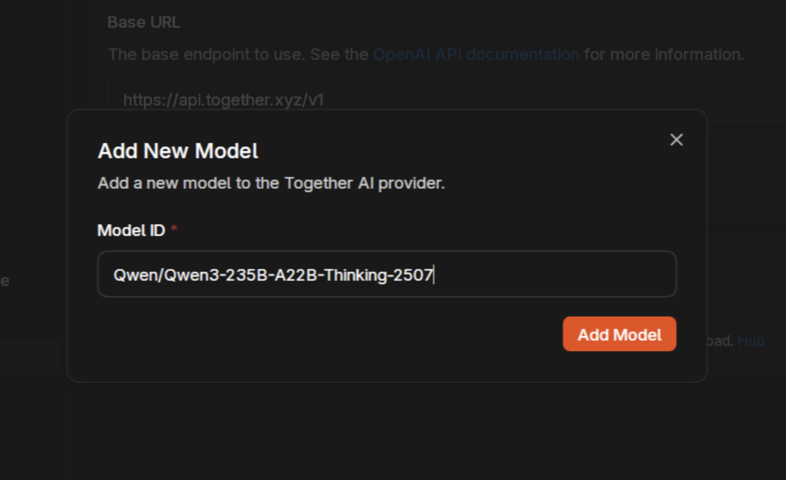
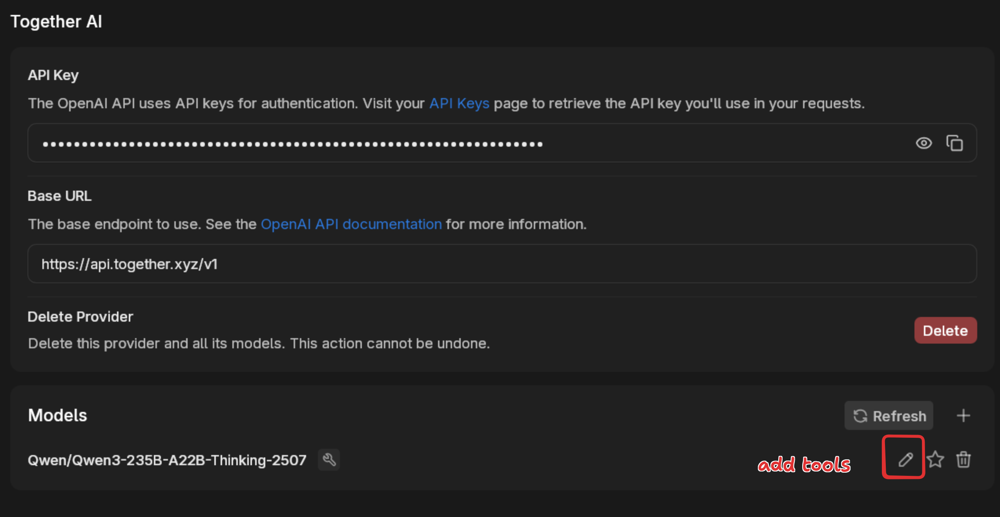
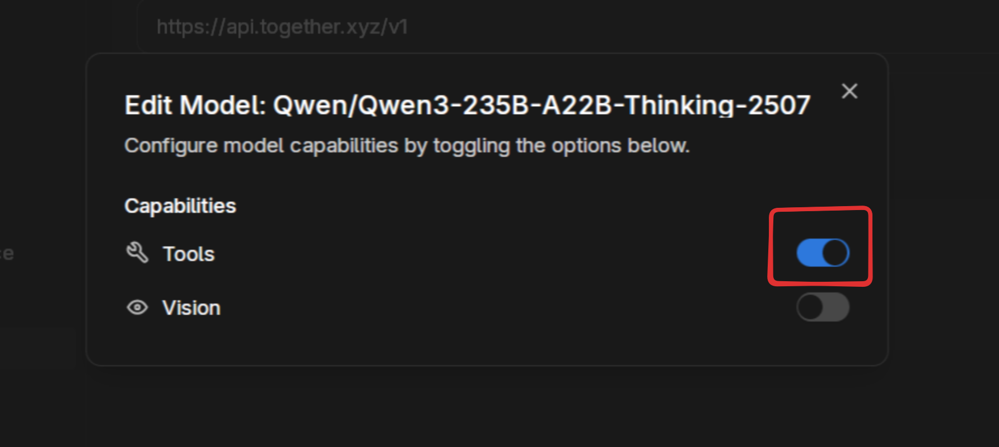
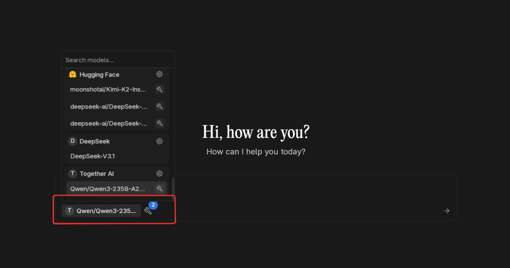
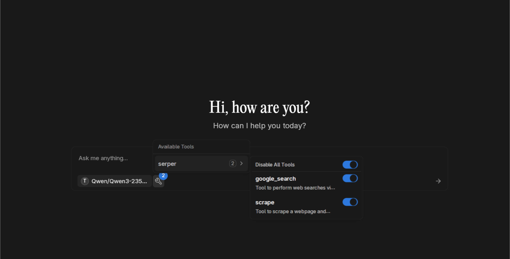
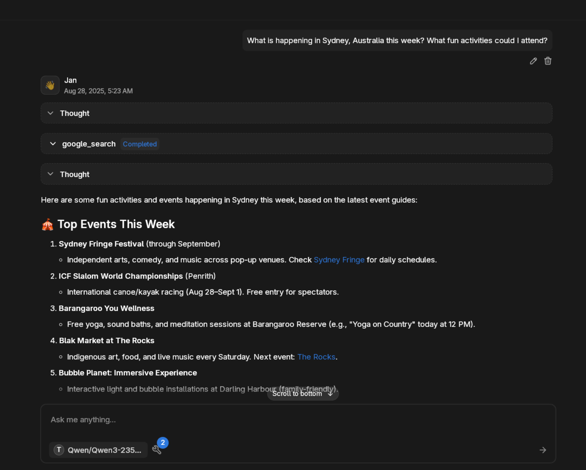

import { Aside } from '@astrojs/starlight/components';

Jan's custom provider system lets you connect to any OpenAI-compatible API service. Whether you're using cloud providers like Together AI, Fireworks, or Replicate, or running local inference servers like vLLM, LMStudio, or transformers, Jan can integrate with them seamlessly.

## What You Can Connect

**Cloud Providers:**
- Together AI, Fireworks, Replicate
- Perplexity, DeepInfra, Anyscale
- Any OpenAI-compatible API service

**Local Inference Servers:**
- vLLM, LMStudio, Ollama
- SGLang, transformers, text-generation-webui
- TensorRT-LLM, LocalAI

**Self-Hosted Solutions:**
- Your own API deployments
- Enterprise AI gateways
- Custom model endpoints

## Setup Process

### Add a New Provider

Navigate to **Settings > Model Providers** and click **Add Provider**.



Enter a name for your provider. We'll use Together AI as our example.


### Get Your API Credentials

For cloud providers, you'll need an account and API key. Here's Together AI's dashboard showing your credits and API key location.



<Aside type="caution">
Keep your API keys secure and never share them publicly. Most providers charge based on usage, so monitor your credits and spending.
</Aside>

### Configure the Provider

Back in Jan, fill in your provider's details:

**API Base URL:** The endpoint for your service (e.g., `https://api.together.xyz/`)
**API Key:** Your authentication token



Common endpoints for popular services:
- **Together AI:** `https://api.together.xyz/`
- **Fireworks:** `https://api.fireworks.ai/`
- **Replicate:** `https://api.replicate.com/`
- **Local vLLM:** `http://localhost:8000/` (default)
- **LMStudio:** `http://localhost:1234/` (default)

### Add Model IDs

Click the `+` button to add specific models you want to access. Each provider offers different models with various capabilities.



For Together AI, we're adding `Qwen/Qwen3-235B-A22B-Thinking-2507`, one of the most capable reasoning models available.

### Configure Model Features

After adding a model, click the pencil icon to enable additional features like tools or vision capabilities.



Enable tools if your model supports function calling. This allows integration with Jan's MCP system for web search, code execution, and more.



### Start Using Your Custom Model

Open a new chat and select your custom model from the provider dropdown.



If you enabled tools, click the tools icon to activate MCP integrations. Here we have Serper MCP enabled for web search capabilities.



<Aside type="note">
Learn how to set up web search with our [Serper MCP tutorial](./mcp-examples/search/serper).
</Aside>

### Example in Action

Here's the Qwen model thinking through a complex query, searching the web, and providing detailed information about Sydney activities.



**Prompt used:** "What is happening in Sydney, Australia this week? What fun activities could I attend?"

The model demonstrated reasoning, web search integration, and comprehensive response formatting—all through Jan's custom provider system.

## Provider-Specific Setup

### Together AI
- **Endpoint:** `https://api.together.xyz/`
- **Popular Models:** `meta-llama/Meta-Llama-3.1-405B-Instruct-Turbo`, `Qwen/Qwen2.5-Coder-32B-Instruct`
- **Features:** Fast inference, competitive pricing, latest models
- **Best For:** Production applications, latest model access

### Fireworks AI
- **Endpoint:** `https://api.fireworks.ai/`
- **Popular Models:** `accounts/fireworks/models/llama-v3p1-405b-instruct`, `accounts/fireworks/models/qwen2p5-coder-32b-instruct`
- **Features:** Ultra-fast inference, function calling support
- **Best For:** Real-time applications, tool usage

### vLLM (Local)
- **Endpoint:** `http://localhost:8000/` (configurable)
- **Setup:** Install vLLM, run `vllm serve MODEL_NAME --api-key YOUR_KEY`
- **Models:** Any HuggingFace model compatible with vLLM
- **Best For:** Self-hosted deployments, custom models

### LMStudio (Local)
- **Endpoint:** `http://localhost:1234/` (default)
- **Setup:** Download LMStudio, load a model, start local server
- **Models:** GGUF models from HuggingFace
- **Best For:** Easy local setup, GUI management

### Ollama (Local)
- **Endpoint:** `http://localhost:11434/` (with OpenAI compatibility)
- **Setup:** Install Ollama, run `OLLAMA_HOST=0.0.0.0 ollama serve`
- **Models:** Ollama model library (llama3, qwen2.5, etc.)
- **Best For:** Simple local deployment, model management

## Example Prompts to Try

### Advanced Reasoning
```
I'm planning to start a sustainable urban garden on my apartment balcony. Consider my location (temperate climate), space constraints (4x6 feet), budget ($200), and goals (year-round fresh herbs and vegetables). Provide a detailed plan including plant selection, container setup, watering system, and seasonal rotation schedule.
```

### Research and Analysis
```
Compare the environmental impact of electric vehicles vs hydrogen fuel cell vehicles in 2024. Include manufacturing emissions, energy sources, infrastructure requirements, and lifecycle costs. Provide specific data and cite recent studies.
```

### Creative Problem Solving
```
Design a mobile app that helps people reduce food waste. Consider user psychology, practical constraints, monetization, and social impact. Include wireframes description, key features, and go-to-market strategy.
```

### Technical Deep Dive
```
Explain how large language models use attention mechanisms to understand context. Start with the basics and build up to transformer architecture, including mathematical foundations and practical implications for different model sizes.
```

### Planning and Strategy
```
I have 6 months to learn machine learning from scratch and land an ML engineering job. Create a week-by-week study plan including theory, practical projects, portfolio development, and job search strategy. Consider my background in software development.
```

## Advanced Configuration

### Authentication Methods

**API Key Header (Most Common):**
- Standard: `Authorization: Bearer YOUR_KEY`
- Custom: `X-API-Key: YOUR_KEY`

**Query Parameters:**
- Some services use `?api_key=YOUR_KEY`

**Custom Headers:**
- Enterprise gateways may require specific headers

### Request Customization

Most providers support OpenAI's standard parameters:
- `temperature`: Response creativity (0.0-1.0)
- `max_tokens`: Response length limit
- `top_p`: Token selection probability
- `frequency_penalty`: Repetition control
- `presence_penalty`: Topic diversity

### Model Naming Conventions

Different providers use various naming schemes:
- **HuggingFace:** `organization/model-name`
- **Together AI:** `meta-llama/Llama-2-70b-chat-hf`
- **Ollama:** `llama3:latest`
- **Local:** Often just the model name

## Troubleshooting

### Connection Issues
- Verify the API endpoint URL is correct
- Check if the service is running (for local providers)
- Confirm network connectivity and firewall settings

### Authentication Failures
- Ensure API key is copied correctly (no extra spaces)
- Check if the key has necessary permissions
- Verify the authentication method matches provider requirements

### Model Not Found
- Confirm the model ID exists on the provider
- Check spelling and capitalization
- Some models require special access or approval

### Rate Limiting
- Most providers have usage limits
- Implement delays between requests if needed
- Consider upgrading to higher tier plans

### Performance Issues
- Local providers may need more powerful hardware
- Cloud providers vary in response times
- Check provider status pages for service issues

## Cost Management

### Cloud Provider Pricing
- Most charge per token (input + output)
- Prices vary significantly between models
- Monitor usage through provider dashboards

### Local Provider Costs
- Hardware requirements (RAM, GPU)
- Electricity consumption
- Initial setup and maintenance time

### Optimization Tips
- Use smaller models for simple tasks
- Implement caching for repeated queries
- Set appropriate max_tokens limits
- Monitor and track usage patterns

## Best Practices

### Security
- Store API keys securely
- Use environment variables in production
- Rotate keys regularly
- Monitor for unauthorized usage

### Performance
- Choose models appropriate for your tasks
- Implement proper error handling
- Cache responses when possible
- Use streaming for long responses

### Reliability
- Have fallback providers configured
- Implement retry logic
- Monitor service availability
- Test regularly with different models

## Next Steps

Once you have custom providers configured, explore advanced integrations:
- Combine with [MCP tools](./mcp-examples/search/serper) for enhanced capabilities
- Set up multiple providers for different use cases
- Create custom assistants with provider-specific models
- Build workflows that leverage different model strengths

Custom providers unlock Jan's full potential, letting you access cutting-edge models and maintain complete control over your AI infrastructure. Whether you prefer cloud convenience or local privacy, Jan adapts to your workflow.