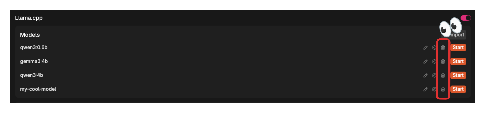

import { Aside } from '@astrojs/starlight/components';

AI models power Jan's conversations. You can run models locally on your device for privacy, or connect to cloud providers for more power.

## Quick Start

**New to Jan?** Start with **Jan-v1** (4B) - it runs on most computers
**Limited hardware?** Use cloud models with your API keys
**Privacy focused?** Download any local model - your data never leaves your device

## Local Models

Local models are managed through [Llama.cpp](https://github.com/ggerganov/llama.cpp), and these models are in a format called GGUF. When you run them locally, they will use your computer's memory (RAM) and processing power, so please make sure that you download models that match the hardware specifications for your operating system:
- [Mac](/docs/desktop/mac#compatibility)
- [Windows](/docs/desktop/windows#compatibility)
- [Linux](/docs/desktop/linux#compatibility)

### Adding Local Models

#### 1. Download from Jan Hub (Recommended)

The easiest way to get started is using Jan's built-in model hub (connected to [HuggingFace's Model Hub](https://huggingface.co/models)):
1. Go to the **Hub** tab
2. Browse available models and click on any model to see details
3. Choose a model that fits your needs & hardware specifications
4. Click **Download** on your chosen model

<Aside type="note">
Jan will indicate if a model might be **Slow on your device** or **Not enough RAM** based on your system specifications.
</Aside>


#### 2. Import from Hugging Face

You can download models with a direct link from Hugging Face:

**Note:** Some models require a Hugging Face Access Token. Enter your token in **Settings > Model Providers > Hugging Face** before importing.

1. Visit [Hugging Face Models](https://huggingface.co/models)
2. Find a GGUF model that fits your computer
3. Copy the **model ID** (e.g., TheBloke/Mistral-7B-v0.1-GGUF)
4. In Jan, paste the model ID to the **Search** bar in **Hub** page
5. Select your preferred quantized version to download

**Copy the model ID:**


**Paste it in Jan's Hub Search Bar:**


#### 3. Import Local Files

If you already have GGUF model files on your computer:
1. Go to **Settings > Model Providers > Llama.cpp**
2. Click **Import** and select your GGUF file(s)
3. Choose how to import:
   - **Link Files:** Creates symbolic links (saves space)
   - **Duplicate:** Copies files to Jan's directory
4. Click **Import** to complete


#### 4. Manual Setup

For advanced users who want to add models not available in Jan Hub:

##### Step 1: Create Model File

1. Navigate to the [Jan Data Folder](./data-folder)
2. Open `models` folder
3. Create a new folder for your model
4. Add your `model.gguf` file
5. Add a `model.yml` configuration file. Example:

```yaml
model_path: llamacpp/models/Jan-v1-4B-Q4_K_M/model.gguf
name: Jan-v1-4B-Q4_K_M
size_bytes: 2497281632
```

That's it! Jan now uses a simplified YAML format. All other parameters (temperature, context length, etc.) can be configured directly in the UI when you select the model.

##### Step 2: Customize in the UI

Once your model is added:
1. Select it in a chat
2. Click the gear icon next to the model
3. Adjust any parameters you need

<Aside type="note">
The simplified `model.yml` format makes model management easier. All advanced settings are now accessible through Jan's UI rather than requiring manual JSON editing.
</Aside>

### Delete Local Models

1. Go to **Settings > Model Providers > Llama.cpp**
2. Find the model you want to remove
3. Click the three dots icon and select **Delete Model**



## Cloud Models

Jan supports connecting to various AI cloud providers through OpenAI-compatible APIs, including OpenAI (GPT-4o, o1), Anthropic (Claude), Groq, Mistral, and more.

<Aside type="note">
When using cloud models, be aware of associated costs and rate limits from the providers. See detailed guides for each provider in the [Cloud Providers section](./remote-models/anthropic).
</Aside>

### Setting Up Cloud Models

1. Navigate to **Settings**
2. Under **Model Providers** in the left sidebar, choose your provider
3. Enter your API key
4. Activated cloud models appear in your model selector


Once you add your API key, you can select any of that provider's models in the chat interface:


## Choosing Between Local and Cloud

### Local Models
**Best for:**
- Privacy-sensitive work
- Offline usage
- Unlimited conversations without costs
- Full control over model behavior

**Requirements:**
- 8GB RAM minimum (16GB+ recommended)
- 10-50GB storage per model
- CPU or GPU for processing

### Cloud Models
**Best for:**
- Advanced capabilities (GPT-4, Claude 3)
- Limited hardware
- Occasional use
- Latest model versions

**Requirements:**
- Internet connection
- API keys from providers
- Usage-based payment

## Hardware Guidelines

| RAM | Recommended Model Size |
|-----|----------------------|
| 8GB | 1-3B parameters |
| 16GB | 7B parameters |
| 32GB | 13B parameters |
| 64GB+ | 30B+ parameters |

<Aside type="tip">
Start with smaller models and upgrade as needed. Jan shows compatibility warnings before downloading.
</Aside>

## Next Steps

- [Explore Jan Models](./jan-models/jan-v1) - Our optimized models
- [Set up Cloud Providers](./remote-models/openai) - Connect external services
- [Learn Model Parameters](./explanation/model-parameters) - Fine-tune behavior
- [Create AI Assistants](./assistants) - Customize models with instructions
