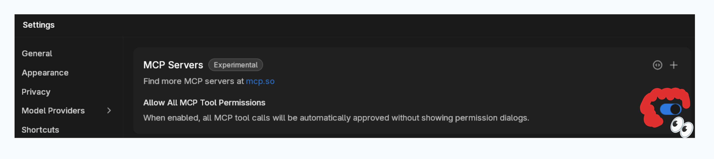

import { Aside } from '@astrojs/starlight/components';

[Serper](https://serper.dev) provides Google search results through a simple API, making it
perfect for giving AI models access to current web information. The Serper MCP integration
enables Jan models to search the web and retrieve real-time information.

## Available Tools

- `google_search`: Search Google and retrieve results with snippets
- `scrape`: Extract content from specific web pages

## Prerequisites

- Serper API key from [serper.dev](https://serper.dev)
- Model with tool calling support (recommended: Jan v1)

<Aside type="tip">
Serper offers 2,500 free searches upon signup - enough for extensive testing and personal use.
</Aside>

## Setup

### Enable MCP

1. Go to **Settings** > **MCP Servers**
2. Toggle **Allow All MCP Tool Permission** ON



### Get Serper API Key

1. Visit [serper.dev](https://serper.dev)
2. Sign up for a free account
3. Copy your API key from the playground


### Configure MCP Server

Click `+` in MCP Servers section:

**Configuration:**
- **Server Name**: `serper`
- **Command**: `npx`
- **Arguments**: `-y serper-search-scrape-mcp-server`
- **Environment Variables**:
  - Key: `SERPER_API_KEY`, Value: `your-api-key`


### Download Jan v1

Jan v1 is optimized for tool calling and works excellently with Serper:

1. Go to the **Hub** tab
2. Search for **Jan v1**
3. Choose your preferred quantization
4. Click **Download**


### Enable Tool Calling

Tool calling is now enabled by default on Jan.

## Usage

### Start a New Chat

With Jan v1 selected, you'll see the available Serper tools:


### Example Queries

**Current Information:**
```
What are the latest developments in quantum computing this week?
```

**Comparative Analysis:**
```
What are the main differences between the Rust programming language and C++? Be spicy, hot
takes are encouraged. 😌
```


**Research Tasks:**
```
Find the current stock price of NVIDIA and recent news about their AI chips.
```

**Fact-Checking:**
```
Is it true that the James Webb telescope found signs of life on an exoplanet? What's the latest?
```

**Local Information:**
```
What restaurants opened in San Francisco this month? Focus on Japanese cuisine.
```

## How It Works

1. **Query Processing**: Jan v1 analyzes your question and determines what to search
2. **Web Search**: Calls Serper API to get Google search results
3. **Content Extraction**: Can scrape specific pages for detailed information
4. **Synthesis**: Combines search results into a comprehensive answer

## Tips for Best Results

- **Be specific**: "Tesla Model 3 2024 price Australia" works better than "Tesla price"
- **Request recent info**: Add "latest", "current", or "2024/2025" to get recent results
- **Ask follow-ups**: Jan v1 maintains context for deeper research
- **Combine with analysis**: Ask for comparisons, summaries, or insights

## Troubleshooting

**No search results:**
- Verify API key is correct
- Check remaining credits at serper.dev

**Tools not appearing:**
- Restart Jan after configuration changes
- Ensure MCP Server shows as active

**Poor search quality:**
- Use more specific search terms
- Try rephrasing your question
- Check if Serper service is operational

<Aside type="caution">
Each search query consumes one API credit. Monitor usage at serper.dev dashboard.
</Aside>

## API Limits

- **Free tier**: 2,500 searches
- **Paid plans**: Starting at $50/month for 50,000 searches
- **Rate limits**: 100 requests per second

## Next Steps

Serper MCP enables models to access current web information, making them powerful research
assistants. Combine with other MCP tools for even more capabilities - use Serper for search,
then E2B for data analysis, or Jupyter for visualization.
