import { Aside } from '@astrojs/starlight/components';

## Tools in Jan

Jan supports powerful tool integrations that extend your AI's capabilities beyond simple text generation. These tools are implemented through the **Model Context Protocol (MCP)**, allowing your AI to search the web, execute code, manage files, and interact with external services.

**Available tool categories:**
- **Web & Search** - Real-time web search, browser automation
- **Code & Analysis** - Jupyter notebooks, code execution, data analysis  
- **Productivity** - Task management, calendar integration, note-taking
- **Creative** - Design tools, content generation, media manipulation
- **File Management** - Document processing, file operations, data extraction

Tools work with both local and cloud models, though compatibility varies. Cloud models like GPT-4 and Claude typically offer the best tool-calling performance, while newer local models are rapidly improving their tool capabilities.

```mermaid
graph TD
    subgraph "What is MCP?"
        You[You using Jan Desktop]
        Claude[Jan AI Assistant]

        subgraph "Your Connected Tools"
            Files[📁 Your Files<br/>Documents, folders,<br/>text files]
            Database[📊 Your Data<br/>Spreadsheets,<br/>databases]
            WebServices[🌐 Online Services<br/>GitHub, Slack,<br/>Google Drive]
            Custom[🔧 Custom Tools<br/>Special programs<br/>you've added]
        end

        subgraph "What Jan Can Do"
            Read[Read & Understand<br/>- View your files<br/>- Check your data<br/>- See updates]
            Action[Take Actions<br/>- Search for info<br/>- Create content<br/>- Run commands]
            Templates[Use Templates<br/>- Common tasks<br/>- Saved prompts<br/>- Workflows]
        end
    end

    You --> Claude
    Claude -->|"Can I see this file?"| Files
    Claude -->|"What's in my database?"| Database
    Claude -->|"Check my GitHub"| WebServices
    Claude -->|"Run this tool"| Custom

    Files --> Read
    Database --> Read
    WebServices --> Action
    Custom --> Templates

    style You fill:transparent
    style Claude fill:transparent
    style Files fill:transparent
    style Database fill:transparent
    style WebServices fill:transparent
    style Custom fill:transparent
    style Read fill:transparent
    style Action fill:transparent
    style Templates fill:transparent
```

## What is MCP?

Jan supports the **Model Context Protocol (MCP)**, an open standard that allows AI models to interact with external tools and data sources in a secure, standardized way.

MCP solves the integration challenge by creating a common interface between AI models and external tools. Instead of building custom connectors for every model-tool combination, MCP provides a universal protocol that any compatible model can use with any compatible tool.

**How it works:**
- **MCP Servers** provide tools, data sources, and capabilities
- **MCP Clients** (like Jan) connect models to these servers
- **Standardized Protocol** ensures compatibility across different implementations

This architecture means you can easily add new capabilities to your AI without complex integrations, and tools built for one AI system work with others that support MCP.

## Core Benefits

**Standardization:** MCP eliminates the "M x N" integration problem where every AI model needs unique connectors for every tool. One standard interface works everywhere.

**Extensibility:** Add powerful new capabilities to your AI models. Search local codebases, query databases, interact with web APIs, automate browser tasks, and more.

**Flexibility:** Swap models and tools easily. Your MCP setup works whether you're using local models, Claude, GPT-4, or future AI systems.

**Security:** User-controlled permissions ensure you decide which tools can access what resources. Tools run in isolated environments with explicit consent.

<Aside type="caution">
Not all models excel at tool calling. For best results:
- **Cloud models:** GPT-4, Claude 3.5+, and Gemini Pro offer excellent tool capabilities
- **Local models:** Newer models like Qwen3, Gemma3, and function-calling variants work well
- **Check compatibility:** Review model cards for tool-calling performance before setup
</Aside>

## Model Compatibility Requirements

<Aside type="note">
To use MCP tools effectively, ensure your model supports tool calling:

**For cloud models:**
- Enable tool calling in provider settings (usually automatic)
- Verify API supports function calling endpoints
- Check model-specific documentation for tool capabilities

**For local models:**
- Enable tool calling in model settings (gear icon → capabilities)
- Choose models specifically trained for function calling
- Monitor performance as tool complexity increases
</Aside>

## Security and Considerations

MCP provides powerful capabilities that require careful security consideration:

**Security Model:**
- **Explicit permissions** for each tool and capability
- **Isolated execution** prevents cross-tool interference
- **User approval** required for sensitive operations
- **Audit trails** track all tool usage and outputs

**Performance Impact:**
- **Context usage:** Active tools consume model context window space
- **Response time:** More tools may slow generation slightly
- **Resource usage:** Some tools require additional system resources

**Best Practices:**
- Enable only tools you actively need
- Review tool permissions regularly
- Monitor system resource usage
- Keep MCP servers updated for security patches

## Setting Up MCP in Jan

### Prerequisites

Ensure you have the required runtime environments:
- **Node.js** - Download from [nodejs.org](https://nodejs.org/)
- **Python** - Download from [python.org](https://www.python.org/)

Most MCP tools require one or both of these environments.

### Enable MCP Support

Navigate to **Settings → MCP Servers** and toggle **Allow All MCP Tool Permission** to ON.

This global setting allows Jan to connect to MCP servers. You'll still control individual tool permissions.

### Example: Browser MCP Setup

Let's configure Browser MCP for web automation as a practical example:

#### Step 1: Add MCP Server

Click the `+` button in the MCP Servers section:

#### Step 2: Configure Browser MCP

Enter these details:
- **Server Name:** `browsermcp`
- **Command:** `npx`  
- **Arguments:** `@browsermcp/mcp`
- **Environment Variables:** Leave empty

#### Step 3: Verify Connection

Confirm the server shows as active:

#### Step 4: Install Browser Extension

Install the [Browser MCP Chrome Extension](https://chromewebstore.google.com/detail/browser-mcp-automate-your/bjfgambnhccakkhmkepdoekmckoijdlc) to enable browser control:

#### Step 5: Configure Extension

Enable the extension for private browsing (recommended for clean sessions):

Connect the extension to your MCP server:

#### Step 6: Enable Model Tools

Select a model with strong tool-calling capabilities and enable tools:

Verify tool calling is active:

## Available MCP Integrations

Jan supports a growing ecosystem of MCP tools:

### Web & Search
- **Browser Control** - Automate web browsing tasks
- **Web Search** - Real-time search with Serper, Exa
- **Screenshot** - Capture and analyze web content

### Development
- **Code Execution** - Run code in secure sandboxes
- **GitHub** - Repository management and analysis
- **Documentation** - Generate and maintain docs

### Productivity  
- **Task Management** - Todoist, Linear integration
- **Calendar** - Schedule and meeting management
- **Note Taking** - Obsidian, Notion connectivity

### Creative
- **Design Tools** - Canva integration for graphics
- **Content Generation** - Blog posts, social media
- **Media Processing** - Image and video manipulation

Explore specific integrations in our [MCP Examples](./mcp-examples/browser/browserbase) section.

## Troubleshooting

### Connection Issues

**MCP server won't connect:**
- Verify Node.js and Python are installed correctly
- Check command syntax in server configuration
- Restart Jan after adding new servers
- Review server logs for specific error messages

**Tools not appearing:**
- Ensure model has tool calling enabled
- Verify MCP permissions are active
- Check that the server status shows as running
- Try with a different model known for good tool support

### Performance Problems

**Slow responses with tools:**
- Reduce number of active tools
- Use models with larger context windows
- Monitor system resource usage
- Consider using faster local models or cloud providers

**Model not using tools effectively:**
- Switch to models specifically trained for tool calling
- Provide more explicit instructions about tool usage
- Check model documentation for tool-calling examples
- Test with proven tool-compatible models first

### Model Compatibility

**Local models not calling tools:**
- Ensure the model supports function calling in its training
- Enable tool calling in model capabilities settings
- Try newer model versions with improved tool support
- Consider switching to cloud models for complex tool workflows

## Future Development

MCP integration in Jan continues evolving with new capabilities:

**Planned Features:**
- **Visual tool builder** for custom MCP servers
- **Tool marketplace** for easy discovery and installation  
- **Enhanced security** with granular permission controls
- **Performance optimization** for faster tool execution

**Ecosystem Growth:**
- More professional tools (CRM, analytics, design)
- Better local model tool-calling performance
- Cross-platform mobile tool support
- Enterprise-grade security and compliance features

The MCP ecosystem enables increasingly sophisticated AI workflows. As more tools become available and models improve their tool-calling abilities, Jan becomes a more powerful platform for augmented productivity and creativity.

Start with simple tools like web search or code execution, then gradually expand your toolkit as you discover new use cases and workflows that benefit from AI-tool collaboration.