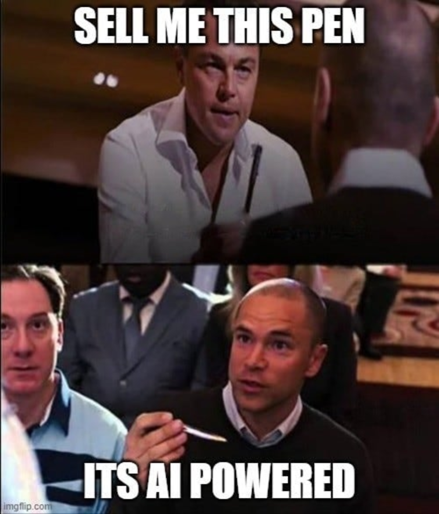
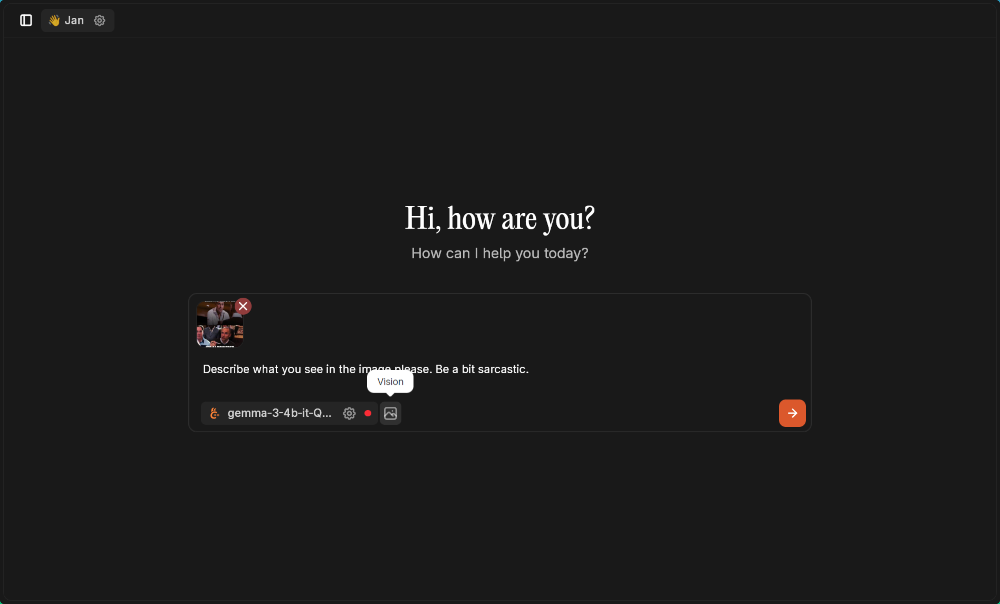
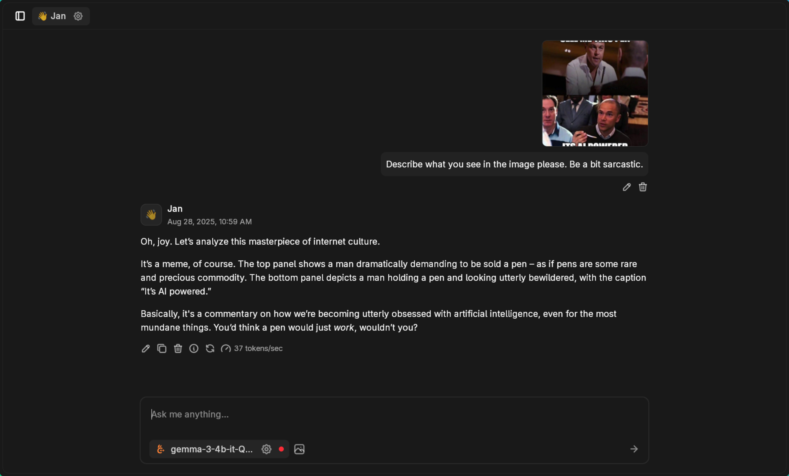
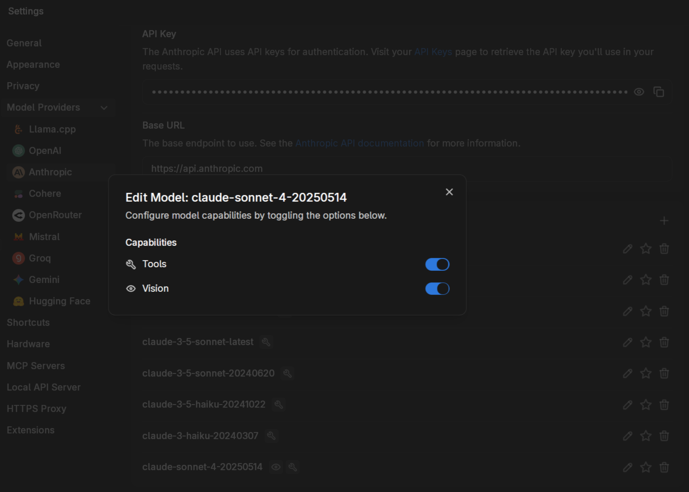
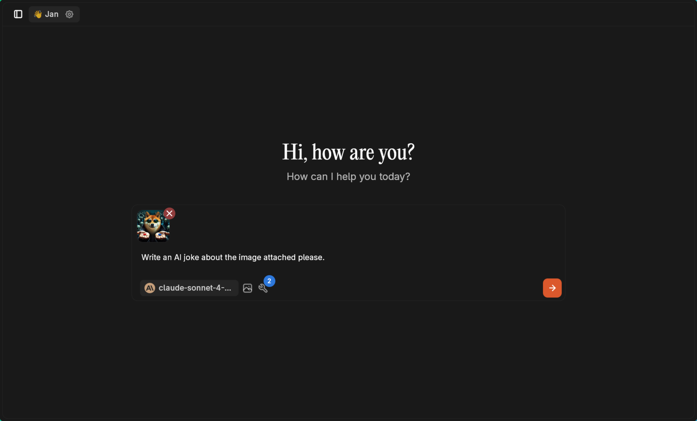
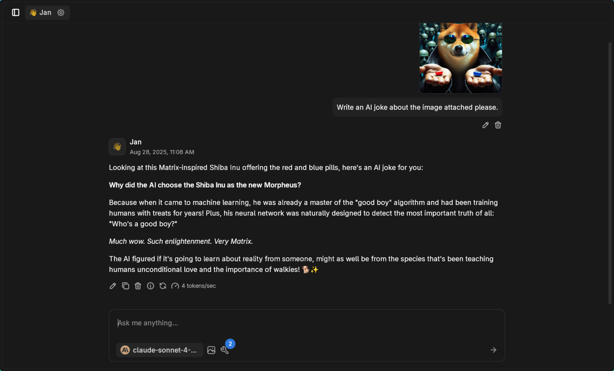

import { Aside } from '@astrojs/starlight/components';

Jan supports image attachments with both local and cloud AI models. Upload images directly in your chats and get visual understanding, analysis, and creative responses from compatible models.

## Local Vision Models

Local models with image support work immediately without configuration. Popular vision models include the latest Gemma3 and Qwen3 series, which excel at image understanding while running entirely on your device.

**Recommended Local Vision Models:**
- **Gemma3 4B** - Excellent balance of performance and resource usage
- **Qwen3 7B/14B** - Superior image analysis capabilities
- **LLaVA models** - Specialized for visual question answering

### Example: Image Analysis

Here's Gemma3 4B analyzing a meme with some personality:



Load a vision model like [Gemma3 4B](https://huggingface.co/unsloth/gemma-3-4b-it-GGUF) and attach your image:



**Prompt used:** "Describe what you see in the image please. Be a bit sarcastic."

The model delivers contextual analysis with the requested tone:



<Aside type="note">
Local vision models process images completely offline. Your images never leave your device.
</Aside>

## Cloud Vision Models

Cloud providers like OpenAI (GPT-4V), Anthropic (Claude), and Google (Gemini) offer powerful vision capabilities. However, image support must be manually enabled for each model.

### Enabling Vision for Cloud Models

Navigate to your model settings and enable vision support:



Toggle both **Tools** and **Vision** if you want to combine image understanding with web search or other MCP capabilities.

### Example: Creative Image Analysis

With Claude 3.5 Sonnet configured for vision, upload an image and get creative responses:



**Prompt used:** "Write an AI joke about the image attached please."

Claude combines image understanding with humor:



## Supported Use Cases

### Creative and Fun
- Meme analysis and creation
- Visual jokes and commentary
- Art critique and style analysis
- Creative writing from visual prompts

### Practical Applications
- Document analysis and OCR
- Chart and graph interpretation
- Product identification and comparison
- Technical diagram explanation

### Educational and Research
- Historical photo analysis
- Scientific image interpretation
- Visual learning assistance
- Research documentation

## Model Capabilities Comparison

| Model Type | Image Support | Setup Required | Privacy | Best For |
|------------|---------------|----------------|---------|----------|
| **Local (Gemma3, Qwen3)** | Automatic | None | Complete | Privacy, offline use |
| **GPT-4V** | Manual enable | API key + toggle | Cloud processed | Advanced analysis |
| **Claude 3.5 Sonnet** | Manual enable | API key + toggle | Cloud processed | Creative tasks |
| **Gemini Pro Vision** | Manual enable | API key + toggle | Cloud processed | Multi-language |

## Image Format Support

Jan accepts common image formats:
- **JPEG/JPG** - Most compatible
- **PNG** - Full transparency support
- **WebP** - Modern web format
- **GIF** - Static images only

<Aside type="tip">
For best results, use clear, well-lit images under 10MB. Higher resolution images provide more detail for analysis.
</Aside>

## Example Prompts

### Technical Analysis
```
Analyze this circuit diagram and explain how it works. Identify any potential issues or improvements.
```

### Creative Tasks
```
Look at this artwork and write a short story inspired by the mood and colors you see.
```

### Educational Support
```
Help me understand this math problem shown in the image. Walk through the solution step by step.
```

### Business Applications
```
Review this presentation slide and suggest improvements for clarity and visual impact.
```

### OCR and Document Processing
```
Extract all the text from this document and format it as a clean markdown list.
```

## Future Improvements

We're actively improving multi-modal support:

**Automatic Detection:** Models will show visual capabilities without manual configuration
**Batch Processing:** Upload multiple images for comparison and analysis
**Better Indicators:** Clear visual cues for vision-enabled models
**Enhanced Formats:** Support for more image types and sizes

## Performance Tips

**Local Models:**
- Ensure sufficient RAM (8GB+ recommended for vision models)
- Use GPU acceleration for faster image processing
- Start with smaller models if resources are limited

**Cloud Models:**
- Monitor API usage as vision requests typically cost more
- Resize large images before upload to save bandwidth
- Combine with tools for enhanced workflows

## Privacy Considerations

**Local Processing:** Images processed by local models never leave your device. Complete privacy for sensitive visual content.

**Cloud Processing:** Images sent to cloud providers are processed on their servers. Check provider privacy policies for data handling practices.

Multi-modal AI opens new possibilities for visual understanding and creative assistance. Whether you prefer local privacy or cloud capabilities, Jan makes it easy to work with images and text together.
