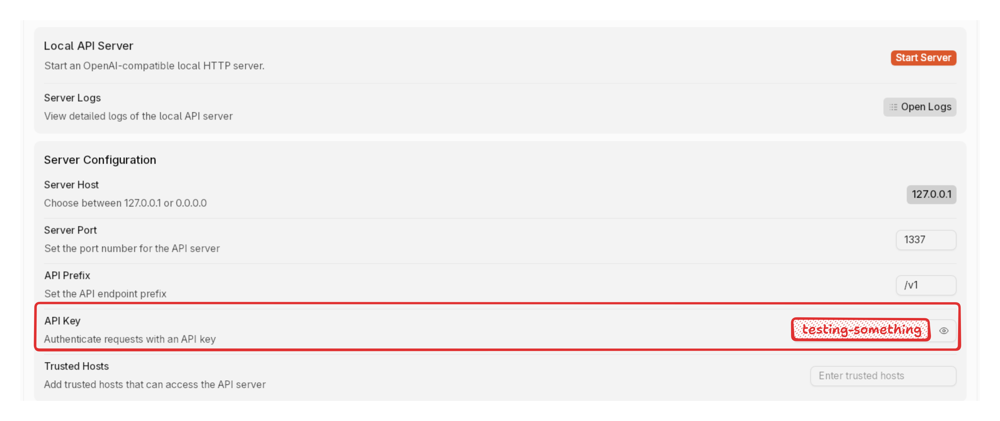

import { Aside } from '@astrojs/starlight/components';
import { Steps } from '@astrojs/starlight/components';
import { Tabs, TabItem } from '@astrojs/starlight/components';


Configure and start Jan's built-in API server.

## Prerequisites

- Jan installed and running
- At least one AI model downloaded or configured (see [Model Management](/docs/manage-models))

For an overview of Jan Local Server, see the [Local Server introduction](./index).

<br/>

<br/>

## Start Server

1. Navigate to **Local API Server**
2. Add an API Key (can be anything)
3. Configure settings (see [Server Configuration](#server-configuration) below)
4. Click **Start Server**
5. Wait for confirmation: `JAN API listening at: http://127.0.0.1:1337`



## Test Server

1. Click **API Playground**
2. Select a model
3. Send a test request

## API Usage

```bash
curl http://127.0.0.1:1337/v1/chat/completions \
    -H "Content-Type: application/json" \
    -H "Authorization: Bearer testing-something" \
    -d '{
        "model": "jan-nano-gguf",
        "messages": [
            {
                "role": "user",
                "content": "Write a one-sentence bedtime story about a unicorn."
            }
        ]
    }'
```

Include your API key in the `Authorization` header for all requests.

## Server Configuration

### Host Address Options
- **127.0.0.1 (Recommended)**:
  - Only accessible from your computer
  - Most secure option for personal use
- **0.0.0.0**:
  - Makes server accessible from other devices on your network
  - Use with caution and only when necessary

### Port Number
- Default: `1337`
- Can be any number between 1-65535
- Avoid common ports (80, 443, 3000, 8080) that might be used by other applications

### API Prefix
- Default: `/v1`
- Defines the base path for all API endpoints
- Example: http://127.0.0.1:1337/v1/chat/completions

### Cross-Origin Resource Sharing (CORS)
CORS controls which websites can access your API, which is important for web applications running in browsers.

**When to enable:**
- If you're building a web application that needs to access the API
- If you're using browser extensions

**When to leave disabled:**
- If you're only using the API from your local applications
- If you're concerned about security

### Verbose Server Logs
Enable to show:
- Detailed information about each API request
- Error messages and debugging information
- Server status updates

## Troubleshooting

<Aside type="note">
Enable **Verbose Server Logs** for detailed error messages.
</Aside>

### Common Server Issues
- Server not running
- Model not loaded in Jan
- Port already in use
- Check admin/sudo rights
- API endpoint doesn't match server settings
- Model name in request doesn't match Jan model name
- Invalid JSON format
- Firewall blocking connection
- Missing API key in request headers

### CORS Errors
- Enable CORS in server settings
- Check request origin
- Verify URL matches server address
- Check browser console

### Performance Issues
- Monitor CPU, RAM, GPU usage
- Reduce context length or GPU layers
- Close other resource-intensive applications
